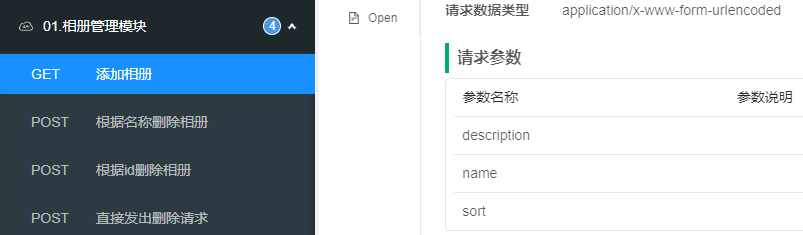

# Knife4j框架

### Knife4j是一款基于Swagger 2的在线API文档框架。

#### 使用Knife4j需要：

- ##### 添加依赖，注意：本次使用的Knife4j的版本必须基于Spring Boot的版本在2.6之前（2.6及更高版本不可用）

  ```xml
  <!-- Knife4j Spring Boot：在线API -->
  <dependency>
      <groupId>com.github.xiaoymin</groupId>
      <artifactId>knife4j-spring-boot-starter</artifactId>
      <version>2.0.9</version>
  </dependency>
  ```

- ##### 需要在主配置文件（`application.properties`或`application.yml`）中添加配置：

  ```properties
  knife4j.enable=true
  ```

- ##### 需要添加配置类，配置类代码为（注意：可能需要修改包名）：

  ```java
  package cn.tedu.csmall.product.config;
  
  import com.github.xiaoymin.knife4j.spring.extension.OpenApiExtensionResolver;
  import lombok.extern.slf4j.Slf4j;
  import org.springframework.beans.factory.annotation.Autowired;
  import org.springframework.context.annotation.Bean;
  import org.springframework.context.annotation.Configuration;
  import springfox.documentation.builders.ApiInfoBuilder;
  import springfox.documentation.builders.PathSelectors;
  import springfox.documentation.builders.RequestHandlerSelectors;
  import springfox.documentation.service.ApiInfo;
  import springfox.documentation.service.Contact;
  import springfox.documentation.spi.DocumentationType;
  import springfox.documentation.spring.web.plugins.Docket;
  import springfox.documentation.swagger2.annotations.EnableSwagger2WebMvc;
  
  /**
   * Knife4j配置类
   *
   * @author java@tedu.cn
   * @version 0.0.1
   */
  @Slf4j
  @Configuration
  @EnableSwagger2WebMvc
  public class Knife4jConfiguration {
  
      /**
       * 【重要】指定Controller包路径
       */
      private String basePackage = "cn.tedu.csmall.product.controller";
      /**
       * 分组名称
       */
      private String groupName = "product";
      /**
       * 主机名
       */
      private String host = "http://java.tedu.cn";
      /**
       * 标题
       */
      private String title = "酷鲨商城在线API文档--商品管理";
      /**
       * 简介
       */
      private String description = "酷鲨商城在线API文档--商品管理";
      /**
       * 服务条款URL
       */
      private String termsOfServiceUrl = "http://www.apache.org/licenses/LICENSE-2.0";
      /**
       * 联系人
       */
      private String contactName = "Java教学研发部";
      /**
       * 联系网址
       */
      private String contactUrl = "http://java.tedu.cn";
      /**
       * 联系邮箱
       */
      private String contactEmail = "java@tedu.cn";
      /**
       * 版本号
       */
      private String version = "1.0.0";
  
      @Autowired
      private OpenApiExtensionResolver openApiExtensionResolver;
  
      public Knife4jConfiguration() {
          log.debug("创建配置类对象：Knife4jConfiguration");
      }
  
      @Bean
      public Docket docket() {
          String groupName = "1.0.0";
          Docket docket = new Docket(DocumentationType.SWAGGER_2)
                  .host(host)
                  .apiInfo(apiInfo())
                  .groupName(groupName)
                  .select()
                  .apis(RequestHandlerSelectors.basePackage(basePackage))
                  .paths(PathSelectors.any())
                  .build()
                  .extensions(openApiExtensionResolver.buildExtensions(groupName));
          return docket;
      }
  
      private ApiInfo apiInfo() {
          return new ApiInfoBuilder()
                  .title(title)
                  .description(description)
                  .termsOfServiceUrl(termsOfServiceUrl)
                  .contact(new Contact(contactName, contactUrl, contactEmail))
                  .version(version)
                  .build();
      }
  
  }
  ```

##### 完成后，重新启动项目，可以通过 http://localhost:8080/doc.html 查看在线API文档，并可使用其中的调用功能等。

------

------

# 相关注解:

### 1.@EnableSwagger2WebMvc注解

- ##### 该注解用来配置Knife4jConfiguration类中的代码

### 2.@Api注解

- 添加在控制器类上，通过此注解的`tags`属性，可以指定模块名称，并且，可以在模块名称前自行添加数字序号，以实现排序效果

- 框架会根据各控制器类上`@Api`注解的``tags`属性值进行升序排列

- ```java
  @Api(tags = "01.相册管理模块")
  @Slf4j
  @RequestMapping("/albums")//该Controller类中所有@RequestMapping请求路径的父路径
  @RestController
  public class AlbumController {}
  ```
  
- 

### 3.@ApiOperation注解

- ##### 添加在处理请求的方法上，通过此注解的`value`属性，可以指定业务名称

- ```java
      @ApiOperation("添加相册")
      @GetMapping("/add-new")
      public String addNew(AlbumAddNewDTO albumAddNewDTO) {
          log.debug("开始处理【添加相册】的请求，参数：{}", albumAddNewDTO);
          albumService.addNew(albumAddNewDTO);
          log.debug("添加数据成功!");
          return "添加数据成功!";
      }
  ```

### 4.@ApiOperationSupport注解

- ##### 添加在处理请求的方法上，通过此注解的`order`属性（数值型），可以指定排序序号，框架会根据此属性值升序排列

- ```java
      @ApiOperation("添加相册")
      @ApiOperationSupport(order = 100)
      @GetMapping("/add-new")
      public String addNew(AlbumAddNewDTO albumAddNewDTO) {
          log.debug("开始处理【添加相册】的请求，参数：{}", albumAddNewDTO);
          albumService.addNew(albumAddNewDTO);
          log.debug("添加数据成功!");
          return "添加数据成功!";
      }
  ```

### 5.@ApiModelProperty注解

- ##### 该注解用在配置PoJo类型对象的属性上

  - ##### 通过此注解的`value`属性可以配置请求参数的名称

  - ##### 通过此注解的`required`属性可以配置是否必须提交此请求参数（注意：此项配置值并不具备任何检查效果）

- ##### 用来向客户端说明某个属性的参数说明,便于理解

  ```java
  @Data//该注解在底层会自动实现getter和setter方法,重写equals()和hashCode()方法
  public class AlbumAddNewDTO implements Serializable {
      
      //添加required=true后,该属性客户端必须填写
      @ApiModelProperty(value="相册名称",required = true)
      private String name;
  
      @ApiModelProperty(value="相册描述",required = true)
      private String description;
  
      @ApiModelProperty(value="自定义排序",required = true)
      private Integer sort;
  }
  ```

### 6.@ApiImplicitParam注解

- ##### 添加在处理请求的方法上，适用于请求参数不是POJO类型时

- ##### 必须配置此注解的`name`属性，取值为请求参数的名称，表示当前注解是对哪个请求参数进行配置

- ##### 通过此注解的`value`属性可以配置请求参数的名称

- ##### 通过此注解的`required`属性可以配置是否必须提交此请求参数（注意：此项配置值并不具备任何检查效果）

- ##### 通过此注解的`dataType`属性配置请求参数的数据类型，常见取值有：`string`、`long`等

```java
    @ApiImplicitParam(name = "id",value = "相册id",required = true,dataType = "long")
    @PostMapping("/{id:[0-9]+}/delete")//在请求路径中先用占位符进行占位,使用正则来限制输入的内容
    public String deleteAlbum2(@PathVariable Long id) {//接收路径中通过占位符传入的信息(类型要匹配否则报400)
        String message = "尝试删除id为[" + id + "]的相册";
        log.debug(message);//输出日志
        return message;//向客户端返回结果
    }
```

### 7.@ApiImplicitParams注解

- ##### 添加在处理请求的方法上，适用于请求参数不是POJO类型，且需要配置的参数的数量超过1个的时候,需要配置此注解的`value`属性，值是`@ApiImplicitParam`注解的数组类型

- #### 语法：

  - ```java
    @ApiImplicitParams({
        @ApiImplicitParam(),
        @ApiImplicitParam(),
        @ApiImplicitParam()
    })
    ```

- #### 例:

  - ```java
        // http://localhost:8080/albums/name/sort/delete
        @ApiOperation("【已过期】根据名称删除相册")
        @ApiOperationSupport(order = 901)
        @ApiImplicitParams({
                @ApiImplicitParam(name = "name", value = "相册名称", required = true, dataType = "String"),
                @ApiImplicitParam(name = "sort", value = "相册排序", required = true, dataType = "int")
        })
        @PostMapping("/{name:[a-z]+}/{sort:[a-z]+}/delete")//在请求路径中先用占位符进行占位
        //接收路径中通过占位符传入的信息(类型要匹配否则报400)
        public String deleteAlbum1(@PathVariable String name,@PathVariable Integer sort{
            String message = "尝试删除名称为[" + name + "],排序为[" + sort + "]的相册";
            log.debug(message);//输出日志
            return message;//向客户端返回结果
        }
    ```

    