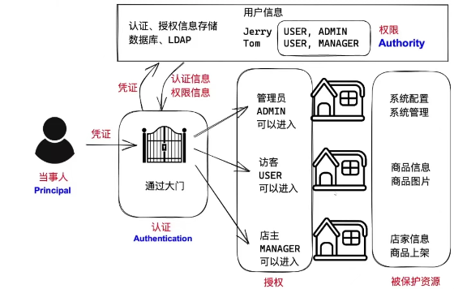

# Spring Security框架

Spring Security框架主要解决了**认证**与**授权**相关的问题.

- ### 依赖:

  ```xml
  <!-- Spring Boot Security的依赖项，用于处理认证与授权 -->
  <dependency>
      <groupId>org.springframework.boot</groupId>
      <artifactId>spring-boot-starter-security</artifactId>
  </dependency>
  ```

- #### 当添加了以上依赖后,当前项目会:

  - 此依赖项中包含`BCryptPasswordEncoder`类，可以用于处理密码加密
  - 所有请求都是必须通过认证的，在没有通过认证之前，任何请求都会被重定向到Spring Security内置的登录页面
    - 可以使用`user`作为用户名，使用启动项目时随机生成的UUID密码来登录
    - 当登录成功后，会自动重定向到此前尝试访问的页面
    - 当登录成功后，所有GET的异步请求允许访问，但POST的异步请求不允许访问（403错误）

  当添加依赖后，在浏览器中尝试访问时还可能出现以下错误：

  ```
  org.springframework.security.web.firewall.RequestRejectedException: The request was rejected because the header value "Idea-c968a669=03021799-4633-4321-9d0d-11b7ee08f588; username=黄汉升; JSESSIONID=120F9329E0CE7AF9E052A302EFE494F2" is not allowed.
  ```

  此错误是浏览器的问题导致的，更换浏览器即可。

- #### 自定义密码:

  在项目默认配置文件**application.properties**中配置以下信息:

  ```properties
  #配置security登录账号
  spring.security.user.username=root
  #配置security登录密码
  spring.security.user.password=root
  ```

  > #### 此时security登录账号密码为 : root/root, 控制台不再输出随机密码

- #### Bcrypt加密:

  使用security验证密码时, 密码必须被框架中的`BCryptPasswordEncoder`类加密过
  Security框架推荐使用`Bcrypt`算法对密码原文进行加密处理, 框架中有`BCryptPasswordEncoder`类, 此类可以实现加密, 判断密码是否匹配等功能, 使用的是`Bcrypt`算法, 每次加密后密文都不相同, 因为里面加入了随机盐值, 盐值保存在密文中, 也可以正常验证

- #### 验证方法:

  Spring Security会在处理登录认证时**自动**根据尝试登录的用户名调`UserDetailsService`接口实现类的`loadUserByUsername`此方法, 并获得`UserDetails`对象, **此对象包含用户的密码、权限等信息**, 接下来, Spring Security会自动判断密码, 如果不正确, 将返回对应异常信息, 如果正确, 会将此用户信息(包含权限)保存下来(默认保存在Session中)

  >#### 比对密码时, 对比的密文必须经过Bcrypt算法加密

  - ```java
    /**
     * 基于Spring Security的登录认证创建的用户登录的(UserDetailsService接口)实现类
     * 最终返回UserDetails,以便进行认证
     *
     * @java.@Wqy
     * @Version 0.0.1
     */
    @Slf4j
    @Service
    public class UserDetailServiceImpl implements UserDetailsService {
    
        // 注入AdminMapper
        @Autowired
        private AdminMapper adminMapper;
    
        // 重写loadUserByUsername(String s)"根据用户名加载用户的方法",Spring Security会自动传入用户名进行处理
        @Override
        public UserDetails loadUserByUsername(String s) throws UsernameNotFoundException {
            log.debug("Spring Security框架自动调用UserDetailServiceImpl中的loadUserByUsername方法,参数{}", s);
    
            AdminLoginInfoVO admin = adminMapper.getLoginInfoByUsername(s);//根据传入的用户名向数据库查询数据
            log.debug("从数据库中根据用户名[{}]查询管理员信息,结果:{}", s, admin);
    
            if (admin == null) {// 判断查询的admin是否为Null?
                log.debug("没有与用户名[{}]匹配的用户信息,即将抛出异常", s);
                String message = "登录失败,用户名不存在!";
                throw new BadCredentialsException(message);// Spring Security提供的异常
            }
    
            // Spring Security框架会内置一个User对象(UserDetails接口的实现)来处理登录的用户名和密码等一系列机制
            UserDetails userDetails = User.builder() //盗用builder()方法来构建登录的信息
                    .username(admin.getUsername()) // 用户名
                    .password(admin.getPassword()) // 根据配置类返回的解码器来对应不同类型的密码,这里使用BCrypt编译器,就必须使用该算法加密后的结果
                    .disabled(admin.getEnable() == 0) // 是否禁用和启用enable
                    .accountLocked(false) // 此项目为设计"账号锁定"的机制,固定false
                    .accountExpired(false) // 此项目为设计"账号过期"的机制,固定false
                    .credentialsExpired(false) // 此项目为设计"凭证锁定"的机制,固定false
                    .authorities("暂时给出的假的权限标识") // 权限
                    .build();
            log.debug("即将向Spring Security框架返回UserDetail对象:{}", userDetails);
            return userDetails; // 最终返回登录认证所需要的信息
        }
    }
    ```

  > #### SecurityConfiguration配置类中,可重写认证的配置方法,设置白名单路径,配置启用登录,配置禁用"防止伪造跨域攻击的机制",配置允许前端AJAX请求跨源访问

- ```java
  /**
   * 重写认证的配置方法,重写前只有super.configure(http)---[所有请求都要被认证],对此应根据自身需求去改变
   * @param http http参数
   * @throws Exception 抛出异常
   */
  @Override
  protected void configure(HttpSecurity http) throws Exception {
      // 如果不调用父类方法,默认所有请求都不需要通过认证,可以直接访问
     // super.configure(http);
  
      // 白名单路径 这些路径不需要登录即可访问(但可能会有未放行的文件不能显示)---白名单外403
      String[] urls = {
              "/favicon.ico",
              "/doc.html",
              "/**/*.js",
              "/**/*.css",
              "/swagger-resources",
              "/v2/api-docs",
              "/admins/login",
      };
  
      // 允许AJAX请求跨源
      http.cors();
  
      // 将"防止伪造跨域攻击的机制"禁用(如果不添加该配置,Post请求会403---浏览器的安全措施)
      http.csrf().disable();
  
      // 添加这些方法,可以手动匹配进行随机认证-----链式写法
      // 提示: 关于请求路径的配置,如果同一路径对应多项配置规则,以第1次配置为准
      http.authorizeRequests() // 管理请求授权
              .mvcMatchers(urls) // 可匹配的路径
              .permitAll() // 直接许可,即可不需要通过认证即可访问
              .anyRequest() // 除了以上配置过的以外的其他所有请求
              .authenticated(); // 要求是"已经通过认证的"
  
      // 将JWT过滤器添加到Spring Security框架的过滤器链中
      http.addFilterBefore(jwtAuthorizationFilter, UsernamePasswordAuthenticationFilter.class);
  
      // 启用登录 :
      // -- 如果启用了表单,会自动重定向到登录表单
      // -- 如果未启用表单,则会提示403错误
          http.formLogin();
  }
  ```

  > #### 配置BCrypt密码编译器(推荐BCrypt加密)，添加Bean注解以便Spring容器进行管理

  - ```java
    /**
     * 配置密码编译器,否则无法验证密码是否正确,服务端会报错
     * @return 密码编码器
     */
    @Bean
    public PasswordEncoder passwordEncoder(){
    //        return NoOpPasswordEncoder.getInstance();// 该类使用了恶汉式单例模式仅返回一个无操作的编码器实例对象,不会对密码进行任何处理,不推荐
        return new BCryptPasswordEncoder();// 如果使用BCrypt编码器,则UserDetails中的Password密码必须是BCrypt加密的密码
    }
    ```

  > #### 配置类中重写认证信息接口
  >
  > #### 配置该接口后服务端登录实现类中将其注入后可对传入的用户名密码进行认证,认证不通过会抛出Spring Security框架内置的异常,通过后会返回Authentication的实例

  - ```java
    /**
     * 配置类重写认证信息接口
     * @return
     * @throws Exception
     */
    @Bean// 该注解便于Spring框架进行管理,自动调用,放入容器,利于自动装配
    @Override
    public AuthenticationManager authenticationManagerBean() throws Exception {
        return super.authenticationManagerBean();
    }
    ```

  - ```java
    // 注入认证信息接口对象
        @Autowired
        private AuthenticationManager authenticationManager;
    
    // 1.执行认证
        //创建一个认证器,实例化UsernamePasswordAuthenticationToken类,传入需要认证的用户名和密码
        Authentication authentication
                = new UsernamePasswordAuthenticationToken(
                adminLoginDTO.getUsername(), adminLoginDTO.getPassword());
        // 调用认证信息接口中的authenticate()方法传入认证器进行认证
        Authentication authenticate
                = authenticationManager.authenticate(authentication);
    ```

## 介绍:

Spring Security是一个能够为**基于Spring的企业应用系统提供声明式的安全访问控制解决方案的安全框架**。它提供了一组**可以在Spring应用上下文中配置的Bean**，充分利用了**Spring IoC,（控制反转Inversion of Control** ,**DI:Dependency Injection 依赖注入**）和**AOP（面向切面编程）**功能，为应用系统提供声明式的安全访问控制功能，减少了为企业系统安全控制编写大量重复代码的工作。

### 功能:

Spring Security对Web安全性的支持大量地依赖于Servlet过滤器。这些过滤器拦截进入请求，并且在应用程序处理该请求之前进行某些安全处理。 Spring Security提供有若干个过滤器，它们**能够拦截Servlet请求，并将这些请求转给认证和访问决策管理器处理，从而增强安全性**。根据自己的需要，可以使用适当的过滤器来保护自己的应用程序。

### 流程图:



------

## 相关注解:

### 1.@AuthenticationPrincipal注解

- 该注解用来让Spring Security框架自动去获取标注对象的当事人信息

  ```java
  /**
   * 处理查询管理员列表的请求
   * @return JsonResult
   */
  // http://localhost:9081/admins
  @ApiOperation("管理员列表")
  @ApiOperationSupport(order = 210)//排序
  @GetMapping("")
  public JsonResult<List<AdminListItemVO>> list(
          @ApiIgnore @AuthenticationPrincipal LoginPrincipal loginPrincipal){// 添加@ApiIgnore注解告诉Api文档忽略当前的输入框
      log.debug("开始处理[查询管理员列表]的请求,无参数");
      log.debug("当前登录的当事人:{}",loginPrincipal);
      List<AdminListItemVO> list = adminService.list();
      return JsonResult.ok(list);
  }
  ```

- 该对象封装了登录且认证成功后get到的当事人信息

  ```java
  // 2.认证成功后,从认证结果中获取所需的数据,将用于生成JWT
          Object principal = authenticateResult.getPrincipal();// 获取认证的当事人对象Principal
  // 这里得到的是登录时loadUserByUsername()中返回的类型,该类型一定"是或者继承"了UserDetails
  log.debug("认证结果中的当事人类型:{}", principal.getClass().getName());
  //例: cn.tedu.csmall.passport.security.AdminDetails
  ```

#### 该注解源码如下:

```java
package org.springframework.security.core.annotation;

import java.lang.annotation.Documented;
import java.lang.annotation.ElementType;
import java.lang.annotation.Retention;
import java.lang.annotation.RetentionPolicy;
import java.lang.annotation.Target;

@Target({ElementType.PARAMETER, ElementType.ANNOTATION_TYPE})
@Retention(RetentionPolicy.RUNTIME)
@Documented
public @interface AuthenticationPrincipal {
    boolean errorOnInvalidType() default false;

    String expression() default "";
}
```

### 2.@EnableGlobalMethodSecurity注解

- 该注解用来启用方法级别的权限检查,用在`SecurityConfiguration`配置类中
- 该注解可搭配`@PreAuthorize`注解,在控制器方法上指定权限的`value`,仅当含有该权限的用户可以请求
- 不符合权限的用户请求时,服务器会报错`AccessDeniedException`,故应当进行全局异常处理并反馈到客户端
- 搭配参数`prePostEnabled = true`可选择是否启用

#### 例如:

```java
/**
 * 创建Spring Security的配置类
 * 配置放行路径,登录页面,认证授权,禁用"防止伪造跨域攻击的机制"
 *
 * @Author java.@Wqy
 * @Version 0.0.1
 */
@Slf4j
@Configuration
// ↓↓↓↓↓↓↓↓↓↓↓↓↓↓↓↓
@EnableGlobalMethodSecurity(prePostEnabled = true)// 启用方法级别的权限检查!
public class SecurityConfiguration extends WebSecurityConfigurerAdapter {
    // 暂不关心方法体中的内容
}
```

#### 该注解源码如下:

```java
package org.springframework.security.config.annotation.method.configuration;

import java.lang.annotation.Documented;
import java.lang.annotation.ElementType;
import java.lang.annotation.Retention;
import java.lang.annotation.RetentionPolicy;
import java.lang.annotation.Target;
import org.springframework.context.annotation.AdviceMode;
import org.springframework.context.annotation.Configuration;
import org.springframework.context.annotation.Import;
import org.springframework.security.config.annotation.authentication.configuration.EnableGlobalAuthentication;

@Retention(RetentionPolicy.RUNTIME)
@Target({ElementType.TYPE})
@Documented
@Import({GlobalMethodSecuritySelector.class})
@EnableGlobalAuthentication
@Configuration
public @interface EnableGlobalMethodSecurity {
    boolean prePostEnabled() default false;

    boolean securedEnabled() default false;

    boolean jsr250Enabled() default false;

    boolean proxyTargetClass() default false;// 配置是否启用

    AdviceMode mode() default AdviceMode.PROXY;

    int order() default 2147483647;
}
```

### 3.@PreAuthorize注解

- 当添加了`@EnableGlobalMethodSecurity`注解并启用了方法级别的权限检查后
- 即可使用`@PreAuthorize`注解进行约束某个控制器的请求权限,仅当某个用户在`SecurityContext`上下文中含有该权限的信息时,才能进行请求并反馈相应的结果

#### 例如:在查询列表控制器中配置权限对应的value值

```java
/**
 * 处理查询管理员列表的请求
 * @return JsonResult
 * ★添加@ApiIgnore注解告诉Api文档忽略当前的输入框
 * ★添加@AuthenticationPrincipal注解可使SpringSecurity去获取认证成功的当事人
 */
// http://localhost:9081/admins
@ApiOperation("管理员列表")
@ApiOperationSupport(order = 210)//排序
// ↓↓↓↓↓↓
@PreAuthorize("hasAuthority('/ams/admin/read')")
@GetMapping("")
public JsonResult<List<AdminListItemVO>> list(
        @ApiIgnore @AuthenticationPrincipal LoginPrincipal loginPrincipal){
    log.debug("开始处理[查询管理员列表]的请求,无参数");
    log.debug("当前登录的当事人:{}",loginPrincipal);
    List<AdminListItemVO> list = adminService.list();
    return JsonResult.ok(list);
}
```

#### 该注解源码如下:

```java
package org.springframework.security.access.prepost;

import java.lang.annotation.Documented;
import java.lang.annotation.ElementType;
import java.lang.annotation.Inherited;
import java.lang.annotation.Retention;
import java.lang.annotation.RetentionPolicy;
import java.lang.annotation.Target;

@Target({ElementType.METHOD, ElementType.TYPE})
@Retention(RetentionPolicy.RUNTIME)
@Inherited
@Documented
public @interface PreAuthorize {
    String value();
}
```

------

------

| 注解                          | 所属框架        | 作用                                                         |
| ----------------------------- | --------------- | ------------------------------------------------------------ |
| `@EnableGlobalMethodSecurity` | Spring Security | 添加在配置类上，用于开启全局的方法级别的权限控制             |
| `@PreAuthorize`               | Spring Security | 添加在方法上，用于配置权限                                   |
| `@AuthenticationPrincipal`    | Spring Security | 添加在方法的参数上，且此参数应该是Security上下文中的认证信息中的当事人类型，用于为此参数注入值 |
