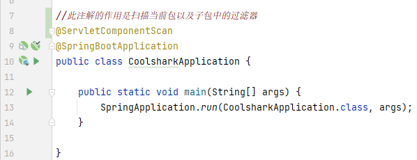

# Spring框架:

### 1.@ResponseBody注解

- #### 此注解的作用是,用JSON格式将一个方法的返回值加载到response的body区域，向客户端返回数据信息。

- #### 如果设置了返回值但不添加该注解,返回的数据,客户端请求不到.

- #### 也可以不加返回值

```java
@Controller
public class HelloController {
    @RequestMapping("/hello")
    @ResponseBody //此注解的作用是,可以通过返回值的方式给客户端响应数据
    public String hello(){
        return "服务器接收到了响应!";
    }
}
```

#### 注解源码如下:

```java
package org.springframework.web.bind.annotation;

import java.lang.annotation.Documented;
import java.lang.annotation.ElementType;
import java.lang.annotation.Retention;
import java.lang.annotation.RetentionPolicy;
import java.lang.annotation.Target;

@Target({ElementType.TYPE, ElementType.METHOD})
@Retention(RetentionPolicy.RUNTIME)
@Documented
public @interface ResponseBody {}
```

- #### 处理表单信息的传参方式

```java
@Controller
public class ParamController {
    @RequestMapping("/param1")
    @ResponseBody
    public String param1(HttpServletRequest request){
        //从Request对象中获取参数(该种方法只能传字符串,之后做转换)
        String info = request.getParameter("info");
        return "接收到了:"+info;
        //提交后浏览器路径信息:http://localhost:8080/param1?info=xxx
    }

    @RequestMapping("/param2")
    @ResponseBody
    //SpringMVC框架提供的方式,直接在参数列表中传入表单中的信息,★如果传入参数类型有误,报400错误
    public String param2(String name,int age){//变量名应当与表单上的name值一致
        return name+":"+age;
        //提交后浏览器路径信息:http://localhost:8080/param2?name=xxx&age=xxx
    }

    @RequestMapping("/param3")
    @ResponseBody
    public String param3(Emp emp){//将表单中的信息封装到对象中,在参数列表中传递该对象即可!
        return emp.toString();
        //提交后浏览器路径信息:http://localhost:8080/param3?name=xxx&salary=xxx&job=xxx
    }
}
```

#### 浏览器400错误:传参时不符合对应数据类型导致

```html
Whitelabel Error Page
This application has no explicit mapping for /error, so you are seeing this as a fallback.

Sat Oct 08 15:57:05 CST 2022
There was an unexpected error (type=Bad Request, status=400).
```

### 2.@RequestMapping注解

- #### @RequestMapping注解是一个用来处理请求地址映射的注解，可用于映射一个请求或一个方法，可以用在类或方法上。

  - ##### 方法上:表示该方法中处理的业务以该地址作为路径

    ```java
    @RequestMapping("/testRequest")
    @ResponseBody
    public String testRequest(){
        retrun "success";
    }
    ```

  - ##### 类上:表示类中所有响应请求的方法都是以该地址作为父路径

    ```java
    @Controller
    @RequestMapping("/hello")
    public class RequestMappingController{
        
    }
    ```

  #### 该注解源码如下:

  ```java
  package org.springframework.web.bind.annotation;
  
  import java.lang.annotation.Documented;
  import java.lang.annotation.ElementType;
  import java.lang.annotation.Retention;
  import java.lang.annotation.RetentionPolicy;
  import java.lang.annotation.Target;
  
  @Target({ElementType.TYPE, ElementType.METHOD})
  @Retention(RetentionPolicy.RUNTIME)
  @Documented
  @Mapping
  public @interface RequestMapping {}
  ```
  

### 3.封装对象时要注意的细节

- #### getter,setter方法,重写toString,有参和全参构造器(行业标准)

```java
//无参构造器默认存在,但是当有了有参构造器,无参构造器就不存在了,由于SpringMVC内部会用到无参构造器,所以需再加入无参构造器
    public Product(){}

    public Product(Integer id, String title, Double price, Integer num) {
        this.id = id;
        this.title = title;
        this.price = price;
        this.num = num;
    }
```

### 4.@RestController注解

- #### 与@Controller注解相似,不同的是使用@RestController相当于在每一个方法上都添加了@ResponseBody注解(该注解通过返回值方式向浏览器响应数据)

#### 该注解源码如下:

```java
package org.springframework.web.bind.annotation;

import java.lang.annotation.Documented;
import java.lang.annotation.ElementType;
import java.lang.annotation.Retention;
import java.lang.annotation.RetentionPolicy;
import java.lang.annotation.Target;
import org.springframework.stereotype.Controller;

@Target({ElementType.TYPE})
@Retention(RetentionPolicy.RUNTIME)
@Documented
@Controller
@ResponseBody
public @interface RestController {}
```

### 5.@Mapper注解

- #### 该注解是一个接口类型,在接口中书写实体类和数据库中表之间的对应关系,Mybatis框架会自动通过此关系生成JDBC代码

- #### @Insert/Select/Delete/Update()该注解方法用来写SQL语句,配合抽象方法传入的参数完成与数据库的相关操作(增删改查...)

#### 该注解源码如下:

```java
package org.apache.ibatis.annotations;

import java.lang.annotation.Documented;
import java.lang.annotation.ElementType;
import java.lang.annotation.Inherited;
import java.lang.annotation.Retention;
import java.lang.annotation.RetentionPolicy;
import java.lang.annotation.Target;

@Documented
@Inherited
@Retention(RetentionPolicy.RUNTIME)
@Target({ElementType.TYPE, ElementType.METHOD, ElementType.FIELD, ElementType.PARAMETER})
public @interface Mapper {}
```

### 6.@Autowired注解

- ##### 自动装配 此框架添加之后,Mybatis和Spring框架会生成ProductMapper的实现类,并且实例化该实现类(实现类里面会实现ProductMapper中的抽象方法,实现的方法里面写的就是JDBC代码),并且把实例化好的对象赋值给了mapper变量

- ##### Spring会自动帮你把bean里面引用的对象的setter/getter方法省略,它会自动帮你set/get

#### 该注解源码如下:

```java
package org.springframework.beans.factory.annotation;

import java.lang.annotation.Documented;
import java.lang.annotation.ElementType;
import java.lang.annotation.Retention;
import java.lang.annotation.RetentionPolicy;
import java.lang.annotation.Target;

@Target({ElementType.CONSTRUCTOR, ElementType.METHOD, ElementType.PARAMETER, ElementType.FIELD, ElementType.ANNOTATION_TYPE})
@Retention(RetentionPolicy.RUNTIME)
@Documented
public @interface Autowired {}
```

### 7.@RequestBody(请求体)注解

- #### 如果发出的请求方式为post请求并且传递过来的是自定义JS对象接收参数时需要添加@RequestBody注解 

- #### 传递JSON格式数据,把JSON格式数据封装到对象里面{...}

- ####  如果不加注解  接收到的参数是null

#### 该注解源码如下:

```java
package org.springframework.web.bind.annotation;

import java.lang.annotation.Documented;
import java.lang.annotation.ElementType;
import java.lang.annotation.Retention;
import java.lang.annotation.RetentionPolicy;
import java.lang.annotation.Target;

@Target({ElementType.PARAMETER})
@Retention(RetentionPolicy.RUNTIME)
@Documented
public @interface RequestBody {}
```

### 8.@JsonFormat注解

- ##### 该注解处理事件属性的呈现格式和时区

  ```java
  private Integer id;
      private String content;
      private String url; //微博图片路径
      //通过JsonFormat设置显示的时间格式
      // 2022年10月12号 15时23分22秒   2022-10-12 15:23:22
      // yyyy年MM月dd号 HH时mm分ss秒   yyyy-MM-dd HH:mm:ss (h为1-12时,H为1-24时)
      @JsonFormat(pattern = "yyyy年MM月dd号 HH时mm分ss秒",timezone = "GMT+8")//指定时间呈现格式和时区GMT+8东八区
      private Date created; //发布微博时间
  ```

### 9.@Configuration注解

- ##### @Configuration注解可告诉编译器该工程所有Mapper接口都在这个包路径path里面.

#### 该注解源码如下:

```java
package org.springframework.context.annotation;

import java.lang.annotation.Documented;
import java.lang.annotation.ElementType;
import java.lang.annotation.Retention;
import java.lang.annotation.RetentionPolicy;
import java.lang.annotation.Target;

@Target({ElementType.TYPE})
@Retention(RetentionPolicy.RUNTIME)
@Documented
@Component
public @interface Configuration {}
```

### 10.@Value注解

- ##### 该注解会将XML配置文件中的变量赋给注解下的变量

- ##### 例如配置文件中:

  - ```properties
    spring.web.resources.static-locations=file:${dirPath},classpath:static
    #设置上传文件大小  默认1MB
    spring.servlet.multipart.max-file-size=10MB
    #配置Mybatis书写SQL语句的xml文件的位置
    mybatis.mapper-locations=classpath:mappers/*xml
    #配置静态资源文件夹路径,利用${}调用
    dirPath=G:/files
    ```

- ##### 在java类中使用时:

  - ```java
    @RestController
    public class UploadController {
        @Value("${dirPath}")//该注解会将配置文件中的变量传递到当下的全局变量中
        private String dirPath;
        //准备保存图片的文件夹
        File dirFile = new File(dirPath);
        if (!dirFile.exists()){
            dirFile.mkdirs();
        }
    ```

#### 该注解源码如下:

```java
package org.springframework.beans.factory.annotation;

import java.lang.annotation.Documented;
import java.lang.annotation.ElementType;
import java.lang.annotation.Retention;
import java.lang.annotation.RetentionPolicy;
import java.lang.annotation.Target;

@Target({ElementType.FIELD, ElementType.METHOD, ElementType.PARAMETER, ElementType.ANNOTATION_TYPE})
@Retention(RetentionPolicy.RUNTIME)
@Documented
public @interface Value {
    String value();
}
```

### 11.@ServletComponentScan注解

- ##### 该注解作用在类上,通常在启动类中

- ##### 作用是扫描当前包以及子包中的过滤器

  

#### 该注解源码如下:

```java
@Target({ElementType.TYPE})
@Retention(RetentionPolicy.RUNTIME)
@Documented
@Import({ServletComponentScanRegistrar.class})
public @interface ServletComponentScan {}
```

### 12.@SpringBootTest注解

- ##### 该注解用于测试类上

### 13.@Test注解

- ##### 该注解用于测试类中的方法上

### 14.@Data注解

- #### 该注解是Lombok的依赖项产生的注解(Lombok框架),可自动提供getter和setter方法,重写toString()和hashCode()方法

- ```xml
   <!-- Lombok的依赖项，主要用于简化POJO类的编写 -->
          <dependency>
              <groupId>org.projectlombok</groupId>
              <artifactId>lombok</artifactId>
              <version>1.18.20</version>
              <scope>provided</scope>
          </dependency>
  ```

### 15.@Repository注解

- #### 当自动装配Mapper接口的对象时，IntelliJ IDEA可能会报错，提示无法装配此对象，但是，并不影响运行!

- #### 添加该注解是为了引导IntelliJ IDEA作出正确的判断

- ```java
  @Repository//该注解用于引导IDEA作出正确的判断
  public interface CategoryMapper {}
  ```

#### 该注解源码如下:

```java
package org.springframework.stereotype;

import java.lang.annotation.Documented;
import java.lang.annotation.ElementType;
import java.lang.annotation.Retention;
import java.lang.annotation.RetentionPolicy;
import java.lang.annotation.Target;
import org.springframework.core.annotation.AliasFor;

@Target({ElementType.TYPE})
@Retention(RetentionPolicy.RUNTIME)
@Documented
@Component
public @interface Repository {}
```

### 16.@Configuration和@MapperScan()注解的结合使用

- ##### @Configuration注解可告诉编译器该工程所有Mapper接口都在这个包路径path里面.

- ##### @MapperScan()注解用于传入要告知服务器mapper接口的包路径.

- ##### 这两种注解Config配置完成后,在接口中就无序添加@Mapper注解和增删改查的@Insert()/@Delete()/@Update()/@Select()注解方法了

  ```java
  @Configuration
  @MapperScan("cn.tedu.boot08.mapper")
  public class MyBatisConfig {
  }
  ```

#### 注解源码如下:

```java
package org.mybatis.spring.annotation;

import java.lang.annotation.Documented;
import java.lang.annotation.ElementType;
import java.lang.annotation.Repeatable;
import java.lang.annotation.Retention;
import java.lang.annotation.RetentionPolicy;
import java.lang.annotation.Target;
import org.springframework.context.annotation.Import;

@Retention(RetentionPolicy.RUNTIME)
@Target({ElementType.TYPE})
@Documented
@Import({MapperScannerRegistrar.class})
@Repeatable(MapperScans.class)
public @interface MapperScan {}
```

### 17.@Resource注解

- #### 自动装配/注入,与@Autowired注解类似

### 18.@Service注解

- ##### `@Service`注解用于类上，标记当前类是一个service类，位于Service层

- ##### 加上该注解会将当前类自动注入到spring容器中，不需要再在applicationContext.xml文件定义bean了。

#### 该注解源码如下:

```java
package org.springframework.stereotype;

import java.lang.annotation.Documented;
import java.lang.annotation.ElementType;
import java.lang.annotation.Retention;
import java.lang.annotation.RetentionPolicy;
import java.lang.annotation.Target;

@Target({ElementType.TYPE})
@Retention(RetentionPolicy.RUNTIME)
@Documented
@Component
public @interface Service {}
```

### 19.@ExceptionHandler注解

- ##### 首先处理请求方法抛出的异常由SpringMVC框架进行处理

- ##### 该注解会让SpringMVC自行捕获当前Controller类中处理请求的所有方法抛出的异常

- ##### 在该注解下可捕获可能产生的不同种类的异常

  - **全局异常处理**(只要出现异常,执行这个处理)
  - **特定异常处理**(针对特定异常处理)
  - **自定义异常处理**(自己编写异常类,手动抛出异常)
    - 自定义类编写完成并添加注解后,它不会自动抛出,因此需要在对应的异常代码中使用try-catch来将该自定义异常进行抛出

- ##### 防止频繁的进行try-catch

#### 该注解源码如下:

```java
package org.springframework.web.bind.annotation;

import java.lang.annotation.Documented;
import java.lang.annotation.ElementType;
import java.lang.annotation.Retention;
import java.lang.annotation.RetentionPolicy;
import java.lang.annotation.Target;

@Target({ElementType.METHOD})
@Retention(RetentionPolicy.RUNTIME)
@Documented
public @interface ExceptionHandler {
    Class<? extends Throwable>[] value() default {};
}
```

### 20.ControllerAdvice注解

- ##### 该注解用来标注类,用于处理当前项目的全局异常

- ##### 该类应当定义处理各种`@RequestMapping`标注的处理业务方法可能抛出的所有异常,达到全局的效果

- ##### 每种经`@RequestMapping`标注的处理业务的方法都还需增加`@ResponseBody`注解,用于将返回值以JSON的格式加载到response的Body区域,给用户返回

#### 该注解源码如下:

```java
package org.springframework.web.bind.annotation;

import java.lang.annotation.Annotation;
import java.lang.annotation.Documented;
import java.lang.annotation.ElementType;
import java.lang.annotation.Retention;
import java.lang.annotation.RetentionPolicy;
import java.lang.annotation.Target;
import org.springframework.stereotype.Component;

@Target({ElementType.TYPE})
@Retention(RetentionPolicy.RUNTIME)
@Documented
@Component
public @interface ControllerAdvice {}
```

### 21.@RestControllerAdvice注解

- ##### 该注解用于处理全局异常(对于整个项目而言),作用在类上

- ##### 该类应当定义处理各种`@RequestMapping`标注的处理业务方法可能抛出的所有异常,达到全局的效果

- ##### 使得任何标注`@RequestMapping`处理请求的方法对于XXXException都应该是抛出的且各`Controller`控制器类中都不必关心如何处理XXXException

- ##### 添加该注解后就不用在每一个处理异常的方法上添加`@ResponseBody`注解来以特定的JOSN格式返回数据

#### 该注解源码如下:

```java
package org.springframework.web.bind.annotation;

import java.lang.annotation.Annotation;
import java.lang.annotation.Documented;
import java.lang.annotation.ElementType;
import java.lang.annotation.Retention;
import java.lang.annotation.RetentionPolicy;
import java.lang.annotation.Target;

@Target({ElementType.TYPE})
@Retention(RetentionPolicy.RUNTIME)
@Documented
@ControllerAdvice
@ResponseBody
public @interface RestControllerAdvice {}
```

### 22.@PathVariable注解

- ##### 该注解作用在参数列表中,作用是获取`@RequestMapping`的请求路径中用`{}`占位符标注的部分

- #### 例:

  ```java
  // http://localhost:8080/albums/233/delete
      @RequestMapping("/{id}/delete")
      public String delete(@PathVariable Long id){//接收路径中通过占位符传入的信息(类型要匹配)
          String message = "尝试删除id值为["+id+"]的相册";//id=233
          log.debug(message);//输出日志
          return message;//向客户端返回结果
      }
  ```

#### 该注解源码如下:

> @AliasFor该注解有相较于的意思,这里的"value"相当于"name"

```java
package org.springframework.web.bind.annotation;

import java.lang.annotation.Documented;
import java.lang.annotation.ElementType;
import java.lang.annotation.Retention;
import java.lang.annotation.RetentionPolicy;
import java.lang.annotation.Target;
import org.springframework.core.annotation.AliasFor;

@Target({ElementType.PARAMETER})
@Retention(RetentionPolicy.RUNTIME)
@Documented
public @interface PathVariable {
    //@AliasFor该注解有相较于的意思,这里的"value"相当于"name"
    @AliasFor("name")
    String value() default "";

    @AliasFor("value")
    String name() default "";

    boolean required() default true;
}
```

### 23.Spring MVC框架还定义了已经限制了请求方式的、与`@RequestMapping`类似的注解，包括：

- ### `@GetMapping`

- ### `@PostMapping`

- ### `@PutMapping`

- ### `@DeleteMapping`

- ### `@PatchMapping`

> 通过地址栏访问的都是get请求,为便于开发人员测试,可使用Knife4j文档框架进行测试
