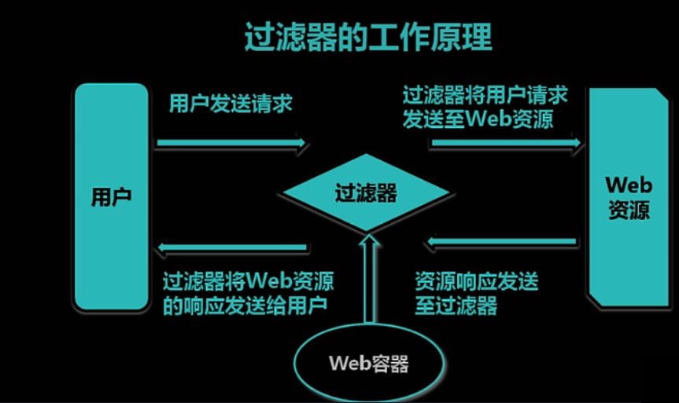

# Java Filter过滤器

- #### 作用: 可以让客户群请求到服务器资源之前或之后经过过滤器




- #### 如何使用过滤器?

  - ##### 创建Filter类文件		

  - ##### 在WebFilter注解中配置处理的请求路径

  - ##### 在doFilter方法中处理请求,写上判断代码,条件满足执行chain.doFilter(request, response);代码代表放行.

  - ##### 在XXXXApplication.java文件中添加@ServletComponentScan注解 进行过滤器扫描

```java
package cn.tedu.coolshark.filter;

import cn.tedu.coolshark.pojo.vo.UserVo;

import javax.servlet.*;
import javax.servlet.annotation.*;
import javax.servlet.http.HttpServletRequest;
import javax.servlet.http.HttpServletResponse;
import javax.servlet.http.HttpSession;
import java.io.IOException;

                                 //urlPatterns里面的路径必须以/开头,如果书写错误会导致项目无法启动
@WebFilter(filterName = "MyFilter",urlPatterns = {"/admin.html","/insertProduct.hml"})
public class MyFilter implements Filter {
    //过滤器初始化方法
    public void init(FilterConfig config) throws ServletException {
    }

    //过滤器销毁方法
    public void destroy() {
    }

    //当请求经过过滤器时执行的方法
    @Override
    public void doFilter(ServletRequest request, ServletResponse response, FilterChain chain) throws ServletException, IOException {
        //参数列表中变量进行了向上造型,这里需强转成指定的类型,以便调用合适的方法
        HttpServletRequest rt = (HttpServletRequest) request;
        HttpServletResponse re = (HttpServletResponse) response;
        //通过HttpServletRequest从请求对象中获取Session对象
        HttpSession session = rt.getSession();
        //获取Session中的用户对象,强转成UserVO类型
        UserVo user = (UserVo) session.getAttribute("user");
        if (user!=null){//登录了
            chain.doFilter(request, response);//放行
        }else {
            re.sendRedirect("/login.html");//通过HttpServletResponse类重定向到登录页面
        }
    }
}
```

- #### 过滤器urlParttens配置方式

  - ##### 精确匹配:   /admin.html  /insertProduct.html  

  - ##### 后缀匹配:  *.jpg     *.html      *.xxx

  - ##### 路径匹配:  /product/*       /user/*   

  - ##### 全部匹配: /*   (匹配网站中所有资源 )

