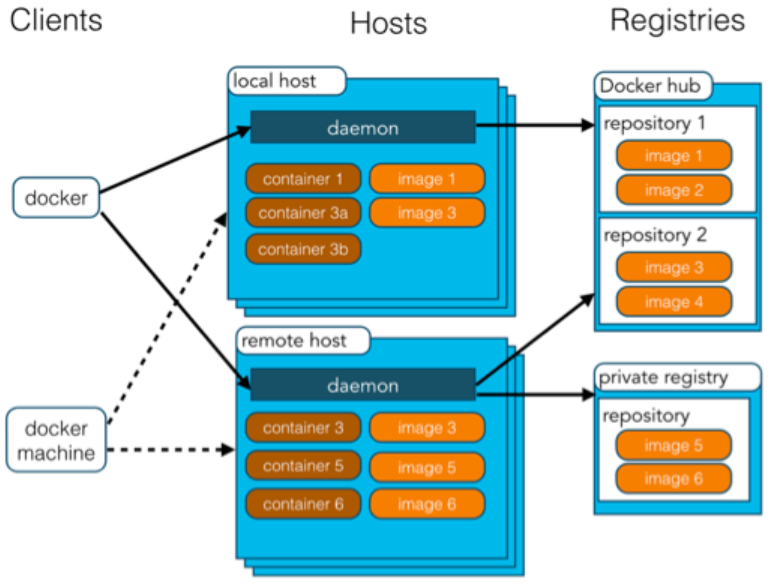
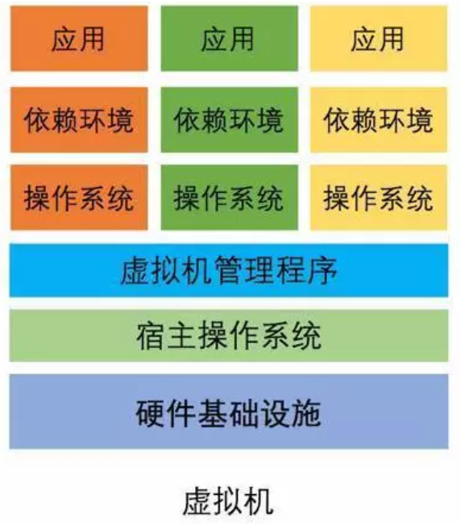
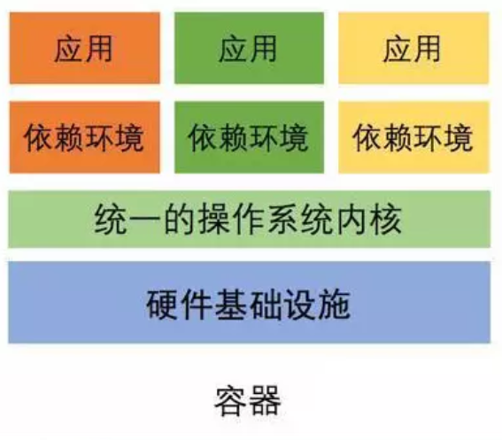
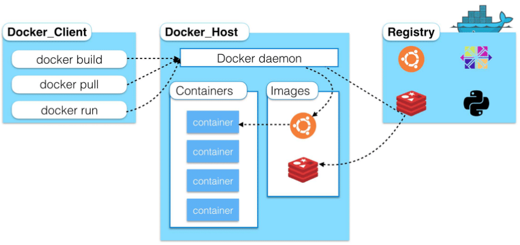
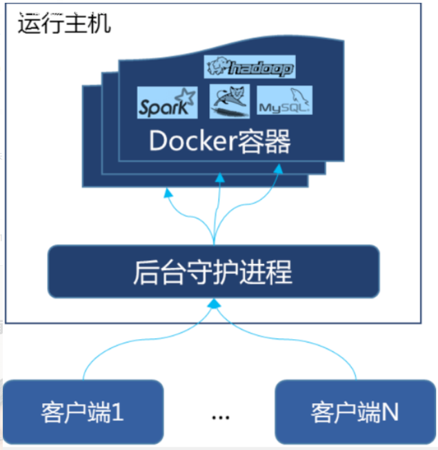

# Docker容器化技术

> #### 1.国外英文官网:https://www.docker.com/    --->docs
>
> #### 2.中文官网:https://docs.docker.com.zh.xy2401.com/
>
> #### 3.所有命令:https://docs.docker.com/reference/

## 百科概念:

Docker 是一个开源的应用容器引擎，让开发者可以打包他们的应用以及依赖包到一个可移植的[镜像](https://baike.baidu.com/item/镜像/1574?fromModule=lemma_inlink)中，然后发布到任何流行的 [Linux](https://baike.baidu.com/item/Linux?fromModule=lemma_inlink)或[Windows](https://baike.baidu.com/item/Windows/165458?fromModule=lemma_inlink)操作系统的机器上，也可以实现[虚拟化](https://baike.baidu.com/item/虚拟化/547949?fromModule=lemma_inlink)。容器是完全使用[沙箱](https://baike.baidu.com/item/沙箱/393318?fromModule=lemma_inlink)机制，相互之间不会有任何接口。

一个完整的Docker有以下几个部分组成：

1. DockerClient客户端
2. Docker Daemon守护进程
3. Docker Image镜像
4. DockerContainer容器

## 起源:

Docker 是 [PaaS](https://baike.baidu.com/item/PaaS?fromModule=lemma_inlink) 提供商 dotCloud 开源的一个基于 [LXC](https://baike.baidu.com/item/LXC?fromModule=lemma_inlink) 的高级容器引擎，源代码托管在 [Github](https://baike.baidu.com/item/Github?fromModule=lemma_inlink) 上, 基于[go语言](https://baike.baidu.com/item/go语言?fromModule=lemma_inlink)并遵从Apache2.0协议开源。2013年起变得火热!

## Docker架构:

Docker使用客户端-服务器(C/S)架构模式,使用远程API来管理和创建Docker容器,Docker容器通过Docker镜像来创建,容器与镜像之间的关系类似于面向对象编程中的对象与类

- Docker采用C/S架构  **Docker daemon(守护进程)**作为服务端接收客户端的请求,并处理这些请求(创建,运行,分发容器),客户端和服务端既可以运行在一台机器上,也可以通过socket或者RESTful API来通信.
- Docker daemon一般在宿主主机后台运行,等待接收来自客户端的消息,Docker客户端则为用户提供一系列可执行命令,用户用这些命令实现Docker daemon交互

## 特性:

在Docker网站用提到:

- Automating the packaging and deployment of applications（使应用的打包与部署自动化）
- Creation of lightweight, private PAAS environments（创建轻量、私密的PAAS环境）
- Automated testing and continuous integration/deployment（实现自动化测试和持续的集成/部署）
- Deploying and scaling web apps, databases and backend services（部署与扩展webapp、数据库和后台服务）

## 局限:

Docker并不是全能的，设计之初也不是KVM之类虚拟化手段的替代品，简单总结几点：

1. Docker是基于Linux 64bit的，无法在32bit的linux/Windows/unix环境下使用
2. LXC是基于cgroup等linux kernel功能的，因此container的guest系统只能是linux base的
3. 隔离性相比KVM之类的虚拟化方案还是有些欠缺，所有container公用一部分的运行库
4. 网络管理相对简单，主要是基于namespace隔离
5. cgroup的cpu和cpuset提供的cpu功能相比KVM的等虚拟化方案相比难以度量(所以dotcloud主要是按内存收费)
6. Docker对disk的管理比较有限
7. container随着用户进程的停止而销毁，container中的log等用户数据不便收集

## 原理:

Docker核心解决的问题是利用LXC来实现类似VM的功能，从而利用更加节省的硬件资源提供给用户更多的计算资源。同VM的方式不同, [LXC](https://baike.baidu.com/item/LXC?fromModule=lemma_inlink) 其并不是一套硬件虚拟化方法 - 无法归属到全虚拟化、部分虚拟化和半虚拟化中的任意一个，而是一个操作系统级虚拟化方法, 理解起来可能并不像VM那样直观。所以我们从虚拟化到docker要解决的问题出发，看看他是怎么满足用户虚拟化需求的。

用户需要考虑虚拟化方法，尤其是[硬件虚拟化](https://baike.baidu.com/item/硬件虚拟化/4155078?fromModule=lemma_inlink)方法，需要借助其解决的主要是以下4个问题:

- 隔离性 - 每个用户实例之间相互隔离, 互不影响。 硬件虚拟化方法给出的方法是VM, LXC给出的方法是container，更细一点是kernel namespace
- 可配额/可度量 - 每个用户实例可以按需提供其计算资源，所使用的资源可以被计量。硬件虚拟化方法因为虚拟了CPU, memory可以方便实现, LXC则主要是利用cgroups来控制资源
- 移动性 - 用户的实例可以很方便地复制、移动和重建。硬件虚拟化方法提供snapshot和image来实现，docker(主要)利用AUFS实现
- 安全性 - 这个话题比较大，这里强调是host主机的角度尽量保护container。硬件虚拟化的方法因为虚拟化的水平比较高，用户进程都是在KVM等虚拟机容器中翻译运行的, 然而对于LXC, 用户的进程是lxc-start进程的子进程, 只是在Kernel的namespace中隔离的, 因此需要一些kernel的patch来保证用户的运行环境不会受到来自host主机的恶意入侵, dotcloud(主要是)利用kernel grsec patch解决的.

------

## 虚拟机与容器的比较

在容器化技术出来之前,使用的是虚拟机技术,虚拟机和Docker容器技术都是一种虚拟化技术

虚拟机包含的是整个操作系统的原生镜像,非常庞大,而Docker的镜像只包含最核心的环境,**非常小巧!**

| 属性           | Docker   | 虚拟化 |
| -------------- | -------- | ------ |
| 启动速度       | 秒级     | 分钟级 |
| 硬盘使用       | MB级     | GB级   |
| 性能           | 接近原生 | 较低   |
| 普通机器支撑量 | 数百个   | 几个   |

#### 1.虚拟机技术

缺点:

- 资源占用十分多
- 冗余步骤多
- 启动十分满

#### 2.容器化技术

容器化技术不是模拟的一个完整的操作系统

##### 比较Docker与虚拟机技术的不同:

1. 传统虚拟机，虚拟出一套硬件，运行一个完整的操作系统，然后在这个操作系统上安装和运行软件
2. Docker 容器内的应用进程直接运行在宿主机的内核（内核级虚拟化），容器内没有自己的内核且也没有进行硬件虚拟。因此容器要比传统虚拟机更为轻便。
3. 每个容器是互相隔离的，每个容器有属于自己的文件系统，容器之间进行不会相互影响，能区分计算资源-----**共享内核,减少开销**

#### 3.容器的优点

- 应用更快速的交付和部署，打包镜像发布测试，一键运行
- 更快捷的升级和扩缩容
- 更简单的系统运维，开发、测试环境高度一致
- 更高效的计算资源利用

#### 4.Docker比虚拟机快的原因

- Docker有着比虚拟机更少的抽象层，Docker不需要实现硬件资源虚拟化，而是直接使用实际物理机的硬件资源，因此在Cpu、内存利用率上Docker将会在效率上有明显优势。

- Docker利用的是宿主机的内核，当新建一个容器时，不需要和虚拟机一样重新加载一个操作系统，避免了引导、加载操作系统内核这个比较费时费资源的过程，当新建一个虚拟机时，虚拟机软件需要加载Guest OS，这个新建过程是分钟级别的，而Docker由于直接利用宿主机的操作系统则省略了这个过程，因此新建一个Docker容器只需要**几秒钟**。
  

## Docker概念

#### 1.镜像(image)

docker镜像就好比是一个模板，可以通过这个模板来创建容器服务

如tomcat镜像 ===> run  ===>  tomcat01容器（提供服务）

通过一个镜像可以创建多个容器，最终服务运行或项目运行就是在容器中的

#### 2.容器(container)

Docker利用容器技术，独立运行一个或一组应用，通过镜像来创建的

拥有启动、停止、删除等基本命令

可以把容器理解为一个建议的linux系统

#### 3.仓库(repository)

仓库就是存放镜像的地方，分为共有和私有

Docker Hub**（默认是国外的）**，阿里云等厂商都有提供容器服务

## Docker架构图:

## Docker底层原理:

Docker是一个Client-Server结构的系统，Docker守护进程运行在主机上， 然后通过Socket连接从客户端访问，守护进程从客户端接受命令并管理运行在主机上的容器。

## 总结:

- Docker 本身是一个容器运行载体或称之为管理引擎。我们把**应用程序和配置依赖**打包好形成一个**可交付的运行环境**，这个打包好的运行环境就是 image镜像文件。只有通过这个镜像文件才能生成Docker容器。image 文件可以看作是容器的模板。Docker 根据image文件生成容器的实例。 同一个 image 文件，可以生成多个同时运行的容器实例。

- image 文件生成的容器实例，本身也是一个文件，称为镜像文件。

- 一个容器运行一种服务，当我们需要的时候，就可以通过docker客户端创建一个对应的运行实例， 也就是我们的容器

- 仓库就是存镜像的地方，我们可以把镜像发布（push）到仓库中，需要的时候从仓库中拉下来（pull）就可以了。