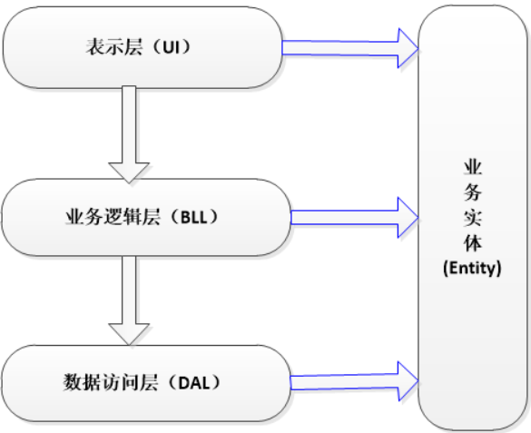

# MVC三层架构

## 一、三层架构包括:

- **UI(表现层)**: 主要是指与用户交互的界面。用于接收用户输入的数据和显示处理后用户需要的数据。
- **BLL:(业务逻辑层)**: UI层和DAL层之间的桥梁。实现业务逻辑。
- **DAL:(数据访问层)**: 与数据库打交道。主要实现对数据的增、删、改、查。将存储在数据库中的数据提交给业务层，同时将业务层处理的数据保存到数据库。（当然这些操作都是基于UI层的。用户的需求反映给界面（UI），UI反映给BLL，BLL反映给DAL，DAL进行数据的操作，操作后再一一返回，直到将用户所需数据反馈给用户）
- **Entity(实体层)**：它不属于三层中的任何一层，但是它是必不可少的一层。

## 二、Entity在三层架构中的作用：

##### 1、实现面向对象思想中的"封装";

##### 2、贯穿于三层，在三层之间传递数据;（注：确切的说实体层贯穿于三层之间，来连接三层）

##### 3、每一条数据就相当于一个对象，每个字段对应对象相应的属性（ORM思想）。

##### 4、每一层（UI—>BLL—>DAL）之间的数据传递（单向）是靠变量或实体作为参数来传递的，这样就构造了三层之间的联系，完成了功能的实现。

## 三、为什么使用三层架构?

目的很简单，实现"**高内聚,低耦合**"

**内聚**：一个模块内各个元素彼此结合的紧密程度，高内聚就是一个模块内各个元素彼此结合的紧密程度高。

**耦合**：一个完整的系统，模块与模块之间，尽可能的使其独立存在，也就是说，让每个模块，尽可能的独立完成某个特定的子功能，模块与模块之间的接口，尽量少而简单，如果某两个模块间的关系比较复杂的话，最好首先进行模块划分，有利于修改和组合。

## 四、与两层的区别

#### 两层:

（当任何一个地方发生变化时，都需要重新开发整个系统。"多层"放在一层，分工不明确耦合度高——难以适应需求变化，可维护性低、可扩展性低）  

#### 三层:

（发生在哪一层的变化，只需更改该层，不需要更改整个系统。层次清晰，分工明确，每层之间耦合度低——提高了效率，适应需求变化，可维护性高，可扩展性高）

#### 三层架构的优势：

##### 1，结构清晰、耦合度低

##### 2，可维护性高，可扩展性高

##### 3，利于开发任务同步进行, 容易适应需求变化

#### 三层架构的劣势：

##### 1、降低了系统的性能。这是不言而喻的。如果不采用分层式结构，很多业务可以直接造访数据库，以此获取相应的数据，如今却必须通过中间层来完成。

##### 2、有时会导致级联的修改。这种修改尤其体现在自上而下的方向。如果在表示层中需要增加一个功能，为保证其设计符合分层式结构，可能需要在相应的业务逻辑层和数据访问层中都增加相应的代码

##### 3、增加了代码量，增加了工作量