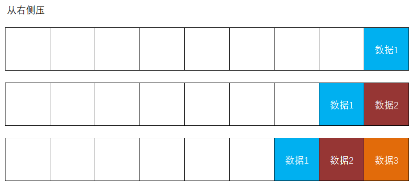

# Redis

Redis是一款基于内存的、使用K-V结构来实现读写数据的NoSQL非关系型数据库

- 基于内存的：Redis访问的数据都在内存中
  - Redis的读写效率非常高
  - 其实Redis也会自动的处理持久化，但是正常读写都是在内存中执行的

- NoSQL：不涉及SQL语句，`No`可理解为日常英语中的`no`（没有），也可理解为`No Operation`（不操作）
- 非关系型数据库：不关心数据库中存储的是什么数据，几乎没有数据种类的概念，更不存在数据与数据之间的关联

通常，在项目中，Redis用于实现缓存！


当使用Redis后：

- 【优点】读取数据的效率会高很多
- 【优点】能够一定程度上保障缓解数据库的查询压力，提高数据库的安全性
- 【缺点】需要关注数据一致性问题，即Redis中的数据与MySQL中的数据是否一致，如果不一致，是否需要处理

# 97. Redis的基本操作

在Windows操作系统中，通过`.msi`安装包来安装的Redis，会自动注册Redis服务，开机会自动启动Redis，所以，Redis处于随时可用的状态。

可以在命令提示符窗口或终端窗口通过`redis-cli`命令，登录Redis控制台：

```
D:\IdeaProjects\jsd2207-csmall-product-teacher>redis-cli
127.0.0.1:6379>
```

当操作提示符变成 `127.0.0.1:6379>` 后，表示已经登录到Redis客户端的控制台。

在Redis客户端控制台中，可以通过`ping`命令实时检测Redis是否仍处理可用状态，如果Redis服务正常可用，将反馈`PONG`：

```
127.0.0.1:6379> ping
PONG
```

在Redis客户端控制台中，可以通过`exit`命令退出，以回到操作系统的终端：

```
127.0.0.1:6379> exit

D:\IdeaProjects\jsd2207-csmall-product-teacher>
```

在Redis客户端控制台中，可以通过`set`命令向Redis中存入值数据，例如：

```
127.0.0.1:6379> set name wangkejing
OK
```

在Redis客户端控制台中，可以通过`get`命令向Redis中存入值数据，例如：

```
127.0.0.1:6379> get name
"wangkejing"
```

```
127.0.0.1:6379> get email
(nil)
```

提示：以上使用的`set`命令，既是新增数据的命令（当Key尚且不存在时），也是修改数据的命令（当Key已经存在时），例如：

```
127.0.0.1:6379> set name fanchuanqi
OK
127.0.0.1:6379> get name
"fanchuanqi"
```

在Redis客户端控制台中，可以通过`keys`命令向Redis中存入值数据，此命令必须有参数，在参数中可以使用通配符，例如：

```
127.0.0.1:6379> keys username1
1) "username1"

127.0.0.1:6379> keys username0
(empty list or set)

127.0.0.1:6379> keys user*
1) "username1"
2) "username3"
3) "username2"
4) "username4"

127.0.0.1:6379> keys *
1) "username1"
2) "email1"
3) "email2"
4) "username3"
5) "name"
6) "username2"
7) "username4"
```

**注意：`keys`命令会根据模式查找当前Redis中的Key，可能耗时较长，会导致“阻塞”，所以，在生产环境中，一般不允许使用此命令！**

在Redis客户端控制台中，可以通过`dbsize`命令查看Redis中的数据的数量，例如：

```
127.0.0.1:6379> dbsize
(integer) 7
```

在Redis客户端控制台中，可以通过`del`命令删除Redis中指定Key的数据，例如：

```
127.0.0.1:6379> del username1
(integer) 1
```

在Redis客户端控制台中，可以通过`flushall`命令删除Redis中的数据，例如：

```
127.0.0.1:6379> flushall
OK
127.0.0.1:6379> keys *
(empty list or set)
```

更多命令，可查阅资料，例如：https://blog.csdn.net/weixin_46742102/article/details/109483603

Redis中的传统数据类型有：string、list、hash、set、zset。

# 98. Redis编程

需要添加依赖项：

```xml
<!-- Spring Boot Data Redis的依赖项，用于实现Redis编程 -->
<dependency>
    <groupId>org.springframework.boot</groupId>
    <artifactId>spring-boot-starter-data-redis</artifactId>
</dependency>
```

在Spring系列框架中，Redis编程需要使用`RedisTemplate`工具类，此工具类应该事先创建、配置，并保存到Spring容器中，当需要使用时，自动装配此工具类的对象。

在根包下创建`RedisConfiguration`配置类，在此类中使用`@Bean`方法来配置`RedisTemplate`：

```java
package cn.tedu.csmall.product.config;

import lombok.extern.slf4j.Slf4j;
import org.springframework.context.annotation.Bean;
import org.springframework.context.annotation.Configuration;
import org.springframework.data.redis.connection.RedisConnectionFactory;
import org.springframework.data.redis.core.RedisTemplate;
import org.springframework.data.redis.serializer.RedisSerializer;

import java.io.Serializable;

/**
 * Redis配置类
 *
 * @author java@tedu.cn
 * @version 0.0.1
 */
@Slf4j
@Configuration
public class RedisConfiguration {

    public RedisConfiguration() {
        log.debug("创建配置类对象：RedisConfiguration");
    }

    @Bean
    public RedisTemplate<String, Serializable> redisTemplate(
            RedisConnectionFactory redisConnectionFactory) {
        RedisTemplate<String, Serializable> redisTemplate = new RedisTemplate<>();
        redisTemplate.setConnectionFactory(redisConnectionFactory);
        redisTemplate.setKeySerializer(RedisSerializer.string());
        redisTemplate.setValueSerializer(RedisSerializer.json());
        return redisTemplate;
    }

}
```

关于Redis中的`list`类型的数据，它是一种先进后出、后进先出的栈结构：


在Redis中操作`list`时，允许从左侧或右侧进行操作（请将此栈结构想像为横着的）：


