# MyBatis-Plus框架


## 官网评价:

[MyBatis-Plus (opens new window)](https://github.com/baomidou/mybatis-plus)（简称 MP）是一个 [MyBatis (opens new window)](https://www.mybatis.org/mybatis-3/)的增强工具，在 MyBatis 的基础上只做增强不做改变，为简化开发、提高效率而生。

#### 官方网站:https://baomidou.com/


## 特性:

- **无侵入**：只做增强不做改变，引入它不会对现有工程产生影响，如丝般顺滑
- **损耗小**：启动即会自动注入基本 CURD，性能基本无损耗，直接面向对象操作
- **强大的 CRUD 操作**：内置通用 Mapper、通用 Service，仅仅通过少量配置即可实现单表大部分 CRUD 操作，更有强大的条件构造器，满足各类使用需求
  - **CRUD:**主要被用在描述软件系统中数据库或持久层的基本操作功能
    - Create增加
    - Read读取
    - Update更新(修改)
    - Delete删除

- **支持 Lambda 形式调用**：通过 Lambda 表达式，方便的编写各类查询条件，无需再担心字段写错
- **支持主键自动生成**：支持多达 4 种主键策略（内含分布式唯一 ID 生成器 - Sequence），可自由配置，完美解决主键问题
- **支持 ActiveRecord 模式**：支持 ActiveRecord 形式调用，实体类只需继承 Model 类即可进行强大的 CRUD 操作
- **支持自定义全局通用操作**：支持全局通用方法注入（ Write once, use anywhere ）
- **内置代码生成器**：采用代码或者 Maven 插件可快速生成 Mapper 、 Model 、 Service 、 Controller 层代码，支持模板引擎，更有超多自定义配置等您来使用
- **内置分页插件**：基于 MyBatis 物理分页，开发者无需关心具体操作，配置好插件之后，写分页等同于普通 List 查询
- **分页插件支持多种数据库**：支持 MySQL、MariaDB、Oracle、DB2、H2、HSQL、SQLite、Postgre、SQLServer 等多种数据库
- **内置性能分析插件**：可输出 SQL 语句以及其执行时间，建议开发测试时启用该功能，能快速揪出慢查询
- **内置全局拦截插件**：提供全表 delete 、 update 操作智能分析阻断，也可自定义拦截规则，预防误操作

## 依赖:

```xml
<dependencies>
    <!--1.数据库驱动-->
    <dependency>
        <groupId>mysql</groupId>
        <artifactId>mysql-connector-java</artifactId>
        <scope>runtime</scope>
    </dependency>
    <!--2.lombok-->
    <dependency>
        <groupId>org.projectlombok</groupId>
        <artifactId>lombok</artifactId>
    </dependency>
    <!--3.mybatis-plus  版本很重要3.0.5-->
    <dependency>
        <groupId>com.baomidou</groupId>
        <artifactId>mybatis-plus-boot-starter</artifactId>
        <version>3.0.5</version>
    </dependency>
    <dependency>
        <groupId>org.springframework.boot</groupId>
        <artifactId>spring-boot-starter-web</artifactId>
    </dependency>
    <dependency>
        <groupId>org.springframework.boot</groupId>
        <artifactId>spring-boot-starter-test</artifactId>
        <scope>test</scope>
    </dependency>
</dependencies>
```

### 连接数据库配置

```properties
# mysql
spring.datasource.username=root
spring.datasource.password=root
spring.datasource.url=jdbc:mysql://localhost:3306/mybatis_plus?useUnicode=true&characterEncoding=utf-8&serverTimezone=Asia/Shanghai
```

### 编写实体类

```java
package com.wsk.pojo;
import lombok.AllArgsConstructor;
import lombok.Data;
import lombok.NoArgsConstructor;
@Data
@AllArgsConstructor
@NoArgsConstructor
public class User {
    private Long id;
    private String name;
    private Integer age;
    private String email;
}
```

### 编写实体类对应的mapper接口

```java
package com.wsk.mapper;
import com.baomidou.mybatisplus.mapper.BaseMapper;
import com.wsk.pojo.User;
import org.springframework.stereotype.Repository;
//在对应的接口上面继承一个基本的接口 BaseMapper
@Repository//代表持久层
public interface UserMapper extends BaseMapper<User> {    
//所有CRUD操作都编写完成了，不用像以前一样配置一大堆文件
}
```

### 在主启动类添加[@MapperScan](https://github.com/MapperScan)注解

```java
package com.wsk;import org.mybatis.spring.annotation.MapperScan;
import org.springframework.boot.SpringApplication;
import org.springframework.boot.autoconfigure.SpringBootApplication;
//扫描mapper包下的所有接口
@MapperScan("com.wsk.mapper")
@SpringBootApplication
public class MybatisPlusApplication {
	public static void main(String[] args) {        				                         	SpringApplication.run(MybatisPlusApplication.class, args);   
    }
}
```

### 进行Test测试

```java
package cn.tedu.mybatisplus;

import cn.tedu.mybatisplus.mapper.UserMapper;
import cn.tedu.mybatisplus.pojo.User;
import org.junit.jupiter.api.Test;
import org.springframework.beans.factory.annotation.Autowired;
import org.springframework.boot.test.context.SpringBootTest;

import java.util.List;

@SpringBootTest
class MybatisPlusApplicationTests {

    // 继承了BaseMapper,所有的方法都来自父类
    // 我们也可以扩展自己的方法!
    @Autowired
    private UserMapper userMapper;

    @Test
    void contextLoads() {
        // 参数是一个Wrapper ,条件构造器,这里先不用 null
        // 查询全部用户
        List<User> users = userMapper.selectList(null);
        users.forEach(System.out::println);
    }
}
```

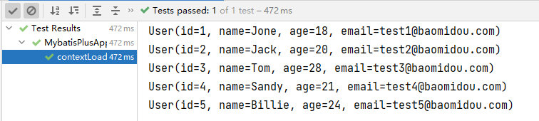

> #### 思考问题

- SQL谁帮我们写的? MyBatis-Plus都写好了
- 方法哪里来的? MyBatis-Plus都写好了

### 配置日志

> 我们所有的sql是不可见的，我们希望知道他们是怎么执行的，所以要配置日志知道

```properties
#配置日志  log-impl:日志实现
mybatis-plus.configuration.log-impl=org.apache.ibatis.logging.stdout.StdOutImpl
```

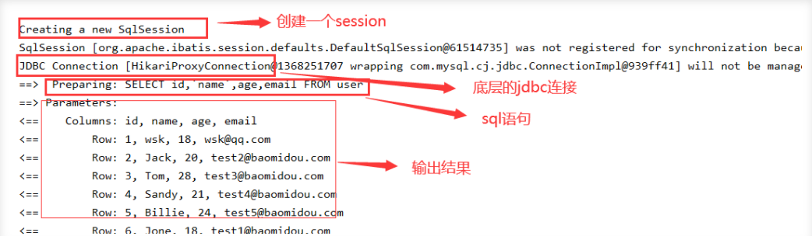

# CRUD扩展

### Insert插入

```java
@Test//测试插入
public void insertTest(){
    User user = new User();
    user.setName("wqy");
    user.setAge(18);
    user.setEmail("2168149199@qq.com");
    Integer result = userMapper.insert(user); //会帮我们自动生成id
    System.out.println(result); //受影响的行数
    System.out.println(user); //通过日志发现id会自动回填
}
```

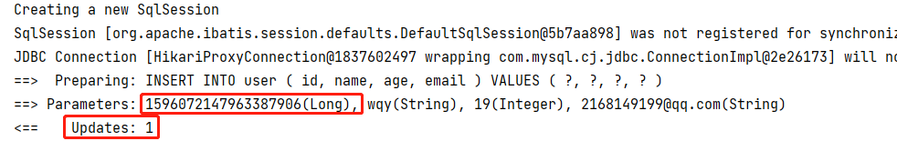

> #### 数据库插入的id的默认值为:全局的唯—id

### 主键自动生成策略

> #### 源码解释

```java
public enum IdType {
    AUTO, //数据库id自增
    INPUT, //手动输入
    ID_WORKER, //默认的全局唯一id
    UUID, //全局唯一id  uuid
    NONE;//未设置主键
    **
}
```

> #### 默认:ID_WORKER全局唯一ID

分布式系统唯一Id生成：https://www.cnblogs.com/haoxinyue/p/5208136.html

- #### TWitter的snowflake雪花算法

snowflake是Twitter开源的分布式ID生成算法，结果是一个long型的ID。其核心思想是：使用41bit作为毫秒数，10bit作为机器的ID（5个bit是数据中心（北京、香港···），5个bit的机器ID），12bit作为毫秒内的流水号（意味着每个节点在每毫秒可以产生 4096 个 ID），最后还有一个符号位，永远是0。

- 具体实现的代码可以参看https://github.com/twitter/snowflake。

> #### 主键自增：AUTO 我们需要配置主键自增

**我们需要配置主键自增**

- 在实体类字段上配置`@TableId(type = IdType.AUTO)`

```java
@Data
@AllArgsConstructor
@NoArgsConstructor
public class User {
    // 对应数据库中的主键(uuid,自增id,雪花算法,redis)
    @TableId(type = IdType.AUTO)
    private Long id;
    private String name;
    private Integer age;
    private String email;
}
```

- 数据库字段一定是自增`AUTO_INCREMENT`

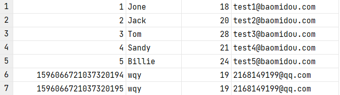

> #### 手动输入: INPUT需要自己写id

```java
@Data
@AllArgsConstructor
@NoArgsConstructor
public class User {
    // 对应数据库中的主键(uuid,自增id,雪花算法,redis)
    @TableId(type = IdType.INPUT)
    private Long id;
    private String name;
    private Integer age;
    private String email;
}
```

### Update修改

```java
@Test//测试修改
public void updateTest(){
    User user = new User();
    user.setId(2L);//怎么改id？？
    //通过条件自动拼接动态Sql
    user.setName("root");
    user.setAge(12);
    user.setEmail("root@qq.com");
    int i = userMapper.updateById(user);//updateById，但是参数是个user
    System.out.println(i);
}
```

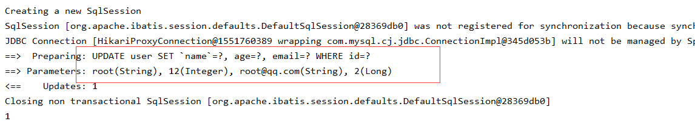

### 自动填充

创建时间、更改时间！ 这些操作一般都是自动化完成，我们不希望手动更新

阿里巴巴开发手册︰几乎所有的表都要配置 gmt_create、gmt_modified ！而且需要自动化

> #### 方式一: 数据库级别(工作中不允许修改数据库级别)

1、在表中增加字段：gmt_create、gmt_modified

2、再次测试插入或更新方法，我们需要在实体类中同步！

```java
private LocalDate gmtCreate;// 驼峰命名
private LocalDate gmtModified;
```

> #### 方式二: 代码级别

1、删除数据库的默认值，更新操作！

2、实体类字段属性上需要增加注解

```java
// 字段  字段添加填充内容
@TableField(fill = FieldFill.INSERT)// 仅插入时使用

private Date createTime;// 这里数据类型只能Date不能LocalDate
@TableField(fill = FieldFill.INSERT_UPDATE)// 插入修改时使用
private Date updateTime;
```

3、编写处理器来处理这个注解即可！

```java
package cn.tedu.mybatisplus.handler;

import com.baomidou.mybatisplus.core.handlers.MetaObjectHandler;
import lombok.extern.slf4j.Slf4j;
import org.apache.ibatis.reflection.MetaObject;
import org.springframework.stereotype.Component;

import java.util.Date;

/**
 * 这是一个处理类
 * 填充数据库中两个特殊字段的值gmt_create和gmt_modified
 *
 * @Author java@Wqy
 * @Version 0.0.1
 */
@Slf4j
@Component// 丢到springboot里   一定不要忘记把处理器加到Ioc容器中!
public class MyMetaObjectHandler implements MetaObjectHandler {
    @Override// 插入时的填充策略
    public void insertFill(MetaObject metaObject) {
        log.info("==start insert ······==");

        this.setFieldValByName("gmtCreate",new Date(),metaObject);
        this.setFieldValByName("gmtModified",new Date(),metaObject);
    }

    @Override// 更新时的填充策略
    public void updateFill(MetaObject metaObject) {
        log.info("==start update ······==");
        
        this.setFieldValByName("gmtModified",new Date(),metaObject);// 修改只配置修改时间
    }
}
```

4、测试插入/更新，观察时间

```java
@Test//测试插入
public void insertTest(){
    User user = new User();
    user.setName("live");
    user.setAge(22);
    user.setEmail("1314@qq.com");
    Integer result = userMapper.insert(user); //会帮我们自动生成id
    System.out.println(result); //受影响的行数
    System.out.println(user); //通过日志发现id会自动回填
}
@Test//测试更新
public void updateTest(){
    User user = new User();
    user.setId(1359495921613004803L);
    user.setName("test3");
    user.setAge(18); //通过条件自动拼接动态Sql
    user.setEmail("test3@qq.com");
    int i = userMapper.updateById(user);//updateById，但是参数是个user
    System.out.println(i);
}
```

### 乐观锁&悲观锁

在面试过程中经常被问到乐观锁/悲观锁

> 乐观锁: 顾名思义十分乐观,他总是认为不会出现问题,无论干什么都不上锁!如果出现了问题,再次更新值测试

>悲观锁：顾名思义十分悲观,他总是认为出现问题,无论干什么都会上锁!再去操作!

我们这里主要讲解 乐观锁机制!

乐观锁实现方式:

- 取出记录时,获取当前version
- 更新时,带上这个version
- 执行更新时,set version = newVersion where version = oldVersion
- 如果version不对,就更新失败

```sql
乐观锁：先查询，获得版本号
-- A
update user set name = "wsk",version = version+1 
where id = 1 and version = 1
-- B  （B线程抢先完成，此时version=2，会导致A线程修改失败！）
update user set name = "wsk",version = version+1 
where id = 1 and version = 1
```

> 测试一下Mybatis-Plus乐观锁插件

1、给数据库中增加version字段

```mysql
ALTER TABLE user ADD version int(11) DEFAULT 1 COMMENT '版本号';
```

2、实体类加对应的字段

```java
@Version//乐观锁version注解
private Integer version;
```

3、注册组件

```java
//扫描mapper文件夹
@MapperScan("com.wsk.mapper")//交给mybatis做的，可以让这个配置类做扫描
@EnableTransactionManagement//自动管理事务
@Configuration//配置类
public class MyBatisPlusConfig {
    //注册乐观锁插件
    @Bean
    public OptimisticLockerInterceptor optimisticLockerInterceptor(){
        return new OptimisticLockerInterceptor();
    }
}
```

4、测试一下

- 成功(单线程下)

```java
@Test//测试乐观锁成功
public void testOptimisticLocker1(){
    //1、查询用户信息
    User user = userMapper.selectById(1L);
    //2、修改用户信息
    user.setAge(18);
    user.setEmail("2803708553@qq.com");
    //3、执行更新操作
    userMapper.updateById(user);
}
```

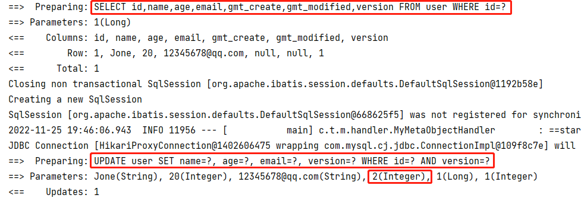

- 失败(多线程并发)

```java
@Test//测试乐观锁失败  多线程下
public void testOptimisticLocker2(){
    //线程1
    User user1 = userMapper.selectById(1L);
    user1.setAge(1);
    user1.setEmail("2803708553@qq.com");
    //模拟另外一个线程执行了插队操作
    User user2 = userMapper.selectById(1L);
    user2.setAge(2);
    user2.setEmail("2803708553@qq.com");
    userMapper.updateById(user2);
    //自旋锁来多次尝试提交！
    userMapper.updateById(user1);//如果没有乐观锁就会覆盖插队线程的值
}
```

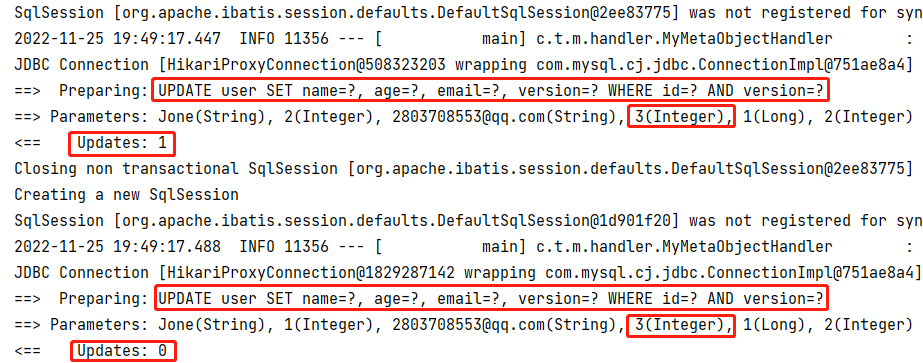

### Select查询

- 通过id查询单个用户

```java
@Test//通过id查询单个用户
public void testSelectById(){
    User user = userMapper.selectById(1L);
    System.out.println(user);
}
```

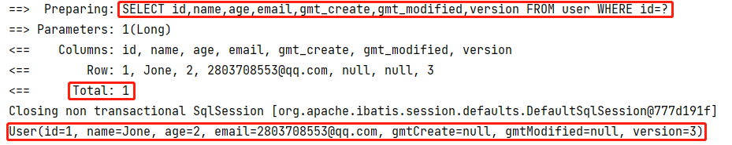

- 通过id查询多个用户

```java
@Test//通过id查询多个用户
public void testSelectBatchIds(){
    List<User> users = userMapper.selectBatchIds(Arrays.asList(1L, 2L, 3L));
    users.forEach(System.out::println);
    //System.out.println(users);
}
```

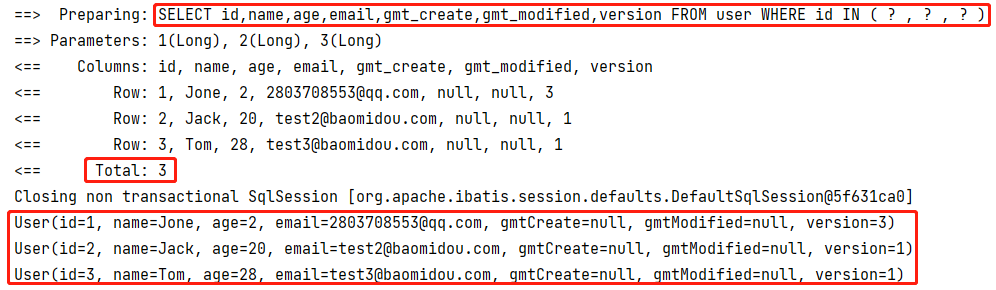

- 条件查询 通过map封装

```java
@Test//通过条件查询之一  map
public void testMap(){
    HashMap<String, Object> map = new HashMap<>();
    //自定义要查询的
    map.put("name","www");//条件key,值value
    map.put("age",18);
    List<User> users = userMapper.selectByMap(map);
    users.forEach(System.out::println);
}
```

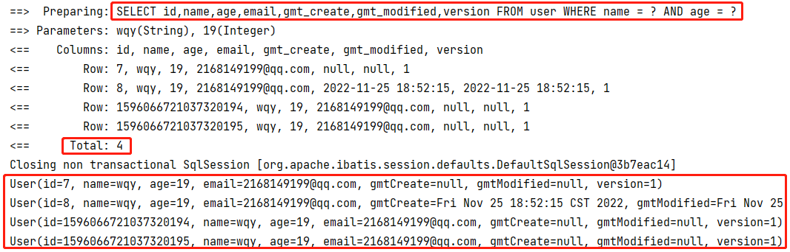

### 分页查询

分页在网站的使用十分之多！

1、原始的limit分页

2、pageHelper第三方插件

3、MybatisPlus其实也内置了分页插件！

> #### 如何使用：

1、配置拦截器组件

```java
 //分页插件
@Bean
public PaginationInterceptor paginationInterceptor(){
    return new PaginationInterceptor();
}
```

2、直接使用page对象即可

```java
@Test//测试分页查询
public void testPage(){
    //参数一current：当前页   参数二size：页面大小
    //使用了分页插件之后，所有的分页操作都变得简单了
    Page<User> page = new Page<>(2,5);
    userMapper.selectPage(page,null);
    page.getRecords().forEach(System.out::println);
    System.out.println("总页数==>"+page.getTotal());
}
```

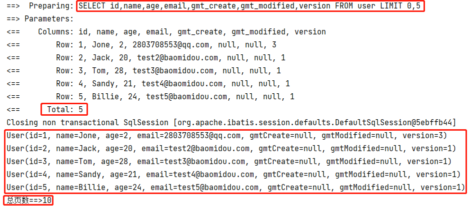

### Delete删除

> 基本的删除任务:

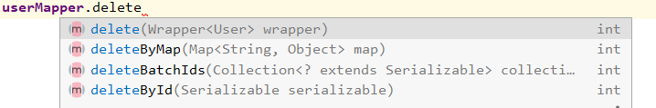

```java
@Test // 测试删除
public void testDeleteById(){
    int count = userMapper.deleteById(1596066721037320195L);
    log.debug("删除成功!影响的条数为:{}",count);
}

@Test // 批量删除
public void testDeleteBatch(){
    int count = userMapper.deleteBatchIds(Arrays.asList(1359507762519068675L, 1359507762519068676L));
    log.debug("删除成功,影响的条数:{}",count);
}

@Test // 条件删除
public void testD(){
    HashMap<String, Object> map = new HashMap<>();
    map.put("age","18");
    map.put("name","lol");
    userMapper.deleteByMap(map);
}
```

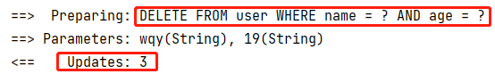

工作中会遇到一些问题：逻辑删除！

### 逻辑删除

> 物理删除: 从数据库中直接删除

> 逻辑删除: 在数据库中没有被删除,而是通过一个变量来使他失效！ deleted=0 ==> deleted=1

**管理员可以查看被删除的记录！防止数据的丢失，类似于回收站！**

##### 测试:

> 1、在数据表中增加一个deleted字段

```mysql
ALTER TABLE user ADD deleted int DEFAULT 0 COMMENT '逻辑删除';
```

> 2、实体类中添加对应属性

```java
@TableLogic//逻辑删除注解
private Integer deleted;
```

> 3、配置！

```java
//逻辑删除组件
@Bean
public ISqlInjector sqlInjector(){
    return new LogicSqlInjector();
}
```

```properties
#配置逻辑删除  没删除的为0 删除的为1
mybatis-plus.global-config.db-config.logic-delete-value=1
mybatis-plus.global-config.db-config.logic-not-delete-value=0
```

> 4、测试一下删除

```java
@Test
public void testDeleteById1(){
    int count = userMapper.deleteById(1596121094836748289L);
    log.debug("删除成功!影响数据的条数为:{}",count);
}
```

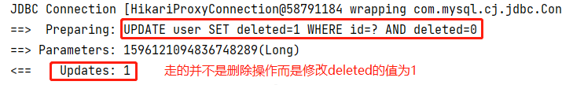

发现： 数据库记录还在，deleted字段变为1

再次测试查询被删除的用户，发现查询为空

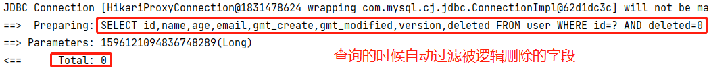

**以上所有的CRUD及其扩展操作，我们都必须精通掌握！会大大提高工作写项目的效率！**

### 性能分析插件

我们在平时的开发中，会遇到一些慢Sql。测试、druid···

MybatisPlus也提供了性能分析插件，如果超过这个时间就停止运行！

1、导入插件

```java
 //性能分析插件
@Bean
@Profile({"dev","test"})//设置dev开发、test测试 环境开启  保证我们的效率
public PerformanceInterceptor performanceInterceptor(){
    PerformanceInterceptor performanceInterceptor = new PerformanceInterceptor();
    performanceInterceptor.setMaxTime(100);//设置sql最大执行时间*ms，如果超过了则不执行
    performanceInterceptor.setFormat(true);//开启sql格式化
    return performanceInterceptor;
}
```

**注意： 要在SpringBoot中配置环境为dev或test环境！**

```properties
#设置开发环境
spring.profiles.active=dev
```

2、测试使用

```java
@Test
void contextLoads() {
    //参数是一个wrapper ，条件构造器，这里我们先不用 null
    //查询全部的用户
    List<User> userList = userMapper.selectList(null);
    userList.forEach(System.out::println);
}
```

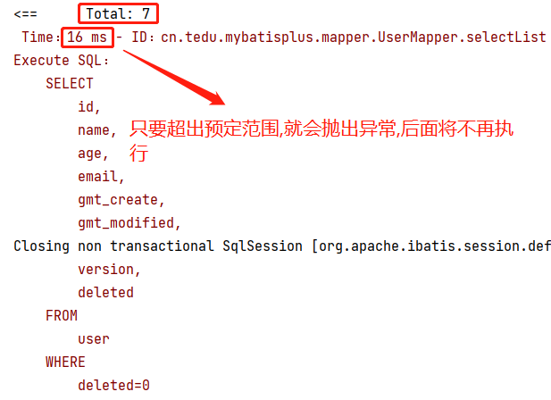

> 数据库一共八条数据，只查出了七条，因为时间超出了预定范围，自动抛出异常，后面就不执行了！！！

##### 使用性能分析插件，可以帮助我们提高效率！

### 条件构造器

**十分重要：Wrapper** 记住查看输出的SQL进行分析

> #### 测试一

```java
@Test
public void testWrapper1(){

    // 参数是一个Wrapper，条件构造器，和Map对比学习
    // 查询name不为空，email不为空，age大于18的用户
    QueryWrapper<User> wrapper = new QueryWrapper<>();
    wrapper.isNotNull("name")
            .isNotNull("email")
            .ge("age",18);// "greater equals"大于等于
    userMapper.selectList(wrapper).forEach(System.out::println);
}
```

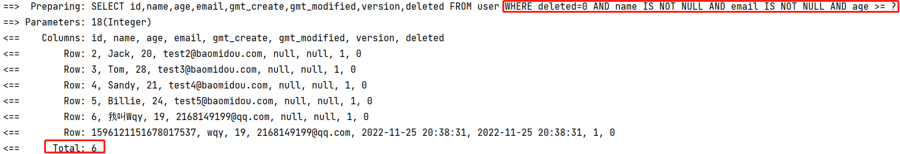

> #### 测试二

```java
@Test
public void testWrapper2(){
    // 查询name=wqy的用户
    QueryWrapper<User> wrapper = new QueryWrapper<>();
    wrapper.eq("name","wqy");
    //查询一个数据selectOne，若查询出多个会报错
    //Expected one result (or null) to be returned by selectOne(), but found: *
    //若出现多个结果使用list或map
    User user = userMapper.selectOne(wrapper);//查询一个数据，若出现多个结果使用list或map
    log.debug("查询成功，数据：{}",user);
}
```

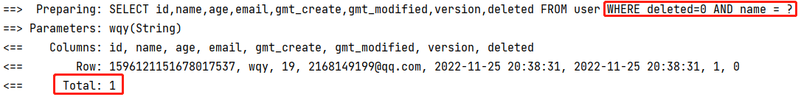

> #### 测试三

```java
@Test
public void testWrapper3(){
    // 查询age在10~20之间的用户
    QueryWrapper<User> wrapper = new QueryWrapper<>();
    wrapper.between("age",10,20);// 区间
    Integer count = userMapper.selectCount(wrapper);
    log.debug("查询成功!数量为:{}",count);
}
```

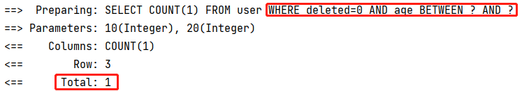

> #### 测试四

```java
@Test
public void testWrapper4(){
    // 模糊查询
    QueryWrapper<User> wrapper = new QueryWrapper<>();
    wrapper
            .notLike("name","s")// 不含s的:%s%
            .likeRight("email","t");// 邮箱t开头的:t%
    userMapper.selectMaps(wrapper).forEach(System.out::println);
}
```

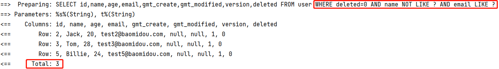

> #### 测试五

```java
@Test
public void testWrappers(){
    // 子查询 查询id<5的用户的信息
    //  SELECT id,name,age,email,gmt_create,gmt_modified,version,deleted
    //  FROM user
    //  WHERE deleted=0
    //  AND id IN (select id from user where id<5)
    QueryWrapper<User> wrapper = new QueryWrapper<>();
    // id 在子查询中查出来
    wrapper.inSql("id","select id from user where id<5");
    List<Object> objects = userMapper.selectObjs(wrapper);
    objects.forEach(System.out::println);
}
```

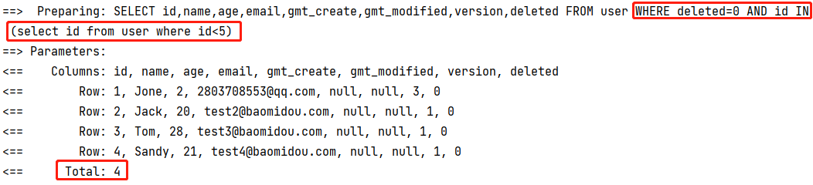

> #### 测试六

```java
@Test
public void testWrapper6(){
    // 查询全部数据并根据id进行升序或降序
    QueryWrapper<User> wrapper = new QueryWrapper<>();
    wrapper.orderByDesc("id"); // 降序
//        wrapper.orderByAsc("id");// 升序
    userMapper.selectList(wrapper).forEach(System.out::println);
}
```

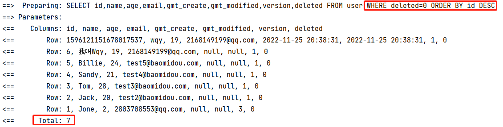

#### _Mysql => JDBC => Mybatis => MybatisPlus_

##### 其余查询方法可寻官网:https://baomidou.com/pages/10c804/

### 代码自动生成器

`AutoGenerator`是MyBatis-Plus的代码生成器,通过`AutoGenerator`可以快速生成Entity、Mapper、MapperXML、Service、Controller等各个模块的代码,极大的提升了开发效率!

```java
package cn.tedu.mybatisplus.wsk;

import com.baomidou.mybatisplus.annotation.FieldFill;
import com.baomidou.mybatisplus.annotation.IdType;
import com.baomidou.mybatisplus.generator.AutoGenerator;
import com.baomidou.mybatisplus.generator.config.DataSourceConfig;
import com.baomidou.mybatisplus.generator.config.GlobalConfig;
import com.baomidou.mybatisplus.generator.config.PackageConfig;
import com.baomidou.mybatisplus.generator.config.StrategyConfig;
import com.baomidou.mybatisplus.generator.config.po.TableFill;
import com.baomidou.mybatisplus.generator.config.rules.DateType;
import com.baomidou.mybatisplus.generator.config.rules.NamingStrategy;

import java.util.ArrayList;

/**
 * 代码生成器
 *
 * @Author java@Wqy
 * @Version 0.0.1
 */
public class WskCode {
    public static void main(String[] args) {

        //我们需要构建一个代码生成器对象
        AutoGenerator mpg = new AutoGenerator();
        // 怎么样去执行?需要书写配置策略

        // 1.全局配置
        GlobalConfig gc = new GlobalConfig();
        String projectPath = System.getProperty("user.dir");// user.dir获取当前项目的目录
        gc.setOutputDir(projectPath+"/src/main/java");// 输出到哪个目录
        gc.setAuthor("java@Wqy");// 配置作者
        gc.setOpen(false); // 是否开启
        gc.setFileOverride(false); // 是否重写文件
        gc.setServiceName("%sService");// 去掉Service的I前缀
        gc.setIdType(IdType.ID_WORKER); // 设置id的类型
        gc.setDateType(DateType.ONLY_DATE); // 设置时间
        gc.setSwagger2(true);

        mpg.setGlobalConfig(gc);

        // 2.设置数据源
        DataSourceConfig dsc = new DataSourceConfig();
        dsc.setUsername("root");// 数据库用户名
        dsc.setPassword("root");// 数据库密码
        dsc.setUrl("jdbc:mysql://localhost:3306/mybatis_plus?useUnicode=true&characterEncoding=utf-8&serverTimezone=Asia/Shanghai");
        dsc.setDriverName("com.mysql.cj.jdbc.Driver"); // 数据库驱动地址
        mpg.setDataSource(dsc); // 添加到数据库源

        // 3.包的配置
        PackageConfig pc = new PackageConfig();
        pc.setParent("cn.tedu.mybatisplus"); // 项目的父包
        pc.setEntity("pojo"); // 设置实体类的名字
        pc.setMapper("mapper");// 设置Mapper层的名字
        pc.setService("service");// 设置Service层的名字
        pc.setController("controller");// 设置Controller层的名字

        mpg.setPackageInfo(pc); // 添加到包配置中

        // 4.策略配置
        StrategyConfig strategy = new StrategyConfig();
        strategy.setInclude("user"); // 配置要操作的数据库表名
        strategy.setNaming(NamingStrategy.underline_to_camel);// Name驼峰命名
        strategy.setColumnNaming(NamingStrategy.underline_to_camel);// Column驼峰命名
        strategy.setEntityLombokModel(true);// 是否使用LomBok
        strategy.setLogicDeleteFieldName("deleted");// 设置逻辑删除字段

        // 自动填充配置
        TableFill gmtCreate = new TableFill("gmt_create", FieldFill.INSERT); // 设置插入时自动填充创建时间
        TableFill gmtModified = new TableFill("gmt_modified", FieldFill.INSERT_UPDATE);// 设置插入和修改时自动填充修改时间
        ArrayList<TableFill> tableFills = new ArrayList<>(); // New一个ArrayList集合
        tableFills.add(gmtCreate); // 添加创建时间
        tableFills.add(gmtModified);// 添加修改时间
        strategy.setTableFillList(tableFills); // 设置到填充配置中

        // 乐观锁配置
        strategy.setVersionFieldName("version"); // 设置乐观锁字段
        strategy.setRestControllerStyle(true);// 开启驼峰命名
        strategy.setControllerMappingHyphenStyle(true);// 开启请求路径RestFul风格
        mpg.setStrategy(strategy);

        mpg.execute();// 执行
    }
}
```

#### 额外配置:

```xml
<!--模板引擎 依赖:mybatis-plus代码生成的时候报异常-->
<dependency>
    <groupId>org.apache.velocity</groupId>
    <artifactId>velocity-engine-core</artifactId>
    <version>2.0</version>
</dependency>
<!--配置ApiModel在实体类中不生效-->
<dependency>
    <groupId>com.spring4all</groupId>
    <artifactId>spring-boot-starter-swagger</artifactId>
    <version>1.5.1.RELEASE</version>
</dependency>
<!--freemarker-->
<dependency>
    <groupId>org.freemarker</groupId>
    <artifactId>freemarker</artifactId>
    <version>2.3.30</version>
</dependency>
<!--beetl-->
<dependency>
    <groupId>com.ibeetl</groupId>
    <artifactId>beetl</artifactId>
    <version>3.3.2.RELEASE</version>
</dependency>
```


