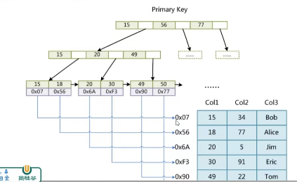
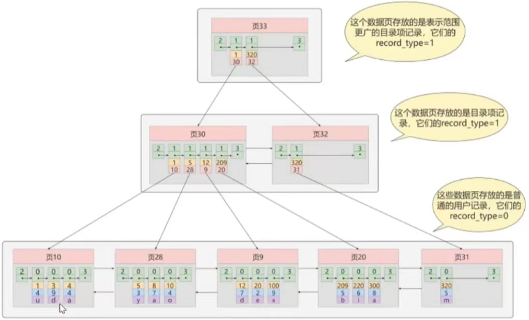
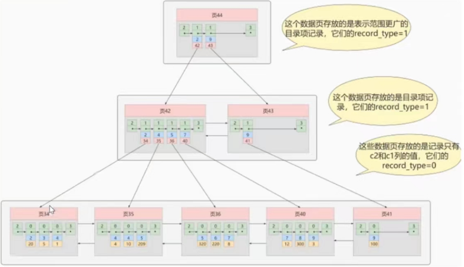
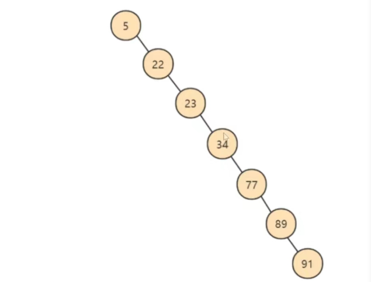
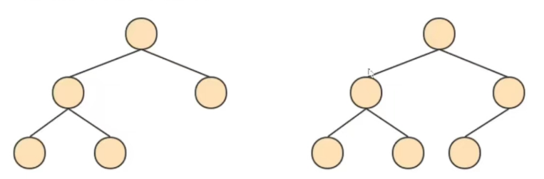
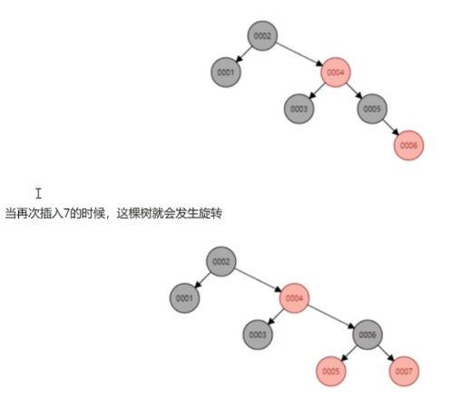

# MySQL储存引擎和树的概念

### 1.Mysql如何实现的索引机制？

MySQL中索引分为三类: B+树索引、Hash索引、全文索引

#### InnoDB索引与MyISAM索引实现的区别？

##### MyISAM(非聚簇索引)

MyISAM索引文件和数据文件是分离的，使用B+树实现，主键索引和辅助索引实现一致，索引文件仅保存记录所在页的**指针**（物理位置），通过这些地址来读取页，进而读取被索引的行。

- InnoDB的辅助索引Data域储存相应记录主键的值而不是地址
- InnoDB的数据文件本身就是主索引文件
- MyISAM的索引和数据是分开储存的。

### 2.B+树

生成了一个存储更高级目录项的页33，这个页中的两条记录分别代表页30和页32，如果用户记录的主键值在[1，320)之间，则到页30中查找更详细的目录项记录，如果主键值 不小于320 的话，就到页32中查找更详细的目录项记录。

**这个数据结构，它的名称是B+树**。

### 3.聚簇索引和非聚簇索引b+树实现的区别？

##### 1.聚簇索引

特点：

- **索引和数据保存在同一个b+树中**。
- **页内的记录是按照主键的大小顺序排成一个单向链表**。
- **页和页之间也是根据页中记录的主键的大小顺序排成一个双向链表**。

- **非叶子节点存储的是记录的主键+页号**。
- 叶子节点存储的是常用的完整用户记录。

优点：

- 数据访问更快，因为**索引和数据保存在同一个b+树中**，因此从聚簇索引中获取数据比非聚簇索引更快。
- 聚簇索引对于主键的排序查找和范围查找速度更快。
- 按照聚簇索引排列顺序，查询显示一定范围数据的时候，由于数据都是紧密相连，数据库可以从更少的数据块中提取数据，节省大量的IO操作

缺点：

- 插入速度严重依赖于插入顺序，按照主键的顺序插入是最快的方式，否则将会出现叶分裂，严重影响性能，因此，对于InnoDB表，我们一般都会定义一个自增的ID列为主键
- 更新主键的代价很高，因为将会导致被更新的行移动。因此，对于InnoDB表，我们一般定义主键为不可更新。

限制：

- **只有InnoDB引擎支持聚簇索引，MyISAM不支持聚簇索引**。
- 由于数据的物理存储排序方式只能有一种，所以每个MySQL的表只能有一个聚簇索引。
- 如果没有为表定义主键，InnoDB会选择非空的唯一索引列代替。如果没有这样的列，InnoDB会隐式的定义一个主键作为聚簇索引。
- **为了充分利用聚簇索引的聚簇特性，InnoDB中表的主键应当选择有序的Id**，不建议使用无序的Id，比如UUID、MD5、HASH、字符串作为主键，无法保证数据的顺序增长。

##### 2.非聚簇索引

（二级索引、辅助索引）

聚簇索引只能在搜索条件是主键值时才发挥作用，因为B+树中的数据都是按照主键进行排序的，如果我们想以别的列作为搜索条件，那么需要创建非聚簇索引。

**例如**：以c2列作为搜索条件，那么需要使用c2列创建一样的B+树

### 4.普通树、平衡二叉树、红黑树、B树、B+树

##### 普通树：

- 左子树全部为空，从形式上看，更像是一个单向链表

##### 平衡二叉树（AVL）：

- 基础数据结构
- 左右平衡
- 高度差大于1会发生自旋
- 每个节点记录一个数据

AVL树全程G.M.Adelson-Velsky和E.M.Landis,这是两个人的人名。

平衡二叉树也叫平衡二叉搜索树，又被成为AVL树，可以保证查询效率较高。

特点：

- 它是一颗空树或它的左右两个子树的高度差的绝对值不超过1
- 并且左右两个子树都是一颗平衡二叉树

##### 红黑树：

- hashmap存储
- 两次旋转达到平衡
- 分为红黑节点

在这棵严格的平台树上又进化为“红黑树”（是一个非严格的平衡树 左子树与右子树的高度差不能超过1），红黑树的长子树只要不超过短子树的两倍即可

