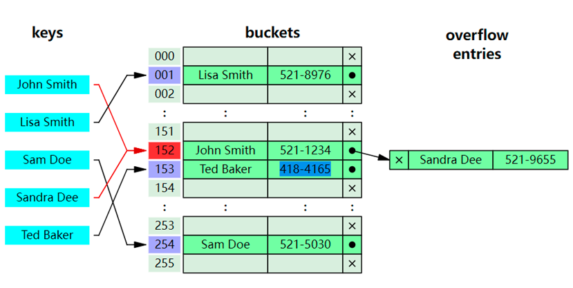

# 数据库索引和主键

## 1.索引的定义:

- **什么是索引(index)**?

官方的定义索引是一种数据结构,从生活的维度讲,假如将一本书看成是一张表,这本书的目录就是表中的索引.

* **为什么要使用索引(Index)**?

数据量比较大时,为了快速找到们需要的数据可以使用索引,这样可以提高查询的效率.

* **索引(Index)有什么弊端**?

1. 会额外的占用空间
2. 对更新操作会带来一定的复杂度.

* 使用索引(Index)的应用场景?

**索引的诞生主要是助力查询，提高查询的效率，所以索引经常会在如下子句中进行应用**：

1. **on** 子句 （表关联条件）
2. **where** 子句（查询条件-等值查询、范围查询）
3. **group by** 子句（分组）
4. **having** 子句（对分组后的数据进行限制）
5. **order by** 子句（基于字段进行定升序或降序排序）

## 2.索引的分类:

> ##### 常见分类维度？

* 逻辑应用维度： (主键(**主键添加**),普通(**普通字段添加**),联合(**范围查询**),唯一(**unique-手机号...**),空间索引,...)

* 物理存储维度： (**聚簇索引**,**非聚簇索引**)

* 数据存储结构维度：(**hash**,**B+树**,....)

  单从效率角度：hash结构>B+树>B树

> ##### 术语分析？

- 聚簇索引（数据和索引存储在一起时，这样的索引称之为聚簇索引）

  查询步骤：索引1-->数据Data

- 非聚簇索引（索引和数据分开存储，这样的索引称之为非聚簇索引）

  查询步骤：索引2-->0*100(address)-->数据Data

## 3.索引创建及应用

* 创建表

```mysql
drop table if exists student;
create table if not exists student
(
    id bigint auto_increment,
    first_name varchar(50) not null comment '学生名字',
    last_name varchar(20) not null comment '学生姓',
    phone varchar(15)  not null comment '手机号',
    email varchar(50) default '' comment '邮箱',
    birthday date comment '出生日期',
    create_time datetime default current_timestamp comment '注册日期',
    primary key (id),
    unique key (phone)
)engine = InnoDB character set utf8mb4;
```

* **如何查看表中的索引**?

```mysql
show index from student; # 查看某个数据库的索引
# 默认主键和唯一键都会创建一个索引
```

部分索引结果：

| Table   | Non_unique | Key_name          | Column_name | Index_type |
| ------- | :--------: | ----------------- | :---------: | ---------- |
| student |     0      | PRIMARY           |     id      | BTREE      |
| student |     0      | phone             |    phone    | BTREE      |
| student |     0      | index_email       |    email    | BTREE      |
| student |     1      | index_first_name  | first_name  | BTREE      |
| student |     1      | index_birthday    |  birthday   | BTREE      |
| student |     1      | index_create_time | create_time | BTREE      |


* **如何创建索引**?

1. 创建表的同时创建索引.(例如 create table tablename(....,index 索引名 (字段名)))
2. 创建表后通过create语句创建索引(例如 create index 索引名 on 表名(字段名))
3. 创建表后通过alter语句创建索引(例如 alter table 表名 add index 索引名(字段名))

* 创建普通索引案例分享.

```mysql
create index index_first_name on student(first_name);
alter table student add index index_last_name (last_name);
```

* 创建唯一索引案例分享

```mysql
create unique index index_first_name on student(first_name);
alter student add unique index index_first_name (last_name)
```

* 创建组合索引案例分享

```mysql
create index index_first_last on student(first_name,last_name);
alter table student add index index_first_last (first_name,last_name);
```

* 如何删除索引?

```mysql
drop index 索引名 on 表名;
```

例如:

```mysql
drop index index_first_last on student;
```

## 4.索引存储结构分析

* **MySQL中索引需要空间进行存储，支持哪些存储结构**?

  1.hash（散列存储）对索引散列求值再对应数据

  2.B+树（多叉平衡树-通过多叉降低树的高度，同时通过左旋或右旋实现树的平衡）

* **MySQL中InnoDB默认的索引存储结构是什么**?

  B+树

* **MySQL中的B+树有什么特点**?

1. 树中的非叶子节点只存储索引和指针
2. 树中的叶子节点存储索引和数据
3. 树中的叶子节点处于相同层，并且之间会使用双向链表连接,可以更好的支持范围查询.


* **MySQL中B+树相对于B树有什么优点**?

1. 一个磁盘块可以存储索引数量会更多.
2. 相同数据量索引的B+树相对于B树的高度相对会比较低(因为分叉多了)
3. 叶子节点之间B+树有双向链表的连接,可以支持快速的范围查询.

* **你觉得Hash索引有什么优势和劣势**?

  hash索引查询效率比较高（等值查询）,但是不支持范围查询.



> 将Keys名字进行散列求值，对应值在数组中的位置，进而寻找数据

## 5.聚簇索引和非聚簇索引

* 什么是聚簇索引？

聚簇索引也叫聚集索引，**索引和数据存储在一起，也就是索引与数据是不分离**。
InnoDB存储引擎就是聚簇索引。


* 聚簇索引都有哪些类型？

InnoDB中，**一张表只有一个聚集索引（即主键索引）**，其他索引都是二级索引。
在实际应用中我们可以直接通过主键聚集索引查询到具体记录。假如是二级索引，**这个索引中存储是索引以及对应主键**，我们使用二级索引执行查询时，是**先基于二级索引找到一级索引，再基于一级索引去查询具体记录**(这个过程是**回表查询**)。

```mysql
select first_name,salary
from employees
where employee_id=206
```


> 二级索引叶子节点存储的是主键，需要基于主键寻找一级索引，进而找到数据。

```mysql
create index index_hire_date on employees(hire_date);

select first_name,salary,email
from employees
where hire_date='1987-07-09'
```


```mysql
create index index_hire_date_salary on employees(hire_date,salary);

select first_name,salary,email
from employees
where hire_date='1987-07-09' and salary<8000
```


* 什么是非聚簇索引？
  非聚簇索引是索引与数据是分离的，索引和数据是单独存储的。MyISAM存储引擎是非聚簇索引。


例如：

```
[10,0x1001] 0x1001表示记录地址
[12,0x1002]

0x1001 [10,Jack,J@t.com]
0x1002 [12,Mike,M@t.com]
```

* **非聚簇索引存储的是什么**？

非聚簇索引在创建时，存储的是索引值以及索引对应的记录的地址。
基于非聚簇索引查询数据时，可以**先基于索引找到数据的一个地址，然后基于地址再去查找数据。**
**单从索引角度来说，非聚集索引查找速度不如聚集索引**，非聚集索引找到地址后还需要根据地址找到数据

## 6.基于索引的查询逻辑

1. 假如索引是聚簇索引中一级索引（主键索引），则可以根据索引直接获取数据
2. 假如索引是非聚簇索引中的一级索引（主键索引），则可以根据索引直接获取数据地址，然后基于地址获取数据
3. 假如索引是二级索引（非主键索引），需要先基于二级索引找到主键，然后再基于主键查找数据（该过程为回表查询）

## 7.索引的优缺点

**优点**:

1. 大大加快数据的检索速度
2. 创建唯一性索引,可以保证数据表中每一行数据的唯一性
3. 加速表与表之间的连接
4. 在使用分组和排序子句进行数据检索时,可以显著减少查询中分组和排序的时间

**缺点**:

1. 索引它需要占据物理内存
2. 当对表中的数据进行增加,删除,修改的时候,索引也要进行动态维护,这样就降低了数据的维护速度.

## FAQ分析

* 什么是索引？(一种数据结构)
* 索引的优势、劣势？ (优势：提高查询效率；劣势：会增加额外的存储、更新的复杂度)
* 索引是如何分类的？(应用、物理存储、数据结构)
* 我们如何创建及应用索引？(程序员只负责创建，应用由数据库优化器说了算)
* MySQL InnoDB引擎默认的索引结构是什么？(B+Tree)
* InnoDB存储引擎为什么使用B+Tree作为索引的数据结构？(平衡、高度、范围查询)
* B+树有什么特点？(非叶子节点特点、叶子节点有什么特点、树的平衡)
* 什么是聚簇索引、非聚簇索引，它们有什么特点？
* 什么是一级索引、二级索引，他们分别存储的是什么？
* 什么是回表查询？(基于二级索引找到一级索引，然后基于一级索引查找数据)

## 8.主键的作用

1. 主键就是被挑选出来,作表中行的**唯一性标识**的候选关键字
2. 主键可以由一个字段,也可以由多个字段组成,分别称为单字段主键或多字段主键

一般来说,主键的作用有四个:

1. 可以保证实体的完整性
2. 能够加快数据的操作速度
3. 在表中添加新记录时,ACCESS会自动检查新纪录的主键值,不允许该值与其他记录的顺序显示表中的记录