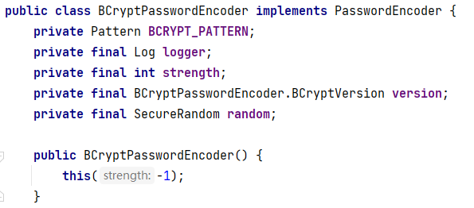

# BCryptPasswordEncoder类

- #### 该类在引入了Spring Boot Security的依赖项后可以使用

```xml
<!-- Spring Boot Security的依赖项，用于处理认证与授权 -->
<dependency>
    <groupId>org.springframework.boot</groupId>
    <artifactId>spring-boot-starter-security</artifactId>
</dependency>
```

- #### BCrypt算法是用于对密码进行加密处理的，在`spring-boot-starter-security`中包含了`BCryptPasswordEncoder`，可以实现编码、验证：

```java
public class BCryptTests {

    @Test
    public void encode() {
        BCryptPasswordEncoder passwordEncoder = new BCryptPasswordEncoder();

        String rawPassword = "123456";
        System.out.println("原文：" + rawPassword);

        for (int i = 0; i < 50; i++) {
            String encodedPassword = passwordEncoder.encode(rawPassword);
            System.out.println("密文：" + encodedPassword);
        }
//        密文：$2a$10$H7neseWrkpdCQiW6R4bJyeXaU.nowsFZZz.iO4HCLzFScz.FdpDSG
//        密文：$2a$10$DoQQSh9eAxDRVKADzQ.Q8Oa4QqcpMUR9UmKyptop3i0mwsdfS.wyC
//        密文：$2a$10$tZCa3YIYehg5B9VESrDOWeoBAX3aX4f.Ioc4awtiY/vwihGmD.xQG
//        密文：$2a$10$9qx53wQEF0XjSjKattwEw.mFayMvjxLnZmPnRO5V1DnZvKuCLrVQG
//        密文：$2a$10$dmGQK7iwTd9Mbwa/mxzABeBHezbqyGpqwmxUobwelQDlRuW4oHS9e
    }

    @Test
    public void matches() {
        BCryptPasswordEncoder passwordEncoder = new BCryptPasswordEncoder();

        String rawPassword = "123456";
        String encodedPassword = "$2a$10$H7neseWrkpdCQiW6R4bJyeXaU.nowsFZZz.iO4HCLzFScz.FdpDSG";

        boolean matches = passwordEncoder.matches(rawPassword, encodedPassword);
        System.out.println("原文：" + rawPassword);
        System.out.println("密文：" + encodedPassword);
        System.out.println("验证：" + matches);
    }

}
```

1. #### BCrypt算法默认使用了随机盐值，所以，即使使用相同的原文，每次编码产生的密文都是不同的！

2. #### BCrypt算法被刻意设计为慢速的，所以，可以非常有限的避免穷举式的暴力破解！

## 其实现了PasswordEncoder接口



## ★PasswordEncoder接口中定义了三个抽象方法

- encode 方法表示对密码进行加密，参数 rawPassword 就是你传入的明文密码，返回的则是加密之后的密文，这里的加密方案采用了 MD5。 
- matches 方法表示对密码进行比对，参数 rawPassword 相当于是用户登录时传入的密码，encodedPassword 则相当于是加密后的密码(从数据库中查询而来)。

- upgradeEncoding()方法 如果解析的密码能够再次进行解析且达到更 安全的结果则返回 true,否则返回 false。默认返回 false。

##### 该接口源代码如下:

```java
package org.springframework.security.crypto.password;

public interface PasswordEncoder {
    String encode(CharSequence var1);

    boolean matches(CharSequence var1, String var2);

    default boolean upgradeEncoding(String encodedPassword) {
        return false;
    }
}
```

