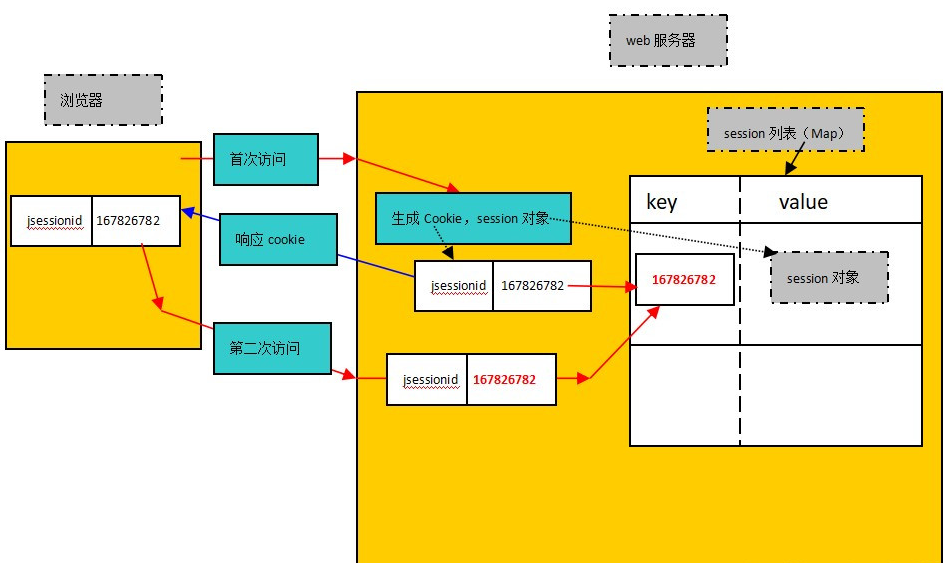

# HttpSession接口

- #### HttpSession 服务端的技术

  ##### 服务器会为每一个用户 创建一个独立的HttpSession

- #### HttpSession原理:

  - ##### 当用户第一次访问Servlet时,服务器端会给用户创建一个独立的Session

  - ##### 并且生成一个SessionID,这个SessionID在响应浏览器的时候会被装进cookie中,从而被保存到浏览器中

  - ##### 当用户再一次访问Servlet时,请求中会携带着cookie中的SessionID去访问

  - ##### 服务器会根据这个SessionID去查看是否有对应的Session对象

  - ##### 有就拿出来使用;没有就创建一个Session(相当于用户第一次访问)

- #### 域的范围:

  - ​    Context域 > Session域 > Request域
  - ​    Session域 只要会话不结束就会存在 但是Session有默认的存活时间(30分钟)

- ### 概述:

- Session表示会话，不止是在javaweb中存在，只要是web开发，都有会话这种机制。

- 在java中会话对应的类型是：javax.servlet.http.HttpSession，简称session/会话

- 在java web中session是一个存储在WEB服务器端的java对象，该对象代表用户和WEB服务器的一次会话。

  **那什么才叫一次会话呢？**

  - ##### 一般多数情况下，是这样描述的：用户打开浏览器，在浏览器上进行一些操作，然后将浏览器关闭，表示一次会话结束。
  - ##### 本质上的描述：从session对象的创建，到最终session对象超时之后销毁，这个才是真正意义的一次完整会话。

- ### session的工作原理:

  1. ##### 打开浏览器,在浏览器上发送首次请求

  2. ##### 服务器会创建一个HttpSession对象,该对象代表一次会话

  3. ##### 同时生成HttpSession对象对应的Cookie对象,并且Cookie对象的name是jsessionid,cookie的

  4. ##### 服务器将Cookie的value和HttpSession对象绑定到session列表中

  5. ##### 服务器将Cookie完整发送给浏览器客户端

  6. ##### 浏览器客户端将Cookie保存到缓存中

  7. ##### 只要浏览器不关闭,Cookie就不会消失

  8. ##### 当再次发送请求时,会自动提交缓存中的Cookie

  9. ##### 服务器接收到Cookie,验证该Cookie的name是否是jsessionid,然后获取该Cookie的value

  10. ##### 通过Cookie的value去session列表中检索对应的HttpSession对象

- #### 要注意的是：

  ##### 当浏览器关闭之后，缓存中的cookie消失，这样客户端下次再访问服务器的时候就无法获取到服务器端的session对象了。这就意味着会话已经结束，但是并不代表服务器端的session对象马上被回收，session对象仍然在session列表中存储，当长时间没有用户访问这个session对象了，我们称作session超时，此时web服务器才会回收session对象。