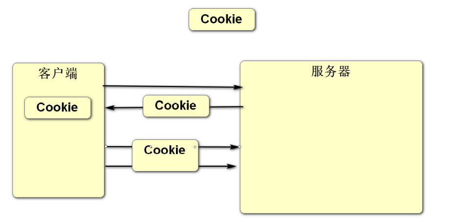
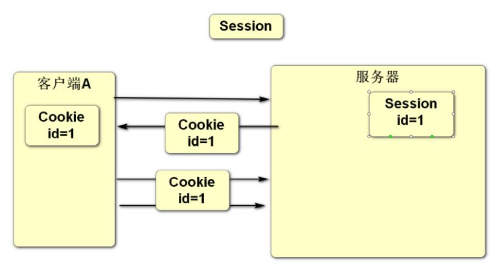
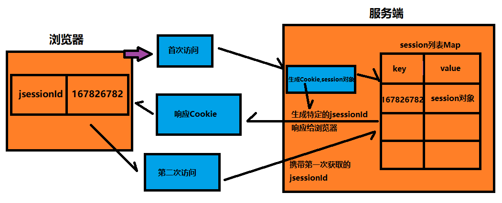

# 回话管理

- ##### 客户端和服务器之间进行数据交互遵循的是HTTP协议, 此协议是无状态协议(一次请求对应一次响应,响应完之后断开连接) 服务器是无法跟踪客户端的请求, 通过Cookie技术可以给客户端添加一个标识(此标识可以保存数据), 客户端之后向此服务器发请求时会自动带上这个标识,这样服务器就可以识别此客户端了, 但是由于Cookie的数据是保存在客户端中,存在被篡改的风险, Session可以避免出现这样的风险,因为Session数据是保存在服务器  

- ##### 通过会话管理Cookie和Session可以保存客户端的数据, 数据库保存的是用户的数据.

### 1.Cookie: 数据保存在客户端(类似于打孔式的会员卡)

- 数据默认保存在浏览器的内存中,当浏览器关闭时数据会清除, **可以设置保存时间(任意时间),设置之后数据会保存在客户端的磁盘中,时间到了之后自动清除**

- 只能保存字符串类型数据

- Cookie是存在客户端浏览器中每次请求会存放在请求头中,所以cookie只可以保存几k的数据  

- 应用场景: 记住用户名和密码

### 2.Session:数据保存在服务器(类似于银行卡) 

- 数据保存在服务器的内存中,保存时间只有半个小时左右   
- 可以保存任意对象类型的数据
- Session保存数据量没有大小限制,但也不建议保存大量数据
- 应用常见: 记住登录状态  

### 关于Session的补充:

HTTP协议本身是无状态协议,无法保存用户信息,即:某客户端第1次访问了服务器端,可能产生了某些数据,

此客户端再次访问服务器时,服务器端无法识别出这个客户端是此前来访的客户端。

> #### HTTP协议基于TCP协议在传输层仅作出一问一答后断开连接,过程很快

##### 故，在HTTP中不适合使用Session来保存用户的信息

为了能够识别客户端的身份，当某客户端第1次向服务器端发起请求时，服务器端将向客户端响应一个JSESSIONID数据，其本质是一个UUID数据，在客户端后续的访问中，客户端会自动携带此JSESSIONID，以至于服务器端能够识别此客户端的身份。同时，在服务器端，还是一个`Map`结构的数据，此数据是使用JSESSIONID作为Key的，所以，每个客户端在服务器端都有一个与之对应在的在此`Map`中的`Value`，也就是Session数据！

> #### 提示：UUID是全球唯一的，从设计上，它能够保证在同一时空中的唯一性。

由于Session的运作机制，决定了它必然存在缺点：

- ##### 默认不适用于集群或分布式系统

  ，因为Session是内存中的数据，所以，默认情况下，Session只存在于与客户端交互的那台服务器上，如果使用了集群，客户端每次请求的服务器都不是同一台服务器，则无法有效的识别客户端的身份

  - 可以通过共享Session等机制解决

- **不适合长时间保存数据**，因为Session是内存中的数据，并且，所有来访的客户端在服务器端都有对应的Session数据，就必须存在Session清除机制，如果长期不清除，随着来访的客户端越来越多，将占用越来越多的内存，服务器将无法存储这大量的数据，通常，会将Session设置为15分钟或最多30分钟清除