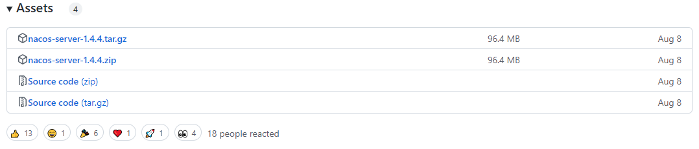
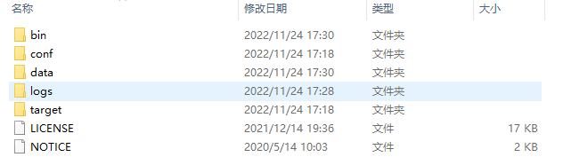
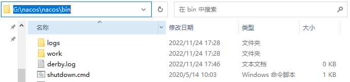
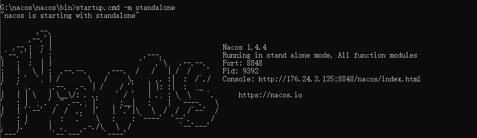

# Nacos注册中心

## 认识Nacos

Nacos是阿里巴巴的产品,现在是SpringCloud中的一个组件,相比Eureka功能更加丰富,在国内受欢迎程度较高

## 安装

1.敲网址:https://nacos.io/ -->前往Github  https://github.com/alibaba/nacos/releases/tag/ 可以指定版本



> 第一个是Linux系统的
>
> 第二个是windows系统的,会得到zip压缩包

2.安装完成后建议自行准备一个**非中文**(含中文有可能出错)的nacos目录,将解压后的文件放入



3.文件处理完后,在conf目录里的application.properties中可以自行配置端口号,默认8848

4.启动时需在该目录的bin下打开命令行,敲命令



- ```
  startup.cmd -m standalone #认真敲,一个空格都不能少
  ```



> ##### 不出错就说明完成了启动!

5.启动后可访问网址:http://localhost:8848/nacos/  

6.进入后输入用户名和密码即可

---- 用户名:nacos

---- 密码:nacos