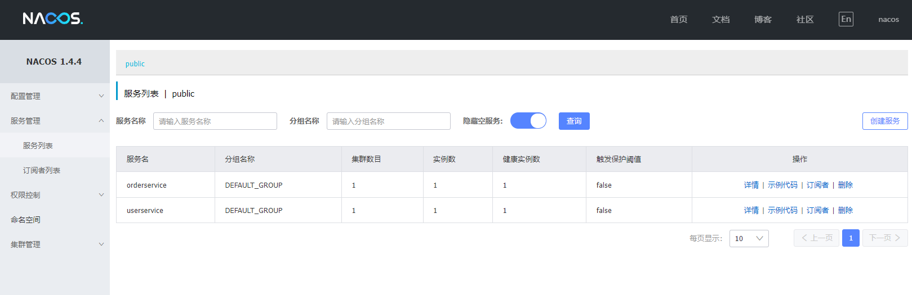
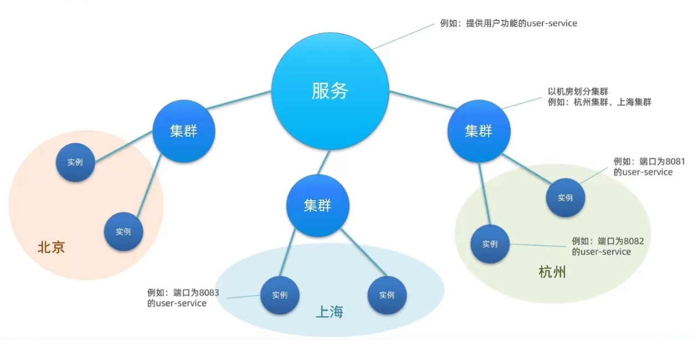
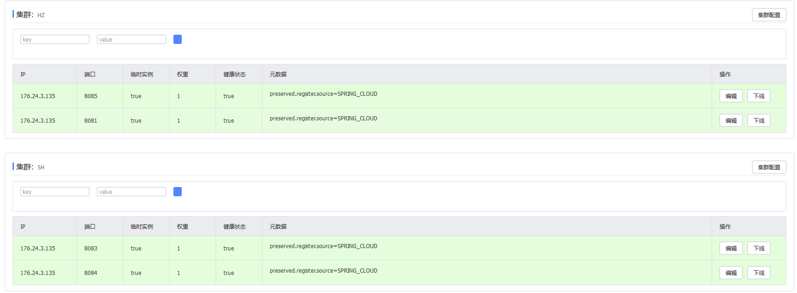

# Nacos服务管理平台


## 百科概念:

Nacos /nɑ:kəʊs/ 是 Dynamic Naming and Configuration Service的首字母简称，一个更易于构建云原生应用的动态服务发现、配置管理和服务管理平台。

Nacos 致力于帮助您发现、配置和管理微服务。Nacos 提供了一组简单易用的特性集，帮助您快速实现动态服务发现、服务配置、服务元数据及流量管理。

Nacos 帮助您更敏捷和容易地构建、交付和管理微服务平台。 Nacos 是构建以“服务”为中心的现代应用架构 (例如微服务范式、云原生范式) 的服务基础设施。

## 认识Nacos

Nacos是阿里巴巴的产品,现在是SpringCloud中的一个组件,相比Eureka功能更加丰富,在国内受欢迎程度较高

## 安装

1.敲网址:https://nacos.io/ -->前往Github  https://github.com/alibaba/nacos/releases/tag/ 可以指定版本


> 第一个是Linux系统的
>
> 第二个是windows系统的,会得到zip压缩包

2.安装完成后建议自行准备一个**非中文**(含中文有可能出错)的nacos目录,将解压后的文件放入


3.文件处理完后,在conf目录里的application.properties中可以自行配置端口号,默认8848

4.启动时需在该目录的bin下打开命令行,敲命令


- ```
  startup.cmd -m standalone #认真敲,一个空格都不能少
  ```


> ##### 不出错就说明完成了启动!

##### 5.启动后可访问网址:http://localhost:8848/nacos/  

6.进入后输入用户名和密码即可

---- 用户名:nacos

---- 密码:nacos

## Nacos服务

#### 1.Nacos服务端,注册中心

> #### 与Eureka服务相比,Nacos服务会更加清晰,整洁,可读性强



> ##### 服务列表中就列举了注册的服务接口和各种信息

#### 2.将服务接口注册到Nacos

1.在cloud-demo父工程中添加spring-cloud-alibaba的管理依赖

```xml
<!--nacos的管理依赖-->
<dependency>
    <groupId>com.alibaba.cloud</groupId>
    <artifactId>spring-cloud-alibaba-dependencies</artifactId>
    <version>2.2.5.RELEASE</version>
    <type>pom</type>
    <scope>import</scope>
</dependency>
```

2.注释掉原来的Eureka依赖

3.添加nacos的客户端依赖

```xml
<!-- nacos客户端依赖包 -->
<dependency>
    <groupId>com.alibaba.cloud</groupId>
    <artifactId>spring-cloud-starter-alibaba-nacos-discovery</artifactId>
</dependency>
```

4.启动项目即可到Nacos注册中心查看微服务的信息

## Nacos服务分级存储模型(地域概念)



> 1.一级是服务,例如userservice
>
> 2.二级是集群,例如杭州或上海
>
> 3.三级是实例,例如杭州机房的某台部署了userservice的服务器

### Nacos跨集群调用问题

> 若是在局域网内进行调用和访问,距离近,速度快,如果是跨域跨集群访问又会如何?

##### 1.服务集群属性

- 修改application.yml,添加如下内容

  ```yaml
  spring:
    cloud:
      nacos:
        server-addr: localhost:8848 # nacos服务端地址
        discovery:
          cluster-name: HZ # 配置集群名称,也就是机房位置,★可以进行修改例如: HZ,杭州  SH,上海
  ```

- 当一个启动实例还包含多个自启动实例时,可以在彼此启动的间隙来改变集群的位置

  

##### 2.当再次刷新Nacos服务页面时,点击userservice微服务详情即可看到多个集群的接口服务状态

>这里的四个服务接口分别处于两个集群(SH,HZ)

