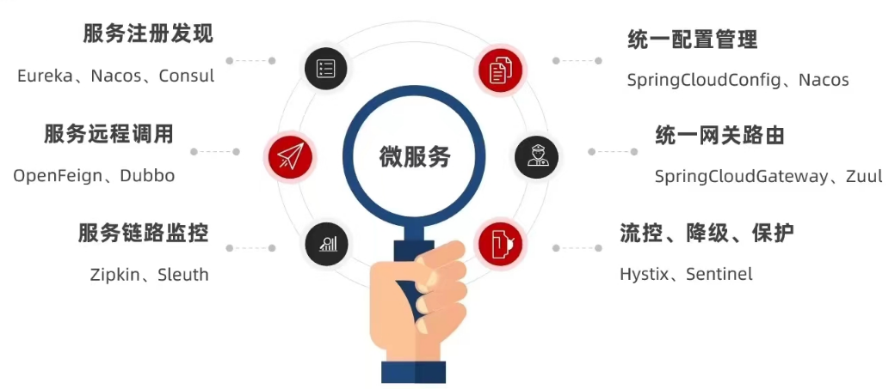
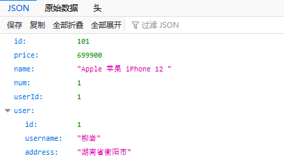

# Spring Cloud

> #### 官网地址:https://spring.io/projects/spring-cloud

## 依赖:

```xml
<!-- springCloud -->
<dependency>
    <groupId>org.springframework.cloud</groupId>
    <artifactId>spring-cloud-dependencies</artifactId>
    <version>${spring-cloud.version}</version>
    <type>pom</type>
    <scope>import</scope>
</dependency>
```

## 什么是SpringCloud

SpringCloud是由Spring提供的一套能够快速搭建微服务架构程序的**框架集**

框架集表示SpringCloud不是一个框架,而是很多框架的统称

SpringCloud就是为了搭建微服务架构项目出现的

有人将SpringCloud称之为"Spring全家桶",广义上指代Spring的所有产品

## Spring Cloud的内容

**内容的提供者**

* Spring自己提供的开发出来的框架或软件
* Netflix(奈非):早期的很长一段时间,提供了大量的微服务解决方案
* alibaba(阿里巴巴):新版本的SpringCloudAlibaba正在迅速占领市场(推荐使用)

课程中使用全套的阿里巴巴组件

**功能上分类**

* 微服务的注册中心
* 微服务间的调用
* 微服务的分布式事务
* 微服务的限流
* 微服务的网关
* ....

------

#### SpringCloud是目前国内使用最广泛的微服务框架

SpringCloud集成了各种微服务功能组件,并基于SpringBoot实现了这些组件的自动装配,从而提供了良好的开箱即用的体验:



### 跨服务的远程调用

先在启动类中创建`RestTemplate`并添加`@Bean`注解

```java
/**
 * 创建RestTemplate并注入Spring容器
 */
@Bean
public RestTemplate restTemplate() {
    return new RestTemplate();
}
```

在Service层使用`@Autowired`进行装配,调用`getForObject()`方法,传入url和返回值类型即可

```java
@Autowired
private RestTemplate restTemplate;

public Order queryOrderById(Long orderId) {
    // 1.查询订单
    Order order = orderMapper.findById(orderId);
    // 2.利用RestTemplate发起http请求，查询用户
    // 2.1.url路径      ↓使用微服务的name做端口↓
    String url = "http://userservice/user/" + order.getUserId();
    // 2.2.发送http请求，实现远程调用
    User user = restTemplate.getForObject(url, User.class);
    // 3.封装user到Order
    order.setUser(user);
    // 4.返回
    return order;
}
```

最后通过浏览器搜索即可获得远程微服务的信息:


