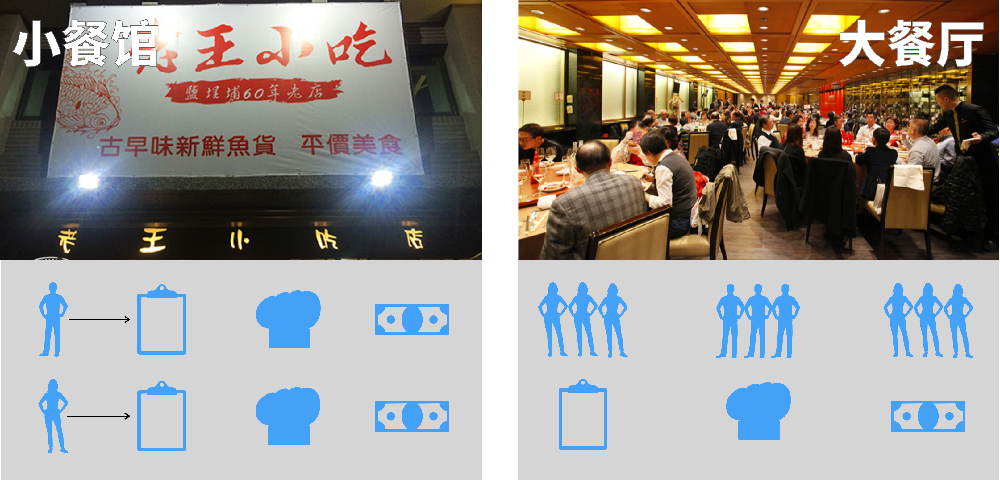
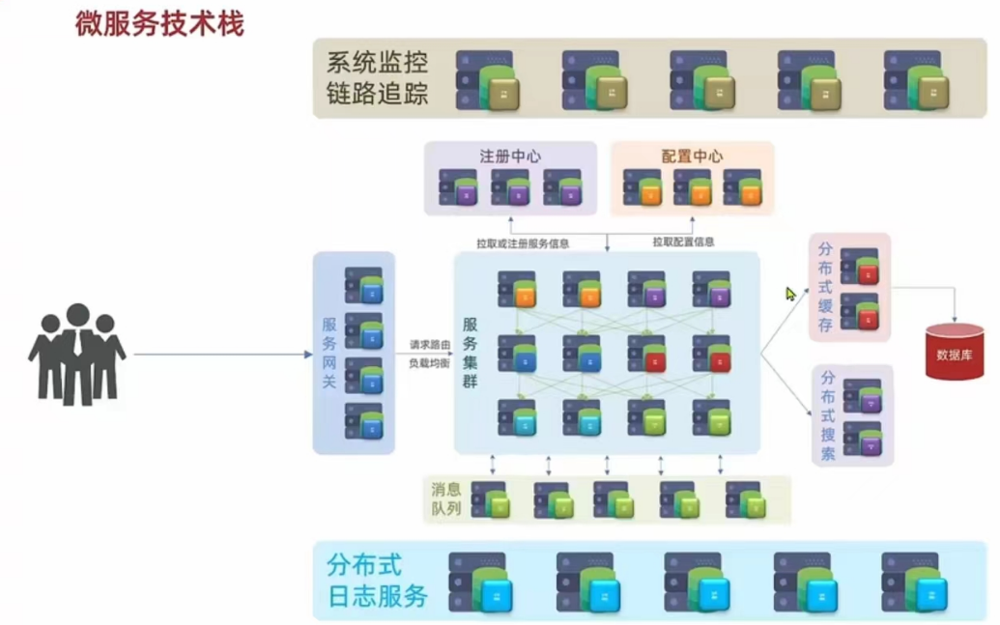
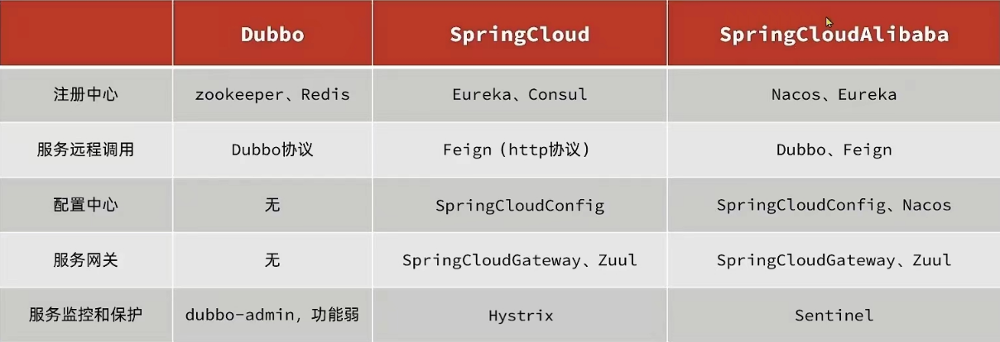

# 一、微服务概述

**微服务的概念是由Martin Fowler（马丁·福勒）在2014年提出的**

微服务是由以单一应用程序构成的小服务，自己拥有自己的行程与轻量化处理，服务依业务功能设计，以全自动的方式部署，与其他服务使用 HTTP API 通信。同时服务会使用最小的规模的集中管理能力，服务可以用不同的编程语言与数据库等组件实现。

简单来说,微服务就是将一个大型项目的各个业务模块拆分成多个互不相关的小项目,而这些小项目专心完成自己的功能,而且可以调用其他小项目的方法,从而完成整体功能

京东\淘宝这样的大型互联网应用程序,基本每个操作都是一个单独的微服务在支持:

- 登录服务器
- 搜索服务器
- 商品信息服务器
- 购物车服务器
- 订单服务器
- 支付服务器
- 物流服务器
- .....

## 为什么需要微服务?

左侧小餐馆就像单体项目

一旦服务器忙,所有业务都无法快速响应

即使添加了服务器,也不能很好的解决这个问题

不能很好的实现"高并发,高可用,高性能"

但是因为服务器数量少,所以成本低,适合并发访问少的项目

右侧大餐厅就是微服务项目

每个业务专门一批人来负责,业务之间互不影响

在某个模块性能不足时,针对这个模块添加服务器改善性能

万一一个服务器发生异常,并不会影响整体功能

但是完成部署的服务器数量多,成本高,需要较多投资,能够满足"高并发,高可用,高性能"的项目

## 怎么搭建微服务项目?

在微服务概念提出之前(2014年),每个厂商都有自己的解决方案

但是Martin Fowler（**马丁·福勒**）提出了微服务的标准之后,为了技术统一和兼容性,很多企业开始支持这个标准

现在我们开发的微服务项目,大多数都是在马丁·福勒标准下的

如果我们自己编写支持这个标准的代码是不现实的,必须通过现成的框架或组件完成满足这个微服务标准的项目结构和格式

**当今程序员要想快速开发满足上面微服务标准的项目结构,首选SpringCloud**

(cloud :云朵)

## 微服务技术栈:

> ### 单体架构:

**将业务的所有功能集中在一个项目中开发,打成一个包部署**

- 优点:

  架构简单

  部署成本低

- 缺点:

  耦合度高

> ### 分布式架构:

**根据业务功能对系统进行拆分,每个业务模块作为独立项目开发,称为一个服务**

- 优点

  降低服务耦合

  有利于服务升级拓展

- 问题:服务治理

  分布式架构需要考虑的问题:

  - 服务拆分粒度如何?
  - 服务集群地址如何维护?
  - 服务之间如何实现远程调用?
  - 服务健康状态如何感知?

### 1.微服务架构特征

- 单一职责:微服务拆分粒度更小,每一个服务都对应唯一的业务能力,做到单一职责,避免重复业务开发
- 面向服务:微服务对外暴露业务接口
- 自治:团队独立,技术独立,数据独立,部署独立
- 隔离性强:服务调用做好隔离,容错,降级,避免出现级联问题

### 2.微服务结构

微服务这种方案需要技术框架来落地,全球的互联网公司都在积极尝试自己的微服务落地技术,在国内最知名的就是SpringCloud和阿里巴巴的Dubbo

###  3.微服务的远程调用

#### 提供者与消费者

- 服务提供者:一次业务中,被其他微服务调用的服务.(提供接口给其他服务)
- 服务消费者:一次业务中,调用其他服务的服务.(调用其他微服务提供的接口)

> ##### 提供者与消费者角色其实是相对的
>
> ##### 一个服务既可以是提供者,又可以是消费者!!!

