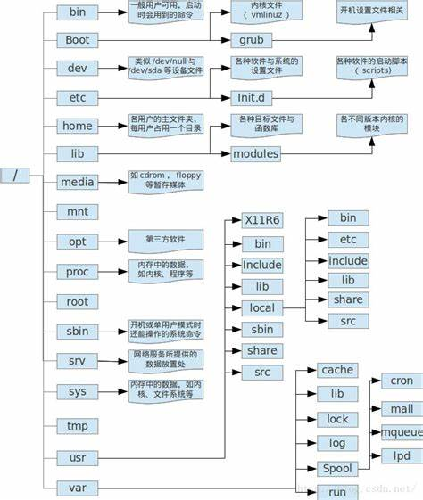
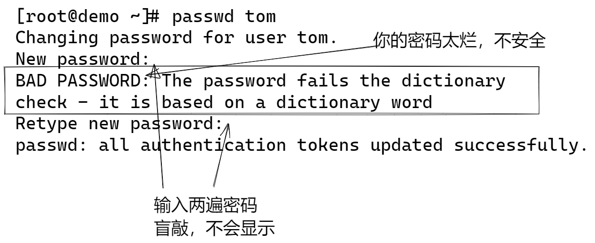
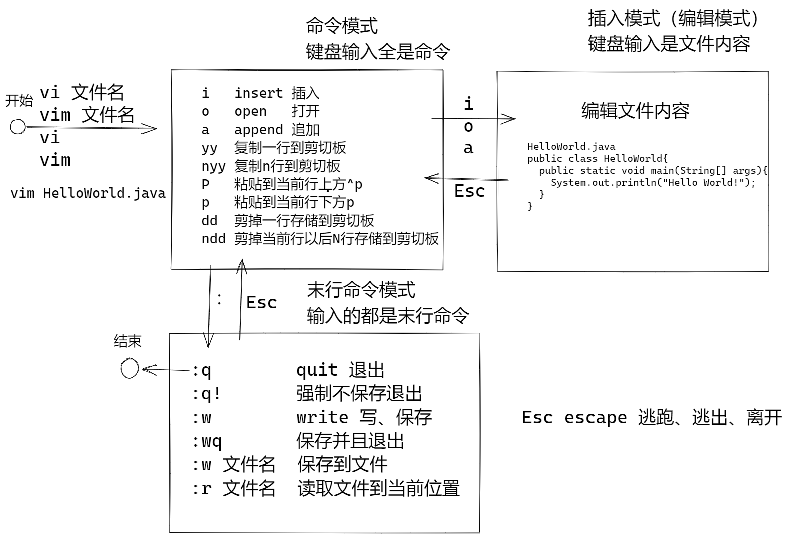
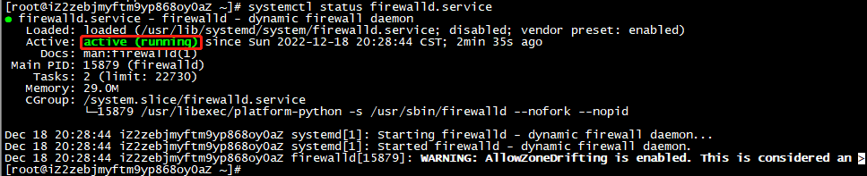
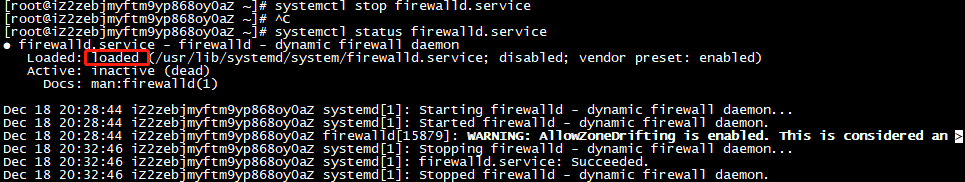

# Linux系统的命令

#### 1.显示日期的命令: `date`

```shell
root@1-2:~# date
Sun Nov 27 01:33:47 PM UTC 2022
```

- 时间格式化:

  ```shell
  root@1-2:~# date +%Y/%m/%d
  2022/11/27
  ```

  ```shell
  root@1-2:~# date +%H:%M
  13:36
  ```

**查看当前时区**：

```sh
date -R
[root@localhost etc]# date -R
Sat, 04 Feb 2023 11:24:18 +0800
```

#### 2.显示日历的命令: `cal`

#### 3.显示计算器: `bc`

```shell

[vbird@www ~]$ bc 
bc 1.06 
Copyright 1991-1994, 1997, 1998, 2000 Free Software Foundation, Inc. 
This is free software with ABSOLUTELY NO WARRANTY. 
For details type `warranty'. 
1+2+3+4  <==只有加法时 
10 
7-8+3 
2 
10*52 
520 
10%3     <==计算『余数』 
1 
10^2 
100 
10/100   <==这个最奇怪！不是应该是 0.1 吗？ 
0 
quit     <==离开 bc 这个计算器 
#输入信息+加、-减、*乘、/除、^指数、%余数
```

因为bc默认仅输出整数，如果要输出小数点下位数，那么就必须要运行 scale=number ，那个number就是小数点位数

```shell
[vbird@www ~]$ bc 
bc 1.06 
Copyright 1991-1994, 1997, 1998, 2000 Free Software Foundation, Inc. 
This is free software with ABSOLUTELY NO WARRANTY. 
For details type `warranty'. 
scale=3     <==没错！就是这里！！ 
1/3 
.333 
340/2349 
.144 
quit 
```

#### 4.`Tab`按键

他具有『命令补全』与『文件补齐』的功能喔！ 重点是，可以避免我们打错命令或文件名呢！

```shell

[vbird@www ~]$ ca[tab][tab]    <==[tab]按键是紧接在 a 字母后面！ 
cadaver             callgrind_control   capifax             card 
cal                 cameratopam         capifaxrcvd         case 
caller              cancel              capiinfo            cat 
callgrind_annotate  cancel.cups         captoinfo           catchsegv 
# 上面的 [tab] 指的是『按下那个tab键』，不是要你输入中括号内的tab啦！
```

#### 5.`Ctrl+c`按键

如果你在Linux底下输入了错误的命令或参数，有的时候这个命令或程序会在系统底下『跑不停』这个时候怎么办？别担心， 如果你想让当前的程序『停掉』的话，可以输入：[Ctrl]与c按键(先按着[Ctrl]不放，且再按下c按键，是组合按键)， 那就是中断目前程序的按键啦！

#### 6.`Ctrl+d`按键

[Ctrl]与d按键的组合！这个组合按键通常代表着： 『键盘输入结束(End Of File, EOF 或 End Of Input)』的意思！ 另外，他也可以用来取代exit的输入呢！例如你想要直接离开文字接口，可以直接按下[Ctrl]-d就能够直接离开了(相当于输入exit啊！)。

```shell
root@1-2:~# 
logout
```

#### 7.`who`、`netstat -a`、`ps-aux`命令

`who`：查看目前有谁在线?

`netstat -a` ：查看网络联机状态

`ps -aux`查看背景运行的程序

#### 8.`sync`、`shutdown`、`reboot`

将数据同步写入硬盘中的命令:`sync`

惯用的关机命令: `shutdown`

重新启动,关机: `reboot`、`halt`、`poweroff`

>由于Linux系统的关机/重新启动是很重大的系统运行，因此只有root才能够进行例如shutdown, reboot等命令。

#### 9.`ls`命令

```shell
[root@www ~]# ls -al
total 156
drwxr-x---   4    root   root     4096   Sep  8 14:06 .
drwxr-xr-x  23    root   root     4096   Sep  8 14:21 ..
-rw-------   1    root   root     1474   Sep  4 18:27 anaconda-ks.cfg
-rw-------   1    root   root      199   Sep  8 17:14 .bash_history
-rw-r--r--   1    root   root       24   Jan  6  2007 .bash_logout
-rw-r--r--   1    root   root      191   Jan  6  2007 .bash_profile
-rw-r--r--   1    root   root      176   Jan  6  2007 .bashrc
-rw-r--r--   1    root   root      100   Jan  6  2007 .cshrc
drwx------   3    root   root     4096   Sep  5 10:37 .gconf      <=范例说明处
drwx------   2    root   root     4096   Sep  5 14:09 .gconfd
-rw-r--r--   1    root   root    42304   Sep  4 18:26 install.log <=范例说明处
-rw-r--r--   1    root   root     5661   Sep  4 18:25 install.log.syslog
[    1   ][  2 ][   3  ][  4 ][    5   ][     6     ][       7          ]
[  权限  ][连结][拥有者][群组][文件容量][  修改日期 ][      檔名        ]
```

ls是『list』的意思，重点在显示文件的文件名与相关属性。而选项『-al』则表示列出所有的文件详细的权限与属性 (包含隐藏档，就是文件名第一个字符为『 . 』的文件)。如上所示，在你第一次以root身份登入Linux时， 如果你输入上述指令后，应该有上列的几个东西，先解释一下上面七个字段个别的意思：


**以档案类型权限为例:**

这个地方最需要注意了！仔细看的话，你应该可以发现这一栏其实共有十个字符：


- 第一个字符代表这个文件是『

  目录、文件或链接文件

  等等』：

  - 当为[ **d** ]则是目录，例如[上表](http://cn.linux.vbird.org/linux_basic/0210filepermission_2.php#table2.1.1)档名为『.gconf』的那一行；
  - 当为[ **-** ]则是文件，例如[上表](http://cn.linux.vbird.org/linux_basic/0210filepermission_2.php#table2.1.1)档名为『install.log』那一行；
  - 若是[ **l** ]则表示为连结档(link file)；
  - 若是[ **b** ]则表示为装置文件里面的可供储存的接口设备(可随机存取装置)；
  - 若是[ **c** ]则表示为装置文件里面的串行端口设备，例如键盘、鼠标(一次性读取装置)。

- 接下来的字符中，以三个为一组，且均为『rwx』 的三个参数的组合。其中，[ r ]代表可读(read)、[ w ]代表可写(write)、[ x ]代表可执行(execute)。 要注意的是，这三个权限的位置不会改变，如果没有权限，就会出现减号[ - ]而已。

  - 第一组为『文件拥有者的权限』，以『install.log』那个文件为例， 该文件的拥有者可以读写，但不可执行；
  - 第二组为『同群组的权限』；
  - 第三组为『其他非本群组的权限』。

#### 10.查看系统的版本：`uname -a`

```sh
[root@am8nlontcnkhzmpb ~]# uname -a
Linux am8nlontcnkhzmpb 3.10.0-862.el7.x86_64 #1 SMP Fri Apr 20 16:44:24 UTC 2018 x86_64 x86_64 x86_64 GNU/Linux
```

#### 11.修改Linux系统的时区

```sh
1. tzselect # 打开时区
2. 根据序号选择时区 Asia --> china --> Beijing Time

# 提示
You can make this change permanent for yourself by appending the line
	TZ='Asia/Shanghai'; export TZ
to the file '.profile' in your home directory; then log out and log in again.

Here is that TZ value again, this time on standard output so that you
can use the /usr/bin/tzselect command in shell scripts:
Asia/Shanghai

3. TZ=‘Asia/Shanghai’ ; export  TZ
4. vim /etc/profile  添加：TZ=‘Asia/Shanghai’ ; export  TZ
```

## Linux对文件和目录的常用命令:

#### 1.查看文件或目录大小`du`

```sh
du -sh 文件名 # 查看文件大小
du -sh ~/Desktop/git本地仓库/* # 查看某个目录大小
```

#### 2.创建文件夹 `mkdir`

```sh
mkdir 文件夹名  # 在当前目录中创建一个文件夹
mkdir demo
```

#### 3.罗列当前目录下的文件列表 `ls`

```sh
ls        # 列出当前文件夹的内容
ll        # 等价于   ls -l
ls -l     # 使用长格式显示文件列表
ls 文件夹  # 显示文件夹中的内容
ls -a     # 显示全部的文件 包含隐藏文件
```

#### 4.清理屏幕 

Linux/Mac/Windows11

```sh
clear
```

Windows

```sh
cls
```

#### 5.创建文件命令和修改文件的访问时间 `touch`:触摸

```sh
touch 不存在的文件名       # 创建新文件
touch 已存在的文件名/文件夹 # 修改文件的时间
```

#### 6.查看文件内容 `cat`

```sh
[admin@iZ2zebjmyftm9yp868oy0aZ ~]$ cat helloword.java
public class Demo{
        public static void main(String[] args){
                System.out.println("Hello World!");
        }
}
```

#### 7.改名和移动文件/文件夹命令 Linux: `mv`移动

```sh
mv 已经存在的文件/文件夹  不存在的文件/文件夹   #改名
mv 已经存在的文件/文件夹  已经存在的文件夹      # 移动到目标文件夹
```

如果第一个参数是不存在的,则报错 `No such file or directory`

主目录（自己的家）： 每个可以登录的Linux用户都有自己的 “家” Home 目录。

#### 8.打印当前工作目录 `pwd`

```sh
[root@iZ2zebjmyftm9yp868oy0aZ ~]# pwd
/root
```

#### 9.删除文件/文件夹 `rm`

```sh
rm 文件名1 文件名2 文件名3   # 删除系列文件
rm 文件名                  # 删除一个文件
rm -rf 文件夹              # 递归强制删除文件夹
```

-r 递归删除，删除文件夹和其子孙文件夹

-f 强力、强制，强制删除，不经过确认直接删除

如果文件名不存在，会报错误：`No such file or directory`

```sh
[root@iZ2zebjmyftm9yp868oy0aZ ~]# rm dem
rm: cannot remove 'dem': No such file or directory
```

**不要使用的命令！！！！！**

```sh
rm -rf .          # 删除当前目录中全部的内容，.表示当前的目录
rm -rf /          # 删除根目录(若非测试,则后果很严重!!!)
```

为了避免意外 很多Linux默认不用root用户登录

- `#` 提示符号表示当前用户是root
- `$` 提示符号表示普通用户
  - 可以使用 sudo su 切换的root用户

#### 10.Linux的目录结构



#### 11.寻找某个文件的位置

```sh
find / -name '文件名'
```

## Linux对用户的操作命令:

#### 1.添加用户

```sh
useradd 用户名     # 添加一个普通用户
passwd 用户名      # 为用户修改密码
useradd tom       # 添加了一个用户tom，同时会创建Tom的Home： /home/tom
passwd tom        # 设置tom的密码，简单密码会警告，但是可以使用
```

可以忽略密码规则警告：



添加用户以后，就可以使用新用户远程登录了：

```sh
ssh admin@公网IP
```

##### 普通用户和root用户

普通用户: 大部分访问权限都是Home文件夹,安全,不容易犯错误

root用户是管理员,具有全部的目录访问权限,权限大,容易犯错误,可以进行系统管理

Linux(Mac)使用建议

- 使用普通用户操作,必要时可切换到root用户
- 用户有两个命令: `sudo`和`su`

#### 2.以管理员身份运行 `sudo`

`su`: super user 超级管理员

`do`: 做

#### 3.离开 `exit`

可以退出当前的shell

- `su` 命令以后,使用exit就是退出当前切换的用户

  ```sh
  [admin@iZ2zebjmyftm9yp868oy0aZ ~]$ su
  Password:
  [root@iZ2zebjmyftm9yp868oy0aZ admin]# exit
  exit
  ```

- `ssh`登录,使用exit就是退出当前的登录

  ```sh
  [admin@iZ2zebjmyftm9yp868oy0aZ ~]$ exit
  logout
  Connection to 39.105.215.87 closed.
  
  C:\Users\Administrator>
  ```

#### 3.切换用户命令 `su`

切换用户命令,不写参数,则切换到管理员

```sh
[admin@iZ2zebjmyftm9yp868oy0aZ ~]$ su
Password:
[root@iZ2zebjmyftm9yp868oy0aZ admin]#
```

## Linux部署常用命名

#### 1.`yum`软件包管理命令与`wget`协议下载命令

> yum软件包管理命令,可以自动从软件仓库下载软件

**yum的常用命令**：

1.yum check-update 列出所有可更新的软件清单

2.yum update 安装所有更新软件

3.yum -y install <package_name> 安装指定的软件

4.yum update <package_name> 更新指定的软件

5.yum list <package_name> 不加<package_name>列出所有可安装的软件清单，加了列出指定的

6.yum -y remove <package_name> 删除软件

7.yum search <package_name> 查找软件

8.yum list installed 列出所有已安装的软件包

9.yum list extras 列出所有已安装但不在 Yum Repository 内的软件包

10.yum info <package_name> 不加<package_name>列出所有软件包的信息，加了列出指定的

11.yum provides <package_name> 列出软件包提供哪些文件

12.yum clean packages 清除缓存目录(/var/cache/yum)下的软件包

13.yum clean all 清除缓存目录(/var/cache/yum)下的软件包及旧的headers

**wget命令**：

wget命令是Linux系统用于从Web下载文件的命令行工具，支持 HTTP、HTTPS及FTP协议下载文件，而且wget还提供了很多选项，例如下载多个文件、后台下载，使用代理等等，使用非常方便。

语法：

```sh
wget [options] [url]
```

参数介绍：

```sh
1. 无参
wget https://download.redis.io/releases/redis-6.0.8.tar.gz # 以下载redis为例

2. -O 选项以其他名称保存下载的文件，-O后跟指定文件名称即可！
wget -O redis.tar.gz https://download.redis.io/releases/redis-6.0.8.tar.gz

3. -P 将文件保存到指定目录下，参数后跟保存的文件名
wget -P /usr/software https://download.redis.io/releases/redis-6.0.8.tar.gz

4. -c 断点续传
wget -c https://download.redis.io/releases/redis-6.0.8.tar.gz

5. -b 后台下载，下载过程日志重定向到当前目录中的wget-log文件中 (tail -f wget-log查看)
wget -b https://download.redis.io/releases/redis-6.0.8.tar.gz

6. -i 选择下载多个文件
首先创建一个文件，vim进行编辑，在其中添加需要添加的应用程序的url链接
vim download_list.txt
使用-i 指定文件进行批量下载
wget -i download_list.txt

7. --limit-rate 限制下载速度，默认情况下，wget命令会以全速下载，资源过大时，全速下载影响带宽，故可限制下载速度
wget --limit-rate=1m https://download.redis.io/releases/redis-6.0.8.tar.gz

8. -U 选项设定模拟下载
如果远程服务器阻止wget下载资源，我们可以通过-U选项模拟浏览器进行下载，例如下面模拟谷歌浏览器下载。
wget -U 'Mozilla/5.0 (Windows NT 10.0; Win64; x64) AppleWebKit/537.36 (KHTML, like Gecko) Chrome/81.0.4044.43 Safari/537.36' https://download.redis.io/releases/redis-6.0.8.tar.gz

9. --tries 选项增加重试次数，如果网络有问题或下载一个大文件有可能会下载失败，wget默认重试20次，我们可以使用-tries选项来增加重试次数。
wget --tries=40 https://download.redis.io/releases/redis-6.0.8.tar.gz

10. --ftp 如果要从受密码保护的FTP服务器下载文件，需要指定用户名和密码
wget --ftp-user=<username> --ftp-password=<password> url
```

#### 2.`vim`编辑文本文件

vi 是经典的全屏幕可视化编辑软件， vi是商业软件。作者：Bram Moolenaar

Gun开源社区仿写一个版本 vim， vim比vi使用更加便利。

程序员： 使用vi的程序员，一种是不会使用vi的程序员



关于vim

- 如果意外退出，或者其他进行正在编辑，会有隐藏文件： .xxxx.swp, 如果确定不是其他人正在编辑文件，则可以使用rm命令删除
- 如果使用了 :help 进入帮助模式，可以使用:q 退出帮助

#### 3.上传文件`scp`

1. 可在Linux环境下使用`rz`命令,上传本地文件

   ```sh
   yum install lrzsz -y # 引入
   ```

2. 在本地找到需要上传的文件使用`scp`命令在命令行上传

   ```sh
   Administrator@DESKTOP-BT9P60R MINGW64 ~/Desktop/jar包/CoolShark后台管理
   $ scp csmall-passport-0.0.1.jar root@39.105.215.87:.
   root@39.105.215.87's password:
   csmall-passport-0.0.1.jar                     100%   45MB   1.1MB/s   00:39
   Administrator@DESKTOP-BT9P60R MINGW64 ~/Desktop/jar包/CoolShark后台管理
   $
   ```

3. 本地cmd窗口

   ```sh
   sftp root@ip地址
   ```

   连接成功后使用put上传文件:
   
   ```sh
   C:\Users\21681>sftp root@125.74.199.190
   root@125.74.199.190's password:
   Connected to 125.74.199.190.
   sftp> put C:\Users\21681\IdeaProjects\JSD2207-03\coolshark\target\coolshark-0.0.1-SNAPSHOT.jar
   Uploading C:/Users/21681/IdeaProjects/JSD2207-03/coolshark/target/coolshark-0.0.1-SNAPSHOT.jar to /root/coolshark-0.0.1-SNAPSHOT.jar
   C:/Users/21681/IdeaProjects/JSD2207-03/coolshark/target/coolshark-0.0.1-SNAPSHOT.jar  100%   22MB 784.5KB/s   00:28
   sftp>
   ```

#### 4.查看树形结构`tree`命令

```sh
yum install tree #引入tree
```

#### 5.Linux解决端口被占用的方式

在Linux使用过程中，需要了解当前系统开放了哪些端口，并且要查看开放这些端口的具体进程和用户，可以通过netstat命令进行简单查询。

```sh
yum install net-tools #引入
```

1、netstat命令各个参数说明如下：

　　-t : 指明显示TCP端口

　　-u : 指明显示UDP端口

　　-l : 仅显示监听套接字(所谓套接字就是使应用程序能够读写与收发通讯协议(protocol)与资料的程序)

　　-p : 显示进程标识符和程序名称，每一个套接字/端口都属于一个程序。

　　-n : 不进行DNS轮询，显示IP(可以加速操作)

2、netstat配合蚕食即可显示当前服务器上所有端口及进程服务，与grep结合可查看某个具体端口及服务情况：

　　netstat -ntlp  //查看当前所有tcp端口·

　　netstat -ntulp |grep 80  //查看所有80端口使用情况·

　　netstat -an | grep 3306  //查看所有3306端口使用情况·

**解决端口占用**:

在终端窗口输入 netstat -tln | grep + 被占用的端口命令

```sh
netstat -tln
netstat -tln | grep 9090 # 获取PID
```

输入[lsof](https://so.csdn.net/so/search?q=lsof&spm=1001.2101.3001.7020) -i:+被占端口命令，回车后可查看端口被哪个进程占用

```sh
yum install lsof # 引入lsof命令
```

```sh
lsof -i:9090 
```

输入kill -9 + 进程id命令，回车后即可杀死占用端口的进程

```sh
kill -9 进程id # 结束当前的进程
```

#### 6.关于Linux启动SpringBoot项目后,无法在浏览器访问的问题------firewall防火墙拦截

**查看防火墙的状态**:

```sh
systemctl status firewalld.service  #查看防火墙的状态
```



> 显示active说明防火墙已开启

**开启防火墙**:

```sh
systemctl start firewalld.service #开启防火墙
```

**关闭防火墙**:

```sh
systemctl stop firewalld.service # 关闭防火墙
```



> 显示loaded说明防火墙已关闭

> 注意只能root用户权限可以关闭防火墙!!!

**重启防火墙**:

```sh
systemctl reload firewalld # 重启防火墙
service firewalld restart  # 也行
```

**永久关闭防火墙**:

```sh
systemctl disable firewalld.service # 永久关闭防火墙
```

#### 7.在Linux后台启动SpringBoot项目

**`nohup`命令**:

```sh
which nohup # 查看是否已经安装/usr/bin/nohup
yum install coreutils # 下载
vi ~/.bash_profile  # 配置nohup全局使用
在PATH= $PATH: $HOME/bin后面添加:/usr/bin
```

**后台启动**:

```sh
//后台启动
nohup java -jar test.jar > test.text 2>&1 & # test.text后面为用于输出日志的文件
```

- nohup (no hang up)当账户退出或终端关闭时,程序仍然运行。
- &：指如果客户端关闭，程序就会停止运行。

- log/lts.txt:指程序运行生成日志文件的存储位置，如果不指定，默认该项目所有输出被重定向到nohup.out的文件中。
- dev/null 表示空设备文件
- 0 表示stdin标准输入
- 1 表示stdout标准输出
- 2 表示stderr标准错误
- 2>&1 就是表示将错误重定向输出到标准输出上。

>##### &：是指在后台运行，但是当用户退出（挂起）的时候，命令会自动跟着结束。
>
>##### nohup：是指不挂断运行，可以使命令永久的执行下去，和用户终端没有关系。
>
>##### 将 nohup 和 & 结合使用，就可以实现使命令永久地在后台执行了。
>
>##### 可以通过kill -9 端口的方式停止

#### 8.查看端口开放情况

```sh
firewall-cmd --list-ports
```

开放某个端口:

```sh
firewall-cmd --zone=public --add-port=8080/tcp --permanent
```

查看端口是否开启:

```sh
firewall-cmd --zone=public --query-port=8080/tcp
```

删除端口号:

```sh
firewall-cmd --zone=public --remove-port=8080/tcp --permanent
```

#### 9.操作数据库

启动数据库:

```sh
systemctl start mariadb #启动数据库
```

查看数据库状态:

```sh
systemctl status mariadb
```

关闭数据库:

```sh
systemctl stop mariad
```

查看系统用户表的数据:

```sh
use mysql # 使用mysql
select host,user,password from user; # 查询数据
update user set user='root' where host='localhost'; # 修改数据
```

分配访问数据库的权限:

```sh
grant all on *.* to 用户名@'%' identified by '密码' with grant option;
```

刷新权限:

```sh
flush privileges;
```

#### 10.解压缩文件

**解压**

zip格式：

```sh
unzip test.zip -d /tmp/ #这里/tmp/是指定目录
```

tar格式：

```sh
tar –xvf file.tar #解压 tar包
tar -xzvf file.tar.gz #解压tar.gz
tar -xjvf file.tar.bz2 #解压 tar.bz2
tar –xZvf file.tar.Z #解压tar.Z
```

**压缩**

```sh
zip -r ./files.zip ./* -r表示递归
```

#### 11.查看运行的程序

```sh
ps -ef | grep java
```

#### 12.复制文件`cp`

```sh
cp -r 源文件 目标文件
cp -r dist /usr/local/webapp
```

