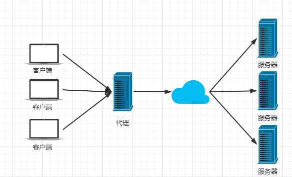
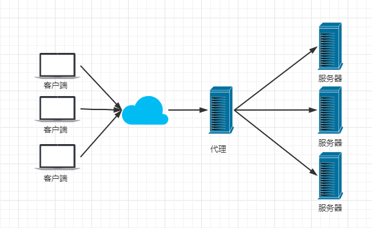
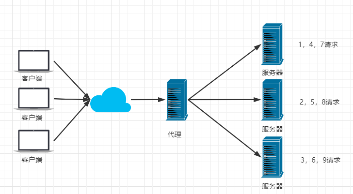
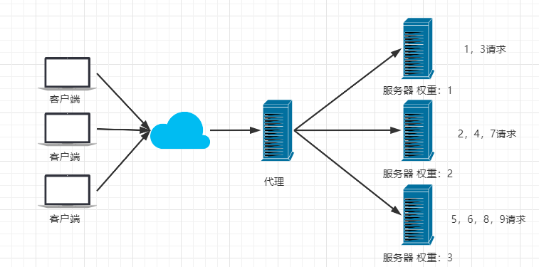
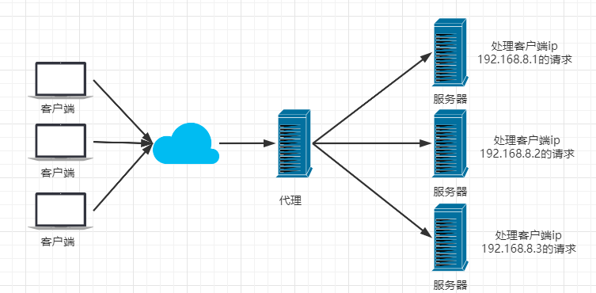
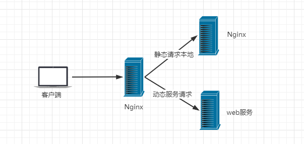
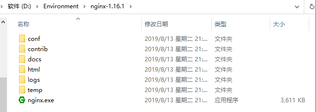
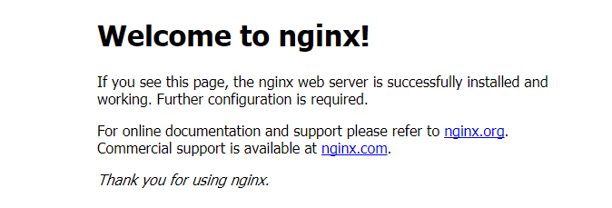
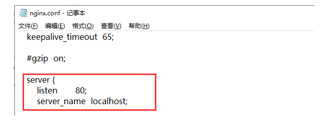

# Nginx使用和命令


## 1.什么是Nginx？

Nginx (engine x) 是一个高性能的HTTP和反向代理web服务器，同时也提供了IMAP/POP3/SMTP服务。Nginx是由伊戈尔·赛索耶夫为俄罗斯访问量第二的Rambler.ru站点（俄文：Рамблер）开发的，第一个公开版本0.1.0发布于2004年10月4日。2011年6月1日，nginx 1.0.4发布。

其特点是占有**内存少**，**并发能力强**，事实上nginx的并发能力在同类型的网页服务器中表现较好，中国大陆使用nginx网站用户有：百度、京东、新浪、网易、腾讯、淘宝等。在全球活跃的网站中有12.18%的使用比率，大约为2220万个网站。

Nginx 是一个安装非常的简单、配置文件非常简洁（还能够支持perl语法）、Bug非常少的服务。Nginx 启动特别容易，并且几乎可以做到7*24不间断运行，即使运行数个月也不需要重新启动。你还能够不间断服务的情况下进行软件版本的升级。

Nginx代码完全用C语言从头写成。官方数据测试表明能够支持高达 50,000 个并发连接数的响应。

## 2.Nginx的作用？

Http代理，反向代理：作为web服务器最常用的功能之一，尤其是反向代理。

### 1.正向代理：



> 当处于局域网的用户想访问外网时，需要进行正向代理。

### 2.反向代理：



> 隐藏真实服务器的IP，暴露代理服务器的IP，用于发送统一的URL访问代理服务器，代理服务器可直接（或利用负载均衡）请求真实的服务器，过程用户是无感的，例如：www.baidu.com。

##### 补充：

##### 正向代理与反向代理的区别

**用途**：

1. 正向代理是处于局域网内的客户端访问局域网外的互联网形成的代理
2. 反向代理是防火墙后的服务器想要提供给互联网访问形成的代理

**目的**：

1. 正向代理代理的对象是本地客户端
2. 反向代理代理的对象是目标服务器

**服务对象**：

1. 正向代理中，服务器不知道真正的用户是谁？

2. 反向代理中，客户端不知道真正的服务器是谁？

   > 谁被代理，代理的对象就不知道服务的人是谁。

### 3.负载均衡：

> Nginx提供的负载均衡策略有2种：内置策略和扩展策略。内置策略为轮询，加权轮询，Ip hash。扩展策略，就天马行空，只有你想不到的没有他做不到的。

##### （1）轮询

多个客户端发送多个请求到代理服务器，代理服务器背后有多台服务器，请求顺序可从头到尾依次循环



##### （2）加权轮询

在轮询的基础上给真实服务器添加权重（权重越大，访问率越高），代理服务器在请求时会根据权重的大小选择性访问



##### （3）Ip_Hash

iphash对客户端请求的ip进行hash操作，然后根据hash结果将同一个客户端ip的请求分发给同一台服务器进行处理，可以解决session不共享的问题。



### 4.动静分离：

在我们的软件开发中，有些请求是需要后台处理的，有些请求是不需要经过后台处理的（如：css、html、jpg、js等等文件），这些**不需要经过后台处理的文件称为静态文件**。

让动态网站里的动态网页根据一定规则把不变的资源和经常变的资源区分开来，动静资源做好了拆分以后，我们就可以根据静态资源的特点将其做缓存操作。提高资源响应的速度。



目前，通过使用Nginx大大提高了我们网站的响应速度，优化了用户体验，让网站的健壮性更上一层楼！

## 3.安装Nginx：

### Windows下安装

#### 1.下载Nginx

http://nginx.org/en/download.html 下载稳定版本。
以nginx/Windows-1.16.1为例，直接下载 nginx-1.16.1.zip。
下载后解压，解压后如下：



#### 2.启动Nginx

有很多种方法启动nginx

(1)直接双击nginx.exe，双击后一个黑色的弹窗一闪而过

(2)打开cmd命令窗口，切换到nginx解压目录下，输入命令 `nginx.exe` ，回车即可

#### 3.检查Nginx是否启动成功

直接在浏览器地址栏输入网址 [http://localhost:80](http://localhost/) 回车，出现以下页面说明启动成功！



#### 4.配置监听

nginx的配置文件是conf目录下的nginx.conf，默认配置的nginx监听的端口为80，如果80端口被占用可以修改为未被占用的端口即可。



当我们修改了nginx的配置文件nginx.conf 时，不需要关闭nginx后重新启动nginx，只需要执行命令 `nginx -s reload` 即可让改动生效

#### 5.关闭Nginx

如果使用cmd命令窗口启动nginx， 关闭cmd窗口是不能结束nginx进程的，可使用两种方法关闭nginx

(1)输入nginx命令 `nginx -s stop`(快速停止nginx) 或 `nginx -s quit`(完整有序的停止nginx)

(2)使用taskkill `taskkill /f /t /im nginx.exe`

```sh
taskkill是用来终止进程的，
/f是强制终止 .
/t终止指定的进程和任何由此启动的子进程。
/im示指定的进程名称 .
```

### Linux下安装

#### 1、安装gcc

安装 nginx 需要先将官网下载的源码进行编译，编译依赖 gcc 环境，如果没有 gcc 环境，则需要安装：

```shell
yum install gcc-c++
```

#### 2、PCRE pcre-devel 安装

PCRE(Perl Compatible Regular Expressions) 是一个Perl库，包括 perl 兼容的正则表达式库。nginx 的 http 模块使用 pcre 来解析正则表达式，所以需要在 linux 上安装 pcre 库，pcre-devel 是使用 pcre 开发的一个二次开发库。nginx也需要此库。命令：

```sh
yum install -y pcre pcre-devel
```

#### 3、zlib 安装

zlib 库提供了很多种压缩和解压缩的方式， nginx 使用 zlib 对 http 包的内容进行 gzip ，所以需要在 Centos 上安装 zlib 库。

```sh
yum install -y zlib zlib-devel
```

#### 4、OpenSSL 安装

OpenSSL 是一个强大的安全套接字层密码库，囊括主要的密码算法、常用的密钥和证书封装管理功能及 SSL 协议，并提供丰富的应用程序供测试或其它目的使用。
nginx 不仅支持 http 协议，还支持 https（即在ssl协议上传输http），所以需要在 Centos 安装 OpenSSL 库。

```sh
yum install -y openssl openssl-devel
```

#### 5、下载安装包

手动下载.tar.gz安装包，地址：https://nginx.org/en/download.html

下载完毕上传到服务器上 /root

或者直接联网下载：

```sh
wget http://nginx.org/download/nginx-1.18.0.tar.gz
```

#### 6、解压

```sh
tar -zxvf nginx-1.18.0.tar.gz
cd nginx-1.18.0
```

#### 7、配置

使用默认配置，在nginx根目录下执行

```sh
./configuremakemake install
```

查找安装路径： `whereis nginx`

关闭主机防火墙，启动成功访问 服务器ip:80


## 4.Nginx常用命令

```sh
1. cd /usr/local/nginx/sbin/
2. ./nginx  # 启动
3. ./nginx -s stop  # 停止
4. ./nginx -s quit  # 安全退出
5. ./nginx -s reload  # 重新加载配置文件
6. ps aux|grep nginx  # 查看nginx进程
```

注意：如何连接不上，检查阿里云安全组是否开放端口，或者服务器防火墙是否开放端口！
相关命令：

```sh
# 开启
service firewalld start
# 重启
service firewalld restart
# 关闭
service firewalld stop
# 查看防火墙规则
firewall-cmd --list-all
# 查询端口是否开放
firewall-cmd --query-port=8080/tcp
# 开放80端口
firewall-cmd --permanent --add-port=80/tcp
# 移除端口
firewall-cmd --permanent --remove-port=8080/tcp
#重启防火墙(修改配置后要重启防火墙)
firewall-cmd --reload
# 参数解释
1、firwall-cmd：是Linux提供的操作firewall的一个工具；
2、--permanent：表示设置为持久；
3、--add-port：标识添加的端口；
```

