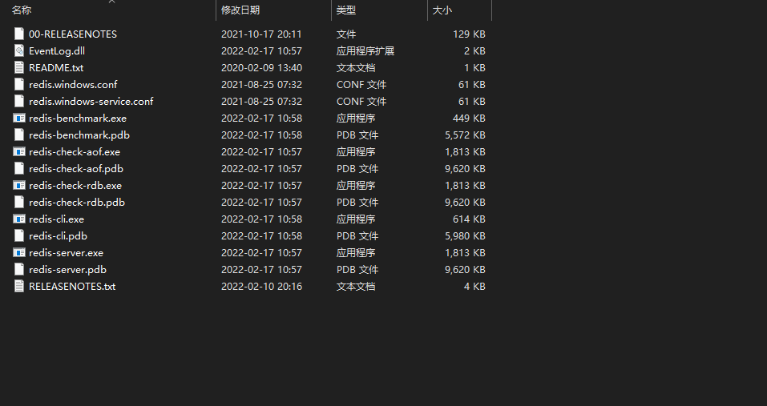
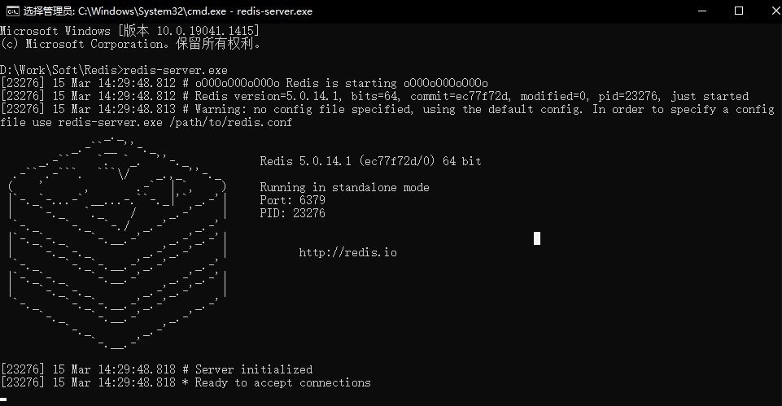
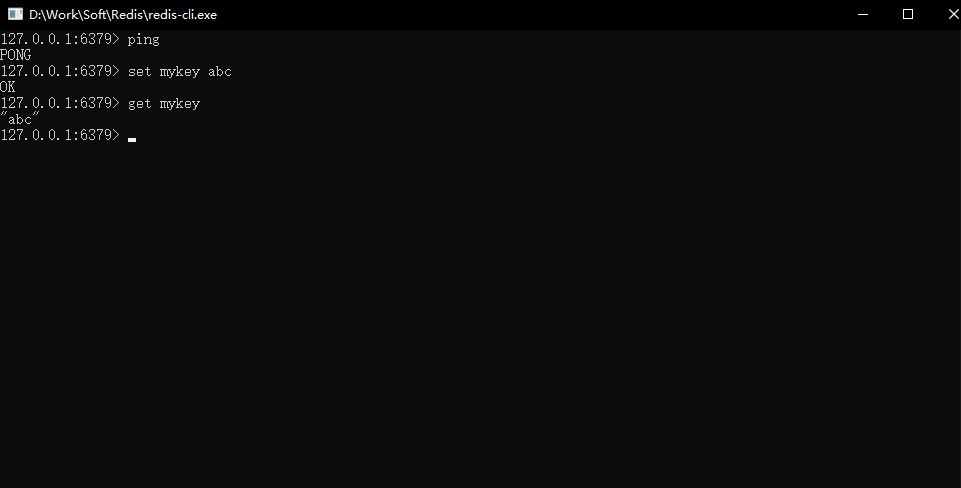
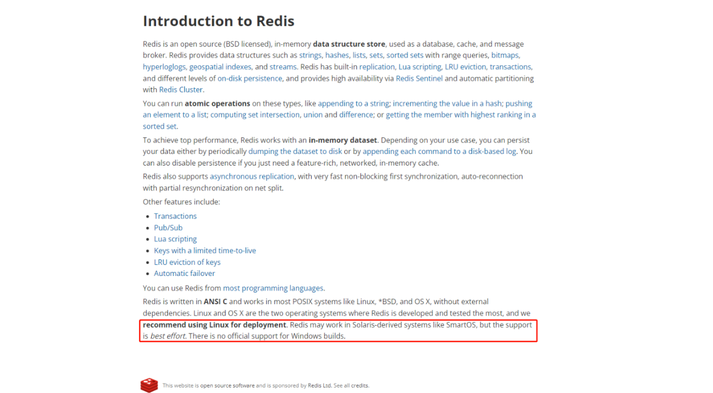

# Redis

**Redis**（Remote Dictionary Server )，即**远程字典服务**。

一个**开源**的使用 [ANSI C](https://baike.baidu.com/item/ANSI C/7657277?fr=aladdin) 语言编写、支持网络、可基于内存亦可持久化的日志型、Key - Value **数据库**，并提供多种语言的 API。

从 2010 年 3 月 15 日起，Redis 的开发工作由 VMware 主持。

从 2013 年 5 月开始，Redis的开发由 [Pivotal](https://blog.csdn.net/qq120631157/article/details/113375562) 赞助。

官网：https://redis.io/

## Windows下载

下载：https://github.com/tporadowski/redis/releases 

> 解压后的目录如下:



> 文件介绍：

- **redis-server.exe**：服务端程序，提供 Redis 服务。
- **redis-cli.exe**: 客户端程序，通过它连接 Redis 服务并进行操作。
- **redis-check-dump.exe**：RDB 文件修复工具。
- **redis-check-aof.exe**：AOF 文件修复工具。
- **redis-benchmark.exe**：性能测试工具，用以模拟同时由 N 个客户端发送 M 个 SETs/GETs 查询（类似于 Apache 的 ab 工具）。
- **redis.windows.conf**： 配置文件，将 Redis 作为普通软件使用的配置，命令行关闭则 Redis 关闭。
- **redis.windows-service.conf**：配置文件，将 Redis 作为系统服务的配置。

### 使用：

>双击 **redis-server.exe**，会弹出窗口一闪而过，如果不想窗口消失，可以在 **cmd** 中打开。



这里启动的是 Redis 的服务端，用于提供服务。

> 双击 **redis-cli.exe**


这里启动的是 Redis 的客户端，用于连接服务。

>测试使用



如此即说明 Redis 可以正常使用。

>Windows 下安装和使用 Redis 都非常简单，但官方并不推荐



>官方建议使用 **Linux** 进行部署。

Redis 可以在其他操作系统中工作，但这种支持是尽力而为的。Windows 版本没有官方支持。

## Linux下载

>这里以 **CentOS 7.6** 系统为例

### 环境准备：

由于 Redis 由 **ANSI C** 编写，安装 Redis 前需要先安装 C 语言环境。

```sh
yum install gcc-c++
```

### 下载：

使用yum命令搜索仓库中是否包含 redis:

```sh
yum search redis
```

搜索结果如下，组件名称 redis，redis-doc 是帮助手册：

```text
Last metadata expiration check: 1:32:06 ago on Sat 03 Dec 2022 02:25:54 PM CST.
==================== Name Exactly Matched: redis =====================
redis.x86_64 : A persistent key-value database
=================== Name & Summary Matched: redis ====================
pcp-pmda-redis.x86_64 : Performance Co-Pilot (PCP) metrics for Redis
redis-devel.x86_64 : Development header for Redis module development
redis-doc.noarch : Documentation for Redis including man pages
```

安装:

```sh
yum install -y redis
```

redis systemd 服务管理：

```sh
systemctl start redis.service    # 启动redis 
systemctl stop redis.service     # 停止 redis
systemctl restart redis.service  # 重新启动
systemctl enable redis.service   # 设置开机启动
systemctl disable redis.service  # 取消开机启动
systemctl status redis.service   # 检查状态，按下q退出
```

> .service  可以省略

使用redis-cli 客户端连接测试：

```sh
redis-cli # 先启动redis服务
```

使用redis命令：

```sh
ping
```

反馈结果：

```sh
PONG
```

使用Redis退出命令离开：

```sh
exit
```

### 性能测试：

> `bin` 目录下的 **redis-benchmark** 可以进行性能测试

- **-c**（clients）：客户端的并发量（默认 50）。
- **-n**（num）：客户端请求数量（默认 100000）。
- **-q**：仅仅显示 redis-benchmark 的 requests per second 信息。
- **-r**（random）：向 Redis 插入更多随机的值。
- **-P** ：每个请求pipeline的数据量（默认为 1）。
- **-k** ：客户端是否使用 keepalive，1 为使用，0 为不使用，默认值为 1。
- **-t**：对指定命令进行基准测试。
- **–csv**：将结果按照 csv 格式输出。

```sh
redis-benchmark -h localhost -p 6379 -c 100 -n 100000
```

### 使用：

>`redis-cli` 是连接本地redis服务的一个命令，通过该命令后可以进入 redis 的脚本控制台。

配置好环境变量后任意目录下输入 `redis-cli` 即可进入。

```sh
[root@sail etc]# redis-cli127.0.0.1:6379> ping
PONG
127.0.0.1:6379> set hello Hello World
(error) ERR syntax error
127.0.0.1:6379> set hello "Hello World"
OK
127.0.0.1:6379> get hello
"Hello World"
```

> 这样 Redis 在 Linux 上就安装完毕了。

## 基础命令：

Redis 默认有 **16** 个数据库

默认使用的是第 **0** 个数据库

不同数据库存不同的值

#### 1.切换数据库`select`：

```sh
127.0.0.1:6379> select 1
OK
127.0.0.1:6379[1]>
```

`[]` 中的数字即为数据库编号（0 号数据库为默认，不展示编号）。

#### 2.看当前数据库的大小`dbsize`：

```sh
127.0.0.1:6379[1]> set username wuqingyuan
OK
127.0.0.1:6379[1]> dbsize
(integer) 1
127.0.0.1:6379[1]>
```

#### 3.清空当前库`flushdb`:

```sh
127.0.0.1:6379[1]> dbsize
(integer) 1
127.0.0.1:6379[1]> flushdb
OK
127.0.0.1:6379[1]> dbsize
(integer) 0
127.0.0.1:6379[1]> 
```

#### 4.清空所有库`flushall`:

```sh
127.0.0.1:6379[1]> flushall
OK
```

#### 5.查看当前数据库所有的键`keys`:

> 因为redis是单线程的，该命令会检索当前redis数据库中的所有key，正常工作不能使用，会造成集体阻塞或数据库宕机！！！

```sh
127.0.0.1:6379[1]> keys *
1) "hello"
```

#### 6.判断key是否存在`exists 键名`：

```sh
127.0.0.1:6379[1]> exists hello
(integer) 1 # 返回1说明存在
127.0.0.1:6379[1]> exists hello1
(integer) 0 # 返回0说明不存在
```

#### 7.移动key到其他数据库`move 键名 数据库编号`：

```sh
127.0.0.1:6379> set hello 1
OK
127.0.0.1:6379> get hello
"1"
127.0.0.1:6379> exists hello
(integer) 1
127.0.0.1:6379> move hello 2 # 将当前数据库中的hello转移到2号数据库
(integer) 1
127.0.0.1:6379> keys *
(empty list or set)
127.0.0.1:6379> select 2
OK
127.0.0.1:6379[2]> keys *
1) "hello"
127.0.0.1:6379[2]> get hello
"1"
```

#### 8.设置键的生存时间`expire`:

> expire 键名 --前提要有这个key

```sh
127.0.0.1:6379> set hello 1
OK
127.0.0.1:6379> expire hello 10 # 前提要有这个key
(integer) 1
```

> setex 键名称 生存时间 值 --可以前提没有

```sh
127.0.0.1:6379[1]> setex hello1 10 HelloWorld
OK
127.0.0.1:6379[1]> get hello1
"HelloWorld"
127.0.0.1:6379[1]> get hello1
"HelloWorld"
127.0.0.1:6379[1]> get hello1
"HelloWorld"
127.0.0.1:6379[1]> get hello1
"HelloWorld"
127.0.0.1:6379[1]> get hello1
"HelloWorld"
127.0.0.1:6379[1]> get hello1
(nil)
```

#### 9.查看键生存时间`ttl 键名`：

```sh
127.0.0.1:6379[1]> ttl hello
(integer) 3
127.0.0.1:6379[1]> ttl hello
(integer) 1
127.0.0.1:6379[1]> ttl hello
(integer) -2
127.0.0.1:6379[1]> get hello
(nil)
```

> -2代表已过期！

#### 10.查看键类型`type 键名`:

```sh
127.0.0.1:6379[1]> set hello World
OK
127.0.0.1:6379[1]> type hello
string
```

#### 11.查看redis底层的键类型`object encoding 键名`:

```sh
127.0.0.1:6379> set hello 1
OK
127.0.0.1:6379> type hello
string
127.0.0.1:6379> object encoding hello
"int"
```

## Redis的数据类型

常见的有五种基本数据类型和一些特殊数据类型，基本数据结构：**String**、 **list**、**set**、**zset**和**hash**，特殊数据类型如位图(**bitmaps**) 、计数器(**hyperloglogs**)和地理空间(**geospatial indexes**)。

### $String 字符串

#### 1.普通赋值`set`:

```sh
127.0.0.1:6379> set hello Hello World
OK
```

#### 2.不存在才赋值`setnx`:

```sh
127.0.0.1:6379> setnx hello Hello
(integer) 0
127.0.0.1:6379> get hello
"Hello World"
```

由于hello已经有值没能赋值成功！

```sh
127.0.0.1:6379> setnx hello HelloWorld!
(integer) 0
127.0.0.1:6379> get hello
"1"
127.0.0.1:6379> setnx hello1 HelloWorld!
(integer) 1
127.0.0.1:6379> get hello1
"HelloWorld!"
127.0.0.1:6379>
```

#### 3.批量赋值`mset`:

```sh
127.0.0.1:6379> mset hello1 Hello1 hello2 Hello2
OK
127.0.0.1:6379> get hello1
"Hello1"
127.0.0.1:6379> get hello2
"Hello2"
```

> #### 原子性批量赋值`msetnx`:

```sh
127.0.0.1:6379> msetnx hello2 "Hello World2" hello3 "Hello World3"
(integer) 0
127.0.0.1:6379> get hello2
"Hello2"
127.0.0.1:6379> get hello3
(nil)
```

要么同时成功，要么同时失败。

#### 4.设置对象`set 对象`：

```sh
127.0.0.1:6379> set user:1 {name:sail,age:27}
OK
127.0.0.1:6379> set user:2 {name:hello,age:28}
OK
127.0.0.1:6379> get user:1
"{name:sail,age:27}"
127.0.0.1:6379> get user:2
"{name:hello,age:28}"
```

设置一个 **user:1** 和 **user:2** 对象，值为 Json 字符串来保存一个对象。

#### 5.追加`append`:

```sh
127.0.0.1:6379> get hello
"1"
127.0.0.1:6379> append hello "Hello world"
(integer) 12
127.0.0.1:6379> get hello
"1Hello world"
```

如果当前 key 不存在，就相当于 `set key`。

#### 6.取值`get`:

```sh
127.0.0.1:6379> get hello
"Hello World"
```

#### 7.先取值再赋值`getset`：

```sh
127.0.0.1:6379> get hello
"1helloworld"
127.0.0.1:6379> getset hello "hello"
"1"
127.0.0.1:6379> get hello
"hello"
```

#### 8.获取长度`strlen`:

```sh
127.0.0.1:6379> strlen hello
(integer) 11
```

#### 9.查看所有的key`keys`:

```sh
127.0.0.1:6379> keys *
1) "hello"
```

#### 10.删除key`del`:

```sh
127.0.0.1:6379> keys *
1) "hello"
127.0.0.1:6379> del hello
(integer) 1
127.0.0.1:6379> keys *
(empty array)
```

#### 11.查看key是否存在`exists`:

```sh
127.0.0.1:6379> keys *
1) "hello1"
127.0.0.1:6379> exists hello
(integer) 0
127.0.0.1:6379> exists hello1
(integer) 1
```

存在返回 **1**，不存在返回 **0**。

#### 12.增减

> incr 自增1

```sh
127.0.0.1:6379> set num1 0
OK
127.0.0.1:6379> incr num1
(integer) 1
127.0.0.1:6379> incr num1
(integer) 2
```

执行一次会让对应 key 的值**加 1**。

> decr 自减1

```sh
127.0.0.1:6379> decr num1
(integer) 1
127.0.0.1:6379> decr num1
(integer) 0
```

执行一次会让对应 key 的值**减 1**。

#### 13.自增步长`incrby 键名 增量`：

```sh
127.0.0.1:6379> incrby num1 10
(integer) 10
127.0.0.1:6379> incrby num1 10
(integer) 20
```

执行一次会按照设置的步长**增加**一次

#### 14.自减步长`decrby 键名 减量`：

```sh
127.0.0.1:6379> decrby num1 10
(integer) 10
127.0.0.1:6379> decrby num1 10
(integer) 0
```

执行一次会按照设置的步长**减少**一次

#### 15.截取

> 截取指定下标getrange key 前标 后标

```sh
127.0.0.1:6379> getrange hello 0 4
"Hello"
```

这里截取的规则是**含头含尾**

> 截取全部 getrange 0 -1

```sh
127.0.0.1:6379> getrange hello 0 -1
"Hello World"
```

这样与 `get key` 的效果一致，建议还是用 `get key`，更加简洁。

#### 16.从指定位置替换

> setrange key 位置 替换内容

```sh
127.0.0.1:6379> setrange hello 6 sail
(integer) 11
127.0.0.1:6379> get hello
"Hello saild"
```

#### 17.过期

> 设置过期setex

```sh
127.0.0.1:6379> setex hello 60 "Hello World"
OK
```

> 查看过期剩余时间ttl

```sh
127.0.0.1:6379> ttl hello
(integer) 56
127.0.0.1:6379> ttl hello
(integer) 55
127.0.0.1:6379> ttl hello
(integer) -2
127.0.0.1:6379> get hello
(nil)
```

当结果为 **-2** 时代表已到期，其值为空。

### $List列表

在 Redis 里面，可以把 List 当成**栈**、**队列**、**阻塞队列**使用。

list 实际是一个链表，左右都可以插入值。

如果 key 不存在，创建新的链表。

如果移除了所有元素，空链表也代表不存在。

在两边插入或者改动值，效率最高；操作中间元素，效率相对低一些。

应用场景：消息排队

#### 1.赋值`Lpush & Rpush`:

> 从左插入Lpush

将一个值或者多个值，插入列表的头部，即从左插入。

```sh
127.0.0.1:6379> Lpush list one # 从左插入一个值
(integer) 1
127.0.0.1:6379> Lpush list two three # 从左插入多个值
(integer) 3
127.0.0.1:6379> Lrange list 0 -1 # -1 即表示查询所有元素
1) "three"
2) "two"
3) "one"
127.0.0.1:6379> Lrange list 0 1 # 查询指定下标范围元素
1) "three"
2) "two"
```

先进的排在后面，后进的排在前面。

> 从右插入Rpush

将一个值或者多个值，插入列表的尾部，即从右插入。

```sh
127.0.0.1:6379> Rpush list four # 从右插入一个值
(integer) 4
127.0.0.1:6379> Rpush list five six # 从右插入多个值
(integer) 6
127.0.0.1:6379> Lrange list 0 -1
1) "three"
2) "two"
3) "one"
4) "four"
5) "five"
6) "six"
```

先进的排在前面，后进的排在后面。

#### 2.元素前后插入值`Linsert`:

> Linsert

```sh
127.0.0.1:6379> Lrange list 0 -1
1) "two"
2) "one"
127.0.0.1:6379> Linsert list before two three # two 之前插入 three
(integer) 3
127.0.0.1:6379> Lrange list 0 -1
1) "three"
2) "two"
3) "one"
127.0.0.1:6379> Linsert list after two three # two 之后插入 three
(integer) 4
127.0.0.1:6379> Lrange list 0 -1
1) "three"
2) "two"
3) "three"
4) "one"
```

#### 3.指定下标赋值`Lset`:

> Lset

```sh
127.0.0.1:6379> Lrange list 0 -1
1) "two"
127.0.0.1:6379> Lset list 0 one # 赋值列表指定下标元素
OK
127.0.0.1:6379> Lrange list 0 -1
1) "one"
```

如果列表不存在或者列表指定下标不存在，赋值失败。

#### 4.取值`Lrange`:

> 查看列表Lrange

```sh
127.0.0.1:6379> Lrange list 0 -1 # -1 即表示查询所有元素
1) "three"
2) "two"
3) "one"
127.0.0.1:6379> Lrange list 0 1 # 查询指定下标范围元素
1) "three"
2) "two"
```

> 下标获取元素Lindex

```sh
127.0.0.1:6379> Lrange list 0 -1
1) "two"
2) "one"
127.0.0.1:6379> Lindex list 0 # 下标从 0 开始
"two"
127.0.0.1:6379> Lindex list 1
"one"
```

Redis 显示的下标是从 1 开始的，实际的下标还是从 0 开始的。

#### 5.列表长度`Llen`:

```sh
127.0.0.1:6379> Llen list
(integer) 2
```

#### 6.列表是否存在`exists`:

```sh
127.0.0.1:6379> exists list
(integer) 1
127.0.0.1:6379> exists list3
(integer) 0
```

#### 7.删除`Lpop & Rpop`:

> 从左删除Lpop

```sh
127.0.0.1:6379> Lrange list 0 -1
1) "three"
2) "two"
3) "one"
4) "four"
127.0.0.1:6379> Lpop list # 移除最左边的元素
"three"
127.0.0.1:6379> Lrange list 0 -1
1) "two"
2) "one"
3) "four"
```

> 从右删除Rpop

```sh
127.0.0.1:6379> Lrange list 0 -1
1) "two"
2) "one"
3) "four"
127.0.0.1:6379> Rpop list # 移除最右边的元素
"four"
127.0.0.1:6379> Lrange list 0 -1
1) "two"
2) "one"
```

#### 8.移除元素`Lrem`:

```sh
127.0.0.1:6379> Lrange list 0 -1
1) "three"
2) "three"
3) "two"
4) "one"
127.0.0.1:6379> Lrem list 1 one # 移除一个指定元素
(integer) 1
127.0.0.1:6379> Lrange list 0 -1
1) "three"
2) "three"
3) "two"
127.0.0.1:6379> Lrem list 2 three # 移除两个指定元素
(integer) 2
127.0.0.1:6379> Lrange list 0 -1
1) "two"
```

#### 9.截取`Ltrim`:

```sh
127.0.0.1:6379> Lrange list 0 -1
 1) "ten"
 2) "nine"
 3) "eight"
 4) "seven"
 5) "six"
 6) "five"
 7) "four"
 8) "three"
 9) "two"
10) "one"
127.0.0.1:6379> Ltrim list 0 2
OK
127.0.0.1:6379> Lrange list 0 -1
1) "ten"
2) "nine"
3) "eight"
```

#### 10.移动`Rpoplpush`:

> 移除前者列表的最后一个元素

```sh
127.0.0.1:6379> Lrange list 0 -1
1) "two"
2) "three"
127.0.0.1:6379> Rpoplpush list list2 # 移除列表最后一个元素并移动到新列表中
"three"
127.0.0.1:6379> Lrange list 0 -1 # 原来的列表
1) "two"
127.0.0.1:6379> Lrange list2 0 -1 # 新的列表
1) "three"
```

### $Hash哈希

https://www.kuangstudy.com/bbs/1515670513748770817

### $Set集合

https://www.kuangstudy.com/bbs/1515620122789117953

### $ZSet有序集合

https://www.kuangstudy.com/bbs/1515680230336315394