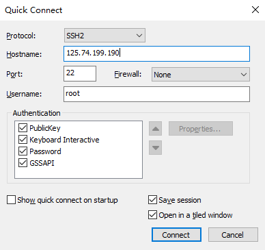

# SecureCRT远程服务器连接

## 1.百科概念:

SecureCRT是一款支持SSH（SSH1和SSH2）的[终端仿真](https://baike.baidu.com/item/终端仿真/3441931?fromModule=lemma_inlink)程序，简单地说是Windows下登录UNIX或Linux服务器主机的软件。

SecureCRT支持SSH，同时支持[Telnet](https://baike.baidu.com/item/Telnet?fromModule=lemma_inlink)和rlogin协议。SecureCRT是一款用于连接运行包括Windows、[UNIX](https://baike.baidu.com/item/UNIX?fromModule=lemma_inlink)和VMS的理想工具。通过使用内含的VCP命令行程序可以进行[加密](https://baike.baidu.com/item/加密?fromModule=lemma_inlink)文件的传输。

## 2.使用

在服务器配置完操作系统后即可使用该工具进行连接

##### 1.如果设置了证书,就在PublicKey中配置证书文件

##### 2.如果设置的密码,就在服务器安全组开放22端口(默认)的前提下直接连接并输入密码

### Linux常用命令:

查看硬件信息命令：ifconfig free fdisk ethtool mii-tool dmidecode dmesg lspci

系统性能监视命令：uptime top free vmstat mpstat iostat sar chkconfig

内存命令:top free vmstat mpstat iostat sar

CPU命令:top vmstat mpstat iostat sar

I/O命令:vmstat mpstat iostat sar

进程命令:ipcs ipcrm lsof strace lstrace

负载命令:uptime mount umount df du fsck dd dumpe2fs dump

关机和查看系统命令：shutdown halt init

常用指令

ls　　 显示文件或目录

-l 列出文件详细信息l(list)

-a 列出当前目录下所有文件及目录，包括隐藏的a(all)

mkdir 创建目录

-p 创建目录，若无父目录，则创建p(parent)

cd 切换目录

touch 创建空文件

echo 创建带有内容的文件。

cat 查看文件内容

cp 拷贝

mv 移动或重命名

rm 删除文件

-r 递归删除，可删除子目录及文件

-f 强制删除

find 在文件系统中搜索某文件

wc 统计文本中行数、字数、字符数

grep 在文本文件中查找某个字符串

rmdir 删除空目录

tree 树形结构显示目录，需要安装tree包

pwd 显示当前目录

ln 创建链接文件

more、less 分页显示文本文件内容

head、tail 显示文件头、尾内容

ctrl+alt+F1 命令行全屏模式

系统管理命令

stat 显示指定文件的详细信息，比ls更详细

who 显示在线登陆用户

whoami 显示当前操作用户

hostname 显示主机名

uname 显示系统信息

top 动态显示当前耗费资源最多进程信息

ps 显示瞬间进程状态 ps -aux

du 查看目录大小 du -h /home带有单位显示目录信息

df 查看磁盘大小 df -h 带有单位显示磁盘信息

ifconfig 查看网络情况

ping 测试网络连通

netstat 显示网络状态信息

man 命令不会用了，找男人 如：man ls

clear 清屏

alias 对命令重命名 如：alias showmeit="ps -aux" ，另外解除使用unaliax showmeit

kill 杀死进程，可以先用ps 或 top命令查看进程的id，然后再用kill命令杀死进程。

关机/重启机器

shutdown

-r 关机重启

-h 关机不重启

now 立刻关机

halt 关机

reboot 重启