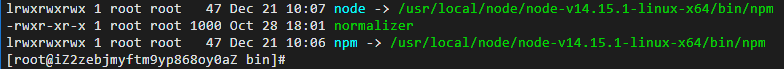

# Linux系统部署SpringBoot+Vue前后端分离的项目

### 一.后端SpringBoot项目

> 根据自己项目需要的环境进行配置,如mysql,redis,rabbitMQ...

#### 1.安装Java环境

搜索yum仓库 search：搜索

```sh
yum search java
```

#### 2.安装OpenJDK8

```sh
yum install -y java-1.8.0-openjdk-devel
```

Complete! 完成

检查Java

```sh
java -version
javac -version
```

上传HelloWorld.java，然后编译运行

```sh
javac HelloWorld.java
java HelloWorld
```

#### 3.安装MySQL（MariaDB）

MySQL 属于Oracle

- Oracle 维护 MySQL
- 开源社区维护了 MySQL的后继版本 MariaDB

##### 1.使用yum从软件仓库安装 MariaDB

```sh
yum install -y mariadb-server mariadb
```

管理MairaDB服务

```sh
systemctl start mariadb      # 启动服务
systemctl restart mariadb    # 重新启动服务
systemctl stop mariadb       # 停止服务  
systemctl enable mariadb     # 允许服务开机运行    
systemctl disable mariadb    # 关闭服务开机运行      
systemctl status mariadb     # 检查服务状态，按下q退出
```

安装Mysql组件

```sh
yum install -y mariadb mariadb-server   # 安装两个组件 mariadb mariadb-server
```

##### 2.启动服务

```sh
systemctl start mariadb      # 启动服务`
```

##### 3.登录mysql

```sh
mysql # 一开始只需要使用该命令即可进入mysql
```

##### 4.配置mysql编码

使用MySQL命令，显示数据库的编码：

```sql
show variables like 'char%';
```

显示：

```text
MariaDB [(none)]> show variables like 'char%';
+--------------------------+------------------------------+
| Variable_name            | Value                        |
+--------------------------+------------------------------+
| character_set_client     | utf8                         |
| character_set_connection | utf8                         |
| character_set_database   | latin1                       |
| character_set_filesystem | binary                       |
| character_set_results    | utf8                         |
| character_set_server     | latin1                       |
| character_set_system     | utf8                         |
| character_sets_dir       | /usr/share/mariadb/charsets/ |
+--------------------------+------------------------------+
8 rows in set (0.001 sec)
```

退出MySQL 

```sql
exit
```

查看MySQL配置文件：

```sh
cd /etc
ls my*
```

结果是， 说明有配置文件 my.cnf,  配置文件夹 my.cnf.d 和 文件夹中已经存在的文件：

```text
my.cnf

my.cnf.d:
auth_gssapi.cnf           mariadb-server.cnf
client.cnf                mysql-clients.cnf
enable_encryption.preset
```

查看MySQL配置文件内容(cat命令用于显示文件的内容)：

```sh
cat my.cnf
```

文件内容：

```text
#
# This group is read both both by the client and the server
# use it for options that affect everything
#
[client-server]

#
# include all files from the config directory
#
!includedir /etc/my.cnf.d
```

include all files from the config directory 这句话的意思：my.cnf 会自动包含配置文件夹中全部的文件，只需要再配置文件夹添加文件，就可以对mysql进行配置。

在/etc/my.cnf.d中添加配置文件encode.cnf:

```sh
cd /etc/my.cnf.d
vim encode.cnf
```

encode.cnf文件内容如下：

```ini
[client]
default-character-set = utf8mb4

[mysql]
default-character-set = utf8mb4

[mysqld]
character-set-client-handshake = FALSE
character-set-server = utf8mb4
collation-server = utf8mb4_unicode_ci
```

添加后，重新启动MySQL,  如果配置文件有错误，会启动MySQL失败！！:

```sh
systemctl restart mariadb;
```

再次登录MySQL, 验证MySQL的编码设置情况：

```sh
mysql
```

在MySQL中执行：

```sql
show variables like 'char%';
```

查询结果：

```text
MariaDB [(none)]> show variables like 'char%';
+--------------------------+------------------------------+
| Variable_name            | Value                        |
+--------------------------+------------------------------+
| character_set_client     | utf8mb4                      |
| character_set_connection | utf8mb4                      |
| character_set_database   | utf8mb4                      |
| character_set_filesystem | binary                       |
| character_set_results    | utf8mb4                      |
| character_set_server     | utf8mb4                      |
| character_set_system     | utf8                         |
| character_sets_dir       | /usr/share/mariadb/charsets/ |
+--------------------------+------------------------------+
8 rows in set (0.001 sec)
```

##### 5.上载数据库数据：

三种方式：

1.在IDEA项目中编译备份数据库脚本：

```sh
mysqldump -uroot -proot 库名>库名.sql
```

进入项目文件在linux命令行（如gitbash）使用`scp`命令：

```sh
scp 脚本文件名 root@ip:.
# 输入命令进行上载
```

2.直接在服务器命令控制台使用`rz`命令：

```sh
rz
# 弹出可视化文件上传窗口，选择要上载的文件
```

3.连接远程数据库可视化应用，例如Navicat...

$可选择端口ip连接或者SSH2连接

**第一种方式导入脚本**：

```sh
mysql # 进入mysql
create database 上载的库名;
use 库名;
source 上载的.sql文件
# Query OK！
```

##### 6.配置权限

查看系统用户表的数据:

```sh
use mysql # 使用mysql
select host,user,password from user; # 查询数据
update user set user='root' where host='localhost'; # 修改数据
```

分配访问数据库的权限:

```sh
grant all on *.* to 用户名@'%' identified by '密码' with grant option;
```

刷新权限:

```sh
flush privileges;
```

#### 4.安装配置Redis

Redis 是Key-Value数据库。

利用yum仓库安装Redis

使用yum命令搜索仓库中是否包含 redis:

```sh
yum search redis
```

搜索结果如下，组件名称 redis，redis-doc 是帮助手册：

```text
Last metadata expiration check: 1:32:06 ago on Sat 03 Dec 2022 02:25:54 PM CST.
==================== Name Exactly Matched: redis =====================
redis.x86_64 : A persistent key-value database
=================== Name & Summary Matched: redis ====================
pcp-pmda-redis.x86_64 : Performance Co-Pilot (PCP) metrics for Redis
redis-devel.x86_64 : Development header for Redis module development
redis-doc.noarch : Documentation for Redis including man pages
```

安装:

```sh
yum install -y redis
```

redis systemd 服务管理：

```sh
systemctl start redis.service    # 启动redis 
systemctl stop redis.service     # 停止 redis
systemctl restart redis.service  # 重新启动
systemctl enable redis.service   # 设置开机启动
systemctl disable redis.service  # 取消开机启动
systemctl status redis.service   # 检查状态，按下q退出
```

> .service  可以省略

使用redis-cli 客户端连接测试：

```sh
redis-cli # 先启动redis服务
```

使用redis命令：

```sh
ping
```

反馈结果：

```sh
PONG
```

使用Redis退出命令离开：

```sh
exit
```

#### 5.启动SpringBoot项目

##### 1.启动项目：`java -jar`命令

以`coolshark-0.0.1-SNAPSHOT.jar`为例：

```sh
java -jar coolshark-0.0.1-SNAPSHOT.jar
```

##### 2.如果是云服务器，需配置安全组，开放项目使用的端口`TCP`

##### 3.开启Linux系统防火墙

查看防火墙状态：

```sh
systemctl status firewalld.service  #查看防火墙的状态
```

开启防火墙：

```sh
systemctl start firewalld.service #开启防火墙
```

**重启防火墙**:

```sh
systemctl reload firewalld # 重启防火墙
service firewalld restart  # 也行
```

##### 4.开放防火墙端口

查看端口开放情况：

```sh
firewall-cmd --list-ports
```

开放某个端口:

```sh
firewall-cmd --zone=public --add-port=8080/tcp --permanent
```

查看端口是否开启:

```sh
firewall-cmd --zone=public --query-port=8080/tcp
```

删除端口号:

```sh
firewall-cmd --zone=public --remove-port=8080/tcp --permanent
```

> 至此启动项目，正常就能run了，如有其他错误，再着重对待！

### 二.前端Vue项目

#### 提前：部署npm

1.安装node环境

```sh
wget https://nodejs.org/dist/v14.15.1/node-v14.15.1-linux-x64.tar.xz
```

2.解压文件

```sh
tar -xvf node-v14.15.1-linux-x64.tar.xz
```

3.更改目录名（不是必须的）

```sh
mv /usr/local/node-v14.15.1-linux-x64 /usr/local/node
```

4.配置环境变量

```sh
NODE_HOME=/usr/local/node/node-v14.15.1-linux-x64
PATH=$NODE_HOME/bin:$PATH
export NODE_HOME PATH
```

5.全局配置npm和node(软链接)

```sh
相当于全局变量，在任何文件夹都能查看版本信息
ln -s /usr/local/node/node-v14.15.1-linux-x64/bin/node /usr/local/bin/
ln -s /usr/local/node/node-v14.15.1-linux-x64/bin/npm /usr/local/bin/
```



6.查看版本信息

```sh
npm -v
```

#### A.第一种部署方式：

##### 1.打包-`dist`

```sh
npm run build
```

##### 2.编写server.js文件

```js
const express = require('express');
const app = express();
app.use(express.static('./dist'));

//运行时的端口，可以自己自定义
const port = 9000;

app.listen(port, function (err) {
    if (err) {
        console.log(err);
        return;
    }
    console.log('Listening at http://localhost:' + port + '\n');
});
```

##### 3.合并解压上传至服务器

将`dist`,`node_modules`,`server.js`文件打包压缩上传服务器

连接服务器：

```sh
sftp root@服务器ip # windows使用cmd窗口连接
```

```sh
put C:\Users\admin\Desktop\test.zip
```

输入密码即可开始上载

##### 4.服务器启动Vue项目

准备文件夹：

```sh
mkdir /root/web
```

解压至该文件夹：

```sh
unzip test.zip -d /root/web
```

进入该文件夹：

```sh
cd /root/web/test
```

启动项目：1.临时运行 2.后台运行

```sh
node server.js  # 临时运行
nohup node server.js > /root/log/web.text 2>&1 & # 后台运行
```

> ##### 访问即可！

#### B.第二种部署到Nginx

先部署Nginx，步骤参考：Linux操作系统\部署案例\部署Nginx.md

##### 1.打包dist文件夹上传到服务器

```sh
npm run build
```

##### 2.上传到服务器：三种方式任意选择

```sh
scp dist.zip root@服务器端口:.
```

##### 3.将dist文件解压到目标目录

```sh
unzip dist.zip -d /usr/local/webapp
```

##### 4.配置nginx的nginx.conf文件

```sh
cd /usr/local/nginx/conf
```

```sh
location / {
            root   /usr/local/webapp/dist;
            try_files $uri $uri/ /index.html;
            #index  index.html index.html;
        }
```


