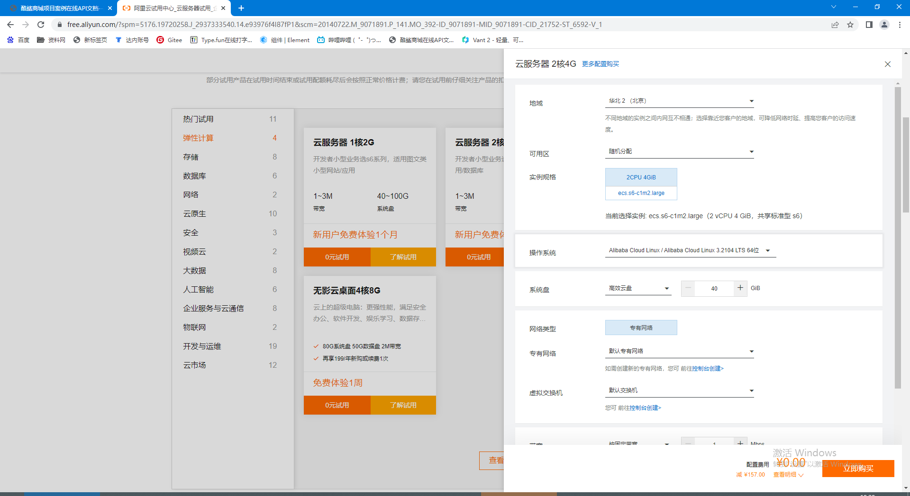

# Java 快速就业课程 Unit01

拓宽知识面，可以面对更广泛的面对软件企业就业岗位。

课程内容：

- Linux 云服务应用
- 高级数据库应用
- 部署大型软件项目
- 简历专题

# 云服务应用

## 购买云服务器




非免费服务器购买：


## 更换服务器镜像

就是更换服务器的系统软件，就是安装新系统

1. 关闭当前服务器

   

2. 更换镜像


### 关于Linux镜像：

- 国内大部分服务器运行的是 CentOS
- CentOS的Redhat的开源发行版本
- Redhat 不再开源CentOS版本
- RockyLinux 是 CentOS 的继任者。

RockyLinux 就是 CentOS 


###  远程连接 Linux

下载 MobaXterm Home Edition

SSH远程登录到Linux：

- 终端登录： 

  ```sh
  ssh root@39.34.123.100
  ```

- mobaXterm:  

  - 创建 session
  - 选择ssh 登录

## Linux 命令

命令 -选项 参数


## 安装Java环境

使用yum安装JDK

yum 软件包管理命令，可以自动从软件仓库下载软件。

搜索yum仓库  search : 搜索

```sh
yum search java 
```

安装JDK 8  install: 安装

```sh
yum install -y java-1.8.0-openjdk-devel
```

Complete 完成

检查Java

```sh
java -version
javac -version
```

上传HelloWorld.java，然后编译运行

```sh
javac HelloWorld.java
java HelloWorld
```

## 课后

1. 更换新的RockyLinux镜像 

2. SSH远程连接RockyLinux

   1. 如果是终端登录，需要删除本地文件

      ```sh
      cd .ssh
      rm know_hosts
      ```

3. 安装Java

4. 上传 编译 HelloWorld！

   


