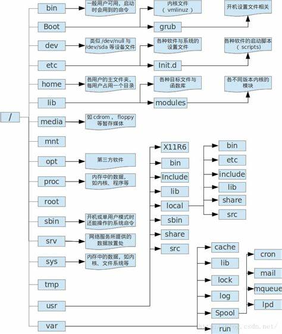

# 快速就业课程

## 我们的目标 

Linux 部署 医疗信息系统


全部服务器都采用云服务器搭建

需求：

- 购买阿里云（腾讯云、XXX云）服务器，首月免费
  - 更换镜像，更换操作系统 RockyLinux（CentOS兼容）

- SSH 客户端连接到服务器


## 关于更换镜像登录问题

- BVSSH

- MobaXterm

- ssh 命令 

  - 如果第二次更换了 RockyLinux镜像，登录会出现错误

    ```sh
    @@@@@@@@@@@@@@@@@@@@@@@@@@@@@@@@@@@@@@@@@@@@@@@@@@@@@@@@@@@
    @    WARNING: REMOTE HOST IDENTIFICATION HAS CHANGED!     @
    @@@@@@@@@@@@@@@@@@@@@@@@@@@@@@@@@@@@@@@@@@@@@@@@@@@@@@@@@@@
    IT IS POSSIBLE THAT SOMEONE IS DOING SOMETHING NASTY!
    Someone could be eavesdropping on you right now (man-in-the-middle attack)!
    It is also possible that a host key has just been changed.
    The fingerprint for the ED25519 key sent by the remote host is
    SHA256:QTWXSdCPQ44tR9/NM3MweuP48+0fku5sbJ397odtTew.
    Please contact your system administrator.
    Add correct host key in C:\\Users\\liuca/.ssh/known_hosts to get rid of this message.
    Offending ECDSA key in C:\\Users\\liuca/.ssh/known_hosts:3
    Host key for 39.101.77.127 has changed and you have requested strict checking.
    Host key verification failed.
    ```

  - 原因是  .ssh/known_hosts 文件保存了上个服务器的证书 和 新服务器的证书冲突。解决办法：打开文件删除证书，或者删除文件也行。参考命令：

    ```sh
    cd .ssh
    del known_hosts
    ```

    如果是 mac 系统

    ```sh
    cd .ssh
    rm known_hosts
    ```

  - 使用命令登录：

    ```sh
    ssh root@39.107.108.110
    ```

## Linux 基本命令

### 创建文件夹

```sh
mkdir 文件夹名   # 在当前目录中创建一个文件夹
mkdir demo      
```

### 列文件夹内容

```sh
ls        # 列出当前文件夹的内容
ll        # 等价于  ls -l 
ls -l     # 使用长格式显示文件列表
ls 文件夹  # 显示文件夹中的内容
```

### 清理屏幕

Linux / Mac / Windows11

```sh
clear
```

Windows

```sh
cls
```

### 创建文件命令和修改文件的访问时间

touch: 触摸 

```sh
touch 不存在的文件名        # 创建新文件
touch 存在的文件名/文件夹    # 修改文件的时间 
```

### 改名和移动命令 

Linux mv 移动

```sh
mv 已经存在的文件/文件夹 不存在的文件/文件夹   # 改名
mv 已经存在的文件/文件夹 已经存在的文件夹      # 移动到目标文件夹
```

如果第一个参数是不存在的，则报错误No such file or directory

Windows 

```sh
move 已经存在的文件/文件夹 不存在的文件/文件夹   # 改名
move 已经存在的文件/文件夹 已经存在的文件夹      # 移动到目标文件夹
```

### 改变当前工作目录

```sh
cd 目标目录     # 改变当前工作目录
cd ..          # 退回上层目录，为啥..代表上层目录：因为发明这个人“懒”
cd /           # 进入根目录
cd ~           # 返回主目录（自己的家）
cd             # 和 cd ~ 相同
```

如果目标目录是不存在的，则出现错误 No such file or directory

主目录（自己的家）： 每个可以登录的Linux用户都有自己的 “家” Home 目录。

### 打印当前工作目录

```sh
pwd      
```

### 删除文件/文件夹

```sh
rm 文件名1 文件名2 文件名3   # 删除系列文件
rm 文件名                  # 删除一个文件
rm -rf 文件夹              # 递归强制删除文件夹
```

-r 递归删除，删除文件夹和其子孙文件夹

-f 强力、强制，强制删除，不经过确认直接删除

如果文件名不存在，会报错误：No such file or directory

**不要使用的命令！！！！！**

```sh
rm -rf .          # 删除当前目录中全部的内容，.表示当前的目录
rm -rf /          # 删除根目录
```

为了避免意外 很多Linux默认不用root用户登录

- `#` 提示符号表示当前用户是root
- `$` 提示符号表示普通用户
  - 可以使用 sudo su 切换的root用户

## Linux 的目录结构



### 添加用户

```sh
useradd 用户名     # 添加一个普通用户
passwd 用户名      # 为用户修改密码
useradd tom       # 添加了一个用户tom，同时会创建Tom的Home： /home/tom
passwd tom        # 设置tom的密码，简单密码会警告，但是可以使用
```

可以忽略密码规则警告：


添加用户以后，就可以使用新用户远程登录了：

```
ssh tom@37.21.33.129
```

## 作业

1.  创建新用户，使用新用户登录到服务器，练习：
   1. 创建文件夹 demo test abc 123 java 
   2. 创建文件 abc.txt  demo.txt   test.txt  hello.txt
   3. 将文件和文件夹，改名
   4. 将文件移动到 demo 文件夹
   5. 删除 创建的文件和文件夹
2. 重新更换镜像！ 使用root用户登录，练习上述案例。
   1. 注意，更换镜像后，需要删除 本地 .ssh/know_hosts 文件


