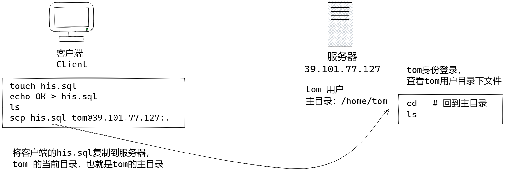
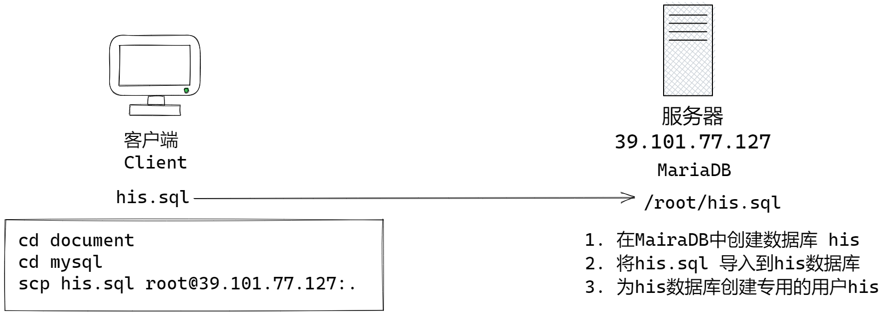
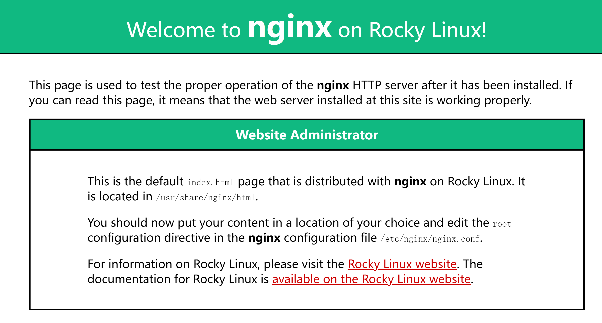
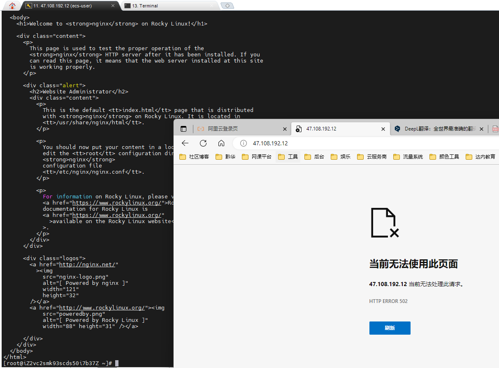
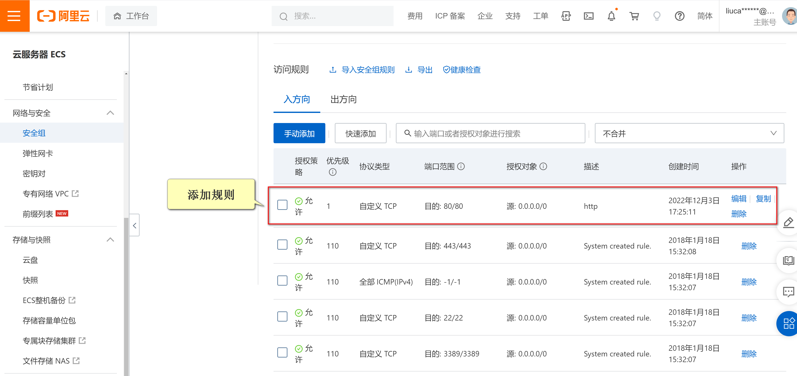

# 快速就业课程

我们目标： 部署医疗信息系统

## 部署MySQL

安装：

```sh
yum install -y mariadb mariadb-server   # 安装两个组件 mariadb mariadb-server
```

服务管理：

```sh
systemctl start mariadb            # 启动服务器
systemctl stop mariadb             # 停止服务器
systemctl restart mariadb          # 重新启动服务器
systemctl enable mariadb           # 设置开机自动启动数据库
systemctl disable mariadb          # 设置开机不启动数据库
systemctl status mariadb           # 检查服务器工作状态，q退出
```

设置MySQL编码实验步骤：

登录到tom用户,提示符号`$`, 命令略

切换到管理员：

```sh
su
```

提示输入密码时候，输入密码：

```sh
Password:
```

切换到root用户后，提示符是 `#`

登录MySQL（MariaDB 服务已经启动）：

```sh
mysql
```

登录以后：

```sh
Welcome to the MariaDB monitor.  Commands end with ; or \g.
Your MariaDB connection id is 9
Server version: 10.3.35-MariaDB MariaDB Server

Copyright (c) 2000, 2018, Oracle, MariaDB Corporation Ab and others.

Type 'help;' or '\h' for help. Type '\c' to clear the current input statement.

MariaDB [(none)]>
```

提示符号 MariaDB [(none)]> 表示已经在MySQL中。

如果没有启动MySQL会出现错误, 请启动MySQL以后再登录：

```text
ERROR 2002 (HY000): Can't connect to local MySQL server through socket '/var/lib/mysql/mysql.sock' (2)
```

使用MySQL命令，显示数据库的编码：

```sql
show variables like 'char%';
```

显示：

```text
MariaDB [(none)]> show variables like 'char%';
+--------------------------+------------------------------+
| Variable_name            | Value                        |
+--------------------------+------------------------------+
| character_set_client     | utf8                         |
| character_set_connection | utf8                         |
| character_set_database   | latin1                       |
| character_set_filesystem | binary                       |
| character_set_results    | utf8                         |
| character_set_server     | latin1                       |
| character_set_system     | utf8                         |
| character_sets_dir       | /usr/share/mariadb/charsets/ |
+--------------------------+------------------------------+
8 rows in set (0.001 sec)
```

退出MySQL 

```sql
exit
```

查看MySQL配置文件：

```sh
cd /etc
ls my*
```

结果是， 说明有配置文件 my.cnf,  配置文件夹 my.cnf.d 和 文件夹中已经存在的文件：

```text
my.cnf

my.cnf.d:
auth_gssapi.cnf           mariadb-server.cnf
client.cnf                mysql-clients.cnf
enable_encryption.preset
```

查看MySQL配置文件内容(cat命令用于显示文件的内容)：

```sh
cat my.cnf
```

文件内容：

```text
#
# This group is read both both by the client and the server
# use it for options that affect everything
#
[client-server]

#
# include all files from the config directory
#
!includedir /etc/my.cnf.d
```

include all files from the config directory 这句话的意思：my.cnf 会自动包含配置文件夹中全部的文件，只需要再配置文件夹添加文件，就可以对mysql进行配置。

在/etc/my.cnf.d中添加配置文件encode.cnf:

```sh
cd /etc/my.cnf.d
vim encode.cnf
```

encode.cnf文件内容如下：

```ini
[client]
default-character-set = utf8mb4

[mysql]
default-character-set = utf8mb4

[mysqld]
character-set-client-handshake = FALSE
character-set-server = utf8mb4
collation-server = utf8mb4_unicode_ci
```

添加后，重新启动MySQL,  如果配置文件有错误，会启动MySQL失败！！:

```sh
systemctl restart mariadb;
```

再次登录MySQL, 验证MySQL的编码设置情况：

```sh
mysql
```

在MySQL中执行：

```sql
show variables like 'char%';
```

查询结果：

```text
MariaDB [(none)]> show variables like 'char%';
+--------------------------+------------------------------+
| Variable_name            | Value                        |
+--------------------------+------------------------------+
| character_set_client     | utf8mb4                      |
| character_set_connection | utf8mb4                      |
| character_set_database   | utf8mb4                      |
| character_set_filesystem | binary                       |
| character_set_results    | utf8mb4                      |
| character_set_server     | utf8mb4                      |
| character_set_system     | utf8                         |
| character_sets_dir       | /usr/share/mariadb/charsets/ |
+--------------------------+------------------------------+
8 rows in set (0.001 sec)
```

## 配置 tom 用户的sudo功能

默认tom用户不能使用sudo命令，执行管理员命令：

```sh
sudo ls /root         # 以管理员身份执行ls /root  
```

提示信息输入tom的密码：

```sh
[sudo] password for tom:
```

输入密码后得到信息：

```sh
tom is not in the sudoers file.  This incident will be reported.
```

翻译：tom不在sudoers文件中。 这一事件将被报告。

也就是说： tom 没有被登记到 /etc/sudoers 文件中，不能能执行管理员的命令，也就是说如果我们把tom登记到/etc/sudoers 文件中， 则就被允许执行管理员命令了。

切换root身份， 会输入root密码：

```sh
su
```

找到sudoers文件:

```sh
cd /etc
ls sudoers
```

> 详细的sudoers文件修改，可以自行搜索

修改 sudoers, 修改文件前，需要先备份文件（修改配置文件时候，应该先备份再修改）:

```sh
cp sudoers sudoers.2022.12.2
vim sudoers
```

使用vim的查找功能查找 root：

> vim提示：输入 `/root` 回车，向后查找 root，多次使用n查找下一个root，找到如下行：

```ini
root    ALL=(ALL)       ALL
```

在这行后添加一行， 允许tom能够执行全部（ALL）的管理员命令:

```ini
tom     ALL=(ALL)       ALL
```

> vim提示：利用yy复制一行，p粘贴到下一行，i进入插入模式，修改root为tom，esc退出插入模式，:wq!强制保存只读文件并且退出。

编辑时候提示: 正在改变一个只读文件，按下ENTER或者命令继续...:

```sh
W10: Warning: Changing a readonly file
Press ENTER or type command to continue
```

退出root：

```sh
exit
```

在tom用户下，命令提示符号 `$`

```sh
sudo ls /root    # 以管理员身份执行 ls /root
```

根据提示输入tom的密码:

```sh
[sudo] password for tom:
```

没有出现任何错误，则说明成功！

sudo 命令的作用：可以使用普通用户身份，临时执行管理员命令！

root用户可以对任意用户密码进行重置：

```sh 
passwd tom      # 设置tom用户的密码
```

### 上载文件

上载文件方法很多：

- ftp 文件传输协议， 很少使用了，ftp明文传输，没有加密，不安全！
- sftp 基于ssh的文件传输协议，自己实验即可。
  - mobaxterm 和 bvssh client 已经讲sftp封装为 GUI 版本，像资源管理器一样好用。
- scp 基于sftp远程文件复制命令




scp 命令的语法：

```sh
scp 源服务器:源文件 目标服务器:目标文件
scp his.sql tom@39.101.77.127:.     # 将his.sql上传到39.101.77.127服务器，用tom身份登录
```

scp 命令输入以后，会提示tom用户的密码, 输入正确密码后文件上传到服务器了

练习：

打开windows本地终端，没有终端可以使用 PowerShell或者 mobaxterm

创建一个文件：

```sh
touch his.sql
```

windows (cmd)创建文件： `echo ok > his.sql`

上传到服务器： 

```sh
scp his.sql tom@39.101.77.127:.  
```

提示输入tom的密码：

```text
tom@39.101.77.127's password:
```

出现上载进度条，如果文件小，不会显示

```text
his.sql                                       100%    0     0.0KB/s   00:00
```

来到服务器查看上传结果, 使用tom用户登录：

```sh
cd
ls
```

### 复制文件命令

linux 命令

```sh
cp 源文件  目标文件      # 基本结构
cp 源文件  新文件名      # 将源文件，改名复制为新文件
cp 源文件  文件夹        # 将源文件，复制到文件夹（可以是. 或 ..）中，文件名不变
cp -r 源文件夹  新文件夹  #  将文件夹改名复制
cp -r 源文件夹  文件夹    # 目标文件夹已经存在了，则复制到文件夹中
```

例子：

```sh
cp test.txt test.txt.bak  # 将文件test.txt 复制为新文件 test.txt.bak
cp test.txt demodir       # demodir 是一个存在的文件夹，则将文件复制到demodir中
cp -r demodir backup      # 将demodir文件夹复制为新文件夹 backup
cp -r demodir abc         # abc是已经存在的文件夹，将demodir复制到abc文件夹中
```

Windows 命令

```sh
copy 源文件  目标文件 
```

## 安装部署HIS系统

HIS 项目： https://gitee.com/robin_home/HIS.git 

### 部署数据库：

从IDEA 项目文件夹，上传his.sql脚本到云服务器：



先进入项目文件夹：

```sh
cd C:\Users\liuca\IdeaProjects\HIS    # 项目文件夹在 C:\Users\liuca\IdeaProjects\HIS 位置
```

上传数据库脚本his.sql:

```sh
cd document   
cd mysql          # 进入 his.sql 的文件夹
dir               # 显示文件夹内容，找到his.sql
scp his.sql root@39.101.77.127:.  # 将his.sql 上传到 root 用户的主目录 /root
```

> 使用 MobaXterm 或者 BVSSH Client 图形化工具上传也行！

登录到云服务器，在服务器上操作,  创建数据库，创建表，为数据库创建专用用户：

检查主目录/root中是否有 his.sql

```
ls 
```

结果：

```sh
his.sql
```

登录MySQL(MariaDB 已经启动，并且设置过utf8mb4编码)

```sh
mysql
```

登录以后，在MySQL中创建数据库, 如下是MySQL命令：

```sql
create database his;
```

打开数据库：

```sql
use his
```

执行his.sql 脚本，创建全部的表

```sql
source his.sql            # 从启动mysql命令所在当前目录，读取执行his.sql
```

检查创建的表：

```sql
show tables;
```

为了安全，不要使用MySQL root用户管理his数据库，为his数据库创建专用用户：

```sql
# 授予 全部 his数据库的权限         his用户@登录位置  设置密码       密码
GRANT all privileges ON his.* TO his@localhost IDENTIFIED BY 'hisadmin'; 
```

退出当前MySQL登录

```sql
exit
```

使用新用户登录测试：

```sh
mysql -uhis -phisadmin
```

在MySQL中，使用MySQL命令测试his用户：

```sql
use his
show tables;
```

## 安装配置Redis

Redis 是Key-Value数据库。

利用yum仓库安装Redis

使用yum命令搜索仓库中是否包含 redis:

```sh
yum search redis
```

搜索结果如下，组件名称 redis，redis-doc 是帮助手册：

```text
Last metadata expiration check: 1:32:06 ago on Sat 03 Dec 2022 02:25:54 PM CST.
==================== Name Exactly Matched: redis =====================
redis.x86_64 : A persistent key-value database
=================== Name & Summary Matched: redis ====================
pcp-pmda-redis.x86_64 : Performance Co-Pilot (PCP) metrics for Redis
redis-devel.x86_64 : Development header for Redis module development
redis-doc.noarch : Documentation for Redis including man pages
```

安装:

```sh
yum install -y redis
```

redis systemd 服务管理：

```sh
systemctl start redis.service    # 启动redis 
systemctl stop redis.service     # 停止 redis
systemctl restart redis.service  # 重新启动
systemctl enable redis.service   # 设置开机启动
systemctl disable redis.service  # 取消开机启动
systemctl status redis.service   # 检查状态，按下q退出
```

> .service  可以省略

使用redis-cli 客户端连接测试：

```sh
redis-cli
```

使用redis命令：

```sh
ping
```

反馈结果：

```sh
PONG
```

使用Redis退出命令离开：

```sh
exit
```

## 安装Nginx

是高性能 Web 服务器，高配置单台服务器，可以处理百万级别的并发。

使用yum进行安装. 

使用yum search 搜索 nginx

```sh
yum search nginx
```

结果, nginx 是组件名：

```txt
Last metadata expiration check: 2:14:01 ago on Sat 03 Dec 2022 02:25:54 PM CST.
==================== Name Exactly Matched: nginx =====================
nginx.x86_64 : A high performance web server and reverse proxy server
=================== Name & Summary Matched: nginx ====================
nginx-all-modules.noarch : A meta package that installs all available
                         : Nginx modules
nginx-filesystem.noarch : The basic directory layout for the Nginx
                        : server
nginx-mod-http-image-filter.x86_64 : Nginx HTTP image filter module
nginx-mod-http-perl.x86_64 : Nginx HTTP perl module
nginx-mod-http-xslt-filter.x86_64 : Nginx XSLT module
nginx-mod-mail.x86_64 : Nginx mail modules
nginx-mod-stream.x86_64 : Nginx stream modules
pcp-pmda-nginx.x86_64 : Performance Co-Pilot (PCP) metrics for the
                      : Nginx Webserver
```

安装Nginx:

```sh
yum install -y nginx
```

管理nginx服务：

```sh
systemctl start nginx
systemctl stop nginx
systemctl restart nginx
systemctl enable nginx
systemctl disable nginx
systemctl status nginx
```

启动nginx 以后使用curl测试：

```sh
curl localhost:80
```

可以得到一张网页：

```sh
<!DOCTYPE html PUBLIC "-//W3C//DTD XHTML 1.1//EN" "http://www.w3.org/TR/xhtml11/DTD/xhtml11.dtd">

<html xmlns="http://www.w3.org/1999/xhtml" xml:lang="en">
  <head>
    <title>Test Page for the Nginx HTTP Server on Rocky Linux</title>
    <meta http-equiv="Content-Type" content="text/html; charset=UTF-8" />
    <style type="text/css">
      /*<![CDATA[*/
      body {
        background-color: #fff;
        color: #000;
        font-size: 0.9em;
        font-family: sans-serif, helvetica;
        margin: 0;
        padding: 0;
      }
      :link {
        color: #c00;
      }
      :visited {
        color: #c00;
      }
      a:hover {
        color: #f50;
      }
      h1 {
        text-align: center;
        margin: 0;
        padding: 0.6em 2em 0.4em;
        background-color: #10B981;
        color: #fff;
        font-weight: normal;
        font-size: 1.75em;
        border-bottom: 2px solid #000;
      }
      h1 strong {
        font-weight: bold;
        font-size: 1.5em;
      }
      h2 {
        text-align: center;
        background-color: #10B981;
        font-size: 1.1em;
        font-weight: bold;
        color: #fff;
        margin: 0;
        padding: 0.5em;
        border-bottom: 2px solid #000;
      }
      hr {
        display: none;
      }
      .content {
        padding: 1em 5em;
      }
      .alert {
        border: 2px solid #000;
      }

      img {
        border: 2px solid #fff;
        padding: 2px;
        margin: 2px;
      }
      a:hover img {
        border: 2px solid #294172;
      }
      .logos {
        margin: 1em;
        text-align: center;
      }
      /*]]>*/
    </style>
  </head>

  <body>
    <h1>Welcome to <strong>nginx</strong> on Rocky Linux!</h1>

    <div class="content">
      <p>
        This page is used to test the proper operation of the
        <strong>nginx</strong> HTTP server after it has been installed. If you
        can read this page, it means that the web server installed at this site
        is working properly.
      </p>

      <div class="alert">
        <h2>Website Administrator</h2>
        <div class="content">
          <p>
            This is the default <tt>index.html</tt> page that is distributed
            with <strong>nginx</strong> on Rocky Linux. It is located in
            <tt>/usr/share/nginx/html</tt>.
          </p>

          <p>
            You should now put your content in a location of your choice and
            edit the <tt>root</tt> configuration directive in the
            <strong>nginx</strong>
            configuration file
            <tt>/etc/nginx/nginx.conf</tt>.
          </p>

          <p>
            For information on Rocky Linux, please visit the
            <a href="https://www.rockylinux.org/">Rocky Linux website</a>. The
            documentation for Rocky Linux is
            <a href="https://www.rockylinux.org/"
              >available on the Rocky Linux website</a
            >.
          </p>
        </div>
      </div>

      <div class="logos">
        <a href="http://nginx.net/"
          ></a>
        <a href="http://www.rockylinux.org/"></a>

      </div>
    </div>
  </body>
</html>
```

可以使用浏览器访问：http://你的IP 得到如下结果：



如果不能看到网页，需要到阿里云的控制台，打开“安全组”中的80端口



找到安全组：


添加规则：




## yum仓库

yum安装的原理： yum命令从yum仓库中搜索安装软件，如果仓库中没有，就无法安装，解决办法，添加仓库配置，增加包含软件组件的仓库. 

yum 搜索的仓库配置  /etc/yum.repos.d/:

```sh
cd /etc/yum.repos.d
ls
```

返回结果是：

```text
Rocky-AppStream.repo         Rocky-NFV.repo
Rocky-BaseOS.repo            Rocky-Plus.repo
Rocky-Debuginfo.repo         Rocky-PowerTools.repo
Rocky-Devel.repo             Rocky-ResilientStorage.repo
Rocky-Extras.repo            Rocky-RT.repo
Rocky-HighAvailability.repo  Rocky-Sources.repo
Rocky-Media.repo
```

查看仓库来源：

```sh
cat Rocky-RT.repo
```

显示结果, 说明目前默认的源（阿里云的镜像 http://mirrors.cloud.aliyuncs.com）：

```text
# Rocky-RT.repo
#
# The mirrorlist system uses the connecting IP address of the client and the
# update status of each mirror to pick current mirrors that are geographically
# close to the client.  You should use this for Rocky updates unless you are
# manually picking other mirrors.
#
# If the mirrorlist does not work for you, you can try the commented out
# baseurl line instead.

[rt]
name=Rocky Linux $releasever - Realtime
#mirrorlist=https://mirrors.rockylinux.org/mirrorlist?arch=$basearch&repo=RT-$releasever
baseurl=http://mirrors.cloud.aliyuncs.com/rockylinux/$releasever/RT/$basearch/os/
gpgcheck=1
enabled=0
countme=1
gpgkey=file:///etc/pki/rpm-gpg/RPM-GPG-KEY-rockyofficial
```

yum 仓库来源：

- 官方镜像源:
- epel 扩展源
- 软件厂商提供的源（MySQL，RabbitMQ）

如果组件搜索不到，往往需要安装yum的扩展源 epel。

安装阿里云的 EPEL 扩展源： https://developer.aliyun.com/mirror/epel

使用命令安装 epel：

```sh
yum install -y https://mirrors.aliyun.com/epel/epel-release-latest-8.noarch.rpm
```

安装后，在/etc/yum.repos.d 文件夹中多了epel的仓库配置：

使用名称查看：

```sh
cd /etc/yum.repos.d
ls
```

结果中包含：

```sh
epel-modular.repo          
epel.repo                   
epel-testing-modular.repo  
epel-testing.repo
```

## 作业：

1. 重新更换镜像为 RockyLinux
2. 安装配置 MySQL
3. 安装配置Redis
4. 安装配置Nginx


