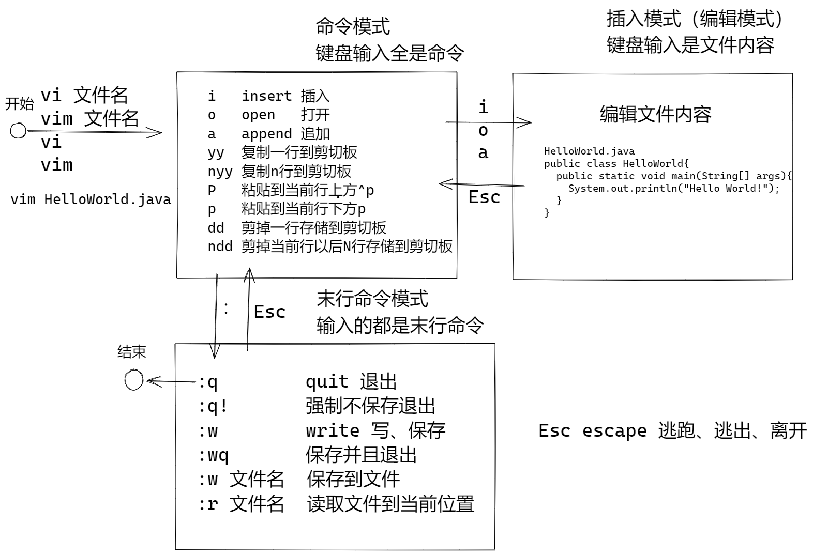

# 快速就业课程

## 普通用户 和 root

普通用户：大部份访问权都是 Home 文件夹，安全，不容易犯错误

root用户是管理员，具有全部的目录访问权限，权限大，容易犯错误，可以进行系统管理

Linux（Mac）使用建议：

- 使用普通用户操作，必要使用切换到root用户
- 用户有两个命令： sudo  su

### sudo 以管理员身份运行

su： super user  超级管理员

do：做

### 离开 exit

可以退出当前的shell

- su 命令以后，使用exit就是退出当前切换的用户
- ssh登录，使用exit就是退出当前的登录

### su 命令

切换用户命令，不写参数，则切换到管理员

## vim 编辑文本文件

vi 是经典的全屏幕可视化编辑软件， vi是商业软件。作者：Bram Moolenaar

Gun开源社区仿写一个版本 vim， vim比vi使用更加便利。

程序员： 使用vi的程序员，一种是不会使用vi的程序员



关于vim

- 如果意外退出，或者其他进行正在编辑，会有隐藏文件： .xxxx.swp, 如果确定不是其他人正在编辑文件，则可以使用rm命令删除
- 如果使用了 :help 进入帮助模式，可以使用:q 退出帮助
- 更多的vim命令，请参考 搜索结果


## yum 是Linux软件包管理命令

yum命令可以从 软件仓库安装程序包。

```sh
yum search 包名称        # 从软件仓库中搜索软件包
yum install -y 软件包名  # 安装软件包 -y 参数表示自动确认
yum search java         # 根据关键字，搜索详细包名 
```

### 安装OpenJDK8

使用yum从软件仓库安装 jdk 8

```sh
yum install -y java-1.8.0-openjdk-devel
```

验证：

```sh
java -version
javac -version
```

### ls 显示全部的文件

Linux（Mac）中 . 开头的文件/文件夹 是隐藏的

```sh
ls -a   # 显示全部的文件 包含隐藏文件
```

## 安装 MySQL(MariaDB)

MySQL 属于Oracle

- Oracle 维护 MySQL
- 开源社区维护了 MySQL的后继版本 MariaDB

使用yum从软件仓库安装 MariaDB

```sh
yum install -y mariadb-server mariadb
```

管理MairaDB服务

```sh
systemctl start mariadb      # 启动服务
systemctl restart mariadb    # 重新启动服务
systemctl stop mariadb       # 停止服务  
systemctl enable mariadb     # 允许服务开机运行    
systemctl disable mariadb    # 关闭服务开机运行      
systemctl status mariadb     # 检查服务状态，按下q退出
```

### 重新启动云服务器

```sh
reboot    # root 用户才能使用 reboot 重新启动服务器
```


## 作业：

1. 重新更换镜像 RockyLinux
2. 添加用户 tom
3. 使用tom用户登录
   1. 切换为 root
   2. 安装JDK8
   3. 编写HelloWorld
   4. 安装MariaDB，设置为开机自动启动，并且重启测试
   5. 创建数据库，创建表，利用insert向表中插入数据


