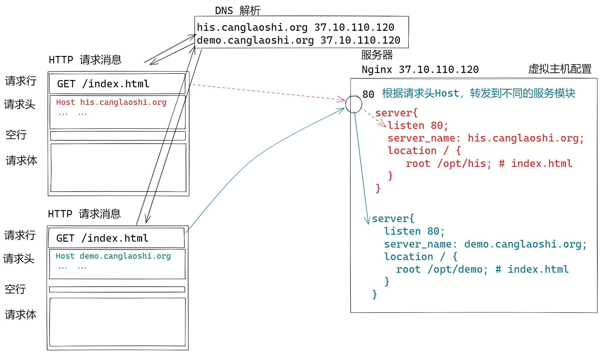

# 快速就业课

## Nginx 虚拟主机

一个服务器虚拟化为多个Web服务器

Nginx 虚拟机工作方式：

- 基于IP的虚拟机：需要多个IP
- 基于端口虚拟机：占用不同的端口，不是默认端口，使用不方便
- 基于域名的虚拟机：
  - 相同IP
  - 相同端口
  - 不同域名

虚拟机工作原理：



实验： 基于域名的虚拟主机

创建两个静态网站文件夹，存储静态网页：

his.canglaoshi.org  网站的页面：

```sh
cd /opt
mkdir his
cd his
vim index.html
```

index.html 的内容：

```html
<html>
    <head></head>
    <body>
        <h1>
            his.canglaoshi.org Index
        </h1>
    </body>
</html>
```

demo.canglaoshi.org 的静态内容：

```sh
cd /opt
mkdir demo
cd demo
vim index.html
```

index.html 的内容：

```html
<html>
    <head></head>
    <body>
        <h1>
            demo.canglaoshi.org Index
        </h1>
    </body>
</html>
```

配置Nginx：

- nginx 的主配置文件  /etc/nginx/nginx.conf 包含了子文件夹 conf.d，所以在conf.d文件夹中添加配置， 就是修改了 nginx.conf.

```sh
cd /etc/nginx/conf.d
vim myhost.conf
```

myhost.conf 文件内容：

```nginx
# his.canglaoshi.org 虚拟机配置
server {
    listen 80;
    server_name his.canglaoshi.org;
    index index.html;
    location / {
        root /opt/his;
    }
}

# demo.canglaoshi.org 虚拟机配置
server {
	listen 80;
    server_name demo.canglaoshi.org;
    index index.html;
    location / {
        root /opt/demo;
    }
}
```

nginx 配置文件测试：

```sh
nginx -t
```

> 如果测试有问题 就需要修改配置文件

如果测试成功则显示：

```text
nginx: the configuration file /etc/nginx/nginx.conf syntax is ok
nginx: configuration file /etc/nginx/nginx.conf test is successful
```

重新启动nginx:

```sh
nginx -s reload          # nginx 热启动
systemctl restart nginx  # nginx 冷启动 
```

修改hosts 文件进行本地DNS解析：

使用管理员身份运行 cmd

```sh
cd C:\Windows\System32\drivers\etc  # 进入hosts的文件夹
notepad hosts                       # 修改 hosts 文件
```

添加内容, 其中ip是你自己服务器的IP：

```ini
39.101.77.127  demo.canglaoshi.org   
39.101.77.127  his.canglaoshi.org
```

保存退出以后，使用ping检查：

```sh
ping demo.canglaoshi.org
```

得到 如下信息表示已经配置成功：

```text
正在 Ping demo.canglaoshi.org [39.101.77.127] 具有 32 字节的数据:
来自 39.101.77.127 的回复: 字节=32 时间=10ms TTL=54
来自 39.101.77.127 的回复: 字节=32 时间=10ms TTL=54
来自 39.101.77.127 的回复: 字节=32 时间=10ms TTL=54
来自 39.101.77.127 的回复: 字节=32 时间=10ms TTL=54

39.101.77.127 的 Ping 统计信息:
    数据包: 已发送 = 4，已接收 = 4，丢失 = 0 (0% 丢失)，
往返行程的估计时间(以毫秒为单位):
    最短 = 10ms，最长 = 10ms，平均 = 10ms
```

> his.canglaoshi.org 测试雷同，这里略去

mac 电脑hosts文件在/etc 文件夹，必须使用root权限才能编辑：

```sh
sudo vim /etc/hosts
```

测试，使用浏览器访问： http://his.canglaoshi.org/index.html 和   http://demo.canglaoshi.org/index.html

## 作业

1. 重新更换RockyLinux 镜像
2. 配置Nginx 虚拟机实验


