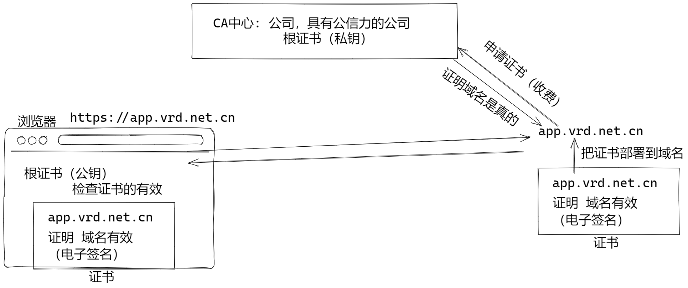
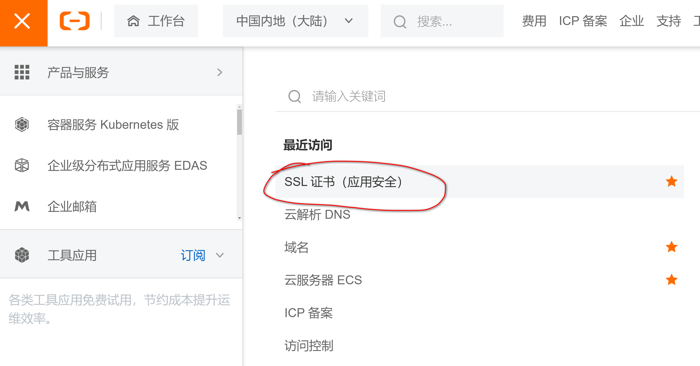
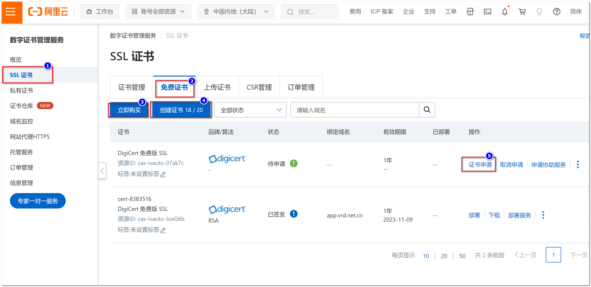
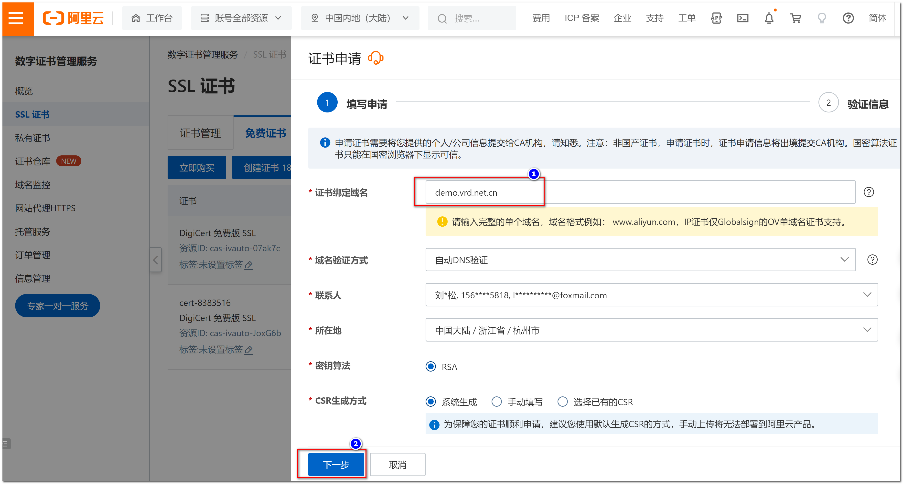
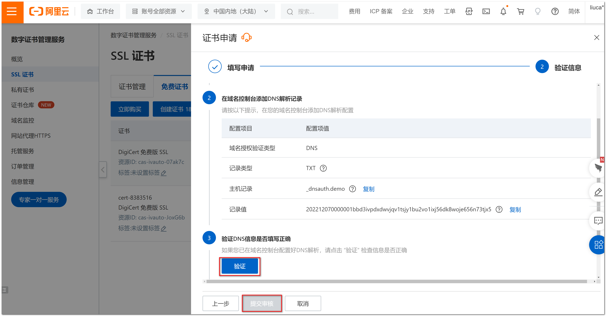

#  快速就业课程

## Nginx 配置 HTTPS 虚拟机

证书的原理：



必须为域名申请证书









过一会就会申请下载证书

下载Nginx版本的证书：8965106_demo.vrd.net.cn_nginx.zip

### 为nginx配置证书

上载证书文件，上传到 /root/文件夹。

在/etc/nginx/文件夹中创建新文件夹 cert 

```sh
mkdir /etc/nginx/cert
```

进入文件夹，释放zip文件：

```sh
cd /etc/nginx/cert
unzip ~/8965106_demo.vrd.net.cn_nginx.zip  # unzip 释放zip文件夹 ~/ 主目录
```

证书文件名太丑了，需要改名：

```sh
mv 8965106_demo.vrd.net.cn.pem demo.vrd.net.cn.pem
mv 8965106_demo.vrd.net.cn.key demo.vrd.net.cn.key
```

创建虚拟机配置文件, demo_vrd.conf:

```sh
cd /etc/nginx/conf.d
vim demo_vrd.conf
```

```nginx
server {
	listen 443 ssl;              # https 默认端口是 443， ssl表示启用ssl加密协议
    server_name demo.vrd.net.cn; # 虚拟机域名必须和证书域名一致！
    index index.html;
    
    ## 配置证书 
    ssl_certificate cert/demo.vrd.net.cn.pem;  
    ssl_certificate_key cert/demo.vrd.net.cn.key; 
    ## 证书参数
    ssl_session_timeout 5m;
    ssl_ciphers ECDHE-RSA-AES128-GCM-SHA256:ECDHE:ECDH:AES:HIGH:!NULL:!aNULL:!MD5:!ADH:!RC4;
    ssl_protocols TLSv1.1 TLSv1.2 TLSv1.3; 
    ssl_prefer_server_ciphers on;
    
    location / {
        root /opt/demo;
    }
}
```

测试并且重启Nginx:

```sh
nginx -t
nginx -s reload
```

阿里云的服务器安全组，必须开放443端口！

客户端， 修改hosts文件，解析 demo.vrd.net.cn 域名：

```ini
37.10.110.101  demo.vrd.net.cn
```

使用浏览器测试 https://demo.vrd.net.cn


