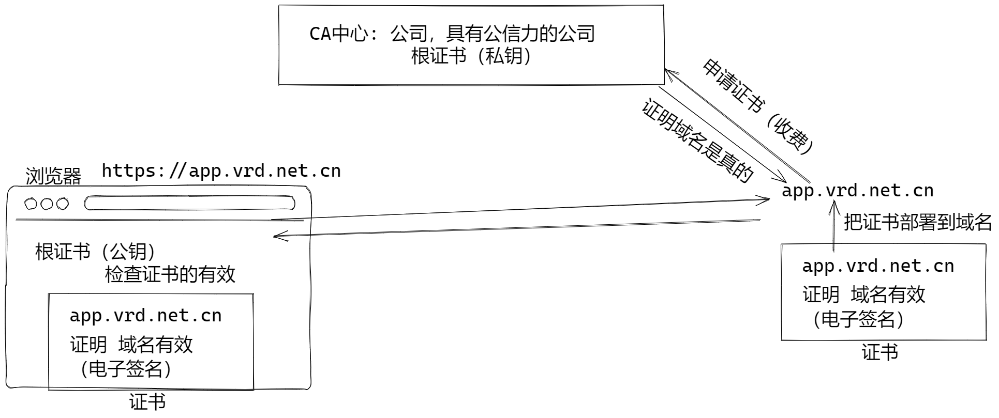
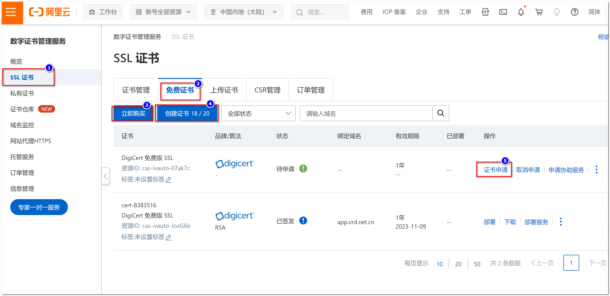
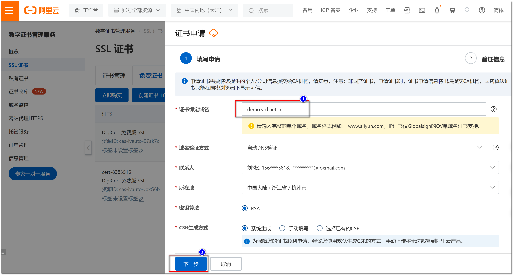
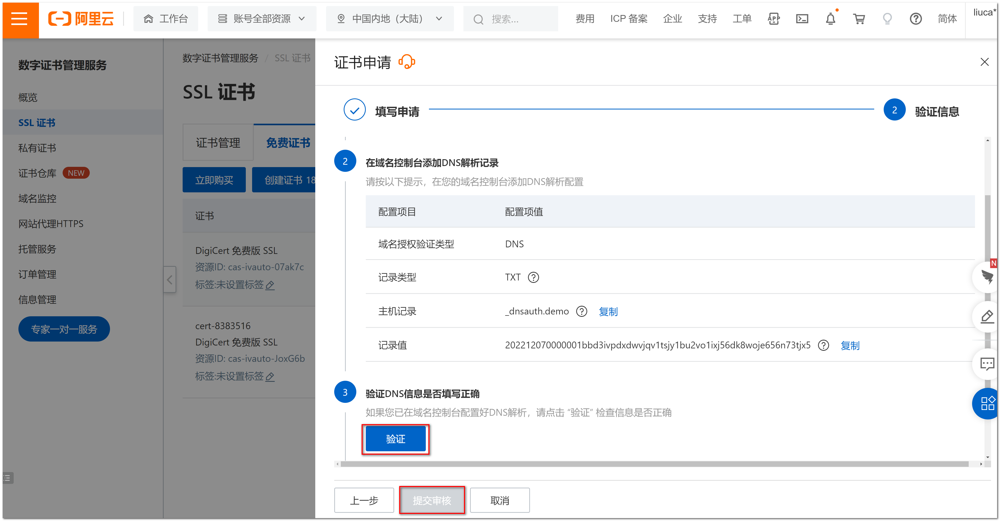

#  快速就业课程

## Nginx 配置 HTTPS 虚拟机

证书的原理：



HTTPS = HTTP + SSL（加密）

HTTP 的 默认端口：80

HTTPS 的默认端口：443

SSH 的端口

HTTPS 通信之前，必须为域名申请证书：从CA公司（CA中心）为域名申请证书：

- 泛域名证书： *.canglaoshi.org证书， 可以证明 demo.canglaoshi.org,  test.canglaoshi.org  ...
- 单域名证书:  demo.canglaoshi.org
- 证书的目的是证明，与这个域名通信是可靠的

使用阿里云服务器，请在安全组放开 443 和 80 端口， 还有22端口，22端口是ssh端口。

**申请免费证书** 








申请成功后，下载证书

下载Nginx版本的证书：8965106_demo.vrd.net.cn_nginx.zip

### 为nginx配置证书

上载证书文件，上传到 /root/文件夹。

在/etc/nginx/文件夹中创建新文件夹 cert 

```sh
mkdir /etc/nginx/cert
```

进入文件夹，释放zip文件：

```sh
cd /etc/nginx/cert
unzip ~/8965106_demo.vrd.net.cn_nginx.zip  # unzip 释放zip文件夹 ~/ 主目录
```

证书文件名太丑了，需要改名：

```sh
mv 8965106_demo.vrd.net.cn.pem demo.vrd.net.cn.pem
mv 8965106_demo.vrd.net.cn.key demo.vrd.net.cn.key
```

创建虚拟机配置文件, demo_vrd.conf:

```sh
cd /etc/nginx/conf.d
vim demo_vrd.conf
```

```nginx
server {
	listen 443 ssl;              # https 默认端口是 443， ssl表示启用ssl加密协议
    server_name demo.vrd.net.cn; # 虚拟机域名必须和证书域名一致！
    index index.html;
    
    ## 配置证书 
    ssl_certificate cert/demo.vrd.net.cn.pem;  
    ssl_certificate_key cert/demo.vrd.net.cn.key; 
    ## 证书参数
    ssl_session_timeout 5m;
    ssl_ciphers ECDHE-RSA-AES128-GCM-SHA256:ECDHE:ECDH:AES:HIGH:!NULL:!aNULL:!MD5:!ADH:!RC4;
    ssl_protocols TLSv1.1 TLSv1.2 TLSv1.3; 
    ssl_prefer_server_ciphers on;
    
    location / {
        root /opt/demo;
    }
}
```

测试并且重启Nginx:

```sh
nginx -t
nginx -s reload
systemctl start nginx
```

阿里云的服务器安全组，必须开放443端口！

客户端， 修改hosts文件，解析 demo.vrd.net.cn 域名：

```ini
37.10.110.101  demo.vrd.net.cn
```

使用浏览器测试 https://demo.vrd.net.cn

## 部署his系统

HIS 项目 Git:  https://gitee.com/robin_home/HIS.git 

使用Git命令下载(克隆)：

```sh
git clone https://gitee.com/robin_home/HIS.git 
```

设置github用户信息：

```sh
git config --global user.name=RobinHood
git config --global user.email=xxxxx.gmail.com
```

### 部署his-web

客户端打包步骤：

- 必须安装 node js 16

- 替换Node js 仓库

  ```sh
  //本次从淘宝仓库源下载
  npm --registry=https://registry.npm.taobao.org install
  ```

- 在 his-web 文件夹中安装依赖包：

  ```sh
  cd HIS-web      # 进入 his-web 文件夹
  npm install     # 安装下载 依赖包， 时间比较长
  ```

  回显结果, 太多，略去...

- 编译， 编译后生成 dist 文件夹，文件夹中就是编译以后的静态网站

  ```sh
  npm run build:prod   # build:prod 来自package.json 文件
  ```

  编译期间信息,  太多，略去...

- 打包为 zip 并且上传到服务器, 可以使用我们提供的 dist.zip

  ```sh
  scp dist.zip root@39.107.11.107:.
  ```

在服务器上部署：

创建 文件夹 /opt/his/web

```sh
mkdir /opt/his/web
```

将dist文件释放到  /opt/his/web

```sh
cd /opt/his/web 
unzip ~/dist.zip   # 释放dist.zip 文件，释放后文件夹 dist
mv dist/* .        # 将dist文件夹的内容移动到当前目录（/opt/his/web ）
rm -r dist         # 将没有用的 dist 文件夹删除
```

配置nginx虚拟机，发布/opt/his/web 到域名: app.vrd.net.cn

在 /etc/nginx/conf.d文件夹中添加 his-web.conf 文件, 与demo_vrd.conf类似所以复制后修改文件：

```sh
cd /etc/nginx/conf.d
cp demo_vrd.conf his-web.conf
vim his-web.conf
```

```nginx
server {
	listen 443 ssl;              # https 默认端口是 443， ssl表示启用ssl加密协议
    server_name app.vrd.net.cn;  # 虚拟机域名必须和证书域名一致！
    index index.html;
    
    ## 配置证书 
    ssl_certificate cert/app.vrd.net.cn.pem;  
    ssl_certificate_key cert/app.vrd.net.cn.key; 
    ## 证书参数
    ssl_session_timeout 5m;
    ssl_ciphers ECDHE-RSA-AES128-GCM-SHA256:ECDHE:ECDH:AES:HIGH:!NULL:!aNULL:!MD5:!ADH:!RC4;
    ssl_protocols TLSv1.1 TLSv1.2 TLSv1.3; 
    ssl_prefer_server_ciphers on;
    
    location / {
        root /opt/his/web;
    }
}
```

上传证书到 /etc/nginx/cert 略去

客户端配置:

客户端配置hosts文件，解析域名 app.vrd.net.cn

```ini
39.101.77.127 app.vrd.net.cn
```

使用浏览器测试： https://app.vrd.net.cn 

## 安装RabbitMQ

### 安装仓库

最好更新一下yum组件：

```sh
yum update -y     # 更新一下系统
reboot            # 重新启动服务器
```

RabbtiMQ 需要先安装Erlang 和 RabbitMQ仓库源：

```sh
yum install epel-release curl -y
curl -s https://packagecloud.io/install/repositories/rabbitmq/rabbitmq-server/script.rpm.sh | bash
curl -s https://packagecloud.io/install/repositories/rabbitmq/erlang/script.rpm.sh | bash
```

> 安装后在 /etc/yum.repo.d/文件夹中包含了 rabbitmq 的仓库配置文件

### 安装 Erlang RabbitMQ

安装

```sh
yum install rabbitmq-server -y
```

启动：

```sh
systemctl start rabbitmq-server     # 启动RabbitMQ
systemctl stop rabbitmq-server      # 关闭RabbitMQ
systemctl restart rabbitmq-server   # 重新启动RabbitMQ
systemctl enable rabbitmq-server    # 设置开机自动启动RabbitMQ
systemctl disable rabbitmq-server   # 关闭自动启动RabbitMQ
systemctl status rabbitmq-server    # 检查RabbitMQ状态
```

检查状态的结果：

```sh
[root@demo ~]# systemctl status rabbitmq-server
● rabbitmq-server.service - RabbitMQ broker
   Loaded: loaded (/usr/lib/systemd/system/rabbitmq-server.service; enabled; >
   Active: active (running) since Thu 2022-11-17 20:07:42 CST; 50s ago
 Main PID: 2661 (beam.smp)
    Tasks: 25 (limit: 22449)
   Memory: 98.4M
   CGroup: /system.slice/rabbitmq-server.service
           ├─2661 /usr/lib64/erlang/erts-13.1.1/bin/beam.smp -W w -MBas ageff>
           ├─2675 erl_child_setup 32768
           ├─2702 /usr/lib64/erlang/erts-13.1.1/bin/epmd -daemon
           ├─2725 /usr/lib64/erlang/erts-13.1.1/bin/inet_gethost 4
           ├─2726 /usr/lib64/erlang/erts-13.1.1/bin/inet_gethost 4
           └─2729 /bin/sh -s rabbit_disk_monitor
```

如果提示 erlang 版本问题，请先删除 erlang 在安装rabbitmq-server：

```sh
yum remove erlang -y
yun install rabbitmq-server -y
```

### 配置RabbitMQ

创建管理员 admin：

```sh
rabbitmqctl add_user admin
```

按照提示输入密码： hisadmin

```sh
Adding user "admin" ...
Password: 
```

分配管理员权限给admin用户：

```sh
rabbitmqctl set_user_tags admin administrator
```

检查用户列表：

```sh
rabbitmqctl list_users
```

显示信息：

```sh
Listing users ...
user	tags
admin	[administrator]
guest	[administrator]
```

添加vhost:

```sh
rabbitmqctl add_vhost /his
```

检查 vhost 

```sh
rabbitmqctl list_vhosts
```

显示：

```sh
Listing vhosts ...
name
/
/his
```

为admin用户添加vhost的权限：

```sh
rabbitmqctl set_permissions -p /his admin ".*" ".*" ".*"
```

## 安装Elasticsearch

不能安装最新版本， HIS项目使用的Elasticsearch 6.8.0:
从清华镜像下载 Elasticsearch-6.8.0.rpm

```sh
wget https://mirrors.tuna.tsinghua.edu.cn/elasticstack/6.x/yum/6.8.0/elasticsearch-6.8.0.rpm
```

下载ik分词器

```sh
wget https://github.com/medcl/elasticsearch-analysis-ik/releases/download/v6.8.0/elasticsearch-analysis-ik-6.8.0.zip
```

安装elasticsearch-6.8.0.rpm

```sh
yum localinstall -y elasticsearch-6.8.0.rpm
```

安装分词插件：

```sh
cd /usr/share/elasticsearch/plugins
mkdir ik
cd ik
unzip ~/elasticsearch-analysis-ik-6.8.0.zip
cd ..
chown elasticsearch:elasticsearch ik -R         # 修改ik文件夹的拥有者为elasticsearch 
```

启动：

```sh
systemctl start elasticsearch
```

检查：

```sh
curl localhost:9200
```

### 如何判断下载的文件是完整的

利用文件再要比较文件的完整性，摘要一样，文件就是一样的

下载华为的 elasticsearch-6.8.0.rpm:

```sh
wget https://repo.huaweicloud.com/elasticsearch/6.8.0/elasticsearch-6.8.0.rpm
```

下载文件的对应摘要：

```sh
wget https://repo.huaweicloud.com/elasticsearch/6.8.0/elasticsearch-6.8.0.rpm.sha512
```

下载了清华的 elasticsearch-6.8.0.rpm:

```sh
wget https://mirrors.tuna.tsinghua.edu.cn/elasticstack/6.x/yum/6.8.0/elasticsearch-6.8.0.rpm
```

> 因为问题同名， 后下载的文件被自动改名为 elasticsearch-6.8.0.rpm.1

sha512sum命令计算文件的摘要：

```sh
sha512sum elasticsearch-6.8.0.rpm  elasticsearch-6.8.0.rpm.1
```

计算结果：

```sh
3c31978bb14ab941e22b9a054316acc3ffc144788a0fb8181b1928be3a3a0a9c5e463cebd99235fc30baf3c58ec20da26e0f6f01d5047d6ea011825e7dbd5c53  elasticsearch-6.8.0.rpm
64ae903accc35b391b417d2ff8cdc1be8f7c8a4610051024674f353ad1cbecc9cbb0777c575093d5450edf5a36d40812845fe1e7115cdd0b28fdeec95ec5256a  elasticsearch-6.8.0.rpm.1
```

查看 elasticsearch-6.8.0.rpm.sha512 的内容：

```sh
cat elasticsearch-6.8.0.rpm.sha512 
```

结果：

```
64ae903accc35b391b417d2ff8cdc1be8f7c8a4610051024674f353ad1cbecc9cbb0777c575093d5450edf5a36d40812845fe1e7115cdd0b28fdeec95ec5256a  elasticsearch-6.8.0.rpm
```

上述结果说明  elasticsearch-6.8.0.rpm.sha512  和清华镜像文件摘要一样，清华镜像是正确的文件！


