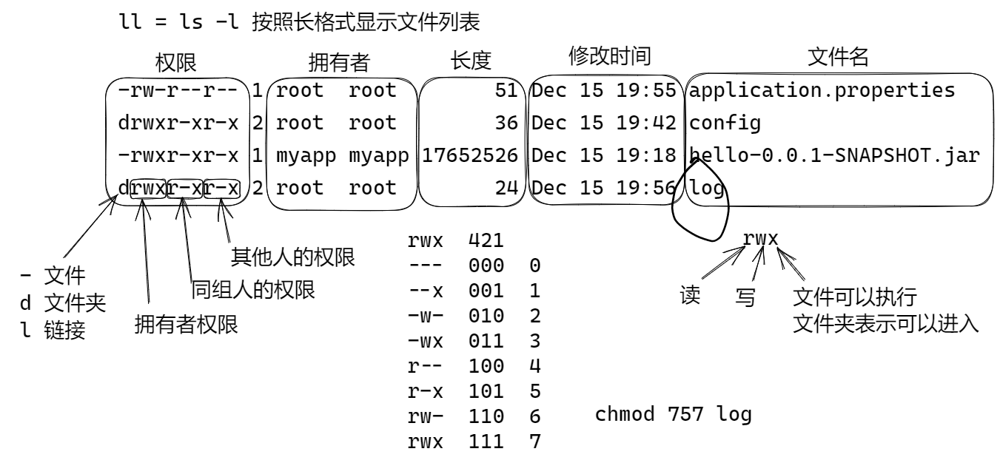

# Unit09 快速就业课程

## 将Spring Boot 应用部署为Linux服务

1. 添加用户 启动服务的用户，
2. SpringBoot应用创建一个目录，方便管理配置
3. 配置服务启动文件

添加用户 启动服务的用户

```sh
useradd myapp
```

创建目录, 将jar文件复制到这个目录中

```sh
mkdir /opt/myapp
cp hello-0.0.1-SNAPSHOT.jar /opt/myapp
```

设置权限：

```sh
cd /opt
chown myapp:myapp myapp -R         # 设置文件的拥有者
cd myapp                           
chmod 755 hello-0.0.1-SNAPSHOT.jar  # 为文件添加执行权限
```

添加服务配置配置文件： /etc/systemd/system/myapp.service

```ini
[Unit]
Description=myapp
After=syslog.target

[Service]
User=myapp
ExecStart=/opt/myapp/hello-0.0.1-SNAPSHOT.jar
SuccessExitStatus=143

[Install]
WantedBy=multi-user.target
```

管理服务：

```sh
systemctl start myapp    # 启动服务
systemctl stop myapp     # 关闭服务
systemctl restart myapp  # 重新启动
systemctl enable myapp   # 设置自动启动
systemctl disable myapp  # 关闭自动启动
systemctl status myapp   # 检查服务状态
```

## 在外部配置 Spring Boot 应用

Spring Boot 可以在外部配置，配置规则：

1. 启动程序当前目录中config文件夹中的配置文件
2. 启动程序当前目录的中的配置文件 
3. 启动程序的classpath：config 包中的配置文件
4. classpath 根目录中的配置文件

实验：

```
/opt/myapp
  - hello-0.0.1-SNAPSHOT.jar (server.port=8080)
  - application.properties 
     - server.port=8090    # 配置文件内容
  - config
     - application.properties 
       - server.port=8099  # 配置文件内容
```

重新启动服务，使用curl 测试。

## Linux 文件权限



改变文件的拥有者：

```sh
chown 用户:组 文件 -R 
chown myapp:myapp log -R   # 将log文件的拥有者设置为 myapp， -R表示递归处理全部子项
```

改变权限

```sh
chmod +权限/-权限 文件/文件夹
chmod +x hello.jar    # 为文件添加执行权限
chmod -x hello.jar    # 为文件减少执行权限
chmod 755 hello.jar   # 为文件设置 rwxr-xr-x 权限
```


