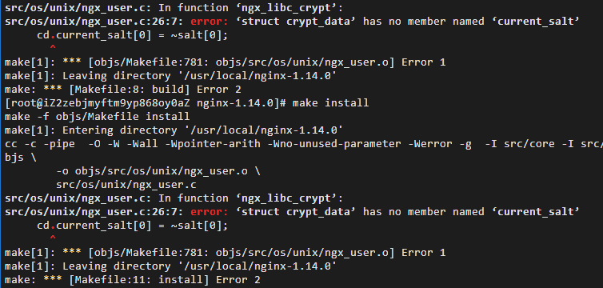
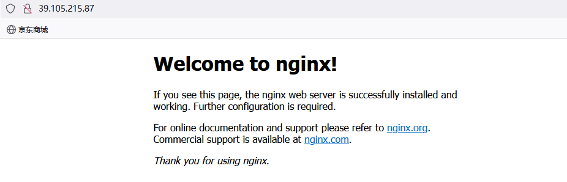
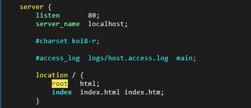

# 部署Nginx

#### 1.安装依赖和相关库：

```sh
yum -y install gcc-c++ zlib-devel openssl-devel libtool
```

#### 2.下载nginx安装包并解压

```sh
cd /usr/local # 定位目录
wget http://nginx.org/download/nginx-1.14.0.tar.gz # 拉取
tar -zxvf nginx-1.14.0.tar.gz # 解压
```

#### 3.配置和安装

```sh
cd nginx-1.14.0
./configure --prefix=/usr/local/nginx # 或者直接./configure进行编译
make # 安装
```

#### 4.安装时的问题：



解决办法：

##### 1.编辑配置：删除`-werror`代码(意思是将警告当做错误来看待)

```sh
vim /usr/local/nginx-1.14.0/objs/Makefile
```

```sh
CC =    cc
CFLAGS =  -pipe  -O -W -Wall -Wpointer-arith -Wno-unused-parameter -werror -g
CPP =   cc -E
LINK =  $(CC)
```

##### 2.编辑配置

```sh
vim /usr/local/nginx-1.14.0/src/os/unix/ngx_user.c
```

```sh
#ifdef __GLIBC__
    /* work around the glibc bug */
    /*cd.current_salt[0] = ~salt[0];*/ # 默认打开，需要进行注释
#endif
```

#### 5.检查是否安装成功

```sh
make install
```

```sh
whereis nginx # 查看nginx位置

# nginx: /usr/local/nginx
```

#### 6.进入nginx

```sh
cd /usr/local/nginx
```

#### 7.启动nginx

```sh
ls  #在nginx目录
#  conf  html  logs  sbin
```

```sh
./nginx # 启动nginx 没有报错即为成功~！
```

#### 8.开放防火墙80端口

```sh
firewall-cmd --list-ports # 查看端口开放情况
firewall-cmd --zone=public --add-port=80/tcp --permanent # 开放80端口
service firewalld restart # 重启防火墙
```

#### 9.访问服务器IP+80进行测试



------

## Nginx常用命令及配置

#### 1.常用命令：

##### 1.查看nginx位置

```sh
whereis nginx
```

##### 2.启动nginx

```sh
./nginx
nginx -s reload          # nginx 热启动
systemctl restart nginx  # nginx 冷启动
```

##### 3.停止nginx

```sh
./nginx -s stop
```

##### 4.安全退出nginx

```sh
./nginx -s quit
```

##### 5.重启配置文件

```sh
./nginx -s reload
```

##### 6.查看nginx的进程

```sh
ps aux|grep nginx
```

#### 2.修改配置

##### 1.找到nginx.conf文件

```sh
cd /usr/local/nginx/conf
```

##### 2.编辑nginx.conf文件

```sh
vim nginx.conf
```



##### 3.到sbin目录重启nginx配置（一定要到sbin目录）

```sh
cd /usr/local/nginx/sbin # 到sbin目录
./nginx -s reload  #重启配置
```

> #### 备注：如果修改后的端口号没有添加到防火墙策略，一定要进行添加或者关闭防火墙。

##### 4.访问生效，修改成功！