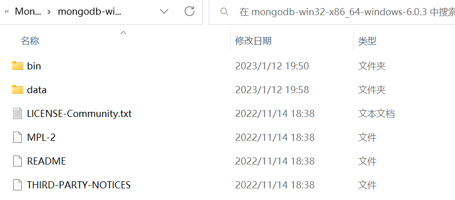
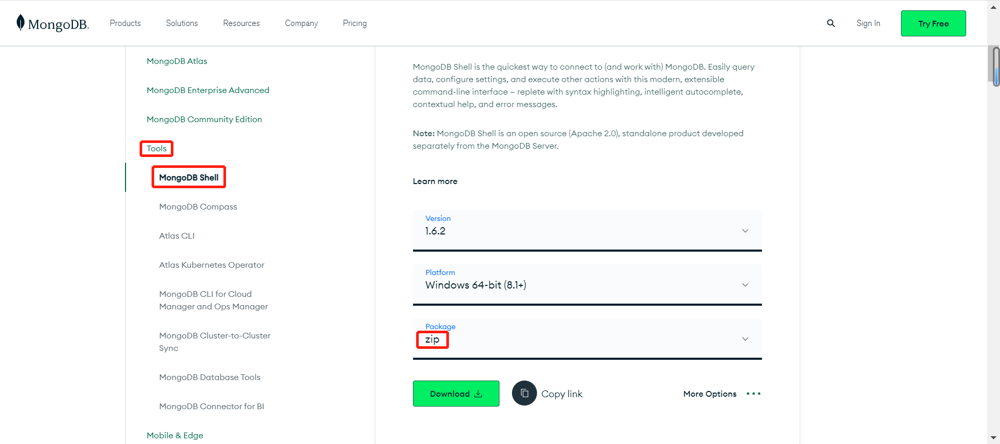
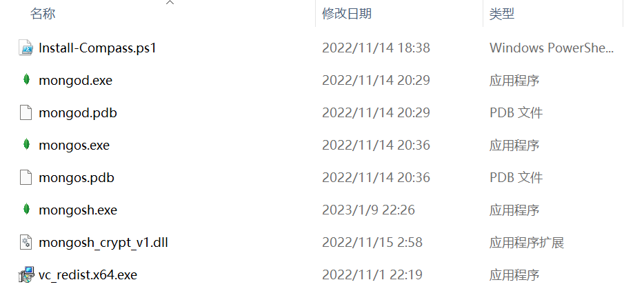
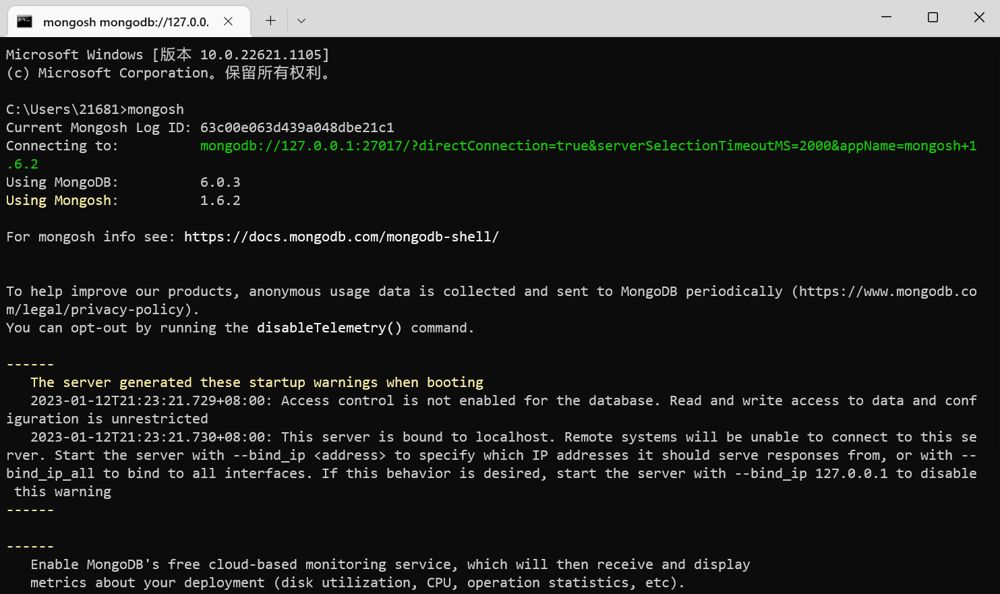

# 安装MongoDB

### 1.下载安装包

MongoDB提供了可用于32位和64位系统的预编译二进制包，可以从MongoDB官网下载安装，MongoDB预编译下载地址：

https://www.mongodb.com/try/download/community


根据上图所示下载zip包。

**提示：版本的选择**：

MongoDB的版本命名规范如：x.y.z

y为奇数时表示当前版本为开发版，如：1.5.2、4.1.13

y为偶数时表示当前版本为稳定版，如：1.6.3、4.0.10

z是修正版本号，数字越大越好。

### 2.解压安装

将压缩包解压到一个目录中。

在解压目录中，手动建立一个目录用于存放数据文件，如data/db



### 3.启动

#### 方式一：命令行参数方式启动服务

在bin目录中打开命令行提示符，输入如下命令：

```sh
D:\MongoDB\mongodb-win32-x86_64-windows-6.0.3\bin>mongod --dbpath=..\data\db # dbpath是数据存放的位置
```

启动信息中可以看到，MongoDB的默认端口是27017，如果我们想改变默认的启动端口可以通过`--port`来指定端口。

**为了方便我们每次启动，可以将安装目录的bin目录设置到环境变量的path中**，`bin`目录下是一些常用命令，比如MongoDB启动服务用的，MongoDB客户端连接服务用的，

#### 方式二：配置文件方式启动服务（部署需要用）

在解压目录中新建`config`文件夹，该文件夹中新建配置文件`mongod.conf`,内容参考如下：

```yaml
storage:
  #The directory where the mongod instance stores its data.Default Value id "\data\db" on Windows.
  dbPath: D:\MongoDB\mongodb-win32-x86_64-windows-6.0.3\data\db
```

【注意】

**1）配置文件中如果使用双引号，比如路径地址，自动会将双引号的内容转义。如果不转义，则会报错：**

```sh
error-parsing-yaml-config-file-yaml-cpp-error-at-line-3-column-15-unknown-escape-character-d
```

解决：

a.对`\`换成`/`或`\\`

b.如果路径中没有空格，则无需加引号。

**2）配置文件中不能以Tab分割字段**

解决：

将其转换成空格。

**命令启动**：

```sh
mongod -f ..\config\mongod.conf
或
mongod --config ..\config\mongod.conf
```

更多参数配置：

```yaml
systemLog:
	destination: file
	#The path of the log file to which mongod or mongos 	
	#should send all diagnostic logging information
	path: "D:/02_Server/DBServer/mongodb-win32-x86_64-2008plus-ssl-4.0.1/log/mongod.log"
	logAppend: true
storage:
	journal:
		enabled: true
#The directory where the mongod instance stores its data.Default Value is "/data/db".
	dbPath: "D:/02_Server/DBServer/mongodb-win32-x86_64-2008plus-ssl-4.0.1/data"
net:
#bindIp: 127.0.0.1
	port: 27017
setParameter:
	enableLocalhostAuthBypass: false
```

### 4.连接MongoDB

#### 方式一：通过Shell命令连接

**下载MongoDB Shell**



将Mongosh的bin目录的两个文件复制到MongoDB的bin目录下：


**复制**：



先将MongoDB的bin目录配置到本机的环境变量path里

**输入命令**：

```sh
mongosh
```



连接成功！