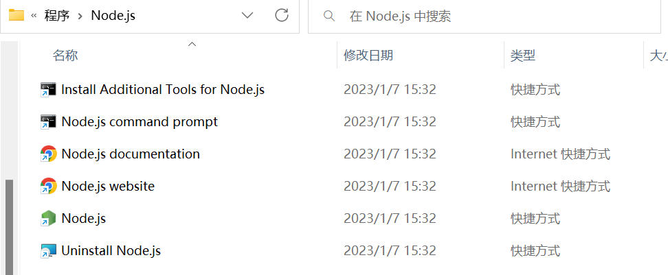

# 安装NodeJs

### 1.进入官网进行下载

中文官网：https://nodejs.org/zh-cn/


Windows版本：

https://nodejs.org/en/download/

### 2.下载并解压

放置到指定能找到的目录

### 3.配置环境变量

在Path变量中添加nodejs文件夹的路径

例如：D:\nodejs\   即可！

### 4.测试

打开Dos窗口

```sh
npm -v
node -v
```

### 5.配置npm源

nmp源（即npm仓库，称之为：registry）默认是境外服务器，在国内使用时，访问速度较慢，通常，

在初次使用时，应该将npm源更换为国内的服务器地址，例如使用 https://registry.npmmirror.com

作为npm源。

配置npm源的命令如下：

```sh
npm config set registry https://registry.npmmirror.com
```

当配置成功后，可通过`get`命令查看npm源：

```sh
npm config get registry
```

### 6.`install`加载依赖

首先**以管理员身份**打开windows终端

输入命令：

```sh
C:\Windows\System32>npm install
```

不出错即加载完毕！

**如果出错找不到文件**：

1.初始化项目：

```sh
npm init -f
# -f表示force
# 直接-f，npm帮你初始化package.json，并填充各种默认值，省事。
```

2.安装依赖：

```sh
npm install formidable --save
# --save表示将安装的包加入依赖列表的意思，可以看下package.json 里的dependencies字段。后面再运行 npm install，就会把所有依赖安装下来。如果不加--save，什么都不会安装。
```

### 7.安装Vue/cli

```sh
npm install -g @vue/cli
```

> 如果遇到network timeout 网络超时，可以再执行一次！

安装完成后，输出命令：

```sh
vue -V  # 检查是否安装成功
```

## $卸载NodeJs

如果因为版本不兼容的问题想要卸载当前版本的NodeJs时：

1. 先卸载对应的安装包以及环境变量

2. 如果安装时的图形界面出现：

   ```sh
   a later version of Node.js already installed Setup will now exit
   ```

3. 进入目录：

   ```sh
   C:\ProgramData\Microsoft\Windows\Start Menu\Programs\Node.js
   ```

   

4. 点击Uninstall Node.js确认卸载即可！
