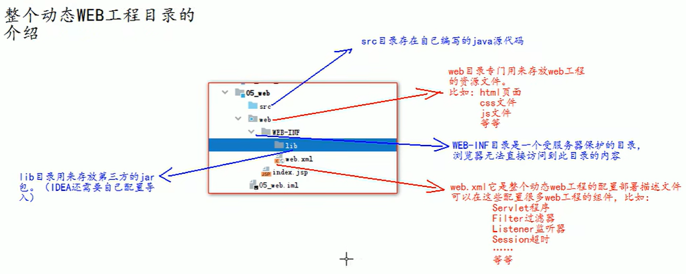

# 安装Tomcat


### 1.打开Tomcat官网下载

地址：https://tomcat.apache.org/

国外网站，下载较慢！

> 市面上企业常用的版本 7.* / 8.*

### 2.下载到指定目录，解压缩


### 3.启动Tomcat服务

找到Tomcat目录下的bin目录下的startup.bat文件，双击就可以启动Tomcat服务器

### 4.测试启动

打开浏览器，地址栏输入地址测试：

1. http://localhost:8080
2. http://127.0.0.1:8080
3. http://本机IP：8080


**1.常见的启动失败的情况有**：

双击startup.bat文件，就出现一个小黑窗口一闪而过，这时，失败的原因基本上都是因为没有配置好JAVA_HOME环境变量导致

**2.常见的JAVA_HOME配置错误有一下几种情况**：

1. JAVA_HOME必须全部大写
2. JAVA_HOME中间必须是英文下划线
3. JAVA_HOME配置的路径只需要到jdk的安装目录即可，不需要带上bin目录

##### 另一种启动Tomcat的方式(命令行)：

1. 打开cmd窗口

2. cd到Tomcat的bin目录下

3. 输入命令：

   ```sh
   catalina run
   ```

4. 运行成功!

   ```sh
   D:\devtools\java_install\apache-tomcat-8.5.84\bin>catalina run
   Using CATALINA_BASE:   "D:\devtools\java_install\apache-tomcat-8.5.84"
   Using CATALINA_HOME:   "D:\devtools\java_install\apache-tomcat-8.5.84"
   Using CATALINA_TMPDIR: "D:\devtools\java_install\apache-tomcat-8.5.84\temp"
   Using JRE_HOME:        "D:\Java\1.8"
   Using CLASSPATH:       "D:\devtools\java_install\apache-tomcat-8.5.84\bin\bootstrap.jar;D:\devtools\java_install\apache-tomcat-8.5.84\bin\tomcat-juli.jar"
   Using CATALINA_OPTS:   ""
   ......
   ```

### 5.停止Tomcat

1. 点击tomcat服务器的窗口x关闭
2. 在当前启动tomcat服务的窗口`ctrl + c`
3. 到tomcat的bin目录下，再次双击shutdown.bat

## 拓展：

### 1.修改Tomcat配置

进入tomcat的conf目录的server.xml文件

修改端口：

```sh
<Connector port="8080" protocol="HTTP/1.1"
               connectionTimeout="20000"
               redirectPort="8443" />
```

修改端口后需要重启Tomcat服务器！

### 2.访问tomcat下的web工程

##### 第一种方式：

将web工程放在webapps目录下的工程目录即可


输入网址：http://localhost:8080/工程目录即可！


##### 第二种方式(相对灵活)：

来到该目录：

```sh
D:\devtools\java_install\apache-tomcat-8.5.84\conf\Catalina\localhost
```

添加xml文件(可以访问任意目录的项目,通常一个项目一个)：

```sh
<--Context是工程的上下文 
   path是访问路径
   docBase是工程的目录
-->
<Context path="/abc" docBase="D:\book" /> # 标签内容
```


### 3.在IDEA中整合Tomcat服务器

添加配置：


项目使用：


下一步（选择JavaEE8的规范）：


目录介绍（演示版本较低但内容相近）：


