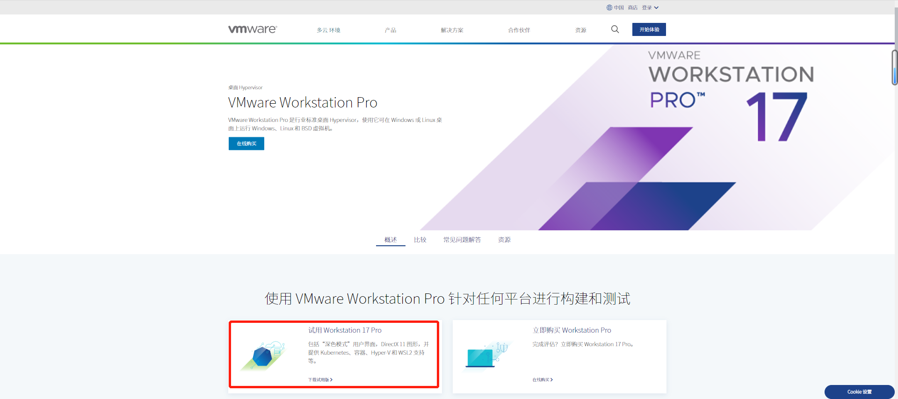
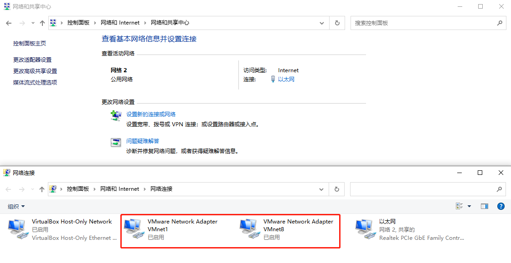
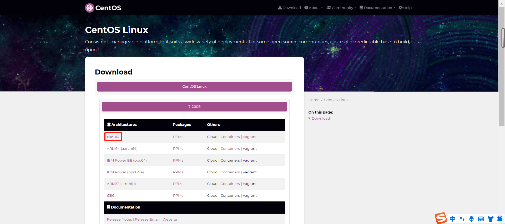
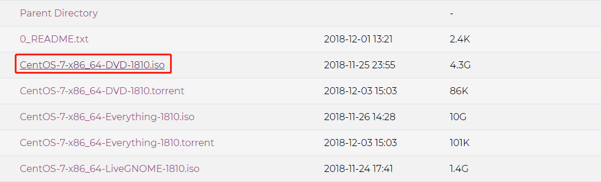
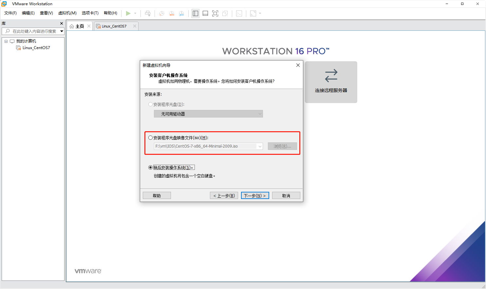

# 安装VMware虚拟机

## 百科概述：

#### _虚拟机是虚拟化技术的一种！_

虚拟机（Virtual Machine）指**通过软件模拟的具有完整硬件系统功能的、运行在一个完全隔离环境中的完整计算机系统**。在实体计算机中能够完成的工作在虚拟机中都能够实现。在计算机中创建虚拟机时，需要将实体机的部分硬盘和内存容量作为虚拟机的硬盘和内存容量。每个虚拟机都有独立的[CMOS](https://baike.baidu.com/item/CMOS/428167)、硬盘和操作系统，可以像使用实体机一样对虚拟机进行操作。

## 下载：

**VMware WorkStation**

https://www.vmware.com/cn/products/workstation-pro.html

#### 检验下载是否完成：

图形化：控制面板->网络和Internet->网络和共享中心->更改适配器设置

命令：win+r运行->ncpa.cpl打开网络连接的选项

#### 下载Linux的发行版之一CentOS系统（使用较多）

https://www.centos.org/download/#centos-linux

#### 配置：

##### 1.选择下载的操作系统

##### 2.选择自定义硬件设备（够用即可！）

##### 3.网络适配器改为NAT（默认）

##### 4.启动等待加载即可！

更多可参考：https://blog.csdn.net/SoulNone/article/details/126681722