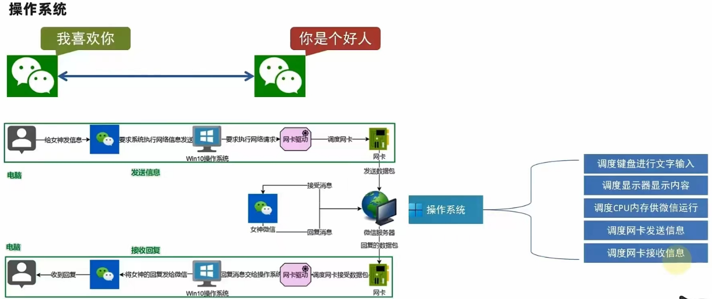
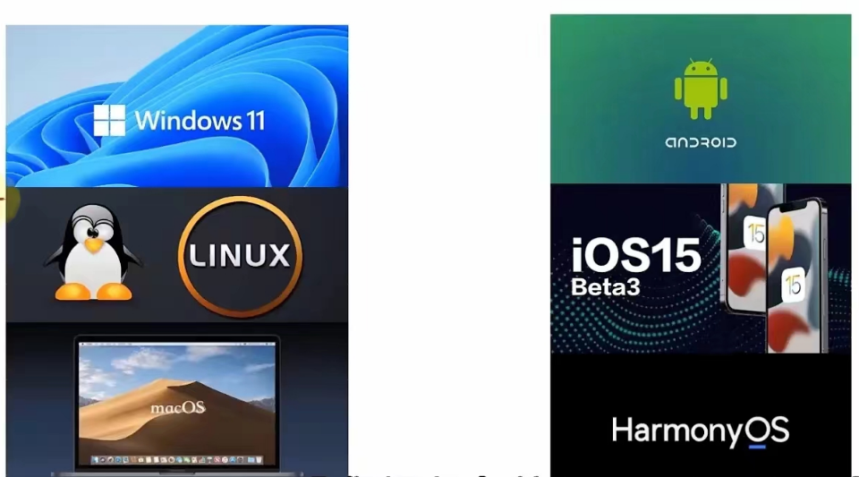

# 操作系统

### 什么是操作系统？

正如前面提到的，在早期想要让计算机执行程序就得要参考一堆硬件功能函数，并且学习机器语言才能够撰写程序。 同时每次写程序时都必须要重新改写，因为硬件与软件功能不见得都一致之故。那如果我能够将所有的硬件都驱动， 并且提供一个发展软件的参考介面来给工程师开发软件的话，那发展软件不就变的非常的简单了？那就是操作系统啦！

#### 总而言之：

操作系统是计算机软件的一种，负责作为用户和计算机硬件之间的桥梁，调度和管理计算机硬件进行工作，计算机没了操作系统，就是一堆无用的塑料

当计算机拥有了操作系统，就相当于与拥有了灵魂，操作系统可以：

- 调度CPU进行工作
- 调度内存进行工作
- 调度硬盘进行数据存储
- 调度网卡进行网络通讯
- 调度音响发出声音
- 调度打印机打印内容
- ......

例如：

目前的操作系统有：

> 左边是个人计算机，右边是移动端设备

### 虚拟机：

学习Linux系统，就需要一个可用的Linux系统。

如何获得？将自己的电脑重装系统为Linux？

NoNo。这不现实，因为Linux系统并不适合日常办公使用

我们通常需要借助虚拟机来获得可用的Linux系统环境进行学习

#### 什么是虚拟机？

通过虚拟化技术，在电脑内，虚拟出计算机硬件，并给虚拟的硬件安装操作系统，即可得到一台虚拟的电脑，称之为虚拟机

#### 为什么要用虚拟机？

我们不能给自己电脑重装系统为Linux，所以通过虚拟机的形式，得到可以用Linux系统环境，供后续学习使用

#### 下载：

文件路径：Java_Important_Notes-WQY\操作系统\Windows操作系统\安装案例\安装VMware虚拟机.md

### 图形化、命令行

对与操作系统的使用，有2种使用方式：

- 图形化页面使用操作系统

- 以命令的形式使用操作系统

不论是Windows还是Linux亦或是MacOS，都是支持这两种使用形式

- 图形化：使用操作系统提供的图形化界面，以获得图形化反馈的形式去使用操作系统。
- 命令行：使用操作系统提供的各类命令，以获得字符反馈的形式去使用操作系统

### 操作系统核心(Kernel)

操作系统(Operating System, OS)其实也是一组程序， 这组程序的重点在於管理计算机的所有活动以及驱动系统中的所有硬件。 我们刚刚谈到计算机没有软件只是一堆废铁，那么操作系统的功能就是让CPU可以开始判断逻辑与运算数值、 让主内存可以开始载入/读出数据与程序码、让硬盘可以开始被存取、让网络卡可以开始传输数据、 让所有周边可以开始运转等等。总之，硬件的所有动作都必须要透过这个操作系统来达成就是了。

上述的功能就是操作系统的核心(Kernel)了！你的计算机能不能做到某些事情，都与核心有关！ 只有核心有提供的功能，你的计算机系统才能帮你完成！举例来说，你的核心并不支持TCP/IP的网络协定， 那么无论你购买了什么样的网卡，这个核心都无法提供网络能力的！

但是单有核心我们使用者也不知道能作啥事的～因为核心主要在管控硬件与提供相关的能力(例如网络功能)， 这些管理的动作是非常的重要的，如果使用者能够直接使用到核心的话，万一使用者不小心将核心程序停止或破坏， 将会导致整个系统的崩溃！因此核心程序所放置到内存当中的区块是受保护的！ 并且开机后就一直常驻在内存当中。

**Tips**:所以整部系统只有核心的话，我们就只能看著已经准备好运作(Ready)的计算机系统，但无法操作他！ 好像有点望梅止渴的那种感觉啦！这个时候就需要软件的帮忙了！

### 系统呼叫(System Call)

计算机系统主要由硬件构成，然后核心程序主要在管理硬件，提供合理的计算机系统资源分配(包括CPU资源、内存使用资源等等)， 因此只要硬件不同(如x86架构与RISC架构的CPU)，核心就得要进行修改才行。 而由於核心只会进行计算机系统的资源分配，所以在上头还需要有应用程序的提供，使用者才能够操作系统的。

为了保护核心，并且让程序设计师比较容易开发软件，因此操作系统除了核心程序之外，通常还会提供一整组开发介面， 那就是系统呼叫层。软件开发工程师只要遵循公认的系统呼叫参数来开发软件，该软件就能够在该核心上头运作。 所以你可以发现，软件与核心有比较大的关系，与硬件关系则不大！硬件也与核心有比较大的关系！ 至於与使用者有关的，那就是应用程序啦！

**Tips: ** 在定义上，只要能够让计算机硬件正确无误的运作，那就算是操作系统了。所以说， 操作系统其实就是核心与其提供的介面工具，不过就如同上面讲的，因为最简单的核心缺乏了与使用者沟通的亲和介面， 所以在目前，一般我们提到的『操作系统』都会包含核心与相关的使用者应用软件呢！

简单的说，上面的图示可以带给我们底下的概念：

- 操作系统的核心层直接参考硬件规格写成， 所以同一个操作系统程序不能够在不一样的硬件架构下运作。举例来说，个人计算机版的Windows XP不能直接在RISC架构的计算机下运作。 所以您知道为何Windows XP又分为32位及64位的版本了吧？因为32/64位的CPU指令集不太相同， 所以当然要设计不同的操作系统版本了。

  

- 操作系统只是在管理整个硬件资源，包括CPU、内存、输入输出装置及档案系统档。 如果没有其他的应用程序辅助，操作系统只能让计算机主机准备妥当(Ready)而已！并无法运作其他功能。 所以你现在知道为何Windows XP上面要达成网页影像的运作还需要类似PhotoImpact或Photoshop之类的软件安装了吧？

  

- 应用程序的开发都是参考操作系统提供的开发介面， 所以该应用程序只能在该操作系统上面运作而已，不可以在其他操作系统上面运作的。 现在您知道为何去购买线上游戏的光盘时，光盘上面会明明白白的写著该软件适合用於哪一种操作系统上了吧？ 也该知道某些游戏为何不能够在Linux上面安装了吧？

### 操作系统与驱动程序

老实说，驱动程序可以说是操作系统里面相当重要的一环了！不过，硬件可是持续在进步当中的！ 包括主机板、显示卡、硬盘等等。那么比较晚推出的较新的硬件，例如显示卡，我们的操作系统当然就不认识罗！ 那操作系统该如何驱动这块新的显示卡？为了克服这个问题，操作系统通常会提供一个开发介面给硬件开发商， 让他们可以根据这个介面设计可以驱动他们硬件的『驱动程序』，如此一来，只要使用者安装驱动程序后， 自然就可以在他们的操作系统上面驱动这块显示卡了。

由上图我们可以得到几个小重点：

- 操作系统必须要能够驱动硬件，如此应用程序才能够使用该硬件功能；
- 一般来说，操作系统会提供开发介面，让开发商制作他们的驱动程序；
- 要使用新硬件功能，必须要安装厂商提供的驱动程序才行；
- 驱动程序是由厂商提供的，与操作系统开发者无关。

所以，如果你想要在某个操作系统上面安装一张新的显示卡，那么请要求该硬件厂商提供适当的驱动程序吧！ ^_^！ 为什么要强调『适当的驱动程序』呢？ 因为驱动程序仍然是依据操作系统而开发的， 所以，给Windows用的驱动程序当然不能使用於Linux的环境下了。

### 应用程序

应用程序是参考操作系统提供的开发介面所开发出来软件，这些软件可以让使用者操作，以达到某些计算机的功能利用。 举例来说，办公室软件(Office)主要是用来让使用者办公用的；影像处理软件主要是让使用者用来处理影音数据的； 浏览器软件主要是让使用者用来上网浏览用的等等。

需要注意的是，应用程序是与操作系统有关系的，如同上面的图示当中的说明喔。因此，如果你想要购买新软件， 请务必参考软件上面的说明，看看该软件是否能够支持你的操作系统啊！举例来说，如果你想要购买线上游戏光盘， 务必参考一下该光盘是否支持你的操作系统，例如是否支持Windows XP/Windows Vista/MAC/Linux等等。 不要购买了才发现该软件无法安装在你的操作系统上喔！

我们拿常见的微软公司的产品来说明。你知道Windows XP, Office 2007之间的关系了吗？

- Windows XP是一套操作系统，他必须先安装到个人计算机上面，否则计算机无法开机运作；
- Windows 98与Windows XP是两套不同的操作系统，所以能在Win 98上安装的软件不见得可在WinXP上安装；
- Windows XP安装好后，就只能拥有很少的功能，并没有办公室软件；
- Office 2007是一套应用程序，要安装前必须要了解他能在哪些操作系统上面运作。