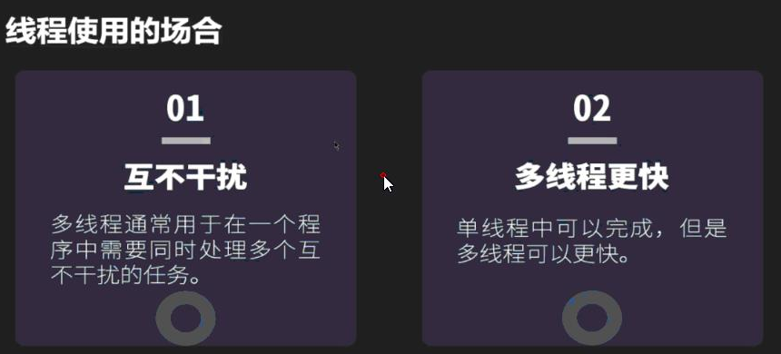
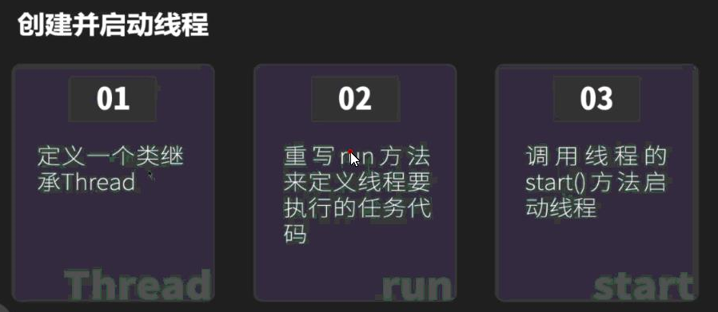
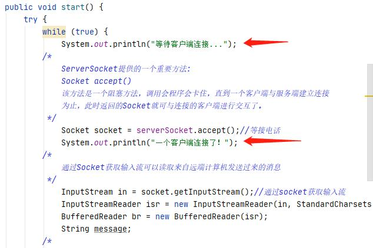
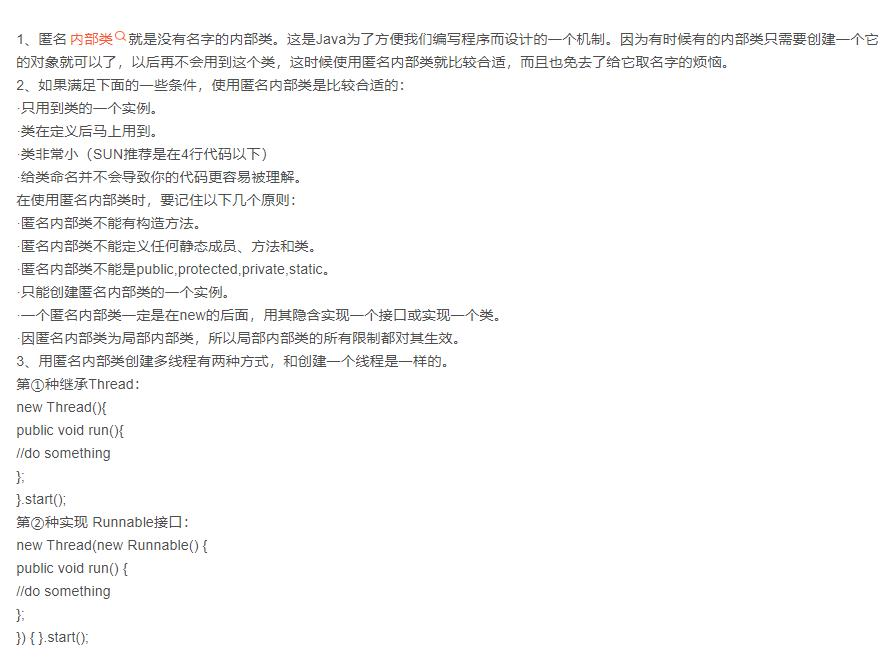
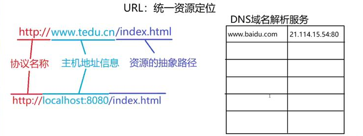
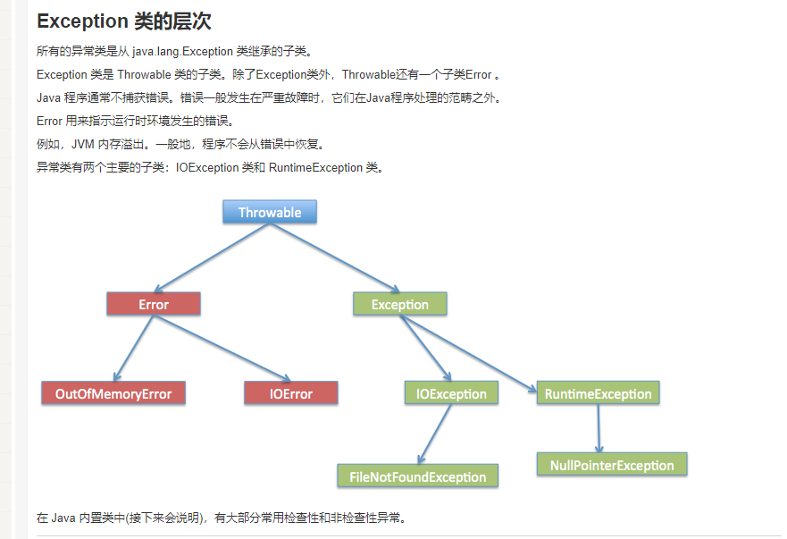
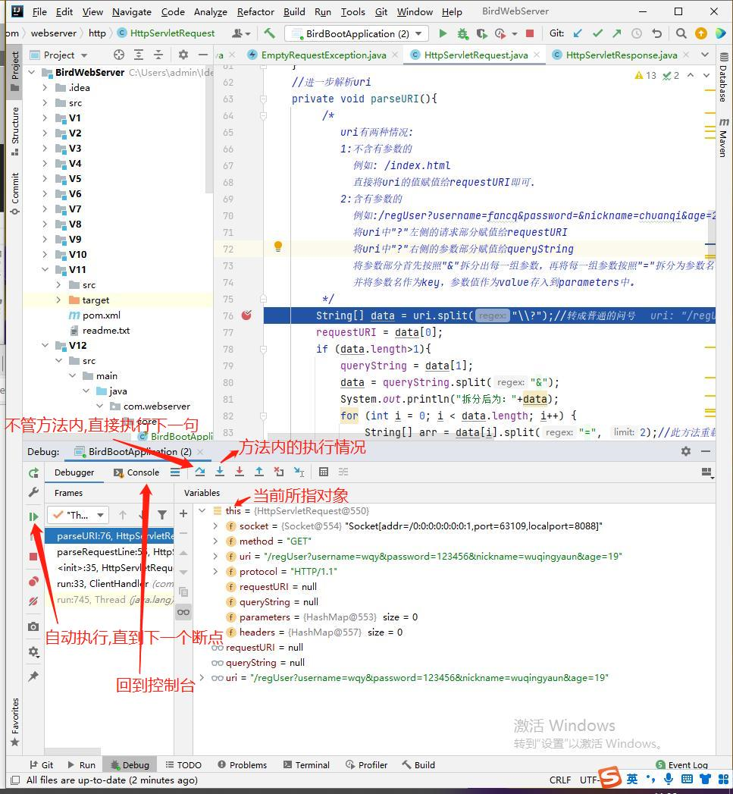
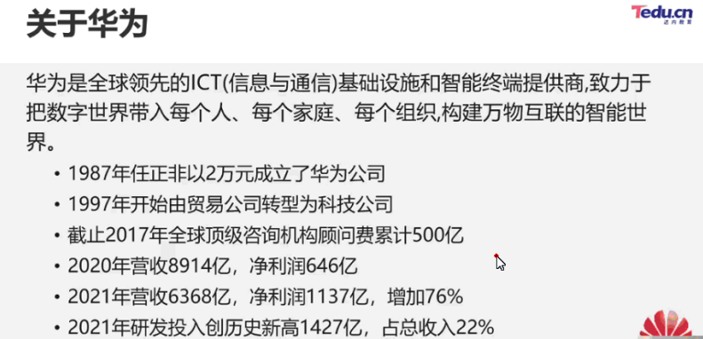
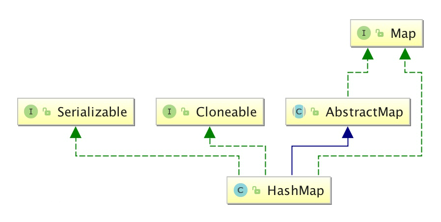

# 8月30日：

#### 1：控制台异常：


#### 2：主动发起连接为客户端

#### 3：Browser/Server，浏览器/服务器模式

#### 4：IP编号：0~65535

#### 5：防火墙：电脑和网络之间的门卫

#### 6：安卓手机底层为Linux系统

#### 7：方法返回什么类型,就用什么类型来接收

#### 8：查询电脑IP：终端——>cmd命令——>ipconfig查询电脑IP

#### 9：IO流与网络传输


#### 10：TCP连接的三次握手和四次挥手


#### 11：IntelliJ IDEA启动程序并列运行


#### 12：通过git命令向远程仓库更新和删除文件

##### 更新：


##### 删除：


# 8月31日：

#### 1：人眼睛观察的极限为30帧

#### 2：线程使用的场合



#### 3：CPU中有逻辑电路和晶体管

#### 4：多核并发,创建并启动线程




#### 5：打桩输出



#### 6:单线程设计


#### 7：run()方法结束,线程声明周期结束，守护线程要等普通线程全部结束后程序结束才能被杀死

#### 8：is开头的方法多半boolean类型

#### 9：内部类的资料



#### 10：集合自定义排序中sort()方法的第二个参数是一个Comparator接口类型,接口不能被实例化,所以创建一个匿名内部类。


# JavaSE的了解：

### Java SE用于开发和部署桌面、服务器以及嵌入设备和实时环境中的Java应用程序，Java SE包括用于开发Java Web服务的类库，同时，Java SE为Java EE提供了基础。

# 9月1日：

#### 1：多个线程同时执行同一块代码称为并发现象

#### 2：线程创建完毕后处于新建状态,调用start()方法后随之执行被重写的run()方法,等待CPU分配完时间片后开始执行

# 9月2日

#### 1：DNS域名解析




#### 2：地址细节处理


#### 3：Git在IDEA中的推送

1：VCS->项目右键->git->add+:

2：VCS->项目右键->git->commit

3：Define remote定义远程


# 9月5日：

#### 1：目录是用来归纳的

#### 2：英文数字符号占一个字节

#### 3：HashSet内部就是HashMap,只是存的时key一列元素

# 9月6日：

#### 1：targer和classes(类加载目录)任意一个类，包的顶层

#### 2:java和resources原代码和资源文件,JVM加载后统一放到classes文件里


#### 3:获取类加载路径

```java
package com.webserver.core
public class ClientHandler{
        public static void main(String[] args) throws URISyntaxException {
        File rootDir = new File( //寻找类加载路径
                ClientHandler.class.getClassLoader()
                        .getResource(".").toURI()
        );
        System.out.println(rootDir);//输出类加载路径
        //定位static目录(static目录下存放的是所有静态资源)
        File staticDir = new File(rootDir,"static");
        System.out.println(staticDir);//输出static目录的全部路径
        //定位static目录下的index.html
        File file = new File(staticDir,"index.html");
        System.out.println("文件是否存在："+file.exists());//true
    }
}
```


#### 4:网页F12打开开发者选项


#### 5:Exception异常的层次



# 9月8日：

#### 1：Debug模式(很实用)



#### 2：内部跳转：当请求路径和看到的页面不同时发生了内部跳转

#### 3：重定向：重定向后页面和路径就会匹配一致

# 9月13日：

#### 1.JDK8新特性lambda、forEach

#### 2：查看一个类的API，按住Ctrl点击类名查看源代码，点击IDEA左侧Project下的Structure可直观呈现所有API

#### 3：ctrl+alt+o删除无用的导包

#### 4：BindException该异常说明有其他程序正在run

#### 5：jar是JAVA的压缩包


## API是预定义的函数：

### ApplicationProgrammingInterface,应用程序编程接口）

#### 是一些预先定义的接口，目的是提供应用程序与开发人员基于某软件或硬件的以访问一组例程的能力，而又无需访问源码，或理解内部工作机制的细节。

# 9月16日：

#### 1：当多种类型数据运算时,会自动向大类型转换


#### 2：当创建对象的时候会自动调用构造方法,一定是先执行超类的静态块再执行派生类的，然后走new的对象的构造方法,若new的派生类或向上造型,则默认先走超类构造方法ABab；若new的超类,则只走超类的静态块和构造方法Aa


#### 3：数据库的重要性：


#### 4：华为云数据库(GaussDB)与MySQL：

#### 5：关于华为HUAWEI



# 9月17日：

#### 1：MySQL中的注意语法

##### a:COUNT()：统计某一字段的数量

##### b:DISTINCT关键字：用于去除指定列重复值的行-

##### c:NVL函数： 用来替换NULL值，NVL(arg1,arg2) 当arg1不为null时则函数返回arg1的值,如果arg1为null则返回arg2的值

#### 2：Switch属于分支结构

# 9月18日：

### 枚举型：

```java
enum  DAY
{
      MON = 1 , TUE, WED, THU, FRI, SAT, SUN
};
```

(1) 枚举型是一个集合，集合中的元素(枚举成员)是一些命名的整型常量，元素之间用逗号,隔开。

(2) **DAY**是一个标识符，可以看成这个集合的名字，**是一个可选项**，即是可有可无的项。

(3) 第一个枚举成员的默认值为整型的0，后续枚举成员的值在前一个成员上加1。

(4) 可以人为设定枚举成员的值，从而自定义某个范围内的整数。

(5) 枚举型是预处理指令#define的替代。

(6) 类型定义以分号;结束。

# 9月19：

#### 1：JAVA的jar包网站：https://mvnrepository.com

#### 2：Driver驱动

#### 3：MySQL端口号：3306

# 9月21日：

### 1:GET和POST是HTTP请求的两种基本方法

#### 最直观的区别就是GET把参数包含在URL中，POST通过request body传递参数。

- ##### GET在浏览器回退时是无害的，而POST会再次提交请求。

- ##### GET产生的URL地址可以被Bookmark(书签收藏)和Share(分享)，而POST不可以。

- ##### GET请求会被浏览器主动cache，而POST不会，除非手动设置。

- ##### GET请求只能进行url编码，而POST支持多种编码方式。

- ##### GET请求参数会被完整保留在浏览器历史记录里，而POST中的参数不会被保留。

- ##### GET请求在URL中传送的参数是有长度限制的，而POST没有。

- ##### 对参数的数据类型，GET只接受ASCII字符，而POST没有限制。

- ##### GET比POST更不安全，因为参数直接暴露在URL上，所以不能用来传递敏感信息。

- ##### GET参数通过URL传递，POST放在Request body(请求体)中。

- ##### Get请求比较快,Post请求较慢

> 以获取数据为主要目的的用Get请求,其余的用Post请求

### 2：

### 404、403、400 、408、305等常见错误代码解析

#### （1）.400-请求无效

##### 说明服务器无法理解用户的请求,除非进行修改,不然你按再多刷新也没有用。很可能的情况是,你不小心输入错误了,导致服务器根本不知道你在表达什么。

#### （2）.403-禁止访问

##### 出现403是因为服务器拒绝了你的地址请求,很有可能是你根本就没权限访问网站,就算你提供了身份验证也没有用。很有可能你被禁止访问了。除非你与Web服务器管理员联系,否则一旦遇到403状态码都无法自行解决。

#### （3）.404-无法找到文件

##### 404其实在日常生活中很常见了。代码的意思是找不到要查询的页面。非常有可能是网页被删除了。

#### （4）.405-请求方式不对,资源被禁止

##### 资源被禁止,有可能是文件目录权限不够导致的。这时候其实,只要赋予"完全控制"的权限,也是可以解决的

#### （5）.408-请求超时

##### 遇到408意味着你的请求发送到该网站花的时间比该网站的服务器准备等待的时间要长，即链接超时。

#### （6）.305-使用代理

##### 这个代码的意思是，你不能直接访问网站，要通过某个代理才能进去。比如，你想要访问一些外网，一定要使用VPN才可以。

### 3：JavaScript

##### JavaScript一种直译式[脚本语言](https://baike.so.com/doc/2874347-3033293.html)，是一种动态类型、弱类型、基于原型的语言，内置支持类型。它的[解释器](https://baike.so.com/doc/5904938-6117840.html)被称为JavaScript引擎，为[浏览器](https://baike.so.com/doc/2920715-3082096.html)的一部分，广泛用于[客户端](https://baike.so.com/doc/4889711-5107810.html)的脚本语言，最早是在HTML（标准通用标记语言下的一个应用）网页上使用，用来给HTML网页增加动态功能。 

##### 在1995年时，由Netscape公司的[Brendan Eich](https://baike.so.com/doc/1830372-1935746.html)，在[网景导航者](https://baike.so.com/doc/5691991-5904691.html)浏览器上首次设计实现而成。因为Netscape与Sun合作，Netscape管理层希望它外观看起来像[Java](https://baike.so.com/doc/2886868-3046592.html)，因此取名为JavaScript。但实际上它的语法风格与Self及[Scheme](https://baike.so.com/doc/6747345-6961891.html)较为接近。

##### 为了取得技术优势，[微软](https://baike.so.com/doc/2130745-2254356.html)推出了[JScript](https://baike.so.com/doc/5458749-5697138.html)，CEnvi推出ScriptEase，与JavaScript同样可在浏览器上运行。为了统一规格，因为JavaScript[兼容](https://baike.so.com/doc/5731854-10416323.html)于ECMA标准，因此也称为[ECMAScript](https://baike.so.com/doc/6950734-7173135.html)。

##### 变量

- JS语言属于弱类型语言,声明变量时不需要指定变量的类型

- 通过let或var声明变量

  - let声明的变量作用域和Java语言类似

  - var声明的变量作用域相当于是全局的,可以在任何地方访问

  - 举例:

    - Java: 

      for(int i=0;i<10;i++){

      ​	int j = i+1;

      }

      int x = i+j;   //i和j超出了作用域    编译报错

    - JS:

      for(let i=0;i<10;i++){

      ​	let j = i+1;

      }

      let x = i+j;     //不报错 但是访问不到i和j  因为超出了作用域

      for(var i=0;i<10;i++){

      ​	var j = i+1;

      }

      var  x = i+j;  //不报错并且可以访问到i和j的值

##### 数据类型

- JavaScript语言中只有对象类型
- 常见的对象类型:

  - number数值:  相当于Java中所有数值类型的总和 
  - string 字符串:   可以用单引号或双引号修饰       
  - boolean布尔值:   true和false 
  - undefined未定义:   当变量只声明不赋值的时候变量的类型和值都为undefined  
- 获取变量类型:      typeof 变量

##### 运算符

- 算术运算符: + - * / %
  - 除法和Java不一样, 会自动根据结果转换整数或小数
    - Java:  int x=5;  int y=2; int z = x/y;  z=2  
    - JS:  let x=5; let y=2;  let z = x/y;   z=2.5    x=6    z=3
- 关系运算符: > < >= <= !=  ==和===
  - ==: 先统一两个变量的类型再比较值    "666"==666     true
  - ===:先比较类型,类型一样后再比较值    "666"==666    false
- 逻辑运算符: && || !     只支持短路与和短路或
- 赋值运算符: =   +=  -=  *=   /=  %=
- 三目运算符:   条件?值1:值2

##### 各种语句

- 各种语句和Java语言基本一致

- if else
- while
- for
- switch case

### 4：ServLet：

#### （ServletRequest和ServletResponse）接口

**Servlet(Server Applet)，全称Java Servlet，未有中文译文。是用[Java](https://baike.so.com/doc/2886868-3046592.html)编写的服务器端程序。其主要功能在于交互式地浏览和修改数据，生成动态Web内容。狭义的Servlet是指Java语言实现的一个接口，广义的Servlet是指任何实现了这个[Servlet接口](https://baike.so.com/doc/7695074-7969169.html)的类，一般情况下，人们将Servlet理解为后者。**

# 9月22日：

### 一.Map没有继承Collection接口

#### Map和Collection是两个不同的接口,没有继承关系!


