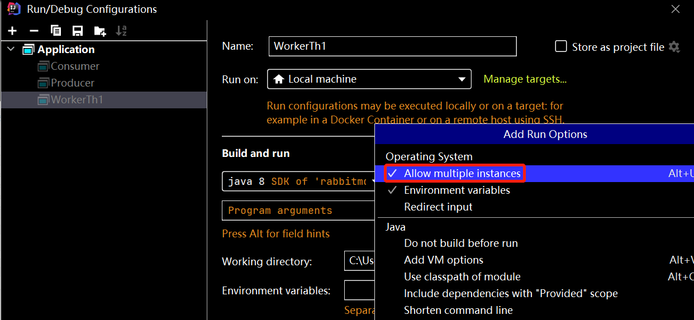

# 2月1日

### 1.Spring事务底层

Spring事务底层是通过数据库事务和AOP动态代理机制实现的

对于使用@Transactional注解的Bean,Spring会创建一个代理对象作为Bean,当调用了代理对象时,先检查是否添加了@Transactional注解:

1. 已添加:利用事务管理器创建一个数据库连接,并且修改autocommit属性为false(手动提交),如果抛出了需要回滚的异常(默认为RuntimeException)就回滚
2. 未添加,不回滚,直接提交

> Spring事务的隔离级别和数据库相同!

### 2.关于数据库char类型

密码password可以使用char类型(定长字符串)

密码通常需要进行加密处理,加密后的长度是固定的,比如:(MD5加密32位)

### 3.锁版本

作用文件pom.xml文件父子依赖中

在我们现在使用maven添加依赖的认知中

有些依赖时必须添加版本号才能执行

有些依赖则不必添加版本号

原因是我们继承的SpringBoot(2.5.9)父项目中,定义了一些常用依赖的版本号

****

如果我们自己编写的父项目想定义我们项目中需要的依赖版本号的话,也是可以实现的

这样做可以统一所有子项目的版本,在更新版本时,只需要修改父项目中定义的版本号即可

父项目的pom文件添加如下内容：

```xml
<!-- 设置当前父项目有哪些子项目(子模块) module就是模块的意思  -->
<modules>
    <module>csmall-stock</module>
</modules>
<!--  在properties标签中,声明需要使用的各个版本号 -->
<properties>
    <java.version>1.8</java.version>
    <!--  这些标签本质就是在定义变量,定义了一个名为mybatis.version值为2.2.2的变量  -->
    <mybatis.version>2.2.0</mybatis.version>
</properties>
<!--下面的标签是用来定义子项目使用依赖时,选用哪个版本号的,也称之为"锁版本"   -->
<!--dependencyManagement标签中的内容,不是添加依赖,而只是指定依赖的版本,子项目真正添加依赖才会生效-->
<dependencyManagement>
    <dependencies>
        <dependency>
            <groupId>org.mybatis.spring.boot</groupId>
            <artifactId>mybatis-spring-boot-starter</artifactId>
            <version>${mybatis.version}</version>
        </dependency>
    </dependencies>
</dependencyManagement>
```

子项目中如果需要mybatis的依赖只需要添加如下内容即可,无需再指定版本号

```xml
<dependency>
    <groupId>org.mybatis.spring.boot</groupId>
    <artifactId>mybatis-spring-boot-starter</artifactId>
</dependency>
```

### 4.RockyLinux

开源，社区拥有和管理、免费的企业Linux发行版，提供强大的生产机平台，可作为CentOS停止维护（改为滚动更新的Stream版）后，RHEL的下游Linux操作系统替代方案，并继承了原CentOS的开源免费的特点。

### 5.工作中代码不同层级包的别名

##### 实体类：

entity/mode/domain/bean/pojo

##### 持久层：

mapper/dao/repository

##### 业务层：

service/biz

##### 控制层：

controller/servlet

### 6.关于远程调用接口`Dubbo`

详情看微服务\Dubbo远程调用部分

### 7.关于Spring-boot的yml/properties配置文件

1. 主配置中是公共配置
2. `spring.profiles.active：`是额外配置文件

### 8.关于任意返回值源码案例

```java
// 这里的泛型T，传入任意对象的反射对象（.class）即可作为返回值
public <T> T getForObject(String url, Class<T> responseType, Object... uriVariables) throws RestClientException {}
```

### 9.关于自定义限流`@SentinelResource`注解

详情看微服务Sentinel流控部分

### 10.解除浏览器下载受限

以Google为例：

地址栏输入：chrome://flags/

选择Parallel downloading后开启**Enabled**

# 2月2日

### 1.SPU和SKU

**SPU（Standard product unit）标准化产品单元**

是商品信息聚合的最小单位，是一组可复用、易检索的标准化信息集合，描述了一个产品的特性。

例如：IPhone7或路虎车就是一个SPU和商家、颜色、款式、套餐都无关！

**SKU（stock keeping unit）库存量单位**

是商品库存进出计量的单位，可以是以件、盒等为单位。

在服装、鞋类商品中使用最多最普遍。例如纺织品的SKU通常表示规格、颜色、款式。

> SPU是标准化产品单元，区分品种；SKU是库存量单位，区分单品；商品特指与商家有关的商品，可对应多个SKU。

# 2月3日：

### 1.IDEA2021新版多次启动一个类



# 2月4日

### 1.Oracle和MySQL的区别

1. Oracle是大型数据库，而MySQL是中小型数据库，MySQL开源，Oracle收费。
2. Oracle的内存占有量非常大，而MySQL非常小。
3. MySQL支持主键自增长，插入时会自动增长。Oracle主键一般使用序列。
4. MySQL中事务默认自动提交commit，但是Oracle需要手动提交。
5. MySQL在windows环境下大小写不敏感，在Linux环境下区分大小写，Oracle不区分。

# 2月7日

### 1.生成UUID

```java
String uuid = UUID.randomUUID().toString();
```

# 2月13日

### 1.关于`synchronized()`

在使用synchronized关键字作用代码块时，通常需要指定一个参数

1. 如果指定new Object()多个线程可能看到的不是同一个对象，就会一起执行代码块
2. 如果指定this当前对象，多个线程看到的是同一个对象，就会轮流执行
3. 如果指定的是"字符串"，其在内存中是字符串字面量，全局唯一，绝对化，不适合锁对象！

# 2月14日

### 1.Java常用正则

- \s：匹配空格
- \r：匹配换行
- \n：匹配空格

# 2月16日

### 1.关于框架对反射的应用

以Spring框架为例，当我们需要将自己的类交给Spring管理时，Spring底层会利用反射机制来得到我们类的信息并进行匹配。

### 2.关于`stream`流

数组或集合都可以调用stream，本质是一个for循环，将你要做的事情告诉stream即可，不需要利用for循环来做，for循环里面做的事情就是stream的应用场景。

### 3.关于`select *`的影响

一条查询语句首先由客户端发过来，通过与数据库建立连接，先查询缓存，如果缓存无果，会通过mysql的解析器进行词法和语法解析，再进行查询优化，生成执行计划由执行器执行调用API查询存储引擎将数据加载到缓存！

1. 增加解析的成本（可能会分析整个SQL语句的执行）
2. IO的消耗
3. 网络开销
4. 不走索引

### 4.注解和接口的区别

首先，在讨论二者的区别时，需要注意在Java中一个标准的class类是怎样的？

**标准的class类**：

```java
package com.jstart.test;

public class Test{
    // 属性
    private String name;
    private int age;
    private String gender;
    
    // 构造
    public Test(){
        System.out.println("构造方法执行了！")
    }
    
    // 代码块
     {
        name = "wqy";
        age = 18;
        gender = "男";
    }
    
    // 方法
    public void print(){
        System.out.println("Hello World!");
    }
}
```

**接口**：

接口是一个默认的抽象类，是不完整的类，进而也不是一个完整的对象，它是用来定义规范的！

```java
package com.jstart.test;

public interface Test{
    // 属性(默认公开静态不可变的常量)
    public static final String NAME = "wqy";
    public static final int AGE = 18;
    public static final String gender = "男";
    
    // 方法(默认公开抽象且不允许有方法体)
    public abstract method(int a,int b);
    
}
```

**注解**：

注解在Java中的作用是来搬运信息的，框架底层会大量使用，注解是一个特殊的接口，接口可以拿来实现，而注解是用来做标注并且传值让框架帮你做事！

```java
package com.jstart.test;

// 注解上需要定义元注解，否则无法使用
@Target(ElementType.METHOD)//规定该注解的使用位置,此处为方法上
@Retention(RetentionPolicy.RUNTIME)
public @interface Test{
    // 属性(通常不直接给初始值，因为注解是用来搬运值的，如果固定，则意义不大)
    public static final int a = 1;
    
    // 方法(注解里面的方法必须要有返回值，且无参，可定义默认值)
    public abstract int value() default 1;
}
```

### 5.终止线程任务

```java
System.exit(0);
```

