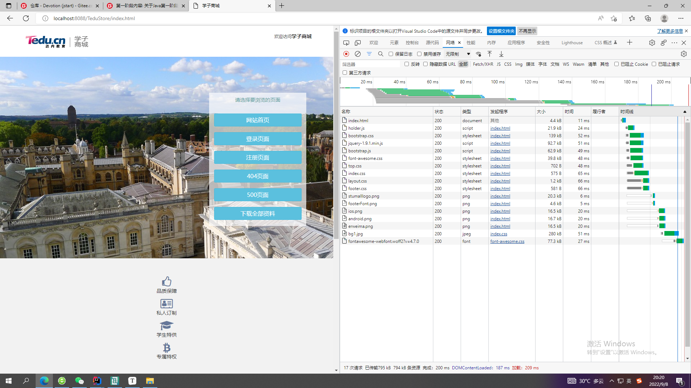

# 8月30日：

#### 1：控制台异常：


#### 2：主动发起连接为客户端

#### 3：Browser/Server，浏览器/服务器模式

#### 4：IP编号：0——65535

#### 5：防火墙：电脑和网络之间的门卫

#### 6：安卓手机底层为Linux系统

#### 7：方法返回什么类型,就用什么类型来接收

#### 8：查询电脑IP：终端——>cmd命令——>ipconfig查询电脑IP

#### 9：IO流与网络传输


#### 10：TCP连接的三次握手和四次挥手


#### 11：IntelliJ IDEA启动程序并列运行


#### 12：通过git命令向远程仓库更新和删除文件

##### 更新：


##### 删除：


# 8月31日：

#### 1：人眼睛观察的极限为30帧

#### 2：线程使用的场合


#### 3：CPU中有逻辑电路和晶体管

#### 4：多核并发,创建并启动线程


#### 5：打桩输出


#### 6:单线程设计


#### 7：run()方法结束,线程声明周期结束，守护线程要等普通线程全部结束后程序结束才能被杀死

#### 8：is开头的方法多半boolean类型

#### 9：内部类的资料


#### 10：集合自定义排序中sort()方法的第二个参数是一个Comparator接口类型,接口不能被实例化,所以创建一个匿名内部类。


# JavaSE的了解：

### Java SE用于开发和部署桌面、服务器以及嵌入设备和实时环境中的Java应用程序，Java SE包括用于开发Java Web服务的类库，同时，Java SE为Java EE提供了基础。

# 9月1日：

#### 1：多个线程同时执行同一块代码称为并发现象

#### 2：线程创建完毕后处于新建状态,调用start()方法后随之执行被重写的run()方法,等待CPU分配完时间片后开始执行

# 9月2日

#### 1：DNS域名解析


#### 2：地址细节处理


#### 3：Git在IDEA中的推送

1：VCS->项目右键->git->add+:

2：VCS->项目右键->git->commit

3：Define remote定义远程


# 9月5日：

#### 1：目录是用来归纳的

#### 2：英文数字符号占一个字节

#### 3：HashSet内部就是HashMap,只是存的时key一列元素

# 9月6日：

#### 1：targer和classes(类加载目录)任意一个类，包的顶层

#### 2:java和resources原代码和资源文件,JVM加载后统一放到classes文件里


#### 3:获取类加载路径

```java
package com.webserver.core
public class ClientHandler{
        public static void main(String[] args) throws URISyntaxException {
        File rootDir = new File( //寻找类加载路径
                ClientHandler.class.getClassLoader()
                        .getResource(".").toURI()
        );
        System.out.println(rootDir);//输出类加载路径
        //定位static目录(static目录下存放的是所有静态资源)
        File staticDir = new File(rootDir,"static");
        System.out.println(staticDir);//输出static目录的全部路径
        //定位static目录下的index.html
        File file = new File(staticDir,"index.html");
        System.out.println("文件是否存在："+file.exists());//true
    }
}
```


#### 4:网页F12打开开发者选项



# 9月8日：

#### 1：Debug模式(很实用)


#### 2：内部跳转：当请求路径和看到的页面不同时发生了内部跳转

#### 3：重定向：重定向后页面和路径就会匹配一致

# 9月13日：

#### 1.JDK8新特性lambda、forEach

#### 2：查看一个类的API，按住Ctrl点击类名查看源代码，点击IDEA左侧Project下的Structure可直观呈现所有API

#### 3：ctrl+alt+o删除无用的导包

#### 4：BindException该异常说明有其他程序正在run

#### 5：jar是JAVA的压缩包


## API是预定义的函数：

### ApplicationProgrammingInterface,应用程序编程接口）

#### 是一些预先定义的接口，目的是提供应用程序与开发人员基于某软件或硬件的以访问一组例程的能力，而又无需访问源码，或理解内部工作机制的细节。

# 9月16日：

#### 1：当多种类型数据运算时,会自动向大类型转换


#### 2：当创建对象的时候会自动调用构造方法,一定是先执行超类的静态块再执行派生类的，然后走new的对象的构造方法,若new的派生类或向上造型,则默认先走超类构造方法ABab；若new的超类,则只走超类的静态块和构造方法Aa


#### 3：数据库中文：


#### 4：数据库的重要性：


#### 5：华为云数据库(GaussDB)与MySQL：

6：关于华为


# 9月17日：

#### 1：MySQL中的注意语法

##### a:COUNT()：统计某一字段的数量

##### b:DISTINCT关键字：用于去除指定列重复值的行-

##### c:NVL函数： 用来替换NULL值，NVL(arg1,arg2) 当arg1不为null时则函数返回arg1的值,如果arg1为null则返回arg2的值

#### 2：Switch属于分支结构

# 9月18日：

### 枚举型：

```java
enum  DAY
{
      MON = 1 , TUE, WED, THU, FRI, SAT, SUN
};
```

(1) 枚举型是一个集合，集合中的元素(枚举成员)是一些命名的整型常量，元素之间用逗号,隔开。

(2) **DAY**是一个标识符，可以看成这个集合的名字，**是一个可选项**，即是可有可无的项。

(3) 第一个枚举成员的默认值为整型的0，后续枚举成员的值在前一个成员上加1。

(4) 可以人为设定枚举成员的值，从而自定义某个范围内的整数。

(5) 枚举型是预处理指令#define的替代。

(6) 类型定义以分号**;**结束。

# 9月19：

#### 1：JAVA的jar包网站：https://mvnrepository.com

#### 2：Driver驱动

#### 3：MySQL端口号：3306

# 9月21日：

### 1:

#### GET和POST是HTTP请求的两种基本方法，要说它们的区别，接触过WEB开发的人都能说出一二。

#### 最直观的区别就是GET把参数包含在URL中，POST通过request body传递参数。

#### 你可能自己写过无数个GET和POST请求，或者已经看过很多权威网站总结出的他们的区别，你非常清楚知道什么时候该用什么。

#### 当你在面试中被问到这个问题，你的内心充满了自信和喜悦。

#### 你轻轻松松的给出了一个“标准答案”：

 

- ##### GET在浏览器回退时是无害的，而POST会再次提交请求。

   

- ##### GET产生的URL地址可以被Bookmark，而POST不可以。

   

- ##### GET请求会被浏览器主动cache，而POST不会，除非手动设置。

   

- ##### GET请求只能进行url编码，而POST支持多种编码方式。

   

- ##### GET请求参数会被完整保留在浏览器历史记录里，而POST中的参数不会被保留。

   

- ##### GET请求在URL中传送的参数是有长度限制的，而POST么有。

   

- ##### 对参数的数据类型，GET只接受ASCII字符，而POST没有限制。

   

- ##### GET比POST更不安全，因为参数直接暴露在URL上，所以不能用来传递敏感信息。

   

- ##### GET参数通过URL传递，POST放在Request body中。

### 2：

### 404、403、400 、408、305等常见错误代码解析

#### （1）.400-请求无效

##### 说明服务器无法理解用户的请求,除非进行修改,不然你按再多刷新也没有用。很可能的情况是,你不小心输入错误了,导致服务器根本不知道你在表达什么。

#### （2）.403-禁止访问

##### 出现403是因为服务器拒绝了你的地址请求,很有可能是你根本就没权限访问网站,就算你提供了身份验证也没有用。很有可能你被禁止访问了。除非你与Web服务器管理员联系,否则一旦遇到403状态码都无法自行解决。

#### （3）.404-无法找到文件

##### 404其实在日常生活中很常见了。代码的意思是找不到要查询的页面。非常有可能是网页被删除了。

#### （4）.405-资源被禁止

##### 资源被禁止,有可能是文件目录权限不够导致的。这时候其实,只要赋予"完全控制"的权限,也是可以解决的

#### （5）.408-请求超时

##### 遇到408意味着你的请求发送到该网站花的时间比该网站的服务器准备等待的时间要长，即链接超时。

#### （6）.305-使用代理

##### 这个代码的意思是，你不能直接访问网站，要通过某个代理才能进去。比如，你想要访问一些外网，一定要使用VPN才可以。

### 3：JavaScript

##### JavaScript一种直译式[脚本语言](https://baike.so.com/doc/2874347-3033293.html)，是一种动态类型、弱类型、基于原型的语言，内置支持类型。它的[解释器](https://baike.so.com/doc/5904938-6117840.html)被称为JavaScript引擎，为[浏览器](https://baike.so.com/doc/2920715-3082096.html)的一部分，广泛用于[客户端](https://baike.so.com/doc/4889711-5107810.html)的脚本语言，最早是在HTML（标准通用标记语言下的一个应用）网页上使用，用来给HTML网页增加动态功能。 

##### 在1995年时，由Netscape公司的[Brendan Eich](https://baike.so.com/doc/1830372-1935746.html)，在[网景导航者](https://baike.so.com/doc/5691991-5904691.html)浏览器上首次设计实现而成。因为Netscape与Sun合作，Netscape管理层希望它外观看起来像[Java](https://baike.so.com/doc/2886868-3046592.html)，因此取名为JavaScript。但实际上它的语法风格与Self及[Scheme](https://baike.so.com/doc/6747345-6961891.html)较为接近。

##### 为了取得技术优势，[微软](https://baike.so.com/doc/2130745-2254356.html)推出了[JScript](https://baike.so.com/doc/5458749-5697138.html)，CEnvi推出ScriptEase，与JavaScript同样可在浏览器上运行。为了统一规格，因为JavaScript[兼容](https://baike.so.com/doc/5731854-10416323.html)于ECMA标准，因此也称为[ECMAScript](https://baike.so.com/doc/6950734-7173135.html)。

### 4：ServLet：

#### （ServletRequest和ServletResponse）接口

**Servlet(Server Applet)，全称Java Servlet，未有中文译文。是用[Java](https://baike.so.com/doc/2886868-3046592.html)编写的服务器端程序。其主要功能在于交互式地浏览和修改数据，生成动态Web内容。狭义的Servlet是指Java语言实现的一个接口，广义的Servlet是指任何实现了这个[Servlet接口](https://baike.so.com/doc/7695074-7969169.html)的类，一般情况下，人们将Servlet理解为后者。**

# 9月22日：

### 一.Map没有继承Collection接口

#### Map和Collection是两个不同的接口,没有继承关系!


### 二.线程安全：

##### 线程安全不能存NULL值,线程不安全可以存NULL值

#### 1._什么是线程安全?_

**线程安全**是多线程编程时的计算机程序代码中的一个概念。在拥有共享数据的多条线程并行执行的程序中，线程安全的代码会通过同步机制保证各个线程都可以正常且正确的执行，不会出现数据污染等意外情况。

#### 2._线程安全的概述_

多个线程访问同一个对象时，如果不用考虑这些线程在运行时环境下的调度和交替执行，也不需要进行额外的同步，或者在调用方进行任何其他操作，调用这个对象的行为都可以获得正确的结果，那么这个对象就是线程安全的。

或者说:一个类或者程序所提供的接口对于线程来说是[原子操作](https://baike.so.com/doc/6325064-6538672.html)或者多个线程之间的切换不会导致该接口的执行结果存在二义性,也就是说我们不用考虑同步的问题。

线程安全问题大多是由[全局变量](https://baike.so.com/doc/2493130-2634693.html)及[静态变量](https://baike.so.com/doc/1933722-2045776.html)引起的，局部变量逃逸也可能导致线程安全问题。

若每个线程中对全局变量、静态变量只有读操作，而无写操作，一般来说，这个全局变量是线程安全的;若有多个线程同时执行写操作，一般都需要考虑[线程同步](https://baike.so.com/doc/1629469-1722601.html)，否则的话就可能影响线程安全。

#### 3._线程的安全性_

类要成为线程安全的，首先必须在[单线程](https://baike.so.com/doc/2408393-2546269.html)环境中有正确的行为。如果一个类实现正确(这是说它符合规格说明的另一种方式)，那么没有一种对这个类的对象的操作序列(读或者写公共字段以及调用公共方法)可以让对象处于无效状态，观察到对象处于无效状态、或者违反类的任何不可变量、前置条件或者后置条件的情况。

此外，一个类要[成为](https://baike.so.com/doc/1232463-1303584.html)线程安全的，在被多个线程访问时，不管运行时环境执行这些线程有什么样的时序安排或者交错，它必须仍然有如上所述的正确行为，并且在调用的代码中没有任何额外的同步。其效果就是，在所有线程看来，对于线程安全对象的操作是以固定的、全局一致的顺序发生的。

正确性与[线程安全性](https://baike.so.com/doc/558977-591801.html)之间的关系非常类似于在描述 ACID(原子性、一致性、独立性和持久性)事务时使用的一致性与独立性之间的关系:从特定线程的角度看，由不同线程所执行的对象操作是先后(虽然顺序不定)而不是[并行执行](https://baike.so.com/doc/6555303-6769052.html)的。

#### 4._举例_

比如一个 ArrayList 类，在添加一个元素的时候，它可能会有两步来完成:1. 在 Items[Size] 的位置存放此元素;2. 增大 Size 的值。

在[单线程](https://baike.so.com/doc/2408393-2546269.html)运行的情况下，如果 Size = 0，添加一个元素后，此元素在位置 0，而且 Size=1;

而如果是在多线程情况下，比如有两个线程，线程 A 先将元素存放在位置 0。但是此时 CPU 调度线程A暂停，线程 B 得到运行的机会。线程B也向此 ArrayList 添加元素，因为此时 Size 仍然等于 0 (注意哦，我们假设的是添加一个元素是要两个步骤哦，而线程A仅仅完成了步骤1)，所以线程B也将元素存放在位置0。然后线程A和线程B都继续运行，都增加 Size 的值。

那好，我们来看看 ArrayList 的情况，元素实际上只有一个，存放在位置 0，而 Size 却等于 2。这就是"线程不安全"了。

#### 5._线程的安全程度_

[线程安全性](https://baike.so.com/doc/558977-591801.html)不是一个非真即假的命题。 Vector 的方法都是同步的，并且 Vector 明确地设计为在多线程环境中工作。但是它的线程安全性是有限制的，即在某些方法之间有状态依赖(类似地，如果在迭代过程中 Vector 被其他线程修改，那么由 Vector.iterator() 返回的 iterator会抛出ConcurrentModificationException)。

对于 Java 类中常见的线程安全性级别，没有一种[分类系统](https://baike.so.com/doc/6618500-6832295.html)可被广泛接受，不过重要的是在编写类时尽量记录下它们的线程安全行为。

Bloch 给出了描述五类线程安全性的分类方法:不可变、线程安全、有条件线程安全、线程兼容和线程对立。只要明确地记录下线程安全特性，那么您是否使用这种系统都没关系。这种系统有其局限性 -- 各类之间的界线不是百分之百地明确，而且有些情况它没照顾到 -- 但是这套系统是一个很好的起点。这种分类系统的核心是调用者是否可以或者必须用外部同步包围操作(或者一系列操作)。下面几节分别描述了[线程安全性](https://baike.so.com/doc/558977-591801.html)的这五种类别。

##### 6.**不可变**

不可变的对象一定是线程安全的，并且永远也不需要额外的同步 。因为一个不可变的对象只要构建正确，其外部可见状态永远也不会改变，永远也不会看到它处于不一致的状态。Java 类库中大多数基本数值类如 Integer 、 String 和 BigInteger 都是不可变的。

需要注意的是，对于Integer，该类不提供add方法，加法是使用+来直接操作。而+操作是不具线程安全的。这是提供原子操作类AtomicInteger的原因。

##### 7.**线程安全**

线程安全的对象具有在上面"线程安全"一节中描述的属性 -- 由类的规格说明所规定的约束在对象被多个线程访问时仍然有效，不管运行时环境如何排列，线程都不需要任何额外的同步。这种[线程安全性](https://baike.so.com/doc/558977-591801.html)保证是很严格的 -- 许多类，如 Hashtable 或者 Vector 都不能满足这种严格的定义。

##### 8.**有条件的**

有条件的线程安全类对于单独的操作可以是线程安全的，但是某些操作序列可能需要外部同步。条件线程安全的最常见的例子是遍历由 Hashtable 或者 Vector 或者返回的[迭代器](https://baike.so.com/doc/4824484-5041154.html) -- 由这些类返回的 fail-fast 迭代器假定在迭代器进行遍历的时候底层集合不会有变化。为了保证其他线程不会在遍历的时候改变集合，进行迭代的线程应该确保它是独占性地访问集合以实现遍历的完整性。通常，独占性的访问是由对锁的同步保证的 -- 并且类的文档应该说明是哪个锁(通常是对象的内部监视器(intrinsic monitor))。

如果对一个有条件线程安全类进行记录，那么您应该不仅要记录它是有条件线程安全的，而且还要记录必须防止哪些操作序列的并发访问。用户可以合理地假设其他操作序列不需要任何额外的同步。

##### 9.**线程兼容**

线程兼容类不是线程安全的，但是可以通过正确使用同步而在并发环境中安全地使用。这可能意味着用一个 synchronized 块包围每一个方法调用，或者创建一个包装器对象，其中每一个方法都是同步的(就像 Collections.synchronizedList() 一样)。也可能意味着用 synchronized 块包围某些操作序列。为了最大程度地利用线程兼容类，如果所有调用都使用同一个块，那么就不应该要求调用者对该块同步。这样做会使线程兼容的对象作为变量实例包含在其他线程安全的对象中，从而可以利用其所有者对象的同步。

许多常见的类是线程兼容的，如集合类 ArrayList 和 HashMap 、 java.text.SimpleDateFormat 、或者 JDBC 类 Connection 和 ResultSet 。

##### 10.**线程对立**

线程对立类是那些不管是否调用了外部同步都不能在并发使用时安全地呈现的类。线程对立很少见，当类修改静态数据，而静态数据会影响在其他线程中执行的其他类的行为，这时通常会出现线程对立。线程对立类的一个例子是调用 System.setOut() 的类。
