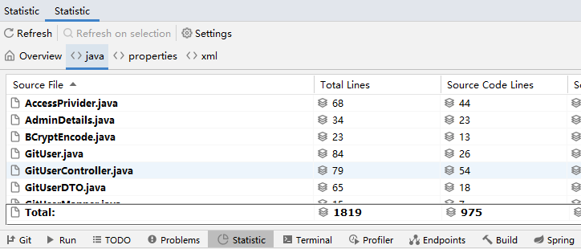

# 8月30日：

#### 1：控制台异常：


#### 2：主动发起连接为客户端

#### 3：Browser/Server，浏览器/服务器模式

#### 4：IP编号：0~65535

#### 5：防火墙：电脑和网络之间的门卫

#### 6：安卓手机底层为Linux系统

#### 7：方法返回什么类型,就用什么类型来接收

#### 8：查询电脑IP：终端——>cmd命令——>ipconfig查询电脑IP

#### 9：IO流与网络传输


#### 10：TCP连接的三次握手和四次挥手


#### 11：IntelliJ IDEA启动程序并列运行


#### 12：通过git命令向远程仓库更新和删除文件

##### 更新：


##### 删除：


# 8月31日：

#### 1：人眼睛观察的极限为30帧

#### 2：线程使用的场合


#### 3：CPU中有逻辑电路和晶体管

#### 4：多核并发,创建并启动线程


#### 5：打桩输出


#### 6:单线程设计


#### 7：run()方法结束,线程声明周期结束，守护线程要等普通线程全部结束后程序结束才能被杀死

#### 8：is开头的方法多半boolean类型

#### 9：内部类的资料


#### 10：集合自定义排序中sort()方法的第二个参数是一个Comparator接口类型,接口不能被实例化,所以创建一个匿名内部类。


# JavaSE的了解：

### Java SE用于开发和部署桌面、服务器以及嵌入设备和实时环境中的Java应用程序，Java SE包括用于开发Java Web服务的类库，同时，Java SE为Java EE提供了基础。

# 9月1日：

#### 1：多个线程同时执行同一块代码称为并发现象

#### 2：线程创建完毕后处于新建状态,调用start()方法后随之执行被重写的run()方法,等待CPU分配完时间片后开始执行

# 9月2日

#### 1：DNS域名解析


#### 2：地址细节处理


#### 3：Git在IDEA中的推送

1：VCS->项目右键->git->add+:

2：VCS->项目右键->git->commit

3：Define remote定义远程


# 9月5日：

#### 1：目录是用来归纳的

#### 2：英文数字符号占一个字节

#### 3：HashSet内部就是HashMap,只是存的时key一列元素

# 9月6日：

#### 1：targer和classes(类加载目录)任意一个类，包的顶层

#### 2:java和resources原代码和资源文件,JVM加载后统一放到classes文件里


#### 3:获取类加载路径

```java
package com.webserver.core
public class ClientHandler{
        public static void main(String[] args) throws URISyntaxException {
        File rootDir = new File( //寻找类加载路径
                ClientHandler.class.getClassLoader()
                        .getResource(".").toURI()
        );
        System.out.println(rootDir);//输出类加载路径
        //定位static目录(static目录下存放的是所有静态资源)
        File staticDir = new File(rootDir,"static");
        System.out.println(staticDir);//输出static目录的全部路径
        //定位static目录下的index.html
        File file = new File(staticDir,"index.html");
        System.out.println("文件是否存在："+file.exists());//true
    }
}
```


#### 4:网页F12打开开发者选项


#### 5:Exception异常的层次


# 9月8日：

#### 1：Debug模式(很实用)


#### 2：内部跳转：当请求路径和看到的页面不同时发生了内部跳转

#### 3：重定向：重定向后页面和路径就会匹配一致

# 9月13日：

#### 1.JDK8新特性lambda、forEach

#### 2：查看一个类的API，按住Ctrl点击类名查看源代码，点击IDEA左侧Project下的Structure可直观呈现所有API

#### 3：ctrl+alt+o删除无用的导包

#### 4：BindException该异常说明有其他程序正在run

#### 5：jar是JAVA的压缩包


## API是预定义的函数：

### ApplicationProgrammingInterface,应用程序编程接口）

#### 是一些预先定义的接口，目的是提供应用程序与开发人员基于某软件或硬件的以访问一组例程的能力，而又无需访问源码，或理解内部工作机制的细节。

# 9月16日：

#### 1：当多种类型数据运算时,会自动向大类型转换


#### 2：当创建对象的时候会自动调用构造方法,一定是先执行超类的静态块再执行派生类的，然后走new的对象的构造方法,若new的派生类或向上造型,则默认先走超类构造方法ABab；若new的超类,则只走超类的静态块和构造方法Aa


#### 3：数据库的重要性：


#### 4：华为云数据库(GaussDB)与MySQL：

#### 5：关于华为HUAWEI


# 9月17日：

#### 1：MySQL中的注意语法

##### a:COUNT()：统计某一字段的数量

##### b:DISTINCT关键字：用于去除指定列重复值的行-

##### c:NVL函数： 用来替换NULL值，NVL(arg1,arg2) 当arg1不为null时则函数返回arg1的值,如果arg1为null则返回arg2的值

#### 2：Switch属于分支结构

# 9月18日：

### 枚举型：

```java
enum  DAY
{
      MON = 1 , TUE, WED, THU, FRI, SAT, SUN
};
```

(1) 枚举型是一个集合，集合中的元素(枚举成员)是一些命名的整型常量，元素之间用逗号,隔开。

(2) **DAY**是一个标识符，可以看成这个集合的名字，**是一个可选项**，即是可有可无的项。

(3) 第一个枚举成员的默认值为整型的0，后续枚举成员的值在前一个成员上加1。

(4) 可以人为设定枚举成员的值，从而自定义某个范围内的整数。

(5) 枚举型是预处理指令#define的替代。

(6) 类型定义以分号;结束。

# 9月19：

#### 1：JAVA的jar包网站：https://mvnrepository.com

#### 2：Driver驱动

#### 3：MySQL端口号：3306

# 9月21日：

### 1:GET和POST是HTTP请求的两种基本方法

#### 最直观的区别就是GET把参数包含在URL中，POST通过request body传递参数。

- ##### GET在浏览器回退时是无害的，而POST会再次提交请求。

- ##### GET产生的URL地址可以被Bookmark(书签收藏)和Share(分享)，而POST不可以。

- ##### GET请求会被浏览器主动cache，而POST不会，除非手动设置。

- ##### GET请求只能进行url编码，而POST支持多种编码方式。

- ##### GET请求参数会被完整保留在浏览器历史记录里，而POST中的参数不会被保留。

- ##### GET请求在URL中传送的参数是有长度限制的，而POST没有。

- ##### 对参数的数据类型，GET只接受ASCII字符，而POST没有限制。

- ##### GET比POST更不安全，因为参数直接暴露在URL上，所以不能用来传递敏感信息。

- ##### GET参数通过URL传递，POST放在Request body(请求体)中。

- ##### Get请求比较快,Post请求较慢

> 以获取数据为主要目的的用Get请求,其余的用Post请求

### 2：

### 404、403、400 、408、305等常见错误代码解析

#### （1）.400-请求无效

##### 说明服务器无法理解用户的请求,除非进行修改,不然你按再多刷新也没有用。很可能的情况是,你不小心输入错误了,导致服务器根本不知道你在表达什么。

#### （2）.403-禁止访问

##### 出现403是因为服务器拒绝了你的地址请求,很有可能是你根本就没权限访问网站,就算你提供了身份验证也没有用。很有可能你被禁止访问了。除非你与Web服务器管理员联系,否则一旦遇到403状态码都无法自行解决。

#### （3）.404-无法找到文件

##### 404其实在日常生活中很常见了。代码的意思是找不到要查询的页面。非常有可能是网页被删除了。

#### （4）.405-请求方式不对,资源被禁止

##### 资源被禁止,有可能是文件目录权限不够导致的。这时候其实,只要赋予"完全控制"的权限,也是可以解决的

#### （5）.408-请求超时

##### 遇到408意味着你的请求发送到该网站花的时间比该网站的服务器准备等待的时间要长，即链接超时。

#### （6）.305-使用代理

##### 这个代码的意思是，你不能直接访问网站，要通过某个代理才能进去。比如，你想要访问一些外网，一定要使用VPN才可以。

### 3：JavaScript

##### JavaScript一种直译式[脚本语言](https://baike.so.com/doc/2874347-3033293.html)，是一种动态类型、弱类型、基于原型的语言，内置支持类型。它的[解释器](https://baike.so.com/doc/5904938-6117840.html)被称为JavaScript引擎，为[浏览器](https://baike.so.com/doc/2920715-3082096.html)的一部分，广泛用于[客户端](https://baike.so.com/doc/4889711-5107810.html)的脚本语言，最早是在HTML（标准通用标记语言下的一个应用）网页上使用，用来给HTML网页增加动态功能。 

##### 在1995年时，由Netscape公司的[Brendan Eich](https://baike.so.com/doc/1830372-1935746.html)，在[网景导航者](https://baike.so.com/doc/5691991-5904691.html)浏览器上首次设计实现而成。因为Netscape与Sun合作，Netscape管理层希望它外观看起来像[Java](https://baike.so.com/doc/2886868-3046592.html)，因此取名为JavaScript。但实际上它的语法风格与Self及[Scheme](https://baike.so.com/doc/6747345-6961891.html)较为接近。

##### 为了取得技术优势，[微软](https://baike.so.com/doc/2130745-2254356.html)推出了[JScript](https://baike.so.com/doc/5458749-5697138.html)，CEnvi推出ScriptEase，与JavaScript同样可在浏览器上运行。为了统一规格，因为JavaScript[兼容](https://baike.so.com/doc/5731854-10416323.html)于ECMA标准，因此也称为[ECMAScript](https://baike.so.com/doc/6950734-7173135.html)。

##### 变量

- JS语言属于弱类型语言,声明变量时不需要指定变量的类型

- 通过let或var声明变量

  - let声明的变量作用域和Java语言类似

  - var声明的变量作用域相当于是全局的,可以在任何地方访问

  - 举例:

    - Java: 

      for(int i=0;i<10;i++){

      ​	int j = i+1;

      }

      int x = i+j;   //i和j超出了作用域    编译报错

    - JS:

      for(let i=0;i<10;i++){

      ​	let j = i+1;

      }

      let x = i+j;     //不报错 但是访问不到i和j  因为超出了作用域

      for(var i=0;i<10;i++){

      ​	var j = i+1;

      }

      var  x = i+j;  //不报错并且可以访问到i和j的值

##### 数据类型

- JavaScript语言中只有对象类型
- 常见的对象类型:

  - number数值:  相当于Java中所有数值类型的总和 
  - string 字符串:   可以用单引号或双引号修饰       
  - boolean布尔值:   true和false 
  - undefined未定义:   当变量只声明不赋值的时候变量的类型和值都为undefined  
- 获取变量类型:      typeof 变量

##### 运算符

- 算术运算符: + - * / %
  - 除法和Java不一样, 会自动根据结果转换整数或小数
    - Java:  int x=5;  int y=2; int z = x/y;  z=2  
    - JS:  let x=5; let y=2;  let z = x/y;   z=2.5    x=6    z=3
- 关系运算符: > < >= <= !=  ==和===
  - ==: 先统一两个变量的类型再比较值    "666"==666     true
  - ===:先比较类型,类型一样后再比较值    "666"==666    false
- 逻辑运算符: && || !     只支持短路与和短路或
- 赋值运算符: =   +=  -=  *=   /=  %=
- 三目运算符:   条件?值1:值2

##### 各种语句

- 各种语句和Java语言基本一致

- if else
- while
- for
- switch case

### 4：ServLet：

#### （ServletRequest和ServletResponse）接口

**Servlet(Server Applet)，全称Java Servlet，未有中文译文。是用[Java](https://baike.so.com/doc/2886868-3046592.html)编写的服务器端程序。其主要功能在于交互式地浏览和修改数据，生成动态Web内容。狭义的Servlet是指Java语言实现的一个接口，广义的Servlet是指任何实现了这个[Servlet接口](https://baike.so.com/doc/7695074-7969169.html)的类，一般情况下，人们将Servlet理解为后者。**

# 9月22日：

### 一.Map没有继承Collection接口

#### Map和Collection是两个不同的接口,没有继承关系!


# 10月8日:

### 1.关于Git图片放入同级images文件夹中不显示问题

#### 解决:将图片路径改为相对路径,在图片名前加上images/即可

### 2.Rebuild "static"快捷键ctrl+shift+F9

# 10月9日:

### 1.Spring Initializr中第一个配置Server URL用于方便一些框架资源的下载,从而提高开发效率

### 2.使用正确的框架创建项目,可不需要大量配置文件和引入

### 3.包装类和基本数据类型的区别

- #### 例:int型的默认值为0,但无法判断是否处于默认状态(可以赋值为0)

- #### 例:Integer包装类的默认值为null,相比基本类型多出了一个未赋值的状态,使用较多.

# 10月10日:

### 1.前端元素显示方式包含哪几种

- ##### 通过display样式控制元素的显示方式,方便进行修改

- ##### block: 块级元素的默认值,  特点: 独占一行,可以修改元素宽高, 包括: h1-h6 ,p,div  

- ##### inline: 行内元素的默认值, 特点: 共占一行, 不能修改元素宽高, 包括:span,b,i,s,u,a

- ##### inline-block: 行内块元素的默认值, 特点: 共占一行,可以修改元素宽高, 包括:input ,img  

- ##### none: 隐藏元素 

### 2.同步: 指单线程依次做几件事

### 3.异步: 多线程同时做几件事

### 4.同步请求:

- ##### 指客户端只有一个主线程,"主线程"负责页面渲染和监听操作,如果需要主线程发出请求时,会停止页面渲染(清空页面) 只负责发请求,当服务器响应了数据之后,主线程再次恢复渲染的职责,把服务器响应的数据显示到页面中,这个过程是将页面内容进行了整体的改变,称为整体刷新,同步请求只能实现页面的整体刷新无法实现局部刷新.

- ##### Form表单,浏览器输入地址,超链接都是同步请求(页面整体刷新)

### 5.异步请求:

- ##### 异步请求: 指客户端的主线程负责页面渲染和监听操作,由"子线程"发出请求获取数据,获取到数据后将数据展示到原有页面, 这种就叫做页面的局部刷新, 只有通过异步请求才可以实现.

### 6.失去焦点事件

- ##### 光标离开的一瞬间触发失去焦点事件@blur="f()"

### 7.端口被占用的情况


- 解决方案:

  - 检查是不是有其他项目正在运行,停止其他项目即可解决

  - 如果没有其他工程在运行仍然占着8080端口:

    - 修改项目端口号,在application.properties添加以下内容

      

    - 重启电脑

    - 找到占用8080端口的进程并杀掉进程

      

### 8.关于使用SpringMVC和MyBatis框架常见的错误

- #### HTTP400错误:该错误通常是在处理同步或异步请求时,表单提交用户输入的信息不符合参数列表中的数据类型,会直接随着客户端主线程发出请求时在页面中报400错误.

  - ##### 若为异步请求,区别是客户端不显示页面(子线程请求不到数据),在浏览器控制台Console会报错isAxiosError.js.

- #### HTTP500错误:该错误通常是处理同步或异步请求时,当服务端压力过大、该关联的地方未关联、异常未抛出时,会报500错误.

  - ##### 所谓关联错误就是在处理当前的业务中,需利用@Mapper接口中的@Insert()、@Delete()、@Update()、@Select()定义未实现的增删改查方法,关联传入的SQL语句进行相应的操作时发生的错误,通常最多的是SQL语句输入错误.

  - ##### 同样,若为同步请求,该错误会随着客户端主线程发出请求时在页面报错,若为异步请求时,处理请求数据的是子线程,发生该错误时,页面空白(请求不到数据),在浏览器控制台进行报错isAxiosError.js,IDEA控制台也会报异常SQLSyntaxErrorException

# 10月11日:

### 1.v-if="变量"和v-show="变量"

- #### 都是可以控制元素是否显示

  - ##### 区别是:v-if=false时会删除元素

  - ##### v-show=false时是隐藏元素,需要频繁切换元素显示隐藏的状态时,使用v-show

### 2.IDAE添加自定义生成内容(敲Tab生成)


## 3.JSON

- ### JavaScript JSON

  - #### JSON 是用于存储和传输数据的格式。

  - #### JSON 通常用于服务端向网页传递数据 

- ### 什么是 JSON?

  - ##### JSON 英文全称 **J**ava**S**cript **O**bject **N**otation

  - ##### JSON 是一种轻量级的数据交换格式。

  - ##### JSON是独立的语言 

  - ##### JSON 易于理解。

- #### JSON是一个轻量级的数据交换格式,也叫作数据封装格式

  - [{"name":"刘德华","age":18},{"name":"张学友","age":20},{"name":"郭富城","age":30}]

  - 当服务器给客户端响应的数据类型为**自定义对象或List集合**时, SpringMVC框架会自动将返回的数据转成JSON格式的字符串, 然后通过网络传输给客户端, 客户端接收到的数据是JSON格式的字符串,Axios框架会自动将JSON格式字符串里的数据转成JavaScript语言中的数组或对象.
  
  - ##### 如果传递的对象为NULL,则JavaScript拿到的会是空字符串.


- ### JSON 语法规则

  - ##### 数据为 键/值 对。

  - ##### 数据由逗号分隔。

    ```java
    "name":"Runoob"
    ```

  - ##### 大括号保存对象

    ```java
    {"name":"Runoob", "url":"www.runoob.com"}
    ```

  - ##### 方括号保存数组

```java
    {"sites":[
    {"name":"Runoob", "url":"www.runoob.com"}, 
    {"name":"Google", "url":"www.google.com"},
    {"name":"Taobao", "url":"www.taobao.com"}
    ]}
```

# 10月12日:

### 1.CSS中border边框样式style属性

- ##### none不设置
- ##### hidden隐藏
- ##### dotted一系列的点
- ##### dashed一系列小线段
- ##### solid一条单一的实心直线
- ##### double两条实心直线

### 2.IDEA可以从磁盘中安装插件


### 3.在IDEA的Database数据库中,有时创建的表未能保存,此时点击Refresh刷新即可.

### 4.Config

- ##### config是显示配置信息命令，它是英文单词configuration的缩写，是“配置”的意思。

- ##### 一般是修改系统配置或设置的，计算机中各类软件及系统都有类似CONFIG的文件，其中主要是系统或各软件的配置参数。 config对象对应于javax.servlet.ServletConfig类，此类位于servlet-api.jar包中。

### 5.选择java类右键->Copy Path...->Copy Reference复制当前类完全路径

# 10月13日:

### 1.自动整理代码快捷键:Ctrl+Alt+l

### 2.MyBatis框架中的trim标签

- ##### mybatis的trim标签一般用于去除sql语句中多余的and关键字，逗号，或者给sql语句前拼接 “where“、“set“以及“values(“ 等前缀，或者添加“)“等后缀，可用于选择性插入、更新、删除或者条件查询等操作。

##### 以下是trim标签中涉及到的属性：

- trim标签:用于去除sql中多余关键字,添加前缀等选择性插入、更新、删除或者条件查询的操作。
- prefix属性用于给sql语句拼接的前缀
- suffix属性用于给sql语句拼接的后缀
- suffixOverrides属性用户去除sql语句中多余的","
- if标签用户在test属性中写判断条件

```xml
<!--动态选择性插入数据:
    INSERT INTO product(title,price,num) VALUES(#{title},#{price},#{num})
    在指定三个不为空的字段,#{变量名}会自动往指定方法的参数列表中获取参数,如果是对象,会自动利用getter获取(底层看不见)
    最后进行选择性插入,未插入的字段会保留原来的值
    -->
    <insert id="dynamicInsert">
        INSERT INTO product
        <trim prefix="(" suffix=")" suffixOverrides=",">
            <if test="title!=null">title,</if>
            <if test="price!=null">price,</if>
            <if test="num!=null">num</if>
        </trim>
        VALUES
        <trim prefix="(" suffix=")" suffixOverrides=",">
            <if test="title!=null">#{title},</if>
            <if test="price!=null">#{price},</if>
            <if test="num!=null">#{num}</if>
        </trim>
    </insert>
```

### 3.配置环境变量,以便在终端搬运数据库


### 当环境变量配置完成之后>

- #### 第一步:在IDEA终端中先敲mysql -uroot -proot进入到数据库中

- #### 在数据库中如果没有这张表就先创建

- #### USE使用数据库

- #### 最后source 上传来的sql文件;例如source bbsdb20221013.sql

- #### 出现一堆Query OK时说明数据库搬运成功

# 10月17日:

### 1.shift+F5浏览器缓存刷新

# 10月18日:

### 1:酷鲨商城项目中的一个问题

- ##### 在updateBanner.html页面中修改轮播图,在进入页面后需要利用created:function(){}方法来通过路径传递的修改前的轮播图url来进行展示,

  - ```javascript
    created:function (){
                //created方法是Vue对象初始化过程中的方法,并没有初始化完成,此时如果需要访问Vue对象中的属               性,可以通过this取代v
                //得到地址栏中从上个页面传递过来的图片路径(这里的this指代Vue对象)
                v.oldUrl = location.search.split("=")[1];
            }
    ```

- ##### 这里如果将路径中传递的路径截取后赋值给v中的oldurl时会报以下错误(不能在初始化之前访问v)

  

  

- ##### ★因此需要赋值给this(当前Vue对象)

  - ```javascript
     created:function (){
                //created方法是Vue对象初始化过程中的方法,并没有初始化完成,此时如果需要访问Vue对象中的属性,可以通过this取代v
                //axios请求后为什么可以使用v?因为发请求是使用的子线程,请求完成后created方法早就执行完Vue对象初始化过程也早就完成,所以可以访问v变量
                //得到地址栏中从上个页面传递过来的图片路径(这里的this指代Vue对象)
                v.oldUrl = location.search.split("=")[1];
            }
    ```

### 2.补充一个CSS样式

- 当遇到文本量过大导致页面显示不美观时:

  - ```Css
    white-space: nowrap;//设置内容不换行
    ```

  - ```css
    text-overflow: ellipsis;//有超出显示范围的文本时显示
    ```

  - #### 效果:

    - 

### 3.前端MVVM设计模式:

- MVVM是将实现前端某一个业务的所有代码划分为三部分
- M:Model 模型, 指数据模型 ,数据相关代码
- V: View 视图, 指页面标签相关代码
- VM: ViewModel 视图模型, 视图模型负责将页面中可能发生改变的元素和某个变量,在内存中进行绑定, 并且会不断监听变量的值的改变, 当变量的值发生改变,可以立即从绑定的关系中找到对应的页面元素, 这样就不需要每次遍历查找了, 从而提高了执行效率

### 4.什么是Vue?

#### 此框架是目前前端最流行的一款基于MVVM设计模式的框架,使用此框架可以让程序员更加便捷的使用MVVM设计模式

- VUE框架两种使用方式:

  - 多页面模式: 在html页面中引入vue.js框架文件即可
  - 单页面模式(脚手架模式): 第四个阶段讲

- 引入vue.js框架到页面中的两种方式:

  - 引入本地文件的方式, 需要先将vue.js框架文件下载到自己电脑上 然后引入
  - 引入CDN服务上面的vue.js, 这种只需要有框架的url路径即可

- ```XML
  * Vue对象相当于是MVVM设计模式中的VM视图模型, 负责将页面中可能发生改变的元素和
  * data里面的变量进行绑定, 变量的值是什么页面元素就显示什么
  * 而且会不断监听变量值的改变, 值只要一变会立即找到对应的元素并让元素跟着改变
  ```

# 10月19日:

### 1.timestamp时间戳类型当数据发生更改时会自动更新时间为当前时间

- ##### 关闭自动更新时间:

  ```sql
  USE cs;
  ALTER TABLE product
      CHANGE created
          created timestamp NOT NULL default current_timestamp;
  ```

- ##### 打开自动更新时间:

  ```sql
  ALTER TABLE product
      CHANGE created
          created timestamp NOT NULL default current_timestamp
              on update current_timestamp;
  ```

### 2.DOS命令:

- #### netstat -an查看电脑地址状态

- #### systeminfo查看本机信息

- #### java-version查看是否含有jdk

- #### java-verbose查看jdk安装路径

### 3.WIN快捷键:

- ##### win+Tab:打开电脑近一个月的使用记录

- ##### win+D键:瞬间切换会桌面

- ##### win+L:给电脑锁屏

- ##### win+E:打卡文件管理

- ##### win+数字键:打开下方由左至右的应用

### 4.后端的三大框架

- #### 三大框架的作用是提高后端业务代码的开发效率

- #### SSM:
  
  - ##### SpringMVC: 从第二个阶段开始接触 到第四阶段  
  - ##### Spring:从第四阶段开始讲  
  - ##### Mybatis: 从第三个阶段开始接触 讲到第四阶段  

### 5.WebServer中的DispatcherServlet类

- ##### 这个类是SpringMVC框架与Tomcat容器整合的一个关键类,接管了处理请求的工作

- ##### 这样当Tomcat将请求对象和响应对象创建完毕后处理请求的环节通过调用这个类来完成,从而将处理请求交给了SpringMVC框架,并在处理后发送响应给浏览器

# 10月20日

#### 1.External Libraries是Java的一个扩展类库,在创建项目,勾选引用时会自动在Maven配置中导入一些对应所需的jar包

- ##### jar包中会包含对应封装过的包和类以及接口以供程序员使用

- 

### 2.★过滤器

- #### 创建过滤器

  

- #### 作用: 可以让客户群请求到服务器资源之前或之后经过过滤器


- #### 如何使用过滤器?

  - 创建Filter类文件		
  - 在WebFilter注解中配置处理的请求路径
  - 在doFilter方法中处理请求,写上判断代码,条件满足执行chain.doFilter(request, response);代码代表放行.
  - 在XXXXApplication.java文件中添加@ServletComponentScan注解 进行过滤器扫描

- #### 过滤器urlParttens配置方式:

  - ##### 精确匹配:   /admin.html  /insertProduct.html  

  - ##### 后缀匹配:  *.jpg     *.html      *.xxx

  - ##### 路径匹配:  /product/*       /user/*   

  - ##### 全部匹配: /*   (匹配网站中所有资源 )

# 10月21日

### 1.数据库三范式

- ##### 以表格为存储方式为关系型数据库
- ##### 以键值对或内存为存储方式为非关系型数据库

# 10月24日

### 1.国外服务器访问速度慢,因为距离较远,因此需要配置为国内服务器,例如:华为云,阿里云

### 2.VarChar(10)指定长度后还会额外使用一个字节去识别你存的内容长度

### 3.Char(10)会直接读取10个长度,不够补空格

### 4.Java包名会体现在源代码上

### 5.Version版本号:X.X.XX(大版本号.小版本号.修正版本Bug)

### 6.数据库

- ##### 数据库中tinyint(byte)

- #### unsigned关键字表示无符号位

  - ##### 效果:tinyint  [-128,127]  ->  [0,255]

- ##### COMMENT用于解释说明字段的意思

- ##### DEFAULT默认值


### 7.项目中含有Test包中含有测试类,用于加载当前环境和判断依赖文件是否正确

```java
package cn.tedu.csmallproduct;

import org.junit.jupiter.api.Test;
import org.springframework.boot.test.context.SpringBootTest;

@SpringBootTest
class CsmallProductApplicationTests {

    @Test
    void contextLoads() {
        System.out.println("Hello World!");
    }
}
```

### 8.MyBatis是处理数据库的一款持久层框架,

- ##### Mybatis整合Spring Boot的依赖项版本号不能不写

### 9.一些可能遇见的错误

- ##### java.lang.IllegalStateException: Failed to load ApplicationContext运行环境错误

#### 报错时冷静处理,分析异常说明:

- ##### 关键看Caused by(引起的原因)----------往往最后一行Caused by是引发的原因

- 

- ##### Access denied for user 'root'@'localhost' (using password: YES)连接数据库的用户名或密码错误

- ##### Failed to determine a suitable driver class加载驱动类失败,配置问题

# 10月25日:

### 1.关于Lombok框架

- 该框架的主要作用是通过注解可以**在编译期生成**某些代码,例如Setters&Getters,hashcode()与equals(),toString()方法等,可以简化开发

### 2.空指针异常(NullPointException)说明任何为Null的属性被使用或者调方法

### 3.拼接字符串是一种效率低下的操作

- #### 使用Slf4j日志框架中的log.调用对应输出级别的方法来执行输出,提高代码可读性以及效率

  ```java
  @Slf4j
  @SpringBootTest
  public class Slf4jTests {
  
      @Test
      void log(){
          log.trace("这是一条[trace]级别的日志");
          log.debug("这是一条[debug]级别的日志");
          log.info("这是一条[info]级别的日志");
          log.warn("这是一条[warn]级别的日志");
          log.error("这是一条[error]级别的日志");
  
          int x = 1;
          int y = 2;
          log.info("{}+{}={}",x,y,x+y);//日志输出
          System.out.println(x+"+"+y+"="+(x+y));//传统输出方式,效率低下
      }
  }
  ```

### 4.在xml配置文件中书写SQL语句时

- ##### 若过滤条件只有一个且参数为未封装时,参数写别的内容不报错(不能为关键符号例:)}

- ##### 在xml文件中书写SQL语句中增删改的标签`<insert>` `<update>` `<delete>`可以混用不报错

```xml
 <!--int deleteById(Long id);-->
    <delete id="deleteById">
        DELETE FROM pms_album WHERE id=#{gjfjgor}
    </delete>
```

### 5.lang包是java的默认包(language)

- 在写resultmap时lang包下的包名可以不写例如:int,Long......

### 6.源代码(.java)->字节码(.class)

# 10月26日:

### 1.当一个方法对应多个SQL语句时会报错

```
Caused by: java.lang.IllegalArgumentException: Mapped Statements collection already contains value for cn.tedu.csmall.product.mapper.AlbumMapper.insert. please check file [C:\Users\admin\IdeaProjects\jsd2207-csmall-product\target\classes\mapper\AlbumMapper.xml] and file [C:\Users\admin\IdeaProjects\jsd2207-csmall-product\target\classes\mapper\BrandMapper.xml]
```

### 2.JavaScript五中基本数据类型

- ##### String

- ##### Number

- ##### null

- ##### undefined

### 3. 关于BindingException

当调用的方法找不到绑定的SQL语句时，将出现错误，例如：

```
org.apache.ibatis.binding.BindingException: Invalid bound statement (not found): cn.tedu.csmall.product.mapper.AlbumMapper.insert
```

出现此错误的原因可能是：

- 在XML文件中，`<mapper>`标签的`namespace`值有误
- 在XML文件中，`<insert>`或类似标签的`id`值有误
- 在配置文件（`application.properties` / `application.yml`）中，配置的`mybatis.mapper-locations`属性有误，可能属性名写错，或属性值写错

注意：以上异常信息中已经明确表示了哪个接口的哪个方法缺少对应的SQL语句，可以以此为线索来排查错误。

### 4.resultMap填写错误,导致编译器不能识别

#### 报该异常(不认识后面的Path):

```
java.lang.IllegalArgumentException: Result Maps collection does not contain value for cn.tedu.csmall.product.mapper.CategoryMapper.StandardResultMapperr
```

### 5.若在一个XML文件中两个resultMap的id相同时会报错

```
#倒数第二的Caused by:
Caused by: org.apache.ibatis.builder.BuilderException: Error parsing Mapper XML. The XML location is 'file [C:\Users\admin\IdeaProjects\jsd2207-csmall-product\target\classes\mapper\CategoryMapper.xml]'. Cause: java.lang.IllegalArgumentException: Result Maps collection already contains value for cn.tedu.csmall.product.mapper.CategoryMapper.StandardResultMapper
#最后一个Caused by:
Caused by: java.lang.IllegalArgumentException: Result Maps collection already contains value for cn.tedu.csmall.product.mapper.CategoryMapper.StandardResultMapper
```

### 6.IDEA中快捷键:ctrl+R搜索框

### 7.DAO层:数据访问对象,就是Mapper

#### 8.在Java开发中，通常将后台分成几层

##### 常见的是三层MVC：model、view、controller，模型、视图、控制层、三层，而impl通常处于controller层的service下，用来存放接口的实现类，impl的全称为implement，表示实现的意思。

### 9.小结:

##### 在java开发中,前端和后端进行连接需要一个服务器,在中小型项目中,在开启Spring项目时,会将项目部署到Tomat服务器中,以它作为容器来完成相关的业务操作。

### 10.处理异常的本质:

##### 提示用户异常的大致原因,防止用户反复尝试触发异常从而造成服务器的浪费和消耗

# 10月27日:

### 1.Session:

- ##### Session可以保存任意对象类型的数据,因为它返回的是Object类型

### 2.IDEA中快捷:ctrl+z撤销、ctrl+shift+z回撤

### 3.Service层:

- 在Service中处理业务逻辑时，当视为“操作失败”时，应该抛出异常，且，抛出的异常应该是自定义的异常，以避免与原有的其它异常在同一个业务中出现而导致无法区分失败原因的问题！

### 4.Controller中的方法由SpringMVC来调用

#### SpringMVC框架会统一处理方法中抛出的异常,就不需进行频繁的try-catch,关于统一处理异常的方法:

- 注解：必须添加`@ExceptionHandler`注解

- 访问权限:应该使用`public`
- 返回值类型:参考处理请求的方法
- 方法名称:自定义
- 参数列表:
  - 处理请求时:需要什么写什么
  - 处理异常时:必须有一个异常类型的参数,表示Spring MVC框架调用处理请求的方法时捕获的异常,并且,可以按需要来添加`httpServletRequest`、`httpServletResponse`等少量特定类型的参数,不可以随意添加其他参数

### 5.关于异常的补充:

#### 异常的顶类是Throwable,它有两个子类:Error和Exception

- ##### Error:用来指示运行时环境发生了错误,例如:JVM内存溢出,一般,程序不会从错误中恢复,编译时也检查不到,其脱离了程序员的控制

  - 两个子类:OutOfMemoryError(内存溢出错误)和IOError(输入输出错误)

- ##### Exception:有两个子类IOException和RuntimeException

  - IOException:输入输出异常(代码写的再好,也无法避免)

    - 例如在读取U盘文件过程中突然拔出U盘
    - 例如在读取网络数据时突然断网

  - RuntimeException:运行时异常(可以通过严谨的代码来避免)

    - 例如:ArrayIndexOutOfBoundsException

      ```java
      if(i >= 0 && i<array.length() ){
          array[i] = 1;
      }
      ```

    - 例如:NullPointerException

      ```java
      if(a != null){
          a.toString();
      }
      ```

### 6.关于IDEA中TODO作用

##### idea中TODO的作用主要是标记一些我们在开发中遇到的问题（没有解决的或者没时间去解决项目工程中使用TODO标签来标识这些地方，下次通过idea查找TODO标签窗口，可以快速查询到当前项目工程中需要解决TODO的问题）;

- 在工具类最下方点击TODO窗口，可以查看当前所有的项目代码中标识的TODO标签

- 通过这个窗口，可以很直观的查询到当前项目中哪些类存在之前标识的TODO标签，选择其中一个类的TODO标签记录，双击即可快速定位到那个类的标签位置

### 7.★Maven的作用:

#### 将项目过程规范化、自动化、高效化以及具备强大的可扩展性

- ##### 构建项目

- ##### 管理依赖

  - 寻找依赖,帮助你下载依赖

  - 只要配置的jar包所依赖的其他jar包都会被它自动下载下来

- ##### 自动下载pom.xml文件中配置所需的jar包

- ##### 可以直接通过Maven进行打包war或者jar项目。

### 8.HTTP:405错误

- #### 请求方式错误,导致资源被禁止,具体如下:

```
Whitelabel Error Page
This application has no explicit mapping for /error, so you are seeing this as a fallback.

Thu Oct 27 14:11:56 CST 2022
There was an unexpected error (type=Method Not Allowed, status=405).
```

### 9.软件划分:

- ##### 系统软件:基于操作系统的软件

- ##### 应用软件:系统软件除外的

### 10.移动互联网:

- 手机,平板电脑等移动设备

### 11.@Slf4j日志的Profile配置有关问题

##### 如果application.properties与被激活的Profile配置中存在同名的属性(trace,debug,info,warn,error),配置值却不相同,在执行时,将以Profile配置为准!

```yaml
# 激活Profile配置(不同环境下使用不同的日志级别)
spring:
  profiles:
    active: dev

# Mybatis相关配置
mybatis:
  mapper-locations: classpath:mapper/*.xml

#logging.level.cn.tedu.csmall=info
```

```yaml
# ######################### #
# 此配置文件是【开发环境】的配置 #
#  此配置文件需要被激活才会生效 #
# ######################## #

# 连接数据库的配置参数
spring:
  datasource:
    url: jdbc:mysql://localhost:3306/mall_pms?useUnicode=true&characterEncoding=utf-8&serverTimezone=Asia/Shanghai
    username: root
    password: root

# 日志的显示级别默认info(根包尽量这样写,若简写会扩大不必要的范围,多写比较麻烦)
logging:
  level:
    cn.tedu.csmall: trace
```

# 10月28日:

### 1.页面设计

- #### 一定是先考虑上下结构,再考虑左右结构

### 2.有关阿里的一条规范

#### (四)OOP规约中第20条:【推荐】类成员与方法访问控制从严： 

- 如果不允许外部直接通过 new 来创建对象，那么构造方法必须是 private。
- 工具类不允许有 public 或 default 构造方法。 
- 类非 static 成员变量并且与子类共享，必须是 protected。 
- 类非 static 成员变量并且仅在本类使用，必须是 private。 
- 类 static 成员变量如果仅在本类使用，必须是 private。
- 若是 static 成员变量，必须考虑是否为 final。
- 类成员方法只供类内部调用，必须是 private。
- 类成员方法只对继承类公开，那么限制为 protected。 

> **说明**：任何类、方法、参数、变量，严控访问范围。过于宽泛的访问范围，不利于模块解耦。 思考：如果是一个 private 的方法，想删除就删除，可是一个 public 的 service 方法，或者 一个 public 的成员变量，删除一下，不得手心冒点汗吗？变量像自己的小孩，尽量在自己的 视线内，变量作用域太大，无限制的到处跑，那么你会担心的。

# 10月29日:

### 1.关于JDK

- ##### java只安装了jre，没有安装jdk,是不能运行源代码的。

- ##### java中JDK是java development kit的简称，代表开发环境工具，包括编译源程序和运行及调试所需要的环境所需要的环境；JRE是java runtime environment的简称，代表运行环境。也就是说JDK是包含JRE的。

- ##### 其中如果只安装JRE不安装JDK，那么只能运行已经编译好的字节码文件即后缀名为.class的文件；如果安装了JDK，那么可以对源代码即后缀名为.java的文件进行编译，生成并运行.class的文件，最后得到程序运行结果。

- ##### 所以，在java中要正常编译并运行源代码，可以只安装JDK。

# 10月31日:

### 1.CORS关键字:

- ##### 前端向后端发送axios请求时谷歌浏览器控制台出的错误

- ```xml
  Access to XMLHttpRequest at 'http://localhost:9080/albums/add-new' from origin 'http://localhost:9000' has been blocked by CORS policy: No 'Access-Control-Allow-Origin' header is present on the requested resource.
  ```

### 2.客户端415错误:

#### 若服务端处理业务的方法中参数列表中添加了@RequestBody注解,而前端传递的参数为FormData格式name="",age=""...时客户端请求时会报415错误

### 3.统一结果对象JsonResult:

- ##### 服务端在返回数据时应返回JSON对象,尽量包含丰富的结果(添加状态,和结果内容等)

- ```java
  /**
   * 该类会统一返回请求结果,JSON对象类型(状态值+结果信息+返回数据)
   */
  @Data
  public class JsonResult implements Serializable {
      @ApiModelProperty("状态码")
      private Integer state;
      @ApiModelProperty("操作失败时的描述文本")
      private String message;
      @ApiModelProperty("操作成功时的返回数据")
      private T data;
      
      public static JsonResult<Void> ok(){
          return ok(null);// 调用ok(Object data)方法,传入null值,则该ok()方法仅返回装有状态码的属性
      }
      
      public static <T> JsonResult<T> ok(T data){// 静态方法,参数列表添加泛型后要在方法上说明并进行泛型占位
          JsonResult<T> jsonResult = new JsonResult<>();
          jsonResult.state = ServiceCode.OK.getValue();// 直接调用枚举类中OK的状态码value
          jsonResult.data = data;
          return jsonResult;
      }
      
      public static JsonResult<Void> fail(ServiceException e){
          return fail(e.getServiceCode(),e.getMessage());
      }
  
     public static JsonResult<Void> fail(ServiceCode serviceCode,String message){// 业务状态码在参数列表中已经被定义
          JsonResult<Void> jsonResult = new JsonResult<>();
          jsonResult.state = serviceCode.getValue();// 调用时仅传入枚举属性即可get到value
          jsonResult.message = message;
          return jsonResult;
      }
  }
  ```
  
- ##### 使得客户端拿到结果可以对结果进行判断,不需自己再组织语言,使得交互更加完善

### 4.default关键字:

##### 通常修饰接口中的方法,可以使实现类选择性实现接口中的方法

### 5.关于接口的方法及变量的默认修饰符:

### 1.接口的实质:

> ## 接口用来描述行为能力和行为特征

- 接口中每一个方法也是隐式抽象的,接口中的方法会被隐式的指定为 **public abstract** （只能是 public abstract，其他修饰符都会报错）
- 接口中可以含有变量，但是接口中的变量会被隐式的指定为 **public static fina**l 变量（并且只能是 public，用 private 修饰会报编译错误。）
- 接口中的方法是不能在接口中实现的，只能由**实现接口的类**来实现接口中的方法。
- 接口是**隐式抽象**的，当声明一个接口的时候，不必使用abstract关键字。
- 接口中每一个方法也是**隐式抽象**的，声明时同样不需要abstract关键字。
- 接口中的方法都是**公有**的。
- 实现接口的方法，相当于重写方法，方法的重写需要满足：**三同一大一小** （方法名、返回值类型、参数列表相同；访问权限>=重写前；抛出异常<=重写前）

# 11月1日:

### 1.华为JDK镜像地址:https://mirrors.huaweicloud.com/java/jdk/

### 2.JavaX解释:

- java和javax都是Java的API**(Application Programming Interface)**包，java是核心包
- javax的x是extension的意思，也就是扩展包。
- java类库是java发布之初就确定了的基础库，而javax类库则是在上面增加的一层东西，就是为了保持版本兼容要保存原来的，但有些东西有了更好的解决方案，所以，就加上些，典型的就是awt(Abstract Windowing ToolKit) 和swing。

### 3.MVC设计模式:

- #### M:modle(数据模型)

  - 核心数据处理,相当于Mapper(对数据库数据的直接处理)和Service(基于Mapper来实现业务逻辑的细节部分)

- #### V:view(视图)

  - 用户能看到的操作界面(传递数据的页面)

- #### C:Controller(控制器)

  - 用来接收用户传递的数据,并调用处理数据的方法(Service接口实现的方法)进行处理

### 4.作用域

> ### 作用域概念:从变量声明开始,到距离它最近的大括号{}结束

- #### 扩大作用域:

  - 可将变量的声明从所在的大括号转移到大括号外,或类下,定义为成员变量进行扩大作用域

  - ```java
    for(int i=0,i<10,i++){
        System.out.println(i);
    }
    ```

  - ```java
    int i;
    for(i=0,i<10,i++){
        System.out.println(i);
    }
    ```

- #### 降低作用域:

  - 相反,若想解决一个变量在一个类中的不同区域进行声明,可在所在代码块外添加{}来降低作用域

  - ```java
    		{
                int count = pictureMapper.countByAlbumId(id);
                if (count > 0) {
                    String message = "删除相册失败,此相册存在关联的图片数据";
                    log.debug(message);
                    throw new ServiceException(ServiceCode.ERROR_CONFLICT, message);
                }
            }
      
            //检查是否存在SPU关联到此相册,如果存在,则不允许删除
            {
                int count = spuMapper.countByAlbumId(id);
                if (count > 0){
                    String message = "删除相册失败,此相册存在关联的SPU数据";
                    log.debug(message);
                    throw new ServiceException(ServiceCode.ERROR_CONFLICT,message);
                }
            }
    ```

# 11月2日:

### 1.泛型----类型占位符:

- ##### 类型占位符可以是任何名称,但通常一个符合绝大部分人的认知来设计占位符,可以联想到对应的意义

- ##### 静态方法用到类型占位符,不直接受到类的影响

  - ```JAVA
        public static <T> JsonResult<T> ok(T data){// 静态方法,参数列表添加泛型后要在方法上说明并进行泛型占位
            JsonResult<T> jsonResult = new JsonResult<>();
            jsonResult.state = ServiceCode.OK.getValue();//直接调用枚举类中OK的状态码value
            jsonResult.data = data;
            return jsonResult;
        }
    ```

- ##### 当没有泛型可用时,IDEA报出警告,影响代码规范时,可以在数据类型后添加`<Void>`

  - ```JAVA
    public static JsonResult<Void> fail(ServiceCode serviceCode,String message){//业务状态码在参数列表中已经被定义
            JsonResult<Void> jsonResult = new JsonResult<>();
            jsonResult.state = serviceCode.getValue();//调用时仅传入枚举属性即可get到value
            jsonResult.message = message;
            return jsonResult;
        }
    ```

### 2.Void类:

> #### 该类是一个占位符,含有私有构造器则不允许外部对其进行实例操作(反射除外)

> #### 该类用于保存对表示Java关键字void的{@Code Class}对象的引用

- ```java
  package java.lang;
  
  /**
   * The {@code Void} class is an uninstantiable placeholder class to hold a
   * reference to the {@code Class} object representing the Java keyword
   * void.
   *
   * @author  unascribed
   * @since   JDK1.1
   */
  public final class Void {
  
      /**
       * The {@code Class} object representing the pseudo-type corresponding to
       * the keyword {@code void}.
       */
      @SuppressWarnings("unchecked")
      public static final Class<Void> TYPE = (Class<Void>) Class.getPrimitiveClass("void");
  
      /*
       * The Void class cannot be instantiated.
       */
      private Void() {}
  }
  ```

### 3.关于前后端连接的错误

- ##### 后端未启动造成该错误

  - ```
    GET http://localhost:9080/albums net::ERR_CONNECTION_REFUSED
    ```

  - ```
    message: 'Network Error'
    ```

### 4.关于前端Table表格居中

- ##### 内容居中:

  - ```css
    <el-table-column prop="id" label="相册编号" width="80" align="center"></el-table-column>
    ```

- ##### 表头居中:

  - ```css
    <el-table-column prop="description" label="相册简介" header-align="center"></el-table-column>
    ```

### 5.`<Template>`标签:

- ##### 该标签被Element UI封装了一个功能

- ```css
  slot-scope="scope"//该属性可以获取当前行的对象信息,以便在方法中传递
  ```

  - 该功能可以获取表格中当前行的对象所有信息,并可以进行传递

- #### 例如:

- ```css
  <template slot-scope="scope">
            <el-button type="primary" icon="el-icon-edit" circle size="mini"></el-button>
            <el-button type="danger" icon="el-icon-delete" circle size="mini"
                       @click="openDeleteConfirm(scope.row)"></el-button>
          </template>
  ```

  

### 6.内存

1. #### 正在执行的程序的数据必须在内存中,CPU只能直接读取内存,内存起到桥梁的作用

2. #### 在不保存的情况下,内存中的数据断电即失

   1. 保存的过程是通过流将数据写到硬盘上进行永久保存
   2. 内存不能持久的保存数据
   3. 当内存几乎占满时,点击鼠标或指针,发出指令,使得CPU在得到指令并且反馈结果到显示器的过程中耗费一定的时间,给人的直观感受就是"卡"!

3. #### 数据库有一个自动保存的机制,当在内存中执行完SQL语句时,数据库会自动将数据保存到硬盘中

### 7.事务

- ##### 添加了事务后,以程序代码为例,当执行插入语句时,发生了错误,IDEA会在内存中执行该插入行为,但是由于事务的限制,该语句并不会插入到数据库(未保存到硬盘中)

- ##### 事务用来保证一致性的

### 8.Vue中created、computed、mounted、methods的执行顺序

1. created最先执行,created执行时挂载阶段还没有开始，模版还没有渲染成html，所以无法获取元素。created钩子函数主要用来初始化数据。
2. 然后是 执行computed中的，因为此时html正在被渲染，computed发生在 created 和 mounted 之间；computed是在DOM执行完成后立马执行（如：赋值）
3. mounted钩子函数一般用来向后端发起请求，拿到数据后做一些业务处理。该函数在模版渲染完成后才被调用。DOM操作一般是在mounted钩子函数中进行。
4. methods方法有一定的触发条件，如click等。
5. watch用于检测vue实例上数据的变动

> ##### 默认加载的时候先computed再watch，不执行methods；等触发某一事件后，则是：先methods再watch。所有方法都应该在methods里定义，在mounted或created里面使用this调用，用这种方法实现初始化。

# 11月3日:

### 1.为什么要用接口?

- ##### 作为一种规范

- ##### 基于框架的标准来书写接口

### 2.枚举类:

- ##### 枚举类中的常量用`,`隔开

### 3.引入Knife4j时必须要做的三件事

- 向pom.xml文件中添加依赖

- 在application.properties或application.yml中添加相关配置

  - ```yml
    # Knife4j相关配置
    knife4j:
      enable: true
    ```

- 在跟目录创建config包添加配置类

# 11月4日：

### 1.IDEA快速替换变量快捷键：

- #### ctrl+F搜索

- #### ctrl+R要替换的内容

- #### Replace All替换

### 2.阿里编码规范:

- #### (二)常量定义中第5条

  ##### 【推荐】如果变量值仅在一个范围内变化，且带有名称之外的延伸属性，定义为枚举类。下面 正例中的数字就是延伸信息，表示星期几。 

#### 正例：

```java
public Enum {
  	  MONDAY(1), TUESDAY(2), WEDNESDAY(3), THURSDAY(4), 		       FRIDAY(5), SATURDAY(6), SUNDAY(7);
}
```

- #### (五)集合处理第1条

  ##### 【强制】关于 hashCode 和 equals 的处理，遵循如下规则：

  -  只要重写 equals，就必须重写 hashCode。

  - 因为 Set 存储的是不重复的对象，依据 hashCode 和 equals 进行判断，所以 Set 存储的 对象必须重写这两个方法。

  - 如果自定义对象做为 Map 的键，那么必须重写 hashCode 和 equals。 说明：String 重写了 hashCode 和 equals 方法，所以我们可以非常愉快地使用 String 对象 作为 key 来使用。

### 3.Iterator迭代器

- #### 重要:在迭代的过程中不能用"集合"的方法来增删元素否则会抛出ConcurrentModificationException

#### 例如:

- ##### 这里不应当用list打点调用remove()方法移除元素,应当用iterator迭代器的方法来调用remove()方法

```java
public class Test{
    public static void main(String[] args){
        ArrayList<Integer> list = new ArrayList<Integer>();
        list.add(1);
        list.add(2);
        list.add(3);
        list.add(4);
        list.add(5);
        Iterator<Integer> iterator = list.iterator();
        while (iterator.hasNext()){
            Integer integer = iterator.next();
            if (integer == 2){
               list.remove(Integer);
            }
        }
    }
}
```

### 4.ElementUI中控件的事件绑定:

1. #### 输入框事件绑定:

   https://element.eleme.cn/#/zh-CN/component/input

2. #### 开关事件绑定:

   - ##### 开关控件的点击事件是@change()

   https://element.eleme.cn/#/zh-CN/component/switch

### 5.`%5B`和`%5D`是左右中括号

# 11月5号:

### 1.集合与数组的相关操作:

- #### 数组转集合:<T> List<T> asList(T... a)

- #### 集合转数组:<T> T[] toArray(T[] a)

- #### 获取集合的子集:List<E> subList(int fromIndex, int toIndex)

# 11月7日:

### 1.SpringSecurity框架依赖添加后

- 进入Api文档会提示输入用户名user和密码(控制台会给)

- 点击登录后会进行重定向,重定向后的页面取决于你之前地址栏中的页面
- 进入Api文档后,所有post请求将无法成功使用,会报403错误(拒绝访问)---为禁用"防止伪造跨域攻击的机制"

### 2.清除浏览器缓存:

- #### ctrl+shift+delete

### 3. 很多年前使用的

- #### java SE (Standard Edition)标准版 

- #### java EE (Enterprise Edition)企业版---做网站的

#### 4.有关全局异常:

- ##### 如果`@ExceptionHandler`注解配了异常,则以注解中异常为准,方法参数要配置注解中异常的"共同"父类

- ##### 如果仅方法参数中配了异常,则以该异常为准

### 5.导包提醒:

#### 千万千万千万千万不要把包给导错了!!!!!!!!!!!!!!!!!!!!!!!!!!!!!!!!!!!!!!!!!!!!!!!!!!!!!!!!!!!!!!!!!!!!

```java
import org.springframework.security.core.AuthenticationException;
```

- 如果导的是Tomcat的包在security认证时会出错

  ```
  Could not resolve parameter [0] in public cn.tedu.blogsystem.web.JsonResult<java.lang.Void> cn.tedu.blogsystem.ex.handler.GlobalExceptionHandler.handleAuthenticationException(org.apache.tomcat.websocket.AuthenticationException): No suitable resolver
  ```

### 6.java数据库编程底层就是JDBC

### 7.计算机底层

- 当人类将一系列有序的指令和代码输入到计算机时,计算机底层会以二进制的形式将这些指令进行词法分析->语义分析->再进行编译,当到达编译过程,前面的语义就已经通过且固定了,不可能在此次编译期间被改变

- 在Mybatis在通过JDBC底层实现时,使用`#{}`占位符预编译处理,在编译前,语义已经被确定且无法改变,故值已经固定,不需要考虑值的数据类型和添加单引号,也不存在SQL注入风险,故在数据库编程时推荐使用预编译PrepareStatement.

# 11月8日:

### 1.Token

Token：票据、令牌

由于客户端种类越来越多，目前，主流的识别用户身份的做法都是使用Token机制，Token可以理解为“票据”，例如现实生活中的“火车票”，某客户端第1次请求服务器，或执行登录请求，则可视为“购买火车票”的行为，当客户端成功登录，相当于成功购买了火车票，客户端的后续访问应该携带Token，相当于乘坐火车需要携带购票凭证，则服务器端可以识别客户端的身份，相当于火车站及工作人员可以识别携带了购买凭证的乘车人。

与Session最大的区别在于：Token是包含可识别的有效信息的！对于需要获取信息的一方而言，只需要具备读取Token信息的能力即可。

> Session机制中客户端需要携带的JSESSIONID本身上是UUID，此数据只具有唯一性，并不是有意义的数据，真正有意义的数据是服务器端内存中的Session数据。

所以，Token并不需要占用较多的内存空间，是可以长时间，甚至非常长时间保存用户信息的！

### 2.JWT

**JWT**：**J**SON **W**eb **T**oken

##### JWT是一种使用JSON格式来组织数据的Token。

##### JWT官网:https://jwt.io/

- JWT分为头部,载荷,签名三个部分

- 

### 2.Authentication认证后返回的数据

```java
UsernamePasswordAuthenticationToken [
Principal=org.springframework.security.core.userdetails.User [ // UserDetails
Username=root, 
Password=[PROTECTED],
Enabled=true,
AccountNonExpired=true,
credentialsNonExpired=true, 
AccountNonLocked=true,
Granted Authorities=[暂时给出的假的权限标识]
],
Credentials=[PROTECTED], 
Authenticated=true,
Details=null, 
Granted Authorities=[暂时给出的假的权限标识]]
```

### 3.前端axios发送请求时可以配置.create()

- ##### .create()方法会返回一个axios对象,可以在该方法中配置需要发送的请求头(认证需要)

  ```javascript
    // .create方法会返回一个axios对象,可在其中配置请求头
    this.axios
        .create({
          'headers':{
            'Authorization':localStorage.getItem('jwt')
          }
        })
        .get(url).then((response) => {// 发送异步请求
      let responseBody = response.data;
      this.tableData = responseBody.data;//将获取响应的数据中的data数据赋值给tableData
    })
  ```

### 4.前端localStorage.setItem()的使用

- #### 什么是localStorage?

> 在HTML5中，新加入了一个localStorage特性，这个特性主要是用来作为本地存储来使用的，解决了cookie存储空间不足的问题(cookie中每条cookie的存储空间为4k)，localStorage中一般浏览器支持的是5M大小，这个在不同的浏览器中localStorage会有所不同。

- #### localStorage的优势

> 1、localStorage拓展了cookie的4K限制
> 2、localStorage会可以将第一次请求的数据直接存储到本地，这个相当于一个5M大小的针对于前端页面的数据库，相比于cookie可以节约带宽，但是这个却是只有在高版本的浏览器中才支持的
> 3、localStorage与sessionStorage的唯一一点区别就是localStorage属于永久性存储，而sessionStorage属于当会话结束的时候，sessionStorage中的键值对会被清空

- #### localStorage的使用

> localStorage.getItem(key):获取指定key本地存储的值
> localStorage.setItem(key,value)：将value存储到key字段

- #### 例如:

  - ```javascript
    // 保存到localStotage中
    let jwt = responseBody.data;
              console.log('登陆成功,服务器响应JWT:'+jwt);
              localStorage.setItem('jwt',jwt);
              console.log('已经将JWT保存到localStorage中')
    ```

  - ```javascript
    // 从localStorage中get获取
    this.axios
          .create({
            'headers':{
              'Authorization':localStorage.getItem('jwt')
            }
          })
          .post(url).then((response) => {});
    ```

### 5.有关跨域

- #### 如何构成跨域?

  > ##### 以下三条,但凡一条不满足都会形成跨域!!

  - ##### 协议不同

  - ##### 域名(IP)不同

  - ##### 端口号不同

- #### HTTP CORS全称是"跨域资源共享"(Cross-Origin-Resource-Sharing)

  ##### 可参考:https://blog.csdn.net/M106588L/article/details/97259375

  - 在服务端添加该配置,可允许浏览器向服务器进行跨源访问,发出`XMLHttpRequest`请求,从而客服AJAX只能同源使用的限制

# 11月9日:

### 1.配置文件存在的价值

配置文件更加利于我们统一的去管理某些配置,让阅读更加的简单

优点:

- 集中配置

  - ```yml
    # 连接数据库的配置参数
    spring:
      datasource:
        url: jdbc:mysql://localhost:3306/mall_ams?useUnicode=true&characterEncoding=utf-8&serverTimezone=Asia/Shanghai
        username: root
        password: root
    ```

- 不会被编译,修改简单

### 2.IDEA自动转大小写快捷键

- ####  ctrl + shift + U(自动转大小写)

### 3.SpringMVC中的MessageConverter

- 在Spring MVC框架中,对于数据的转换,都用到了对应的MessageConverter

  - 在控制器中将返回到客户端的"数据"转换成JSON数组格式,利于Js利用Axios框架去接收

- 但Spring MVC框架**并没有实现自动把方法返回的对象转换成JSON格式并输出**

  - 若尝试输出会出现xml解析错误:格式不佳

  - 并且会默认按照toString()方法的形式输出,例:

    ```
    JsonResult(state=50100, message=错误, data=null)
    ```

### 4.FastJson框架

- 该框架实现对象与JSON的相互转换

### 5.JSON格式的response响应类型

- ```java
  response.setContentType("application/json; charset=utf-8")
  ```

### 6.当某一个类不足以满足当前需求,但又需要使用时,可以使用继承来解决!!!

### 7.resultMap的实质

- ##### 用来指导MyBatis如何将查询结果进行封装

# 11月10日:

### 1.过滤器时Java EE体系中最早接收到请求的组件

### 2.如果在请求时不携带请求参数会报错HTTP:500

请求路径中的参数为空,发生错误

```
org.springframework.security.web.firewall.RequestRejectedException: The request was rejected because the URL contained a potentially malicious String "//"
```

```java
// http://localhost:9081/adminsid/delete
@ApiOperation("根据id删除管理员")
@ApiOperationSupport(order = 200)
@ApiImplicitParam(name = "id",value = "管理员id",required = true,dataType = "long")
@PreAuthorize("hasAuthority('/ams/admin/delete')")
//              ↓↓↓↓↓↓↓↓↓↓路径中id不传就会为空导致路径变为"//delete"
@PostMapping("/{id:[0-9]+}/delete")
public JsonResult<Void> delete(@Range(min = 1,message = "删除管理员失败,尝试删除的管理员id无效") @PathVariable Long id){
    log.debug("开始处理[删除管理员]的请求,管理员id为{}",id);
    adminService.delete(id);
    return JsonResult.ok();
}
```

### 3.单点登录

**SSO:** **S**ingle **S**ign **O**n,单点登录,表现为客户端只需要在某1个服务器上通过认证,其他服务器也可以识别此客户端的身份!

##### 例如:

百度中有百度贴吧和百度云盘等网站,当实现单点登录后,在百度中登录以后就可以实现访问百度其他的网站也可以实现登录

#### 单点登录的实现手段主要有2种:

- 使用Session机制，并共享Session
  - `spring-boot-starter-data-redis`结合`spring-session-data-redis`
- 使用Token机制
  - 各服务器需要有同样的解析JWT的代码

# 11月11日:

### 1.SpringBoot

- Spring Boot是由Pivotal团队提供的全新[框架](https://baike.baidu.com/item/框架/1212667?fromModule=lemma_inlink)，其设计目的是用来简化新[Spring](https://baike.baidu.com/item/Spring/85061?fromModule=lemma_inlink)应用的初始搭建以及开发过程。该框架使用了特定的方式来进行配置，从而使开发人员不再需要定义样板化的配置。

### 2.Spring的系列框架

- Spring Boot Data - ...  是Spring的一个系列框架

```xml
<!-- Spring Boot Data redis的依赖项,用于实现Redis编程 -->
<dependency>
    <groupId>org.springframework.boot</groupId>
    <artifactId>spring-boot-starter-data-redis</artifactId>
</dependency>
```

### 3.JSON数据

- ##### JSON数据在传输过程中会保留数据类型和值,在序列化过程中不会有太大风险

# 11月13日

### 1.为避免出现内存泄露，应该注意

- 当某个对象不再需要使用时,及时将其变量重新赋值为Null
  - 仅全局变量
  - 需要注意多层引用的数据,例如数组
- 所有连接外部资源的对象都有释放资源的方法,不再需要使用时及时清理
  - 即使是局部变量
- 如果你需要使用try...catch赖不活某些异常时,在try代码块中使用到了占用资源的对象,请在finally代码块中进行释放
  - 例如:IO流

### 2.事务控制语言(TCL)

- Transaction Controller Language
- 用来维护数据一致性的语句
- 包括
  - COMMIT:提交,确认已经进行的数据改变
  - ROLLBACK:回滚,取消已经进行的数据改变
  - SAVEPOINT:保存点,使当前的事务可以回退到指定的保存点,便于取消部分改变

### 3.正常开发流程

##### 提需求(运营/客户/技术) => 需求文档、产品原型(PM、产品经理) => 需求评审(运营、PM、开发) => 开发(项目经理、技术开发) => 验证测试(测试人员) => 上线(运维) => 客户使用
# 11月14日

### 1.jsp文件

- ##### jsp文件默认使用ISO-8859-1的欧洲字符集编码

- #### 更换字符集

  - 在html的head标签内

    - ```html
      <meta charset="UTF-8">
      ```


### 2.

#### HTTP:304是之前访问过，第二次访问浏览器会进行缓存

### 3.

#### 数据转成字节的过程称为序列化

### 4.

#### JSON跨系统之间都可以使用

### 5.

#### mp3是音频序列化标准H264、H265是视频序列化标准

### 6.

#### CPU只计算内存中的数据。

### 7.向Redis中写入数据

因为在Redis中key不能相同,所以在写入数据时要保证每组数据的key不应当相同,否则会被覆盖

写入多个对象数据前,key值应当是对象的名字加冒号`:`这样多个对象在Redis中会按照一定规律存储

### 8.接口是用来定义规范和标准的

# 11月15日

### 1.关于Mapper的调用

关于Mapper的调用一定要有Service来调用,因为Mapper属于数据层,数据访问组件,Service调用Mapper是为了对数据进行处理,便于返回符合规则的数据,为了保证数据的安全性,Mapper不应当被其他组件调用

### 2.关于重建缓存

当缓存被清除还没完成重建时,会存在一定的危险性,因为可能会存在多种请求向Redis中查询,因查不到而把压力带给数据库,导致存在数据库崩溃的风险.

### 3.关于事务

- 编程式事务 begin transaction开启/commit提交/rollback回滚.
- 声明式事务 @Transaction

# 11月17日:

### 1.关于数据库字段

Varchar最高限制字符是65532

text可以存储更长的字符串

### 2.SOC关注点分离

### 3.unsigned在数据库中代表无符号的意思

### 4.部署服务器

前提pom.xml文件中需要,否则会报`jar中没有主清单属性`的错误!!!

```xml
<build>
    <plugins>
        <plugin>
            <groupId>org.springframework.boot</groupId>
            <artifactId>spring-boot-maven-plugin</artifactId>
        </plugin>
    </plugins>
</build>
```

- 先点maven,clean,test执行所有的test源代码保证test不会出错
- package打包
- 打完包后会保存在项目文件的target里,
- 执行时只需要开启命令窗口输入java -jar (jar包路径)-------回车即可

#### 前端打包

执行npm run build

会新增一个dist文件夹,将文件夹放在含有web环境的项目中启动即可,或者打成jar包在终端运行

# 11月18日:

### 1.前端空格效果:`&nbsp`

##### 例如:

```vue
<template #tags>
    <van-tag plain type="danger">自营</van-tag> &nbsp;
    <van-tag plain type="danger">酷鲨物流</van-tag>
</template>
```

### 2.复制快捷

### 3.运行Nacos

windows开启当前nacos目录进入命令行敲运行

```
startup.cmd -m standalone
```

# 11月19日:

### 1.关于Vue中的splice()方法

splice(index,len,item)是vue中数组变异的方法之一，可以用来删除，更新，和增加数组内容
参数:
index:数组下标
len：为1或0
item:更新或增加的内容
使用方法：
1，删除，当参数形式为splice(index,1)时表示删除下标为index的内容
2,更新，当参数形式为splice(index,1,item)时表示用新的值item更新替换掉下标为index的值
3，增加，当参数形式为splice(index,0,item)时表示在下标为index的位置增加一项值为item

# 11月21日:

### 1.关于IDEA中的一些快捷键

- 直观查看Java类中的方法

  - ```
    点击齿轮->show members
    ```

- 调整开发工具里Terminal字体

  - ```
    File->Settings->Editor->Color Scheme->Console Font
    ```

- 自动缩放开发区代码大小

  - ```
    File->KeyMap->Decrease Font Size(缩放)||Increase Font Size(放大)
    ```

- 设置数据库方言

  - ```
    Languages&Frameworks->SQL Dialects
    ```

### 2.关于git提交时报错问题

错误内容:

```
remote: [session-0f4205a9] Access denied
fatal: unable to access 'https://gitee.com/jstart/blog-client.git/': The requested URL returned error: 403
```

错误原因:

1. 没有在IDEA中登录账户
2. 在电脑本地git用户凭证不一致
   1. 解决方案:找到控制面板删除原有凭证,提交时重新输入git用户名和密码即可

### 3.关于数据类型

- 127的数据类型是byte

# 11月22日:

### 1.固定定位和[绝对定位](https://so.csdn.net/so/search?q=绝对定位&spm=1001.2101.3001.7020)的区别：(脱离文档流)

1. - ##### 固定定位使用“position: fixed;”样式设置，而绝对定位使用“position: absolute;”样式设置；

2. - ##### 固定定位的偏移基准是屏幕（浏览器视口），而绝对定位的基准则是父级元素。

### 2.关于图片element-UI图片上传

前后端分离后,静态资源文件夹已经不是后端配置的static文件夹

应当将图片保存到前端的静态资源目录下(Vuecli3是在public),在非网络图片下才可对应路径进行访问,若是网络图片则会直接显示

在修改信息时,往往需要删除原来的图片,此时需要在上传新的图片之前删除原来的图片,可以使用element-UI上传中的属性解决


### 3.关于BCrypt加密的API----`PasswordEncoder`接口

```java
package org.springframework.security.crypto.password;

public interface PasswordEncoder {
    String encode(CharSequence var1);// 对明文进行加密采用MD5

    boolean matches(CharSequence var1, String var2);// 前明文后密文检验是否匹配

    default boolean upgradeEncoding(String encodedPassword) {// 如果密码能够再次解析且安全性更高会返回true
        return false;
    }
}
```

# 11月14日:

### 1.在windows命令行中切换目录

1.返回上一级`cd..`

```shell
G:\nacos\nacos\bin>cd..

G:\nacos\nacos>
```

2.仅切换盘的位置`G:`

```shell
G:\nacos\nacos>G:

G:\nacos\nacos>
```

3.进入指定的盘的根目录中`cd G:/`

```shell
G:\nacos\nacos>cd G:/

G:\>
```

4.切换一个想要的目录`cd D:\XXXX`

```shell
G:\>cd G:\nacos\nacos\bin

G:\nacos\nacos\bin>
```

# 11月25日:

#### 1.网络上的主机,可以是一个IP,可以是一个domai

#### 2.在IDEA推送代码时,如果没有SSH公钥授权,可采用https协议进行访问

```
git@gitee.com:jstart/cloud-demo.git //SSH公钥访问
```

```
https://gitee.com/jstart/cloud-demo.git //https协议访问
```

# 11月26日:

### 1.部署分为本地部署\远程部署

1.本地就是自己的电脑
本地部署基本上自己用

2.远程就是部署在服务器(相对)运行,
远程部署的目的供大家使用

3.远程部署流程
  a.首先有台远程服务器
  b.连接远程
  c.配置远程环境(包括基础环境\运行环境\网络环境)
  d.运行程序(裸系统部署,容器化部署)

### 2.整个项目流程

1. #### 发起项目立项(合作社)

2. #### 项目预算(合作社)

3. #### 招标(合作社)

4. #### 中标(企业)

5. #### 需求确认(双方)

6. #### 签合同,(双方,付首付款)

7. #### 开发(企业)

8. #### 需求变更((双方)

9. #### 开发联调(企业)

10. #### 上线部署(企业)

11. #### 验收(双方)

12. #### 结尾款

### 3.关于Mybatis中#{}和${}

#{}相当于JDBC里面的?,是预编译的加上它之后对于一些特殊字符会进行一个转义,所以#{}占位符可以防止SQL注入

${}传参相当于直接把参数拼接到原始的SQL里面,Mybatis不会对它进行任何特殊处理

所以,${}和#{}占位符的最大区别在于,前者是动态参数,后者是占位符,动态参数无法防止SQL注入的问题,所以实际应用尽可能使用#{},另外$符的动态传参可以适合应用一些动态SQL的场景里,动态传递表名,动态设置排序字段等.

#### 4.关于Linux

Linux的图形化界面很差,基本都是命令,不像Windows有丰富的图形化界面,因此,通常服务器都是运行在Linux系统下的

CentOS7,企业级Linux的发行版,完全开源,完全免费

虚拟机的网络适配器建议该为NAT模式

桥接模式下,直接接入当前的网络环境,当网络不稳定时,IP会变

NAT,相当于在Windows系统中独立开辟新的网路空间,IP地址固定不变的,无论是否接入外网,都可以访问CentOS

# 11月27日:

### 1.什么是操作系统?

操作系统(Operating System, OS)其实也是一组程序,这组程序的重点在于管理计算机的所有活动,以及驱动系统中的所有硬件,这样就不需要在执行程序时参考一堆硬件的功能函数了!

### 2.绝对路径与相对路径

- 绝对路径：由根目录(/)开始写起的文件名或目录名称， 例如 /home/dmtsai/.bashrc；
- 相对路径：相对于目前路径的文件名写法。 例如 ./home/dmtsai 或 ../../home/dmtsai/ 等等。反正开头不是 / 就属于相对路径的写法

# 11月28日:

### 1.V2rayN

1、 V2Ray是一款优秀的**开源网络代理工具**，可以帮助你流畅体验互联网。目前整个平台支持使用Windows、Mac、安卓、IOS、Linux等操作系统。与暗影袜相比，它是一颗冉冉升起的新星，在迷惑能力、兼容性和速度上有着独特的优势。

2、 V2Ray是一个模块化的代理软件包，其目标是提供常用的代理软件模块，简化网络代理软件的开发。新的流媒体协议mKCP可以有效提高传输速度。

3、 V2Ray的运行需要服务器和客户端的相互支持，因此需要对服务器和客户端进行安装和配置。这个过程不是很简单,V2ray更像是一个集成工具，它集合了多种协议和功能。对于个人用户来说，它就像一个工具箱，可以使用各种工具组合。对于开发人员来说，它就像一个脚手架，他们可以在上面开发和扩展他们需要的功能，以节省开发时间。

# 11月29日:

### 1.Cloudflare

Cloudflare是一家美国的跨国科技企业，总部位于旧金山，在英国伦敦亦设有办事处。Cloudflare以向客户提供网站安全管理、性能优化及相关的技术支持为主要业务。通过基于反向代理的内容分发网络(CDN, Content Delivery Network)、任播(Anycast)技术 [1] 、基于nginx+lua架构的Web应用防火墙(WAF, Web Application Firewall) [2] 及分布式域名解析服务(Distributed Domain Name Server)等技术，Cloudflare可以帮助受保护站点抵御包括分布式拒绝服务攻击(DDoS, Distributed Denial of Service)在内的大多数网络攻击，确保该网站长期在线，同时提升网站的性能、访问速度以改善访客体验。

Cloudflare提供的安全服务是帮助网站阻止来自网络的黑客攻击、垃圾邮件等，并提升网页的浏览速度，这和一般的安全软件往往会影响网页的运行速度大相径庭。目前Cloudflare在全球拥有152个数据中心 [3] ，如果用户使用了其服务，那么网络流量将通过Cloudflare的全球网络智能路由。Cloudflare会自动优化用户的网页交付，以期达到最快的页面加载时间以及最佳性能。Cloudflare提供包括CDN、优化工具、安全、分析以及应用等服务。

### 2.网络传输OkHttp的文档

地址:https://square.github.io/okhttp/

提供:

1.Post请求传入url获取响应信息

2.Get请求传入url获取信息

**依赖:**

```xml
<!--http客户端-->
<dependency>
    <groupId>org.apache.httpcomponents</groupId>
    <artifactId>httpclient</artifactId>
    <version>4.5.6</version>
</dependency>

<!--Apache的FastJson-->
<dependency>
    <groupId>com.alibaba</groupId>
    <artifactId>fastjson</artifactId>
    <version>1.2.51</version>
</dependency>

<!--okhttp-->
<dependency>
    <groupId>com.squareup.okhttp3</groupId>
    <artifactId>okhttp</artifactId>
    <version>3.14.1</version>
</dependency>
```

# 12月1日:

### 1.MDN社区文档,含有http详解

##### 文档地址:https://developer.mozilla.org/

### 2.开发翻译器(好用)

##### 网址:https://www.deepl.com/

### 3.镜像站

- 清华镜像:https://mirrors.tuna.tsinghua.edu.cn/
- 南京大学镜像:https://mirrors.nju.edu.cn/

### 4.查看IDEA的代码行数

到`Plugins`插件中下载`Statistic`,重启后左下方会有`Statistic`显示,点开刷新即可查看当前项目代码行数.



# 12月2日:

### 1.MySQL 主要提供的整数类型

有 **TINYINT**、**SMALLINT**、**MEDIUMINT**、**INT**、**BIGINT**，其属性字段可以添加 AUTO_INCREMENT 自增约束条件。下表中列出了 MySQL 中的数值类型。

| 类型名称      | 说明           | 存储需求 |
| ------------- | -------------- | -------- |
| TINYINT       | 很小的整数     | 1个字节  |
| SMALLINT      | 小的整数       | 2个宇节  |
| MEDIUMINT     | 中等大小的整数 | 3个字节  |
| INT (INTEGHR) | 普通大小的整数 | 4个字节  |
| BIGINT        | 大整数         | 8个字节  |

从上表中可以看到，不同类型的整数存储所需的字节数不相同，占用字节数最小的是 TINYINT 类型，占用字节最大的是 BIGINT 类型，占用的字节越多的类型所能表示的数值范围越大。

根据占用字节数可以求出每一种数据类型的取值范围。例如，TINYINT 需要 1 个字节（8bit）来存储，那么 TINYINT 无符号数的最 大值为 28-1，即 255；TINYINT 有符号数的最大值为 27-1，即 127。其他类型的整数的取值范围计算方法相同，如下表所示。

| 类型名称      | 说明                                      | 存储需求                |
| ------------- | ----------------------------------------- | ----------------------- |
| TINYINT       | -128〜127                                 | 0 〜255                 |
| SMALLINT      | -32768〜32767                             | 0〜65535                |
| MEDIUMINT     | -8388608〜8388607                         | 0〜16777215             |
| INT (INTEGER) | -2147483648〜2147483647                   | 0〜4294967295           |
| BIGINT        | -9223372036854775808〜9223372036854775807 | 0〜18446744073709551615 |

# 12月3日:

### 1.关于接口继承的问题

接口继承接口时,无需重写被继承接口中的方法

# 12月6日:

### 1.关于配置文件中配置变量

以`.yml`文件为例:

```yaml
# 自定义上传路径
image:
  dirPath: C:\Users\admin\IdeaProjects\ems-web-client\public\
```

# 12月7日：

### 1.数据在网路的传输

数据通过光纤传到路由器，路由器将数据信息转换成电信号，网线将电信号传到通信设备

蜂窝接收数据时，数据先从数据中心传到蜂窝塔，再以电磁波的方式发送到手机上

# 12月7日:

### 1.商城项目Spu上架流程

1. 先选择商品类别
2. 选择商品品牌,并填写基本信息
3. 选择商品相册
4. 填写商品详情,列举前面的基本信息
5. 完成!

### 2.商城项目商品详情信息

1. 标题
2. 销量
3. 价格(原价和现价)
4. 图片
5. 属性
6. 数量

# 12月10日:

### 1.javaScript关于随机数的Api

1. 先说几个Math函数

**Math.floor()** 向下取整

**Math.ceil()** 向上取整

**parseInt()** 解析一个字符串，并返回一个整数

**Math.random()** 获取0-1之间的随机数

**Math.round()** 四舍五入

2. 获取伪随机数

获取0-9的随机数 parseInt(Math.random() * 10)

获取0-N的随机数 parseInt(Math.random() * N)

获取1-10的随机数 parseInt(Math.random() * 10 + 1)

获取1-N的随机数 parseInt(Math.random() * N + 1)

获取0-N的随机数 parseInt(Math.random() * (N + 1))

获取N-M的随机数 parseInt(Math.random() * (M - N + 1) + N)

> 用floor()写法和parseInt()一样，用ceil()则再是否+1上会有区别。

### 2.Vue脚手架项目有时会出现样式代码写到HTML中出现不显示的情况

比如:

```css
<div style="background-image: url('../../public/wave.png')"></div>
```

会出现不显示,此时可以添加类选择器,在<style>标签中书写样式代码.

# 12月12日:

### 1.龙蜥和麒麟操作系统

1. 龙蜥:

2021年10月19日的大会上，阿里云发布全新操作系统“龙蜥”并宣布开源。龙蜥[操作系统](https://baike.baidu.com/item/操作系统/192?fromModule=lemma_inlink)定位于[服务器端](https://baike.baidu.com/item/服务器端/3369401?fromModule=lemma_inlink)，支持[X86](https://baike.baidu.com/item/X86/6150538?fromModule=lemma_inlink)、[ARM](https://baike.baidu.com/item/ARM/7518299?fromModule=lemma_inlink)等多种芯片架构和计算场景。

2022年6月13日，龙蜥社区对外公布了下一代龙蜥操作系统（Anolis OS 23）研发路线图，PoC 版已在社区官网上线，正式版本2023 年发布，它支持 X86、ARM-v9、RISC-V 等多种芯片架构，并集成更多核心自研组件。

1. 银河麒麟:

银河麒麟（KylinOS）原是在“[863计划](https://baike.baidu.com/item/863计划/114257?fromModule=lemma_inlink)”和国家[核高基](https://baike.baidu.com/item/核高基/9032748?fromModule=lemma_inlink)科技重大专项支持下，[国防科技大学](https://baike.baidu.com/item/国防科技大学/1644273?fromModule=lemma_inlink)研发的[操作系统](https://baike.baidu.com/item/操作系统/192?fromModule=lemma_inlink)，后由国防科技大学将品牌授权给天津麒麟 ，后者在2019年与[中标软件](https://baike.baidu.com/item/中标软件/10477525?fromModule=lemma_inlink)合并为[麒麟软件有限公司](https://baike.baidu.com/item/麒麟软件有限公司/24498080?fromModule=lemma_inlink) ，继续研制的以[Linux](https://baike.baidu.com/item/Linux/27050?fromModule=lemma_inlink)为内核的操作系统。银河麒麟是优麒麟（[Ubuntu Kylin](https://baike.baidu.com/item/Ubuntu Kylin/8810990?fromModule=lemma_inlink)）的商业发行版。 使用UKUI桌面。

### 2.模糊查询`CONCAT`

**使用MyBatis框架进行模糊查询**

众所周知,SQL语句中的like模糊查询 

```mysql
select * from table where name like '%赵%';
```

在实际开发过程中有时我们为了匹配多个模糊查询字段信息，如果以以上的方式去写有些繁琐，因此大部分情况下我们都是使用like concat这个语法去实现，具体如下：
(1)、具体某个字段匹配，根据名称模糊查询：

```mysql
select * from table where name like CONCAT('%',#{wd},'%');
```

(2)、同时匹配多个字段，根据名称，状态，描述等字段模糊查询：

```mysql
select * from table where CONCAT(id, name, status, description) LIKE CONCAT('%',#{wd},'%');
```

> 说明：wd是模糊查询数据信息根据这些字段一个一个循环查询进行匹配

# 12月13日:

### 1.什么是程序?

程序就是计算机能够识别和执行的指令集合,每一条指令使计算机执行相应的动作或操作.

### 3.关于皖派商城的内容

在解决购物车问题时,需要的List列表中的对象含有属性的List列表

使得在得到查询的结果时遇到问题

1. 关联查询得到的列表数据中不含属性列表
2. 需要处理返回一个完整的查询结果

##### 最终的解决方案:

```xml
<!-- 在1对多的查询中，List属性需要使用collection标签来配置 -->
<!-- collection标签的property属性：封装查询结果的类型中的属性名，即List的属性名 -->
<!-- collection标签的ofType属性：List的元素数据类型，取值为类型的全限定名 -->
<!-- collection标签的子级：如何将查询结果中的数据封装成ofType类型的对象 -->
<resultMap id="LoginResultRM" type="cn.tedu.csmall.passport.pojo.vo.AdminLoginInfoVO">
    <id column="id" property="id"/>
    <result column="username" property="username"/>
    <result column="password" property="password"/>
    <result column="enable" property="enable"/>
    <!--权限是一个列表,由一个id关联得到,可能是多个,最终封装到该对象中-->
    <collection property="permissions" ofType="java.lang.String">
        <constructor>
            <arg column="value"/>
        </constructor>
    </collection>
</resultMap>
```

> 利用数组与集合之间的遍历和转换,最终返回一个完整的结果!

# 12月15日:

### 1.前端发送同步请求的三种方式：

- url地址栏
- form表单
- a标签

### 2.HTTP：502错误

http 错误502意思是服务器收到无效响应从上游服务器访问履行它的要求。

502状态码是服务器作为网关或代理，以满足客户的要求来访问所请求的URL 。

由于不良的IP之间的沟通后端计算机，导致服务器收到无效响应从上游服务器访问履行它的要求。

### 3.沙箱API支付成功后返回:

```java
charset=UTF8
& // 商户订单号
out_trade_no=202212151423418CB7B1E9D6A747B7AF9751381E410D69
&
method=alipay.trade.page.pay.return
& // 交易金额
total_amount=12.00
&
sign=Ffe500gN21JlSFuf%2FIpEgBmz%2F1xNXk2hGmWXIcl8xGj87bdcaQK6jU%2BQCigCXMtDo3yH6jzEr%2BJQZE9wRv6JVHj0%2F0OjCdVJeOY7sIEeDrI6TrN%2Ffk5cLbd7rKgFfS9zgCD6sd%2FNPKgfElMozG9CebuFC5jy58zCzoB6ALYv7TJY7ZTjrdWLfkiQtMJApclkfmWo2T2MFGavid26Bt4qEmTJuwwEJfD%2BYzgExDN0vOaHFwOz2kMuWrTTltVERXBw8CeGj6oCxZQA0k0WftOC4QFGtifXcW3B1RvDdI5fWwqI2vieuWh3dzQwYnM9Aa%2ByrJ63Ov3hOKAZGL8ouKPU6w%3D%3D
& // 交易流水号
trade_no=2022121522001461350505668626
&
auth_app_id=2021000122602796
&
version=1.0
&
app_id=2021000122602796
&
sign_type=RSA2
&
seller_id=2088621993923600
& // 付款时间
timestamp=2022-12-15+14%3A29%3A01
```

### 4.关于MyBatis框架的xml文件书写SQL的标签

##### `Collection`标签的使用

该标签用于查询集合或嵌套映射查询

当我查询的列表的对象中含有列表对象类型时

```java
/**
 * 返回订单列表的VO类
 */
@Data
public class OrderListVO implements Serializable {

    .....

    /**
     * 属性集合
     */
    private List<Attribute> attributeList;
}
```

需要使用collection标签来进行映射查询,效果是查询的列表中每一个对象都含有一个列表

**在resultMap映射标签中添加collection标签**

```xml
<!--
1.property属性是要嵌套映射的列表名
2.ofType是要嵌套映射列表封装的对象限定名
3.result标签对应封装的对象所要查询的某些字段
-->
<collection property="attributeList" ofType="cn.tedu.anhuicsmall.product.pojo.entity.Attribute">
    <result column="value_List" property="valueList"/>
    <result column="unit" property="unit"/>
</collection>
```

查询的效果:

```java
// 这是查询的列表中一个对象对应多个属性的案例
OrderListVO(userId=1, spuId=6, addressName=张三, spuName=淮南牛肉汤, logisticsName=中通快递, number=1, isBack=0, 
attributeList=[
Attribute(id=null, templateId=null, name=null, description=null, valueList=新鲜, unit=, sort=null, gmtCreate=null, gmtModified=null), 
Attribute(id=null, templateId=null, name=null, description=null, valueList=0.5, unit=Kg, sort=null, gmtCreate=null, gmtModified=null)
])
```

**另一种查询方式,当只需查询某个嵌套列表中对象的一条字段时可以使用**

```xml
<!-- 在1对多的查询中，List属性需要使用collection标签来配置 -->
<!-- collection标签的property属性：封装查询结果的类型中的属性名，即List的属性名 -->
<!-- collection标签的ofType属性：List的元素数据类型，取值为类型的全限定名 -->
<!-- collection标签的子级：如何将查询结果中的数据封装成ofType类型的对象 -->
<resultMap id="LoginResultRM" type="cn.tedu.anhuicsmall.passport.pojo.vo.AdminLoginInfoVO">
    <id column="id" property="id"/>
    <result column="username" property="username"/>
    <result column="password" property="password"/>
    <result column="enable" property="enable"/>
    <collection property="permissions" ofType="java.lang.String">
        <constructor>
            <arg column="value"/>
        </constructor>
    </collection>
</resultMap>
```

查询的效果:

```java
// 这是一个有关查询角色的权限值的案例
AdminLoginInfoVO(id=1, username=root, password=$2a$10$N.ZOn9G6/YLFixAOPMg/h.z7pCu6v2XyFDtC4q.jeeGm/TEZyj15C, enable=1, permissions=[
/ams/admin/read, /ams/admin/add-new, /ams/admin/delete, /ams/admin/update, /pms/product/read, /pms/product/add-new, /pms/product/delete, /pms/product/update, /pms/brand/read, /pms/brand/add-new, /pms/brand/delete, /pms/brand/update, /pms/category/read, /pms/category/add-new, /pms/category/delete, /pms/category/update, /pms/picture/read, /pms/picture/add-new, /pms/picture/delete, /pms/picture/update, /pms/album/read, /pms/album/add-new, /pms/album/delete, /pms/album/update
])
```

# 12月16日:

### 1.关于localStorage

它内部储存的是键值对(K-V)

```sh
Storage { 
jwtToUser: "UiOiJyb290In0.KP2Insn_6u6gafzcsUBrigIV
CcLu9Pc", ruleFormToUser: "\"root\"", 
ruleFormToAdmin: "\"super_admin\"",
jwtToAdmin: "l6i5b7OqSGGh8UXOL-q3kJXgpCnlWzRUGgVAQww3w", 
jwt: "hJPLcCb9PLz7I3UDq0j7MbWQbVAPNWDI8KuxPE", 
length: 5 
}
```

相同的key会进行覆盖

### 2.关于Join连接

1. 左连接`left join`
2. 右连接`right join`
3. 共性部分`inner join`

# 12月17日：

### 1.前端自动换行

```css
<div style="word-break: break-all;overflow: hidden">
<span style="font-size: 15px;color: #2f2c2a;margin-bottom: 5px">{{ c.outTradeNo }}</span>
</div>
```

### 2.MQ分布式消息队列

用队列的方式去发送消息,把要传输的数据放到队列里面,用来生产数据的叫生产者,从队列中取出消息的叫消费者

MQ分布消息队列是一种应用之间异步通信的方式,主要由三个部分组成


生产者在生产消息的一端,主要负责消息所承载业务信息的一个实例化,是我们整个消息的发起方

Broker是整个消息的服务端,主要是去处理消息单元,负责消息的存储,投递以及队列其他的附加功能的实现,是整个消息队列最核心的部分

消费者主要负责消息的消费具体根据消息所承载的信息去处理各种业务逻辑

场景:

1. 异步处理:

   主要应用在实施性要求不严格的一些场景,比如用户注册发送验证码,下单通知发送优惠劵等,服务方只需要把协商好的消息发送到消息队列,剩下的由消费者的消息服务去处理,不需要等待消费者的返回结果就可以直接返回到客户端,返回给业务层面

   

2. 应用解耦:

   把相关但是耦合度不高的系统关联起来,比如订单系统与优惠券,积分系统有关联度,但是没那么紧密,每个系统之间只需要把一些约定的消息发送到MQ,另外的系统直接去消费这个消息就可以了,解决各类系统之间采用不同的框架,语言类实现,从而大大增加了系统的一个灵活度

3. 流量削峰

   主要用于大流量入口的一些短时间的业务,权衡高可用把大量的一些并行任务发送到MQ,根据MQ的存储和分发的功能平稳的去处理,起到大流量缓冲的作用

   

### 3.关于`intanceof`关键字

判断前者是否能转换为后者

```java
@Override
public BrandStandardVO get(Long id) {
    Serializable serializable = redisTemplate.opsForValue().get(BRAND_ITEM_KEY_PREFIX+id);// 传入id与brand:item拼接成key
    BrandStandardVO brandStandardVO = null;// 预先声明一个品牌详情的引用
    if (serializable!=null){ // 判断根据品牌key返回的数据是否为null?
        if (serializable instanceof BrandStandardVO){ // 判断类型是否存在可转换的关系
            brandStandardVO = (BrandStandardVO) serializable;// 将返回的Serializable强转为BrandStandardVO品牌详情
        }
    }
    return brandStandardVO;// 最终作出返回
}
```

# 12月18日

### 1.数据库索引

- 聚簇索引

  将主键作为索引的值，成为聚簇索引，其他字段作为索引的值成为非聚簇索引

  聚簇索引的最叶子节点存储的是用户的完整数据

### 2.关于部署上传文件的问题

1. 可在Linux环境下使用`rz`命令,上传本地文件

2. 在本地找到需要上传的文件使用`scp`命令在命令行上传

   ```sh
   Administrator@DESKTOP-BT9P60R MINGW64 ~/Desktop/jar包/CoolShark后台管理
   $ scp csmall-passport-0.0.1.jar root@39.105.215.87:.
   root@39.105.215.87's password:
   csmall-passport-0.0.1.jar                     100%   45MB   1.1MB/s   00:39
   Administrator@DESKTOP-BT9P60R MINGW64 ~/Desktop/jar包/CoolShark后台管理
   $
   ```

# 12月19日

### 1.关于视图

视图是数据库中的一个对象,是一张虚拟的表,不存储数据,只有结构,可以通过视图来查询到表的数据.

使用视图的原因:

1. 为了简化sql语句的编写
2. 加快查询的速度
3. 保证数据库的安全性(隐藏对实际数据库的直接访问)
4. 视图提供了mysql的SELECT查询语句层次的封装,可以简化数据处理.

缺点:

修改限制：当用户试图修改视图的某些行时，SQL Server必须把它转化为对基本表的某些行的修改。对于简单视图来说，这是很方便的，但是，对于比较复杂的视图，可能是不可修改的。

### 2.查看开放的端口

```sh
netstat -anp
```

### 3.数据库事务

* 什么是事务?

一个逻辑工作单元,这个工作单元中的所有操作,要么都成功要么都失败.例如一个转账操作，一次下单操作。

* 为什么要使用事务?

用于保证数据的正确性(完整,一致)

* 事务是如何保证数据的正确性的?

通过事务的四大特性(原子性,一致性,隔离性,持久性)

* 常见的事务操作有哪些？

set autocommit=0/begin/savepoint xx/commit/rollback/rollback to xxx

* 事务的原子性和一致性如何保证？

undo 日志(回滚日志-逻辑日志)

* 事务的持久性如何保证？

redo 日志(重做日志-物理日志)

* 事务的隔离性如何保证？

锁和MVCC(多版本并发控制)

* 多个事务并发执行时可能会产生什么问题？

脏读(一个事务读取了其它事务未提交的数据)
不可重复读(同一个事务内部，对一个sql多次查询结果是不一样的)
幻影读(一个事务读取到的数据可能数据库中不存在数据)

* 事务的隔离级别有哪些?

四种(read uncommitted,read committed,repeatable read,Serializable)

* 如何查询当前会话的事务隔离级别?

```mysql
select @@tx_isolation;
```

* 如何修改当前会话的事务隔离级别?

```mysql
 set session transaction isolation level read uncommitted;
 set session transaction isolation level read committed;
 set session transaction isolation level repeatable read;
 set session transaction isolation level serializable;
```

或者

```mysql
 set tx_isolation='read-uncommitted';
 set tx_isolation='read-committed;
 set tx_isolation='repeatable-read';
 set tx_isolation='serializable';
```

# 12月20日：

### 1.关于线程的状态

**源码在`java.lang.Thread`类中的`state`枚举中**

1.New: 刚创建尚未启动的状态

```java
Thread t = new Thread();
```

2.Runnable: 可运行的状态，正在等待处理器CPU调度执行

3.Blocked：被阻止等待监视器锁定，处于阻塞状态

4.Waiting：等待线程的状态，处于等待另一线程执行特定完对应操作

例如：

```java
Object.wait(); //对象等待另一线程调用
```

5.Timed_waiting: 具有等待时间的等待线程的线程状态

例如调用了：

```java
Thread.sleep    
Object.wait // 超时
Thread.join // 超时
```

6.Terminated: 结束,终止线程的线程状态,线程已完成执行

### 2.进程与线程的区别

进程是有内核调用的

线程是由进程调用的

### 3.线程通信

`Object`定义的两个方法:`wait()`和`notify()`

后者可以通知前者去工作

### 4.关于springboot在yml文件配置数据库的问题

#### 密码的第一位是0时要加双引号

**原因**:

如果yml中的密码是以数字0开头，系统会认为当前数字是**8进制**，并自动将8进制转变为10进制即，passworld: 0137自动转变为passworld: 95而**密码是0137**，**与95不符**，所以**无法成功访问数据库**

### 5.测试网速

**网址**:http://www.webkaka.com/webCheck.aspx

### 6.JVM底层

C语言和汇编语言写的

### 7.程序=数据结构+算法

### 8.方法区存储的是类的元数据

# 12月21日:

### 1.Redis面试

缓存是为了降低IO的延迟

Redis是单线程的

### 2.Nginx可以干嘛？

地址：https://www.php1.cn/detail/nginx_KeYongLaiG_da4a63e4.html

### 3.redis查看数据结构

上层：type key

底层：object encoding key

查看某个key的空转时长：object idletime key

#### 4.redis提供的分布式

主从，哨兵，集群

# 12月22日：

### 1.事务的提交方式

autocommit = 0 手动提交

autocommit = 1 自动提交

查看事务提交方式：

```mysql
select @@autocommit
```

设置事务提交方式：

```mysql
set @@autocommit = 0/1 # 0=手动；1=自动
```

### 2.关于RR和RC隔离级别

RC：Read committed不可重复读（每次执行查询都会创建ReadView，并且会改变）

RR：Repeadtable read可重复读（事务启动时创建ReadView，整个事务期间一直使用）

RC隔离级别每一次查询都会产生一个新的ReadView，活跃事务列表会变，读取时数据会变，因此不可重复读！

RR隔离级别每次查询用的是一个事务期间的ReadView，在该事务期间读取使用的都是一个ReadView，数据不会变，因此可重复读！（与金钱相关会使用RR隔离级别）

### 3.Serializable可串行化隔离级别

底层使用加锁的方式实现的，容易影响并发

### 4.关于select*的查询

该查询也可能走索引，如果是非主键查询，此种方式会先走二级索引再走一级索引从而产生回表查询，而且或检索所有字段，比较耗时，在sql优化角度通常不建议使用。

### 5.查看mysql的执行计划`explain`

explain执行计划包含是否全表查询、数据结构、是否走索引

```mysql
explain
select *
from bbsdb.emp
where salary>1000;
```

# 12月23日:

### 1.查询数据库版本:

```mysql
select version();
```

