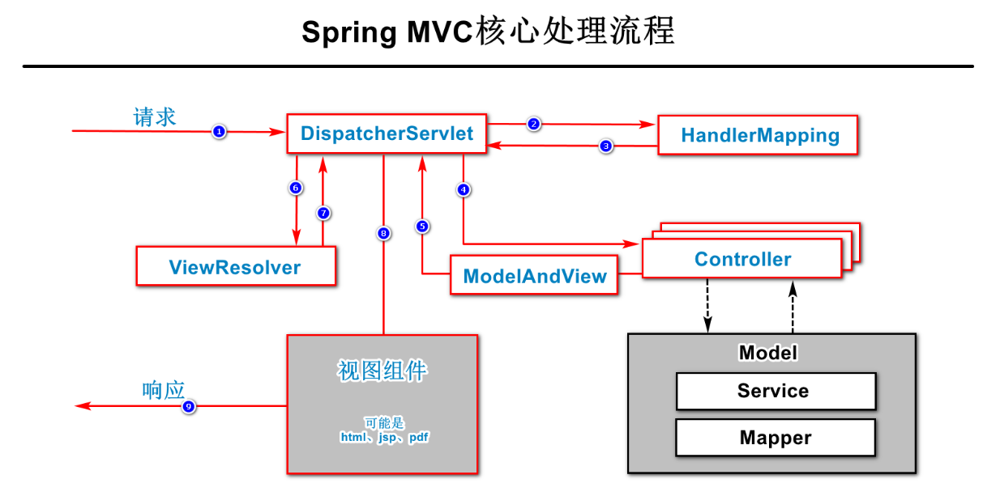

# SpringMVC框架

## 1.关于MVC

- MVC是一种设计理念,它认为每个项目中至少应该有Model、View、Controller这几个组件
  - 当然还有其他组件：例如@Service、@Repository
- MVC提供了一种"角色划分与职责划分"的参考,Model、View、Controller是不同类型的角色，并且负责解决各自的问题
  - 绝不解决别人的问题
- 这样的设计更加利于项目的管理和维护
- MVC并不是唯一的，在不同的开发领域，还存在其他的类似的设计理念，例如MVP、MVVP等... 

## 2.Spring MVC框架的作用

Spring MVC框架主要解决了接收请求、响应结果的相关问题。

## 3. Spring MVC框架的依赖项

当项目中需要使用Spring MVC框架时，需要添加的依赖项是：`spring-webmvc`


## 4. 配置请求路径

通过`@RequestMapping`系列注解可以配置请求路径

## 5. 限制请求方式

通过`@RequestMapping`注解的`method`属性限制请求方式，例如：

```java
@RequestMapping(value = "/login", method = RequestMethod.POST)
```

或者，直接使用衍生的注解，例如`@GetMapping`、`@PostMapping`。

## 6. 接收请求参数

可以在处理请求的方法的参数列表中自由设计请求参数，可以：

- 将各请求参数逐一列举出来，表现为方法的多个参数，例如：

  ```java
  public JsonResult<Void> login(String username, String password) { ... }
  ```

- 将各请求参数封装到自定义的类型中，使用自定义的类型作为方法的参数

关于请求参数的注解：

- `@RequestParam`：此注解可以用于：修改请求参数的名称（没有太多实用价值），强制要求必须提交此参数（可以通过Validation框架的`@NotNull`实现同样效果），设置请求参数的默认值（适用于允许客户端不提交此请求参数时）
- `@PathVariable`：当URL中设计了占位符参数时，必须在对应的方法参数上添加此注解，以表示此参数的值来自URL中的占位符位置的值，如果占位符中的名称与方法参数名称不匹配，可以通过此注解的参数来配置
- `@RequestBody`：当方法的参数添加了此注解时，客户端提交的请求参数必须是对象格式的，当方法的参数没有添加此注解时，客户端提交的请求参数必须是FormData格式的

## 7. 响应结果

默认情况下，处理请求的方法的返回值将表示**“处理响应结果的视图组件的名称，及相关的数据”**，在Spring MVC中，有一种内置的返回值类型是`ModelAndView`，不是前后端分离的做法！

在处理请求的方法上，可以添加`@ResponseBody`注解，当添加此注解后，处理请求的方法的返回值将表示“响应的数据”，不再由服务器端决定视图组件，这种做法也叫做“响应正文”！这是前后端分离的做法！

`@ResponseBody`注解可以添加在处理请求的方法上，将作用于当前方法，也可以添加在控制器类上，将作用于控制器类中所有处理请求的方法！

控制器类需要添加`@Controller`注解，才是控制器类，或者，也可以改为添加`@RestController`，此注解是由`@Controller`和`@ResponseBody`组合而成的！所以，添加`@RestController`后，当前控制器类中所有处理请求的方法都是“响应正文”的！

当控制器处理请求需要响应正文时，Spring MVC框架会根据处理请求的方法的返回值类型，来决定使用某个`MessageConverter`（消息转换器），来将返回值转换为响应到客户端的数据，不同的返回值类型对应不同的消息转换器，例如，返回值类型是`String`时，Spring MVC框架将使用`StringHttpMessageConverter`，如果某个返回值类型是Spring MVC框架没有对应的消息转换器的，且当前项目添加了`jackson-databind`依赖项后，会自动使用此依赖项中的消息转换器，而`jackson-databind`中的消息转换器会将方法返回的结果转换为JSON格式的字符串！另外，如果当前项目是使用XML来配置Spring MVC框架的，还需要添加`<annotation-driven/>`标签以开启“注解驱动”，如果是使用注解进行配置的，则需要在配置类上添加`@EnableWebMvc`注解，如果是在Spring Boot中应用Spring MVC，不需要此配置！

> #### 在MVC中,Controller(控制器)的职责只是接收请求,响应结果,及相关的必要处理
>
> 1. 可能对请求参数的基本格式进行检查
>
>    --- 推荐结合Spring Validation框架处理
>
> 2. 可能对处理过程中发生的错误进行处理
>
>    --- Spring MVC框架提供了统一异常处理机制

## 8. 处理异常

添加了`@ExceptionHandler`注解的方法，就是处理异常的方法。

处理异常的方法到底处理哪种异常，由`@ExceptionHandler`注解参数或方法的参数中的异常类型来决定！如果`@ExceptionHandler`注解没有配置参数，由方法的参数中的异常类型决定，如果`@ExceptionHandler`注解配置了参数，由以注解参数中配置的类型为准！

处理异常的方法可以声明在控制器类，将只作用于当前控制器类中的方法抛出的异常！

通常，建议将处理异常的方法声明在专门的类中，并在此类上添加`@ControllerAdvice`注解，当添加此注解后，此类中特定的方法（例如处理异常的方法）将作用于每次处理请求的过程中！如果处理异常后的将“响应正文”，也可以在处理异常的方法上添加`@ResponseBody`注解，或在当前类上添加`@ResponseBody`，或使用`@RestControllerAdvice`取代`@ControllerAdvice`和`@ResponseBody`。

## 9. Spring MVC框架的核心执行流程



#### 组件解析:

1. **DispatcherServlet**

   是一种前端控制器,由框架提供。

   作用: 统一处理请求和响应,除此之外还是整个流程控制的中心,调用其他组件处理用户的请求

2. **HandlerMapping**

   处理器映射器,由框架提供。

   作用: 根据请求的url、method等信息查找具体的Handler（一般是Controller）

3. **Controller**

   处理器，由工程师开发。

   作用：在DispatcherServlet的控制下，Controller对具体的用户请求进行处理，将处理结果及要跳转的视图封装到一个对象 ModelAndView 中并将其返回给处理器适配器 (HandlerAdaptor)

4. **HandlerAdapter**

   处理器适配器，由框架提供。

   作用：根据映射器找到处理器Handler信息，按照特定的规则去执行相关的处理器

5. **ViewResolver**

   视图解析器，由框架提供。

   作用：负责将处理结果 ModelAndView中的视图名称封装成视图对象（首先根据逻辑视图名解析成物理图名，即具体的页面地址，再生成 View 视图对象）最后对DispatcherServlet调用视图对象让 View 进行渲染并通过页面展示给用户。

#### 服务器集群:


##### 其余可看扩展视频教程:https://tts.tmooc.cn/studentCenter/toMyttsPage

------

## 注解:

| 注解                    | 所属框架   | 作用                                                         |
| ----------------------- | ---------- | :----------------------------------------------------------- |
| `@ResponseBody`         | Spring MVC | 添加在方法上，标记此方法是“响应正文”的，<br />添加在类上，标记此类中所有方法都是“响应正文”的 |
| `@RestController`       | Spring MVC | 添加在类上，标记此类是一个“响应正文”的控制器类               |
| `@RequestMapping`       | Spring MVC | 添加在类上，也可以添加在处理请求的方法上， 通常用于配置请求路径 |
| `@GetMapping`           | Spring MVC | 添加在方法上，是将请求方式限制为`GET`的`@RequestMapping`     |
| `@PostMapping`          | Spring MVC | 添加在方法上，是将请求方式限制为`POST`的`@RequestMapping`    |
| `@DeleteMapping`        | Spring MVC | 添加在方法上，是将请求方式限制为`DELETE`的`@RequestMapping`  |
| `@PutMapping`           | Spring MVC | 添加在方法上，是将请求方式限制为`PUT`的`@RequestMapping`     |
| `@RequestParam`         | Spring MVC | 添加在请求参数上，可以： <br />1. 指定请求参数名称 <br />2. 要求必须提交此参数 <br />3. 指定请求参数的默认值 |
| `@PathVariable`         | Spring MVC | 添加在请求参数上，用于标记此参数的值来自URL中的占位符，如果URL中的占位符名称与方法的参数名称不同，需要配置此注解参数来指定URL中的占位符名称 |
| `@RequestBody`          | Spring MVC | 添加在请求参数上，用于标记此参数必须是对象格式的参数，如果未添加此注解，参数必须是FormData格式的 |
| `@ExceptionHandler`     | Spring MVC | 添加在方法上，标记此方法是处理异常的方法，可以通过配置注解参数来指定需要处理的异常类型，<br />如果没有配置注解参数，所处理的异常类型取决于方法的参数列表中的异常类型 |
| `@ControllerAdvice`     | Spring MVC | 添加在类上，标记此类中特定的方法将作用于每次处理请求的过程中 |
| `@RestControllerAdvice` | Spring MVC | 添加在类上，是`@ControllerAdvice`和`@ResponseBody`的组合注解 |
