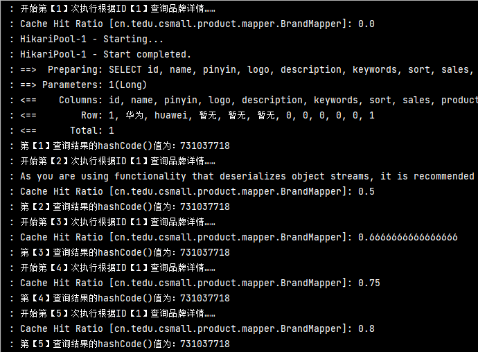
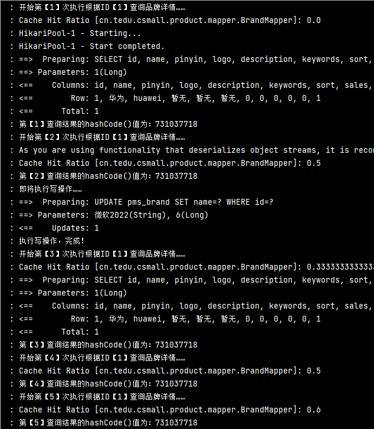

# Mybatis框架的缓存机制

## 什么是缓存？

我们当前第一次从数据库中查询出来的数据会被记录到缓存中，当我们下次查询相同的数据时，会从缓存中获取，不会去访问数据库，比如：

浏览器会对我们页面中的内容进行缓存，当我们再次做相同的访问时，它就不会从服务器中获取，而是从缓存中获取，如果没有了缓存，它就会重新对服务器里的数据库进行访问，缓存的存在可以在一定程度上减轻服务器的压力。

缓存只对查询有效！

**Mybatis框架默认是有2套缓存机制的，分别称之一级缓存和二级缓存。**

## 一级缓存：

Mybatis框架的一级缓存也称之为“会话（Session）缓存”，默认是开启的，且无法关闭！

**一级缓存必须保证多次的查询操作满足：同一个SqlSession、同一个Mapper、执行相同的SQL查询、使用相同的参数。**

关于一级缓存的典型表现可以通过测试以下代码进行观察：

```java
@Slf4j
@SpringBootTest
public class MybatisCacheTests {

    @Autowired
    SqlSessionFactory sqlSessionFactory;

    // Mybatis一级缓存演示
    @Test
    void l1Cache(){
        // 一级缓存必须保证多次的查询操作满足：同一个SqlSession、同一个Mapper、执行相同的SQL查询、使用相同的参数。
        SqlSession sqlsession = sqlSessionFactory.openSession();
        BrandMapper brandMapper = sqlsession.getMapper(BrandMapper.class);
        // 第一次查询后,因缓存原因,第二次执行同一个Mapper时会使用同一个对象,且不会执行查操作
        Long id = 1L;
        log.debug("开始第【1】次执行根据ID【1】查询品牌详情……");
        BrandStandardVO result1 = brandMapper.getStandardById(id);
        log.debug("第【1】查询结果的hashCode()值为：{}", result1.hashCode());
        log.debug("开始第【2】次执行根据ID【1】查询品牌详情……");
        BrandStandardVO result2 = brandMapper.getStandardById(id);
        log.debug("第【2】查询结果的hashCode()值为：{}", result2.hashCode());

        log.debug("第【1】次的查询结果与第【2】的查询结果进行对比，结果：{}", result1 == result2);

        id = 2L;
        log.debug("开始第【1】次执行根据ID【2】查询品牌详情……");
        BrandStandardVO result3 = brandMapper.getStandardById(id);
        log.debug("第【1】查询结果的hashCode()值为：{}", result3.hashCode());
        log.debug("开始第【2】次执行根据ID【2】查询品牌详情……");
        BrandStandardVO result4 = brandMapper.getStandardById(id);
        log.debug("第【2】查询结果的hashCode()值为：{}", result4.hashCode());

        // log.debug("即将调用SqlSession对象的clearCache()方法清除缓存……");
        // sqlSession.clearCache();// 这是用来清除一级缓存的方法之一
        // log.debug("已经清除以前产生的缓存数据！");

        log.debug("即将执行写操作……");// 当执行了写操作(增/删/改),无论任何数据有没有变化,都会清空此前产生的缓存
        Brand brand = new Brand();
        brand.setId(6L);
        brand.setName("微软2022");
        brandMapper.update(brand);
        log.debug("执行写操作，完成！");

        // 当清除了缓存之后,即可重新查询Mapper数据,相当于第一次查询,但再次查询还是会存在缓存
        id = 1L;
        log.debug("开始第【3】次执行根据ID【1】查询品牌详情……");
        BrandStandardVO result5 = brandMapper.getStandardById(id);
        log.debug("第【3】查询结果的hashCode()值为：{}", result5.hashCode());

        id = 2L;
        log.debug("开始第【3】次执行根据ID【2】查询品牌详情……");
        BrandStandardVO result6 = brandMapper.getStandardById(id);
        log.debug("第【3】查询结果的hashCode()值为：{}", result6.hashCode());
    }
}
```

#### 一级缓存的失效：

一级缓存会因为以下任意一种原因而消失：

1. 不是同一个SqlSession
2. 同一个SqlSession但是查询条件不同
3. 调用SqlSession对象的`clearCache()`方法，将清除当前会话中此前产生的所有一级缓存数据
4. 当前执行了任何写操作（增 / 删 / 改），无论任何数据有没有发生变化，都会清空此前产生的缓存数据

## 二级缓存：

1. Mybatis框架的二级缓存也称之为“namespace缓存”，是作用于某个namespace的，具体 表现为：**无论是否为同一个SqlSession，只要执行的是相同的Mapper的查询，且查询参数相同，就可以应用二级缓存。**
2. 二级缓存也是SqlSessionFactory级别，通过同一个SqlSessionFactory创建的SqlSession查询结果会被缓存；此后若再次执行相同的查询语句，结果就会从缓存中获取

在使用Spring Boot与Mybatis的项目中，二级缓存默认是全局开启的，但**各namespace默认并未开启**，如果需要在namespace中开启二级缓存，需要：

1. 在XML文件中添加`<cache/>`标签，则表示当前XML中所有查询都开启了二级缓存！

2. 需要注意：使用二级缓存时，需要保证查询结果的类型实现了`Serializable`接口！

3. 还可以在`<select>`标签上配置`useCache`属性，以配置“是否使用缓存”，此属性的默认值为`true`，表示“使用缓存”。

4. 二级缓存必须在SqlSession关闭或提交之后有效

   - ```java
     sqlSession.close(); // 关闭
     sqlSession.commit(); // 提交
     ```

- ##### 当未发生写操作时:



当应用二级缓存后，在日志上会提示`[Cache Hit Ratio]`，表示“当前namespace缓存命中率”。

#### 二级缓存的失效：

与一级缓存相同，只需要发生任何写操作，都会自动清除缓存数据！

- ##### 当发生写操作时:




Mybatis在查询数据时，会优先尝试从二级缓存中查询是否存在缓存数据，如果命中，将直接返回，如果未命中，则尝试从一级缓存中查询是否存在缓存数据，如果命中，将返回，如果仍未命中，将执行数据库查询。

**二级缓存的示例代码**：

```java
@Autowired
BrandMapper brandMapper;

@Test
void l2Cache() {
    Long id = 1L;
    log.debug("开始第【1】次执行根据ID【1】查询品牌详情……");
    BrandStandardVO result1 = brandMapper.getStandardById(id);
    log.debug("第【1】查询结果的hashCode()值为：{}", result1.hashCode());

    log.debug("开始第【2】次执行根据ID【1】查询品牌详情……");
    BrandStandardVO result2 = brandMapper.getStandardById(id);
    log.debug("第【2】查询结果的hashCode()值为：{}", result2.hashCode());

    log.debug("即将执行写操作……");
    Brand brand = new Brand();
    brand.setId(6L);
    brand.setName("微软2022");
    brandMapper.update(brand);
    log.debug("执行写操作，完成！");

    log.debug("开始第【3】次执行根据ID【1】查询品牌详情……");
    BrandStandardVO result3 = brandMapper.getStandardById(id);
    log.debug("第【3】查询结果的hashCode()值为：{}", result3.hashCode());

    log.debug("开始第【4】次执行根据ID【1】查询品牌详情……");
    BrandStandardVO result4 = brandMapper.getStandardById(id);
    log.debug("第【4】查询结果的hashCode()值为：{}", result4.hashCode());

    log.debug("开始第【5】次执行根据ID【1】查询品牌详情……");
    BrandStandardVO result5 = brandMapper.getStandardById(id);
    log.debug("第【5】查询结果的hashCode()值为：{}", result5.hashCode());
}
```

提示：一定要在XML中添加`<cache>`才能够使用二级缓存。