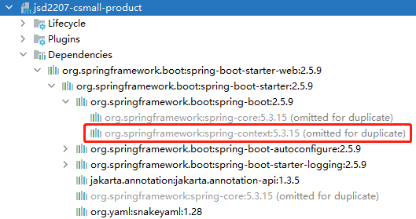

# Spring框架

## 1. Spring框架的作用

Spring框架主要解决了创建对象、管理对象的问题。

## 2. Spring框架的依赖项

当项目中需要使用Spring框架时，需要添加的依赖项是：`spring-context`



## 3. Spring框架创建对象的做法

#### Spring框架创建对象有2种做法：

1. 在任何配置类（添加了`@Configuration`）中，自定义方法，返回某种类型的（你需要的）对象，并在方法上添加`@Bean`注解

   - 此方式创建出来的对象，在Spring容器中的名称就是方法名称
   - 此方法应该是`public`
   - 此方法的返回值类型，是你期望Spring框架管理的数据的类型
   - 此方法的参数列表，应该为空
   - 此方法的方法体，应该是自行设计的，没有要求

2. 配置组件扫描，并在组件类上添加组件注解

   - 此方式创建出来的对象，在Spring容器中的名称默认是将类名首字母改为小写

     - 例如：类名是`AdminController`，则对象在Spring容器中的名称为`adminController`
     - 此规则仅适用于类名的第1个字母大写，且第2个字母小写的情况，如果不符合此规则，则对象在Spring容器中的名称就是类名
     - 可以通过组件注解的参数来指定名称

   - 在任何配置类上，添加`@ComponentScan`，当加载此配置类时，就会激活组件扫描

   - 可以配置`@ComponentScan`的参数，此参数应该是需要被扫描的根包（会扫描所配置的包，及其所有子孙包），且此注解参数的值是数组类型的

     - 例如：

     - ```java
       @ComponentScan("cn.tedu")
       ```

     - 配置类xml中时:

       - ```xml
         <!-- 扫描controller包下的所有控制器组类 -->
         <context:component-Scan base-package="cn.tedu.controller"></context>
         ```
   
   - 如果没有配置`@ComponentScan`的参数中的根包，则组件扫描的范围就是当前类的包及其子孙包
   
   - 需要在各组件类上添加组件注解，才会被创建对象，常见的组件注解有：
   
     - `@Component`：通用注解
   
     - ```java
       @Controller
       ```
   
       ：控制器类的注解
   
       - `@RestController`：仅添加Spring MVC框架后可使用
       - `@ControllerAdvice`：仅添加Spring MVC框架后可使用(SpringMVC的全局异常处理)
       - `@RestControllerAdvice`：仅添加Spring MVC框架后可使用(SpringMVC的全局异常处理)
   
     - `@Service`：Service这种业务类的注解
   
     - `@Repository`：处理数据源中的数据读写的类的注解
   
   - 以上4种组件注解在Spring框架作用范围之内是完全等效的
   
   - 在Spring框架中，还有`@Configuration`注解，也是组件注解的一种，但是Spring对此注解的处理更加特殊（Spring框架对配置类使用了代理模式）

对于这2种创建对象的做法，通常：

- 如果是自定义的类，优先使用组件扫描的做法来创建对象

  - 例如配置类、Mapper层、Service层、控制器类。

- 如果不是自定义的类，无法使用组件扫描的做法，只能在配置类中通过`@Bean`方法来创建对象

  - 例如认证权限项目的Security配置类中利用@Bean注解创建密码编码器和认证信息接口

    ```java
    /**
     * 配置密码编译器,否则无法验证密码是否正确,服务端会报错
     * @return 密码编码器
     */
    @Bean
    public PasswordEncoder passwordEncoder(){
        return new BCryptPasswordEncoder();
    }
    
    /**
     * 重写认证信息接口
     * @return AuthenticationManager
     * @throws Exception Exception
     */
    @Bean// 该注解便于Spring框架进行管理,自动调用,放入容器,利于自动装配
    @Override
    public AuthenticationManager authenticationManagerBean() throws Exception {
        return super.authenticationManagerBean();
    }
    ```


当Spring成功的创建了对象后，会将对象保存在Spring应用程序上下文（`ApplicationContext`）中，后续，当需要这些对象时，可以从Spring应用程序上下文中获取！

由于Spring应用程序上下文中持有大量对象的引用，所以，Spring应用程序上下文也通常被称之为“Spring容器”。

## 4. Spring框架管理的对象的作用域

默认情况下，Spring框架管理的对象都是单例的！

单例：在任何时间点，某个类的对象最多只有1个！

可以在类上添加`@Scope("prototype")`使得被Spring管理的对象是“非单例的”。

> 提示：`@Scope`注解还可以配置为`@Scope("singleton")`，此`singleton`表示“单例的”，是默认的。

默认情况下，Spring框架管理的**单例的**对象是“预加载的”，相当于设计模式中的单例模式的“饿汉式单例模式”。

> 提示：可以在类上添加`@Lazy`注解，使得此对象是“懒加载的”，相当于“懒汉式单例模式”，只会在第1次需要获取对象时才把对象创建出来！

注意：Spring框架并不是使用了设计模式中的“单例模式”，只是从对象的管理方面，对象的作用域表现与单例模式的极为相似而已。

## 5.SpringBean的生命周期

大致分为五个阶段：

1. **创建前准备**：Bean在加载之前需要从上下文和配置中解析查找Bean有关的扩展实现
   1. init-method：容器在初始化Bean的时候会调用的方法
   2. destory-method：容器在销毁Bean的时候会调用的方法
   3. BeanFactoryPostProcessor这一类的Bean加载过程前置和后置的一些处理扩展实现
2. **创建实例化**：通过反射区创建Bean的实例对象，并且会扫描和解析Bean声明的一些属性
3. **依赖注入**：被实例化的Bean存在依赖其他Bean对象的情况，对这些依赖的Bean进行对象注入，比如：`@Autowired`、`@Setter`
4. **容器缓存**：把Bean保存到容器以及Spring的缓存中，可以被开发者使用
   1. 调用init-method方法在配置中属性指定的方法
   2. 调用BeanPostProcessor的后置处理器方法
5. **销毁实例**：当Spring的应用上下文被关闭后，上下文所有的Bean会被销毁
   1. 如果存在Bean实现了DisposableBean接口或配置destory-method属性的一些方法会在此阶段被调用

## 5. 自动装配

自动装配：当某个量需要值时，Spring框架会自动的从容器中找到合适的值，为这个量赋值。

自动装配的典型表现是在属性上添加`@Autowired`注解，例如：

```java
@RestController
public class AlbumController {

    // ↓↓↓↓↓  自动装配的典型表现  ↓↓↓↓↓
    @Autowired
    private IAlbumService albumService;
}
```

或者：

```java
@RestController
public class AlbumController {

    private IAlbumService albumService;
    
    //                     ↓↓↓↓↓↓↓  自动装配  ↓↓↓↓↓↓↓
    public AlbumController(IAlbumService albumService) {
        this.albumService = albumService;
    }
}
```

> 提示：Spring创建对象时需要调用构造方法，如果类中仅有1个构造方法（如上所示），Spring会自动调用，如果这唯一的构造方法是有参数的，Spring也会自动从容器中找到合适的对象来调用此构造方法，如果容器没有合适的对象，则无法创建！如果类中有多个构造方法，默认情况下，Spring会自动调用添加了`@Autowired`注解的构造方法，如果多个构造方法都没有添加此注解，则Spring会自动调用无参数的构造方法，如果也不存在无参数构造方法，则会报错！

另外，在配置类中的`@Bean`方法也可以在需要的时候自行添加参数，如果Spring容器中有合适的值，Spring也会从容器中找到值来调用方法。

关于“合适的值”，Spring对于`@Autowired`的处理机制是：查找在Spring容器中**匹配类型的对象**的数量：

- 1个：直接装配，且装配成功
- 0个：取决于`@Autowired`注解的`required`属性
  - `true`（默认值）：装配失败，在加载时即报错----为true说明必须装配
  - `false`：放弃装配，则此量的值为`null`，在接下来的使用过程中可能导致NPE（`NullPointerException`）
- 超过1个：取决于是否存在某个Spring Bean（Spring容器中的对象）的名称**与当前量的名称匹配**
  - 存在：成功装配
  - 不存在：装配失败，在加载时即报错

关于通过名称匹配：

- 默认情况下，要求量（全局变量、方法参数等）的名称与对象在Spring容器中名称完全相同，视为匹配
- 可以在量（全局变量、方法参数等）的声明之前添加`@Qualifier`注解，**通过此注解参数来指定名称**，以匹配某个Spring容器的对象
  - `@Qualifier`注解是用于配合自动装配机制的，单独使用没有意义

其实，还可以使用`@Resource`注解实现自动装配，但不推荐！

Spring框架对`@Resource`注解的自动装配机制是：先根据名称再根据类型来实现自动装配。

`@Resource`是`javax`包中的注解，根据此注解的声明，此注解只能添加在类上、属性上、方法上，不可以添加在构造方法上、方法的参数上。

## 6. 关于IoC与DI

**IoC**：**I**nversion **o**f **C**ontrol，控制反转，即将对象的创建、管理的权力（控制能力）交给框架

IOC是一种面向对象编程的设计思想,在不采用这种思想的情况下,我们需要自己去维护对象于对象之间的依赖关系,很容易造成对象之间的耦合度过高,在一个大型项目中,十分不利于代码的维护,IOC则可以解决这种问题,它可以帮我们维护对象与对象之间的依赖关系,将对象的创建控制权交由框架解决和管理,降低对象之间的耦合

**DI**：**D**ependency **I**njection，依赖注入，即为依赖项注入值

DI是IOC实现的实现方式,由于IOC这个词汇比较抽象,很多时候我们会用DI来代替IOC,简单将两者划上等号,实现依赖注入的关键是IOC容器,它的本质是一个工厂.

**关系:** Spring框架通过 DI 实现/完善了IoC。

## 7.Spring框架的核心模块

Spring Core：核心类库，提供IOC服务；

Spring Context：提供框架级别的Bean访问方式以及企业级功能（定时任务）；

Spring AOP：面向切面编程思想，提供面向切面的服务；

Spring DAO：对JDBC的抽象封装简化数据访问的操作（以类型或对象的形式传递数据）；

Spring ORM：对现有ORM框架的支持；

> ORM全称对象关系映射（Object/Relation Mapping），指**将Java对象状态自动映射到关系数据库中的数据上**，从而提供透明化的持久化支持，即把一种形式转化为另一种形式。

Spring Web：提供基本面向Web的综合特征（多文件上传）；

Spring MVC：提供面向Web应用的Model-View-Controller实现；

Spring Test：提供了对JUnit和TestNG测试的支持；

Spring Aspect：该模块位于AspectJ的集成提供支持；

------

# 注解:

| 注解                           | 所属框架 | 作用                                                         |
| ------------------------------ | -------- | ------------------------------------------------------------ |
| `@ComponentScan`               | Spring   | 添加在配置类上，开启组件扫描。<br />如果没有配置包名，则扫描当前配置类所在的包，<br />如果配置了包名，则扫描所配置的包及其子孙包 |
| `@Component`                   | Spring   | 添加在类上，标记当前类是组件类，可以通过参数配置Spring Bean名称 |
| `@Controller`                  | Spring   | 添加在类上，标记当前类是控制器组件类，用法同`@Component`     |
| `@Service`                     | Spring   | 添加在类上，标记当前类是业务逻辑组件类，用法同`@Component`   |
| `@Repository`                  | Spring   | 添加在类上，标记当前类是数据访问组件类，用法同`@Component`   |
| `@Configuration`               | Spring   | 添加在类上，仅添加此注解的类才被视为配置类，通常不配置注解参数 |
| `@Bean`                        | Spring   | 添加在方法上，标记此方法将返回某个类型的对象，<br />且Spring会自动调用此方法，并将对象保存在Spring容器中 |
| `@Autowired`                   | Spring   | 添加在属性上，使得Spring自动装配此属性的值 <br />添加在构造方法上，使得Spring自动调用此构造方法<br />添加在Setter方法上，使得Spring自动调用此方法 |
| `@Qualifier`                   | Spring   | 添加在属性上，或添加在方法的参数上， <br />配合自动装配机制，用于指定需要装配的Spring Bean的名称 |
| `@Scope`                       | Spring   | 添加在组件类上，或添加在已经添加了`@Bean`注解的方法上，<br />用于指定作用域，注解参数为`singleton`（默认）时为“单例”，注解参数为`prototype`时为“非单例” |
| `@Lazy`                        | Spring   | 添加在组件类上，或添加在已经添加了`@Bean`注解的方法上， <br />用于指定作用域，当Spring Bean是单例时，注解参数为`true`（默认）时为“懒加载”，注解参数为`false`时为“预加载” |
| `@Value`                       | Spring   | 添加在属性上，或添加在被Spring调用的方法的参数上，<br/>用于读取`Environment`中的属性值，为对象的属性或方法的参数注入值 |
| `@Resource`                    | Spring   | 此注解是`javax`包中的注解，<br />添加在属性上，使得Spring自动装配此属性的值， <br />通常不推荐使用此注解 |
| `@EnableScheduling`            | Spring   | 只能添加在类上 <br/>作用在配置类上,用来开启计划任务,例如定时向Redis中加载缓存 |
| `@EnableTransactionManagement` | Spring   | 只能添加在类上<br/>用来开启事务管理                          |

## 8.总结资料:

**地址**:https://www.processon.com/view/link/60ec02b9f346fb6bcd28ae80