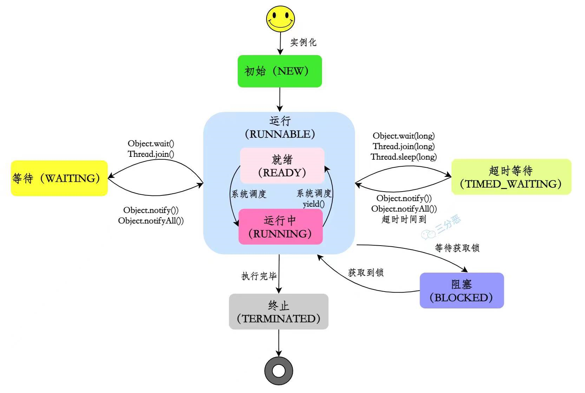
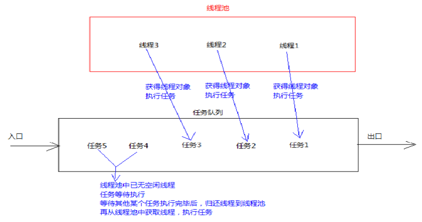

# 有关线程的重要知识:

## 1.进程和线程?

**进程**：

是指计算机中的某个完整服务，需要占用某个端口进行启动，由内核调度。

例如：MySQL服务、Nginx服务、Redis服务、SpringBoot项目......

**线程**：

是指进程中的一个执行流程，一个进程可以运行多个线程。

例如：java.exe进程可以运行很多线程。

线程总是输入某个进程，进程中的多个线程共享进程的内存。

## 2.线程的好处?

- 使程序运行的更快!

- 充分利用CPU资源,目前几乎没有线上的CPU是单核的,发挥多核CPU强大的能力

## 3.多线程的实现方式:

- ##### 继承Thread类创建线程

- ##### 实现Runnable接口创建线程

- ##### 实现Callable接口通过FutureTask包装器来创建Thread线程

- ##### 使用线程池创建线程,使用线程池接口ExecutorsService结合Callable,Future实现又返回结果的多线程

前面两种【无返回值】原因：通过重写run方法，run方法的返回值是void，所以没有办法返回结果。  后面两种【有返回值】原因：通过Callable接口，就要实现call方法，这个方法的返回值是Object，所以返回的结果可以放在Object对象中。

## 4.几种方式的实现及区别:

#### 1.实现Runnable、Callable接口

**优势**： 线程类只是实现了Runnable接口或Callable接口，还可以继承其他类。   在这种方式下，多个线程可以共享同一个target对象，所以非常适合多个相同线程来处理同一份资源的情况，从而可以将CPU、代码和数据分开，形成清晰的模型，较好地体现了面向对象的思想。   

**劣势**： 编程稍微复杂，如果要访问当前线程，则必须使用Thread.currentThread()方法。

#### 2.继承Thread类

**优势**：  编写简单，如果需要访问当前线程，则无需使用Thread.currentThread()方法，直接使用this即可获得当前线程。

#### Runnable和 Callable的区别

Runnable没有返回值，Callable可以拿到有返回值，Callable可以看作是 Runnable的补充。

## 5.线程的启动方式:

(1).**将类声明为 Thread 的子类**。该子类应重写 Thread 类的 run 方法，然后在 run 方法里填写相应的逻辑代码。 

(2).**实现 Runnable 接口**，并编写 run 方法,相比继承 Thread 类创建线程的好处是 以实现接口的方式创建线程可以对类进行更好的扩展，该类可以继承其他类来扩展自身需求

相比第一种方式更加灵活，扩展性强。 线程对象创建后，其他线程(比如main线程）调用了该对象的start()方法。该状态的线程位于可运行线程池中，等待被线程调度选中，获取CPU的使用权，此时处于就绪状态（ready）。就绪状态的线程在获得CPU时间片后变为运行中状态（running）。

## 6.线程的状态:

- 初始(New)：刚创建尚未启动的状态

  ```java
  Thread t = new Thread();
  ```

- 运行(Runnable)：可运行的状态，正在等待处理器CPU调度执行

- 阻塞(Blocked)：表示线程阻塞于锁。

- 等待(Waiting)：等待线程的状态，处于等待另一线程执行特定完对应操作

  ```java
  Object.wait();
  ```

- 超时等待(Timed_waiting)：具有等待时间的等待线程的线程状态

  ```java
  Thread.sleep    
  Object.wait // 超时
  Thread.join // 超时
  ```

- 终止(Terminated)：结束,终止线程的线程状态,线程已完成执行!



## 7.线程池:

#### 1.什么是线程池?

<u>线程池就是一个容纳多个线程的容器,其中的线程可以反复使用,省去了频繁创建线程对象的操作.</u>



#### 2.线程的执行过程

- ##### 线程任务----Runnable.

- ##### 创建线程----new Thread().

- ##### 启动线程----start().

- ##### 并发执行中----Running.

- ##### 任务执行完毕----Dead.

- ##### 线程销毁----gc回收.

#### 3.线程池的使用

Executors:创建线程池的工厂类,用于创建线程池对象.

ExecutorService:线程池接口,规定了线程池相关功能方法.

#### 4.创建线程池:

ExecutorServuice pool = Executors.newDixedThreadPool(容量);

#### 5.线程池的关闭

- shutdown()

  1.不再接收新的任务了.

  2.将现有任务执行完毕.

  3.结束池中所有的线程.

- shutdownNow()

  1.不再接收新的任务了.

  2.中断线程池中的所有线程.

#### 6.线程池的好处

- 降低资源消耗:通过重复利用已创建的线程,降低线程创建和销毁造成的消耗.

- 提高响应速度:当任务到达时,任务可以不需要等到线程创建就能立即执行.

- 增加线程的可管理性:线程是稀缺资源,使用线程池可以进行统一分配,调优和监控.