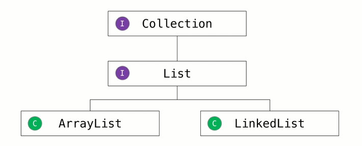
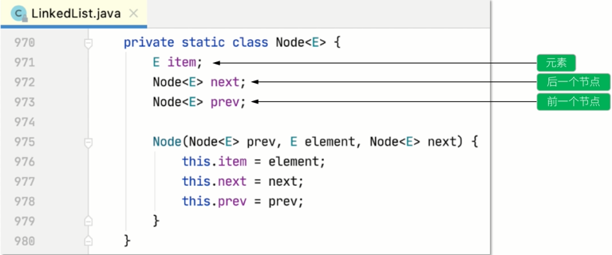
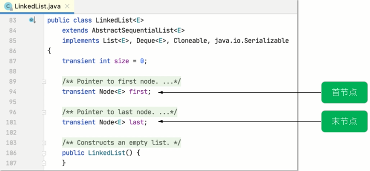
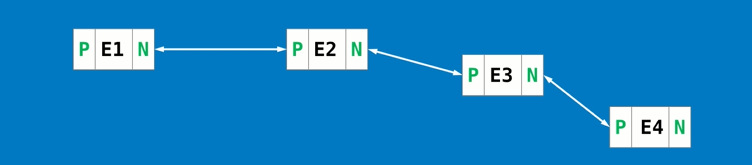
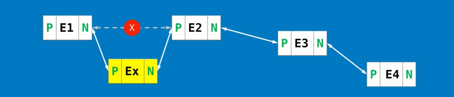
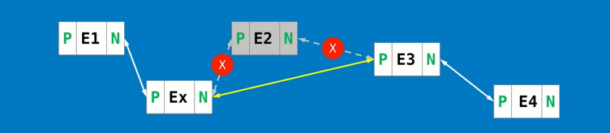
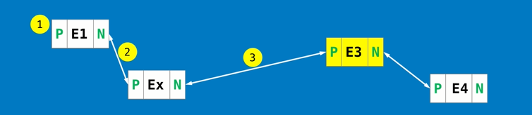
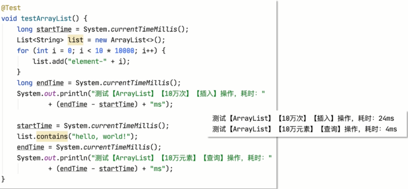
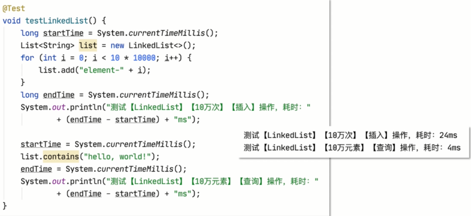
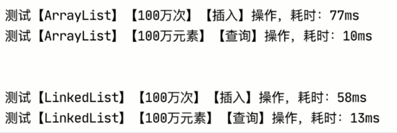

# ArrayList和LinkedList的区别

## 1.ArrayList与LinkedList的共同点?

- #### 都是List接口的实现类

  - 都是序列的,可存储相同元素

  - 绝大部分情况下,不关心特有方法

    

- #### 关于"序列的":

  - 在List集合中的各个元素都有索引,类似数组下标,是顺序编号的
  - 不推荐描述为"有序的",详见后续LinkedList的存储结构
  - 同理,不要将Set集合描述为"无序的",只能描述为"散列的",例如TreeSet,LinkedHashSet的各个元素就可以表现出"有序的特征

- #### 关于"存储相同元素":

  - 在使用集合时,仅当2个对象的HashCode()返回值相同,且equals()对比结果为true时,视为"相同"
    - Set集合不能存储相同元素

## 2.ArrayList和LinkedList的区别?

- #### ArrayList的底层实现是基于数组的

  - ##### 优点:查询效率高

  

  - ##### 缺点:修改效率低

    

- #### LinkedList的底层实现是基于双向链表的

  - ##### 内部使用"节点Node"管理元素

    

    

  - ##### 每个元素都存在着"节点",通过节点互相连接

    

  - ##### 优点:修改效率高----增加

    

  - ##### 优点:修改效率高----删除

    

  - ##### 缺点:查询效率偏低-----ArrayList可以根据下标来查找元素,LinkedList需要寻找下一个元素的节点后进行连接

    

- #### 因为LinkedList的底层实现基于双向链表,当添加元素时,本质是基于新元素创建"节点",每一个节点需要记录指向前一个节点和后一个节点的引用,占用的存储空间更多

## 3.错误的表达

- #### 当需要查询时,使用ArrayList;当需要修改时,使用LinkedList

- #### 解读:

  - ##### 尽管ArrayList易读难写,但是,没有写入数据,则无从读起

  - ##### 尽管LinkedList易写难读,但是,光写入,不读取,没有任何意义

  - ##### ArrayList和LinkedList这2者之间也没有继承关系,不可互相转换

  - ##### 该"错误的表达"是因为描述不精准

## 4.关于效率的测试

- ##### ArrayList:

- 

- ##### LinkedList:

- 

- #### 如果将以上测试的数据量修改为100万:

- 

## 5.关于存储空间与执行效率

- ##### 目前主流的计算机或服务器的性能均非常优秀,无论是运行速度还是存储容量都非常高,在不结合实际情况时,单纯的讨论存储空间或执行效率没有任何意义

  - 例如:你有10万个"hello,world!"在内存中没有销毁,形成了浪费,将无谓的占用内存中12乘2乘100000=24000000字节,约2.3MB内存
    - 如果是单机应用,或访问频率非常低的服务端应用,负面影响并不明显
    - 如果是访问频率非常高的服务器端应用,负面影响将非常明显

- ##### 如果对程序的运行效率的要求非常高,可以事先分析读写频率,并根据分析结果使用ArrayList或LinkedList.

  - 所以,此前分析的"误区"在于描述不精准,大致方向并没有问题

## 6.扩展

- #### 无论是ArrayList,还是LinkedList,都是线程不安全的,当在多线程中需要使用List时,应该用CopyOnWriteArrayList

## 总结(1/3)

- ##### 相同之处:

  - 都是List接口的实现类
    - 都是序列的,可存储相同元素
    - 绝大部分情况下,不关心特有方法
  - 都是线程不安全的

## 总结(2/3)

- ##### 不同之处:

  - ArrayList的底层实现是基于数组的,所以,查询效率高,但修改效率偏低
  - LinkedList的底层实现是基于双向链表的,所以,查询效率偏低,但修改效率高,另外,其内部本质上管理的是多个节点,每个节点需要记录指向前一个节点和后一个节点的引用,占用存储空间会更多

## 总结(3/3)

- 实际使用原则:在使用简单的字符串作为集合元素时,在10万级别的元素数量时,ArrayList和LinkedList的性能差异并不明显(在绝大部分情况下,使用List时的元素数量都不超过100个,尽管元素数据更加复杂),并且,不可以单纯的只读不写或只写不读,同时,基于ArrayList占用的存储空间更少,一般使用ArrayList即可,仅当需要极致的追求性能时,再根据读写频率来区分使用,但是,当需要考虑线程安全问题时,则使用CopyOnWriteArrayList.