# 什么是Volatile?

- ### volatile是Java语言中的一个关键字,可以修饰类的属性

  - 其英文释义一般是:**不稳定的**

  - ```java
    public class VolatileDemo{
        public volatile int i;
    }
    ```

- ### volatile的主要作用是:

  - ##### 禁止指令重排

  - ##### 确保多线程时属性的可见性

## 关于指令重排:

- ##### 在代码没有依赖关系的前提下,处于优化的目的,CPU和编译器均可能会对指令进行重新排序,可能导致执行顺序与源代码顺序并不相同

  ```java
  //以下2行代码的执行先后顺序可以被改变,并且不会出现任何错误,可能会被指令重排
  int x = 5;
  int y = 8;
  ```

  ```java
  //以下2行代码的执行先后顺序不会被改变,存在依赖关系
  int x = 5;
  int y = x + 8;
  ```

- ##### 但是,在多线程下,指令重排可能导致运行结果不符合预期

  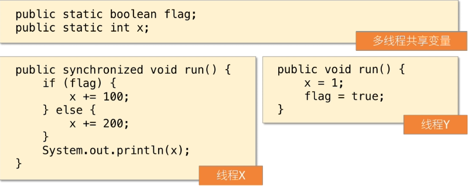

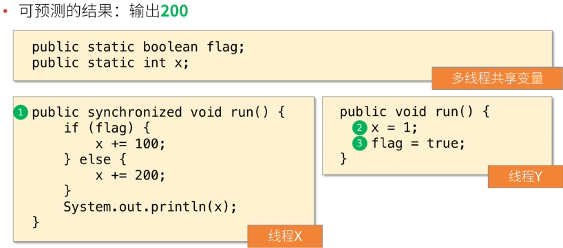

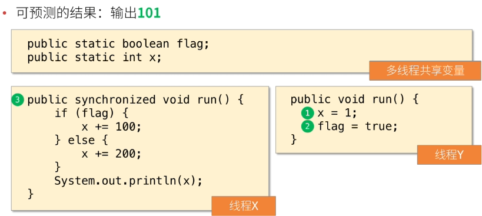

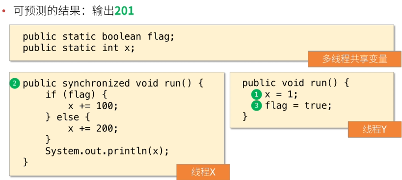

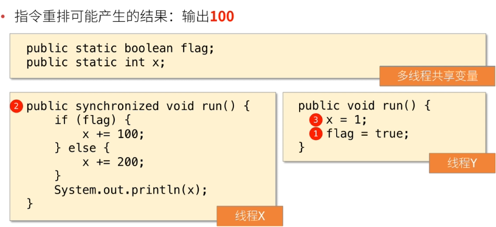

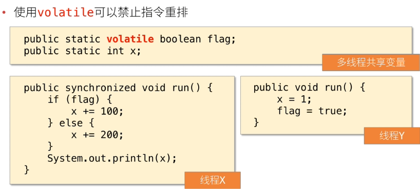

- ##### 指令重排时CPU和编译器决定的,一定程度上人为不可控

- ##### 指令重排的目的是优化指令提高执行效率,在单线程中,执行结果不会出现问题,但是,在多线程中,可能出现预期外的结果,所以,应该为共享变量添加`volatile`关键字进行修饰

## 关于属性的可见性:

- ##### 每个线程的执行过程中,有专属的工作内存空间,当需要某个值时,会优先从工作内存中查找,如果工作内存中没有,则会从主内存中将值复制到工作内存中并缓存.

- ##### 在多线程情景下,可能存在:X线程已经将值缓存到工作内存中,Y线程改变了主内存的值,但X线程仍使用工作内存中缓存的值(尚未从主内存中同步最新的值)

- #### 以下代码中,主线程无法停止子线程:

  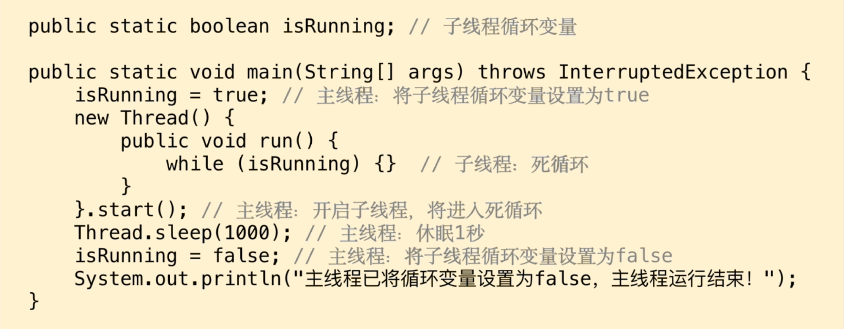

  - ##### 事实上子线程最终并不会停止

    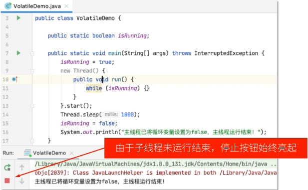

- #### 内存图如下:

  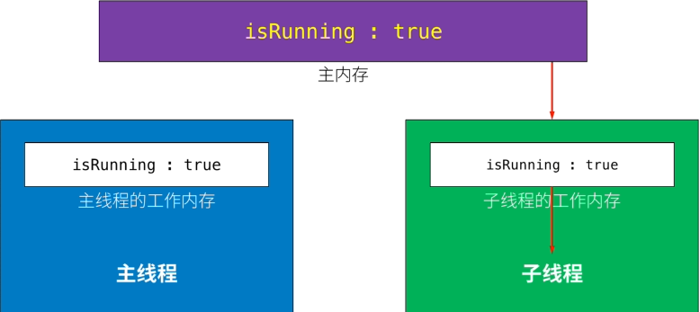

  - ##### 子线程在高频率的死循环,并没有及时更新主线程中的isRunning:false,而是使用自己工作内存中缓存的isRunning:true值,故无法改变死循环的状态(若给子线程添加休眠即可解决)

    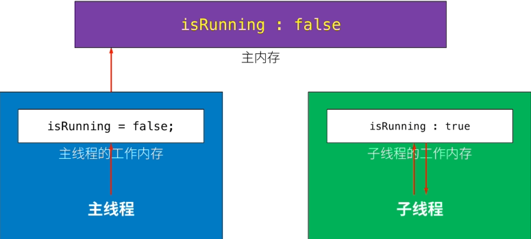

- #### 添加volatile即可解决此问题

  - ##### 添加volatile后子线程一定会到主线程中拿到改变后的isRunning:false值从而改变死循环状态

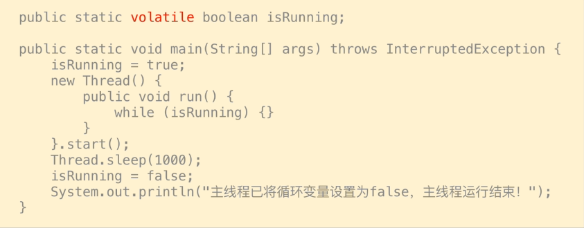

- #### 在多线程中,由于各线程会优先从工作内存中获取共享变量的值,可能导致某线程更新了共享变量的值,但其他线程仍使用工作内存中缓存的值,出现属性可见性的问题,添加`volatile`即可解决问题

## 常见误区:

- #### 误区:使用synchronized后不需要使用volatile

- ##### 解读:两者都是用于解决多线程相关问题的,但问题的情景并不相同,通常,使用synchronized解决问题大多是"多个线程执行相同的代码"的情景,而使用volatile解决的问题大多是"多个线程执行的代码不同,但使用到了相同的共享变量"的情景

## 总结(1/3)

- #### 关于volatile:

  - ##### 它是一个关键字,用于修饰类的成员属性

  - ##### 它的主要作用有:

    - 禁止指令重排
    - 确保多线程时属性的可见性

## 总结(2/3)

- #### synchronized和volatile均不可替代彼此,虽然两者都是用于解决多线程相关问题的,但问题的情景并不相同,通常,使用synchronized解决的问题大多是"多线程执行相同的代码"的情景,而使用volatile解决的问题大多是"多个线程执行的代码不同,但使用到了共享变量"的情景

## 总结(3/3)

- #### 实际使用原则:当某个属性出现在多个方法中,至少有1个方法会改变该属性的值,且这些方法可能同时被不同的线程执行,则应该为属性添加`volatile`关键字.