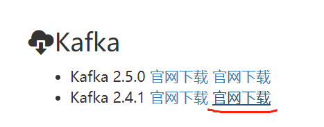

# Kafka消息中间件

## 一、什么是Kafka

Kafka是由Apache软件基金会开发的一个开源流处理平台，由Scala和Java编写。该项目的目标是为处理实时数据提供一个统一、高吞吐、低延迟的平台。Kafka最初是由LinkedIn开发，并随后于2011年初开源。

## 二、kafka软件结构

Kafka是一个结构相对简单的消息队列(MQ)软件

kafka软件结构图


Kafka Cluster(Kafka集群)

Producer:消息的发送方,也就是消息的来源,Kafka中的生产者

> order就是消息的发送方,在Dubbo中order是消费者,这个身份变化了

Consumer:消息的接收方,也是消息的目标,Kafka中的消费者

> stock就是消息的接收方,在Dubbo中stock是生产者,这个身份变化了

Topic:话题或主题的意思,消息的收发双方要依据同一个话题名称,才不会将信息错发给别人

Record:消息记录,就是生产者和消费者传递的信息内容,保存在指定的Topic中

## 三、Kafka的特征与优势

Kafka作为消息队列,它和其他同类产品相比,突出的特点就是性能强大

Kafka将消息队列中的信息保存在硬盘中

Kafka对硬盘的读取规则进行优化后,效率能够接近内存

硬盘的优化规则主要依靠"顺序读写,零拷贝,日志压缩等技术"

Kafka处理队列中数据的默认设置:

- Kafka队列信息能够一直向硬盘中保存(理论上没有大小限制)
- Kafka默认队列中的信息保存7天,可以配置这个时间,缩短这个时间可以减少Kafka的磁盘消耗

## 四、Kafka的安装和配置（windows）



必须将我们kafka软件的解压位置设置在一个根目录,文件夹名称尽量短(例如:kafka)

然后路径不要有空格和中文


我们要创建一个空目录用于保存Kafka运行过程中产生的数据

本次创建名称为data的空目录

下面进行Kafka启动前的配置

先到D:\kafka\config下配置有文件zookeeper.properties

找到dataDir属性修改如下

```
dataDir=D:/data
```

修改完毕之后要Ctrl+S进行保存,否则修改无效!!!!

注意E盘和data文件夹名称,匹配自己电脑的真实路径和文件夹名称

还要修改server.properties配置文件

```
log.dirs=D:/data
```

修改注意事项和上面相同

## 五、启动kafka

要想启动Kafka必须先启动Zookeeper

### 1.Zookeeper介绍

zoo:动物园

keeper:园长

可以引申为管理动物的人

Linux服务器中安装的各种软件,很多都是有动物形象的

如果这些软件在Linux中需要修改配置信息的话,就需要进入这个软件,去修改配置,每个软件都需要单独修改配置的话,工作量很大

我们使用Zookeeper之后,可以创建一个新的管理各种软件配置的文件管理系统

Linux系统中各个软件的配置文件集中到Zookeeper中

实现在Zookeeper中,可以修改服务器系统中的各个软件配置信息

长此以往,很多软件就删除了自己写配置文件的功能,而直接从Zookeeper中获取

Kafka就是需要将配置编写在Zookeeper中的软件之一

所以要先启动zookeeper才能启动kafka

### 2.Zookeeper启动

进入路径D:\kafka\bin\windows

输入cmd进入dos命令行

```
D:\kafka\bin\windows>zookeeper-server-start.bat ..\..\config\zookeeper.properties
```

### 3.kafka启动

总体方式一样,输入不同指令

```
E:\kafka\bin\windows>kafka-server-start.bat ..\..\config\server.properties
```

**附录**

Mac系统启动Kafka服务命令（参考）：

```
# 进入Kafka文件夹
cd Documents/kafka_2.13-2.4.1/bin/
# 动Zookeeper服务
./zookeeper-server-start.sh -daemon ../config/zookeeper.properties 
# 启动Kafka服务
./kafka-server-start.sh -daemon ../config/server.properties 
```

Mac系统关闭Kafka服务命令（参考）：

```
# 关闭Kafka服务
./kafka-server-stop.sh 
# 启动Zookeeper服务
./zookeeper-server-stop.sh
```

在启动kafka时有一个常见错误

```
wmic不是内部或外部命令
```

这样的提示,需要安装wmic命令,安装方式参考

https://zhidao.baidu.com/question/295061710.html

如果启动kafka无响应

在“环境变量”的“用户变量路径”中Path属性添加一行后

```
%SystemRoot%\System32\Wbem;%SystemRoot%\System32\;%SystemRoot%
```

## 六、Kafka使用演示

启动的zookeeper和kafka的窗口不要关闭

我们在csmall项目中编写一个kafka使用的演示

csmall-cart-webapi模块

添加依赖

```xml
<!-- SpringBoot整合Kafka的依赖  -->
<dependency>
    <groupId>org.springframework.kafka</groupId>
    <artifactId>spring-kafka</artifactId>
</dependency>
<!--   google提供的可以将java对象转化为json格式字符串的工具   -->
<dependency>
    <groupId>com.google.code.gson</groupId>
    <artifactId>gson</artifactId>
</dependency>
```

修改yml文件进行配置

```yaml
spring:
  kafka:
    # 定义kafka的位置
    bootstrap-servers: localhost:9092
    # consumer.group-id是spring-kafka框架要求必须配置的内容,不配置启动会报错
    # 作用是给话题分组,防止不同项目中恰巧相同的话题名称混淆
    # 本质上,在当前项目发送消息给kafka是,会使用我们配置的csmall作为话题名称前缀
    # 例如发送一个话题名称为message的消息,真正发送到kafka的话题名称为csmall_message
    consumer:
      group-id: csmall
```

在SpringBoot启动类中添加启动Kafka的注解

```java
@SpringBootApplication
@EnableDubbo
// 项目启动时启用对kafka的支持
@EnableKafka
// 为了测试kafka收发消息
// 我们利用SpringBoot自带的定时任务工具,周期性的向kafka发送消息
// 明确我们SpringBoot自带定时任务和Kafka没有必然联系
@EnableScheduling
public class CsmallCartWebapiApplication {

    public static void main(String[] args) {
        SpringApplication.run(CsmallCartWebapiApplication.class, args);
    }
}
```

下面我们就可以实现周期性的向kafka发送消息并接收的操作了

编写消息的发送

cart-webapi包下创建kafka包

包中创建Producer类来发送消息

```java
// 启动时要将这个类实例化保存到Spring容器,才能执行周期运行的效果
@Component
public class Producer {

    // Spring-Kafka框架会自动将能够操作发送消息的对象注入到Spring容器
    // 我们直接使用@Autowired自动装配即可
    // KafkaTemplate<[话题类型],[消息类型]>
    @Autowired
    private KafkaTemplate<String,String> kafkaTemplate;

    // 定义话题常量
    public static final String TOPIC_KEY="myCart";
    
    int i=1;
    // 编写实现每隔8秒(8000毫秒)运行一次的方法来发送消息到Kafka
    @Scheduled(fixedRate = 8000)
    public void sendMessage(){
        // 实例化要发送的对象并赋值
        Cart cart=new Cart();
        cart.setId(i++);
        cart.setCommodityCode("PC100");
        cart.setUserId("UU100");
        cart.setPrice(10+ RandomUtils.nextInt(90));
        cart.setCount(1+ RandomUtils.nextInt(10));
        // 将cart对象转换为json格式字符串发送
        // {"id":"1","userId":"UU100","price":"50",....}
        // 利用Google提供的gson工具类转换
        Gson gson=new Gson();
        String json = gson.toJson(cart);
        System.out.println("要发送的json格式字符串为:"+json);
        // 执行发送
        kafkaTemplate.send(TOPIC_KEY,json);
    }
}
```

Zookeeper\Kafka\Nacos\Seata启动

然后启动cart每隔8秒会发送一次消息

如果没有报错,能确定功能基本正常

下面开始接收

kafka包中创建一个叫Consumer的类来接收消息

> 接收消息的类可以是本模块的类,也可以是其它模块的类,编写的代码是完全一致

```java
// 当前类是来接收Kafka发送的消息用的
// 要求将这个类也保存到Spring容器中,因为SpringTemplate使用spring容器中的对象
@Component
public class Consumer {

    // spring-Kafka接收消息,使用了"监听机制"
    // 框架设计了一条线程,实时关注Kafka话题接收消息的情况
    // 我们指定一个话题名称(myCart),这个话题一旦接收消息,监听线程就会通知当前方法
    @KafkaListener(topics = Producer.TOPIC_KEY)
    // 上面就是设置监听器的注解,指定了myCart这个话题名称
    // 当kafka中出现myCart话题的消息时,监听器会自动调用下面的方法
    // 方法的参数和返回值是指定的不能修改
    public void received(ConsumerRecord<String,String> record){
        // 返回值必须是void 参数必须是ConsumerRecord类型
        // 泛型指定对应发送时的泛型<[话题类型],[消息类型]>
        // 这个参数record就是消息的发送者发送到kafka的内容,由监听器自动赋值
        // 从消息对象中获得消息内容
        String json=record.value();
        // json就是发送来的消息内容,它可能是这样值:{"id":"1","userId":"UU100","price":"50",....}
        // 下面再使用Gson工具类将json格式字符串转换为java对象
        Gson gson=new Gson();
        Cart cart=gson.fromJson(json,Cart.class);
        // 转换完成,输出Cart对象
        System.out.println(cart);
    }
}
```

重新启动cart测试

观察消息的收发情况