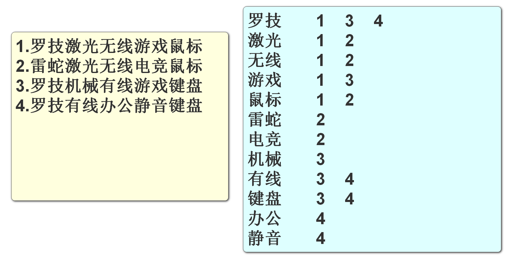
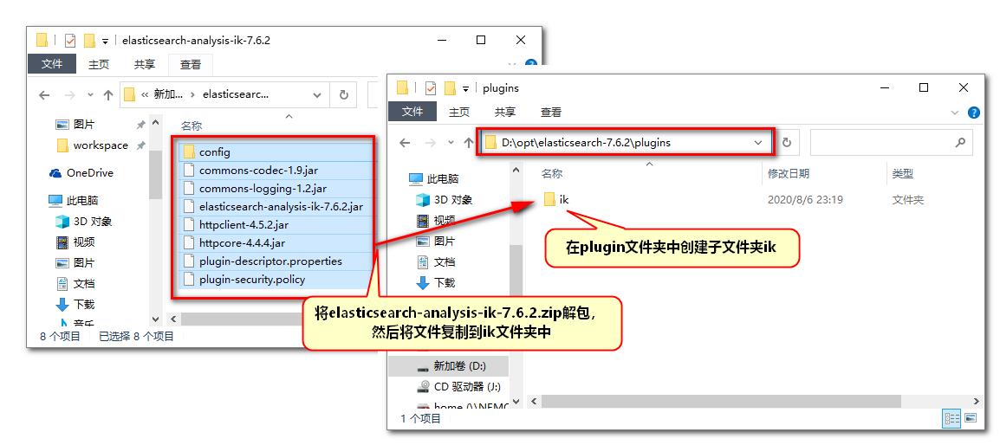

# Elasticsearch 概述

## Elasticsearch下载

苍老师网站


官方下载链接

https://www.elastic.co/cn/downloads/past-releases#elasticsearch

## 什么是Elasticsearch

elastic:富有弹性的

search:搜索

我们可以把它简称为ES,但是搜索它的资料时(例如百度)还是使用Elasticsearch进行搜索更准确

**这个软件不再是SpringCloud提供的,它也不针对微服务环境的项目来开发**

Elasticsearch和redis\mysql一样,不仅服务于java语言,其它语言也可以使用

它的功能也类似一个数据库,能高效的从大量数据中搜索匹配指定关键字的内容

它也将数据保存在硬盘中

这样的软件有一个名称**全文搜索引擎**

它本质就是一个java项目,使用它进行数据的增删改查就是访问这个项目的控制器方法(url路径)

> ES的底层技术

ES使用了java的一套名为Lucene的API

这个API提供了全文搜索引擎核心操作的接口,相当于搜索引擎的核心支持,ES是在Lucene的基础上进行了完善,实现了开箱即用的搜索引擎软件

市面上和ES功能类似的软件有

Solr/MongoDB

## 为什么需要Elasticsearch

数据库进行模糊查询效率严重低下

所有关系型数据库都有这个缺点(mysql\mariaDB\oracle\DB2等)

在执行类似下面模糊查询时

```sql
select * from spu where spu_name like '%鼠标%'
```

测试证明**一张千万级别的数据表进行模糊查询需要20秒以上**

当前互联网项目要求"三高"的需求下,这样的效率肯定不能接受

Elasticsearch主要是为了解决数据库模糊查询性能低下问题的

ES进行优化之后,从同样数据量的ES中查询相同条件数据,效率能够提高100倍以上

## 数据库索引简介

所谓的索引(index)其实就是数据目录

通常情况下,索引是为了提高查询效率的

数据库索引分两大类

* 聚集索引
* 非聚集索引

**聚集索引**就是数据库保存数据的物理顺序依据,默认情况下就是主键id,所以按id查询数据库中的数据效率非常高

**非聚集索引**:如果想在非主键列上添加索引,就是非聚集索引了

例如我们在数据库表中存在一个姓名列,我们为姓名列创建索引

在创建索引时,会根据姓名内容来创建索引

例如"张三丰" 这个姓名,创建索引后查询效率就会明显提升

如果没有索引,这样的查询就会引起效率最低的"逐行搜索",就是一行一行的查这个数据的姓名是不是张三丰,效率就会非常低

模糊查询时因为'%鼠标%',使用的是前模糊条件,使用索引必须明确前面的内容是什么,前模糊查询是不能使用索引的,只能是全表的逐行搜索,所以效率非常低

所以当我们项目中设计了根据用户输入关键字进行模糊查询时,需要使用**全文搜索引擎**来优化

> 索引面试题
>
> 1.创建的索引会占用硬盘空间
>
> 2.创建索引之后,对该表进行增删改操作时,会引起索引的更新,所以效率会降低
>
> 3.对数据库进行批量新增时,先删除索引,增加完毕之后再创建
>
> 4.不要对数据样本少的列添加索引
>
> 5.模糊查询时,查询条件前模糊的情况,是无法启用索引的
>
> 6.每次从数据表中查询的数据的比例越高,索引的效果越低

## Elasticsearch运行原理

要想使用ES提高模糊查询效率

首先要将数据库中的数据复制到ES中

在新增数据到ES的过程中,ES可以对指定的列进行**分词**索引保存在索引库中

形成倒排索引结构



## Elasticsearch的启动

课程中使用7.6.2的版本

压缩包280M左右,复制到没有中文,没有空格的目录下解压

双击bin\elasticsearch.bat运行


双击之后可能会看到下面的dos界面


这个界面不能关闭,一旦关闭ES就停止了

验证ES的运行状态

浏览器输入地址:localhost:9200看到如下内容即可


mac系统启动

```
tar -xvf elasticsearch-7.6.2-darwin-x86_64.tar.gz 
cd elasticsearch-7.6.2/bin 
./elasticsearch
```

linux:

```
tar -xvf elasticsearch-7.6.2-linux-x86_64.tar.gz
cd elasticsearch-7.6.2/bin
./elasticsearch
```

## ES基本使用

ES启动完成后,我们要学习如何操作它

我们已经讲过,操作ES是对ES发送请求

我们创建一个子项目search,在这个子项目中创建一个专门发送各种类型请求的文件来操作ES

创建search项目也要父子相认

然后子项目pom文件如下

```xml
<?xml version="1.0" encoding="UTF-8"?>
<project xmlns="http://maven.apache.org/POM/4.0.0" xmlns:xsi="http://www.w3.org/2001/XMLSchema-instance"
         xsi:schemaLocation="http://maven.apache.org/POM/4.0.0 https://maven.apache.org/xsd/maven-4.0.0.xsd">
    <modelVersion>4.0.0</modelVersion>
    <parent>
        <groupId>cn.tedu</groupId>
        <artifactId>csmall</artifactId>
        <version>0.0.1-SNAPSHOT</version>
        <relativePath/> <!-- lookup parent from repository -->
    </parent>
    <groupId>cn.tedu</groupId>
    <artifactId>search</artifactId>
    <version>0.0.1-SNAPSHOT</version>
    <name>search</name>
    <description>Demo project for Spring Boot</description>

    <dependencies>
        <dependency>
            <groupId>org.springframework.boot</groupId>
            <artifactId>spring-boot-starter</artifactId>
        </dependency>

        <dependency>
            <groupId>org.springframework.boot</groupId>
            <artifactId>spring-boot-starter-test</artifactId>
            <scope>test</scope>
        </dependency>
    </dependencies>

</project>
```

下面创建一个能够向ES发送请求的文件

这种能够向指定url发送请求的文件格式称之为http client(http 客户端)


文件类型叫HTTP Request文件

我们可以起名为elasticsearch

我们先从最简单的请求开始

向es发送指令

## Es执行分词

上次课我们创建了search模块

在模块中创建的Http client文件

执行了访问ES的测试

下面要测试ES的分词功能

```json
### 三个#是注释,也是分隔符,http文件要求每个请求必须以分隔符开始,否则会报错
GET http://localhost:9200

### 测试ES的分词功能,运行请求,查看分词结果
POST http://localhost:9200/_analyze
Content-Type: application/json

{
  "text": "my name is hanmeimei",
  "analyzer": "standard"
}
```

analyze:分析

analyzer:分析者(分词器)

standard是ES默认的分词器,"analyzer": "standard"是可以省略的

standard这个分词器只能对英文等西文字符(有空格的),进行正确分词

但是中文分词不能按空格分,按这个分词器分词,每个字都会形成分词,这样的结果不能满足我们日常的搜索需要


我们解决中文不能正确分词的问题

实际上要引入一个中文常见词语的词库,分词时按照词库中的词语分词即可

我们可以使用免费的中文分词器词库插件IK来实现中文分词效果



安装插件之后要重启ES才能生效

关闭Es窗口之后再双击elasticsearch.bat文件运行即可

ES启动之后,将中文分词器设置完成,在运行分词

```json
{
  "text": "罗技激光鼠标",
  "analyzer": "ik_smart"
}
```

再次运行分词测试,应该看到正常的中文分词效果

但是词库的容量有限,比较新的网络名词和较新出现的人名是不在词库中的

## ik分词插件的种类

我们安装的ik实际上不只一个分词器

实际上除了ik_smart之外还有ik_max_word

```json
POST http://localhost:9200/_analyze
Content-Type: application/json

{
  "text": "北京冬季奥林匹克运动会顺利闭幕",
  "analyzer": "ik_smart"
}
```

```json
POST http://localhost:9200/_analyze
Content-Type: application/json

{
  "text": "北京冬季奥林匹克运动会顺利闭幕",
  "analyzer": "ik_max_word"
}
```

上面的两个分词器运行分词,结果会有非常明显的区别

总结区别如下

**ik_smart**

* 优点:特征是粗略快速的将文字进行分词,占用空间小,查询速度快

* 缺点:分词的颗粒度大,可能跳过一些重要分词,导致查询结果不全面,查全率低

**ik_max_word**

* 优点:特征是详细的文字片段进行分词,查询时查全率高,不容易遗漏数据
* 缺点:因为分词太过详细,导致有一些无用分词,占用空间较大,查询速度慢

## 使用ES操作数据

ES是一个数据库性质的软件

可以执行增删改查操作,只是他操作数据不使用sql,数据的结构和关系型数据库也不同

我们先了解一下ES保存数据的结构


* ES启动后,ES服务可以创建多个index(索引),index可以理解为数据库中表的概念

* 一个index可以创建多个保存数据的document(文档),一个document理解为数据库中的一行数据
* 一个document中可以保存多个属性和属性值,对应数据库中的字段(列)和字段值

项目csmall-finish项目中

node文件夹下共享了ES文档,命令都在里面,可以测试

所有的代码都在"ES文档"中, 笔记略

下面我们要学习使用java代码来操作ES

# SpringBoot 操作 Elasticsearch

## Spring Data简介

原生状态下,我们使用JDBC连接数据库,因为代码过于繁琐,所以改为使用Mybatis框架

在ES的原生状态下,我们java代码需要使用socket访问ES,但是也是过于繁琐,我们可以使用SpringData框架简化

Spring Data是Spring提供的一套连接各种第三方数据源的框架集

我们需要使用的是其中连接ES的Spring Data Elasticseatrch

官方网站:https://spring.io/projects/spring-data


官网中列出了SpringData支持连接操作的数据源列表

下面我们就按照SpringDataElasticsearch的步骤对ES进行操作

## 添加依赖和配置

就使用我们之前创建的search模块来操作ES

pom文件添加依赖

```xml
<?xml version="1.0" encoding="UTF-8"?>
<project xmlns="http://maven.apache.org/POM/4.0.0" xmlns:xsi="http://www.w3.org/2001/XMLSchema-instance"
         xsi:schemaLocation="http://maven.apache.org/POM/4.0.0 https://maven.apache.org/xsd/maven-4.0.0.xsd">
    <modelVersion>4.0.0</modelVersion>
    <parent>
        <groupId>cn.tedu</groupId>
        <artifactId>csmall</artifactId>
        <version>0.0.1-SNAPSHOT</version>
        <relativePath/> <!-- lookup parent from repository -->
    </parent>
    <groupId>cn.tedu</groupId>
    <artifactId>search</artifactId>
    <version>0.0.1-SNAPSHOT</version>
    <name>search</name>
    <description>Demo project for Spring Boot</description>

    <dependencies>
        <dependency>
            <groupId>org.springframework.boot</groupId>
            <artifactId>spring-boot-starter</artifactId>
        </dependency>

        <dependency>
            <groupId>org.springframework.boot</groupId>
            <artifactId>spring-boot-starter-test</artifactId>
            <scope>test</scope>
        </dependency>

        <!-- Spring Data Elasticsearch 整合SpringBoot的依赖   -->
        <dependency>
            <groupId>org.springframework.boot</groupId>
            <artifactId>spring-boot-starter-data-elasticsearch</artifactId>
        </dependency>
    </dependencies>

</project>
```

application.properties添加配置

```properties
# 配置ES的ip和端口
spring.elasticsearch.rest.uris=http://localhost:9200

# 设置日志门槛
logging.level.cn.tedu.search=debug
# SpringDataElasticsearch框架中日志输出专用类也要设置debug
logging.level.org.elasticsearch.client.RestClient=debug
```

## 创建和ES关联的实体类

和数据库一样

我们操作ES时也需要一个类似实体类的数据类,作为操作ES的数据载体

search项目创建entity包

在包中创建Item(商品)类

```java
@Data
@Accessors(chain = true)    // 支持链式set赋值
@AllArgsConstructor         // 自动生成包含全部参数的构造方法
@NoArgsConstructor          // 自动生成无参数的构造方法

// @Document注解标记当前类是ES框架对应的实体类
// 属性indexName指定ES中对应的索引名称,运行时,如果这个索引不存在,SpringData会自动创建它
@Document(indexName = "items")
public class Item implements Serializable {

    // SpringData通过@Id标记当前实体类的主键属性
    @Id
    private Long id;
    // @Field是SpringData标记普通属性的注解
    // type是定义这个属性的类型,FieldType.Text是支持分词的字符串,后面要定义两个分词器
    @Field(type = FieldType.Text,
            analyzer = "ik_max_word",
            searchAnalyzer = "ik_max_word")
    private String title;
    // Keyword是不需分词的字符串类型
    @Field(type = FieldType.Keyword)
    private String category;
    @Field(type = FieldType.Keyword)
    private String brand;
    @Field(type = FieldType.Double)
    private Double price;
    // imgPath是图片路径,路径不会成为搜索条件,所以这个列可以不创建索引,节省空间
    // index = false,就是不创建索引的设置
    // 但是需要注意,不创建索引并不是不保存这个数据,ES中仍然保存imgPath的值
    @Field(type = FieldType.Keyword,index = false)
    private String imgPath;

    // images/2022/11/28/18239adc-8ae913-abbf91.jpg
}
```

## 创建操作ES的持久层

我们使用SpringData连接ES

需要知道SpringData框架对持久层的命名规则

持久层规范名称为repository(仓库),创建这个包,包中创建接口ItemRepository

```java
// Repository是Spring家族对持久层包名\类名\接口名的规范
@Repository
public interface ItemRepository extends ElasticsearchRepository<Item,Long> {
    // ItemRepository接口要继承SpringData框架提供的父接口ElasticsearchRepository
    // 一旦继承,当前接口就可以编写使用父接口中提供的连接ES的方法了
    // 继承父接口后,SpringData会根据我们在泛型中指定的Item实体类,找到对应的索引
    // 并生成操作这个索引的基本增删改查方法,我们自己无需编写
    // ElasticsearchRepository<[要操作的实体类名称],[实体类主键的类型]>
}
```

## 测试ES

如果没有测试包,创建test测试包

如果没有测试类,创建测试类

编写测试

```java
// springboot环境下的测试必须要@SpringBootTest注解才能成功
@SpringBootTest
class SearchApplicationTests {

    @Autowired
    private ItemRepository itemRepository;

    // 执行单增
    @Test
    void addOne() {
        // 实例化Item对象
        Item item=new Item()
                .setId(1L)
                .setTitle("罗技激光无线游戏鼠标")
                .setCategory("鼠标")
                .setBrand("罗技")
                .setPrice(188.0)
                .setImgPath("/1.jpg");
        // 利用SpringDataElasticsearch提供的方法,完成这个实体类新增到Es
        itemRepository.save(item);
        System.out.println("ok");
    }

    // 单查
    @Test
    void getOne(){
        // SpringDataElasticsearch提供了按id查询ES中数据的方法
        // 返回值是一个Optional类型对象,声明了一个泛型,我们理解为只能保存一个该泛型类型对象的集合
        Optional<Item> optional = itemRepository.findById(1L);
        Item item=optional.get();
        System.out.println(item);

    }

    // 批量增
    @Test
    void addList(){
        // 实例化一个List,把要保存到Es中的数据都添加到这个集合中
        List<Item> list=new ArrayList<>();
        list.add(new Item(2L,"罗技激光有线办公鼠标","鼠标",
                            "罗技",9.9,"/2.jpg"));
        list.add(new Item(3L,"雷蛇机械无线游戏键盘","键盘",
                            "雷蛇",268.0,"/3.jpg"));
        list.add(new Item(4L,"微软有线静音办公鼠标","鼠标",
                            "微软",199.0,"/4.jpg"));
        list.add(new Item(5L,"罗技机械有线背光键盘","键盘",
                            "罗技",228.0,"/5.jpg"));
        itemRepository.saveAll(list);
        System.out.println("ok");
    }

    // 全查
    @Test
    void getAll(){
        // SpringData框架提供的全查ES中对应实体类所有数据的方法
        Iterable<Item> items = itemRepository.findAll();
        for(Item item : items){
            System.out.println(item);
        }
        System.out.println("----------------------------------");
        items.forEach(item -> System.out.println(item));
    }

}
```

## SpringData自定义查询

SpringData框架提供的基本增删改查方法并不能完全满足我们的业务需要

如果是针对当前Es数据,进行个性化的自定义查询,那还是需要自己编写查询代码

就像我们要实现根据关键词查询商品信息一样,完成类似数据库中的模糊查询.

### 单条件查询

我们查询需求为输出所有数据中title属性包含"游戏"这个分词的商品信息

> 参考数据库中模糊查询
>
> ```sql
> select * from item where title like '%游戏%'
> ```

我们使用SpringDataES进行查询,本质上还是相当于ES文档中执行的查询语句

在SpringData框架下,ItemRepository接口中实现更加简单

```java
// SpringData自定义查询
// 我们要编写遵循SpringData给定的格式的方法名
// SpringData会根据方法名自动推断出查询意图,生成能够完成该查询的语句
// query(查询):表达当前的方法是一个查询方法,类似sql语句中的select
// Item/Items:是要查询的实体类名称,返回集合的查询应该带s
// By(通过\根据):标识开始设置查询条件的关键字,等价于sql语句中的where
// Title:要查询的字段,可以是Item实体类中的任何字段
// Matches(匹配):执行查询的条件,Matches是查询匹配字符串的关键字,类似于sql语句中的like

Iterable<Item> queryItemsByTitleMatches(String title);
```

下面可以开始在测试类中进行测试查询

```java
// 单条件自定义查询
@Test
void queryOne(){
    // 查询Es的items索引中,title字段包含"游戏"分词的数据
    Iterable<Item> items=itemRepository.queryItemsByTitleMatches("游戏");
    items.forEach(item -> System.out.println(item));
}
```

上面代码运行时底层运行的查询语句为:

```json
### 单条件搜索
POST http://localhost:9200/items/_search
Content-Type: application/json

{
  "query": {"match": { "title":  "游戏" }}
}
```

### 多条件查询

在相对复杂的查询逻辑下

经常使用多个条件来定位查询需要的数据

这样就需要逻辑运算符"and"/"or"

ItemRepository接口中添加多条件的查询方法

```java
// 多条件自定义查询
// 多个条件之间要使用and或or来分隔,表示多个条件之间的逻辑关系
// 下面我们要使用title和brand字段进行多条件查询
// 多个条件时,方法名要按照规则编写多个条件,参数也要对应条件数量来变化
// 声明的参数会按照顺序依次赋值到需要值的条件中,和参数名称无关
Iterable<Item> queryItemsByTitleMatchesAndBrandMatches(
                                            String title,String brand);
```

测试代码如下

```java
// 多条件自定义查询
@Test
void queryTwo(){
    // 查询ES中,items的索引里,title字段包含"游戏",并且品牌是"罗技"的数据
    Iterable<Item> items=itemRepository
            .queryItemsByTitleMatchesAndBrandMatches("游戏","罗技");
    items.forEach(item -> System.out.println(item));
}
```

底层运行的请求

```json
### 多字段搜索
POST http://localhost:9200/items/_search
Content-Type: application/json

{
  "query": {
    "bool": {
      "must": [
        { "match": { "title": "游戏"}},
        { "match": { "brand": "罗技"}}
      ]
    }
  }
}
```

当查询条件关系为And时,查询语句关键字为must

当查询条件关系为Or时,查询语句关键字为should

### 排序查询

默认情况下从ES中查询获得的数据排序依据是ES查询得出的相关性分数(score)

但是如果想改变这个排序就需要在查询方法上添加新的关键字

在ItemRepository接口添加具备排序功能的查询方法

```java
// 排序查询
Iterable<Item> queryItemsByTitleMatchesOrBrandMatchesOrderByPriceDesc(
       												 String title,String brand);
```

测试代码如下

```java
@Test
void queryOrder(){
    Iterable<Item> items=itemRepository
            .queryItemsByTitleMatchesOrBrandMatchesOrderByPriceDesc(
                                                            "游戏","罗技");
    items.forEach(item -> System.out.println(item));
}
```

底层运行的代码

```json
### 多字段搜索
POST http://localhost:9200/items/_search
Content-Type: application/json

{
  "query": {
    "bool": {
      "should": [
        { "match": { "title": "游戏"}},
        { "match": { "brand": "罗技"}}
      ]
    }
  },"sort":[{"price":"desc"}]
}
```

### 分页查询

SpringData框架支持完成分页查询

需要在ItemRepository接口中修改方法的参数和返回值就可以实现

```java
// 分页查询
// 返回值类型需要修改为Page类型,这个类型既可以保存从ES中查询出的数据
// 又可以保存当前分页查询的分页信息例如:当前页码,每页条数,总条数,总页数,有没有上一页,有没有下一页等
// 参数方面,需要在参数列表末尾添加一个Pageable类型的参数
// 这个类型的对象包含要查询的页码和每页的条数
Page<Item> queryItemsByTitleMatchesOrBrandMatchesOrderByPriceDesc(
                                     String title, String brand, Pageable pageable);
```

测试代码

```java
// 自定义分页查询
@Test
void queryPage(){
    int page=1;                 // 设置要查询的页码 1表示查询第一页
    int pageSize=2;             // 每页条数的设置
    Page<Item> pages=itemRepository
            .queryItemsByTitleMatchesOrBrandMatchesOrderByPriceDesc(
                    "游戏","罗技", PageRequest.of(page-1,pageSize));
    pages.forEach(item -> System.out.println(item));

    // pages对象包含的分页信息输出
    System.out.println("总页数:"+pages.getTotalPages());
    System.out.println("总条数:"+pages.getTotalElements());
    System.out.println("当前页:"+(pages.getNumber()+1));
    System.out.println("每页条数:"+pages.getSize());
    System.out.println("是否是首页:"+pages.isFirst());
    System.out.println("是否是末页:"+pages.isLast());

}
```
