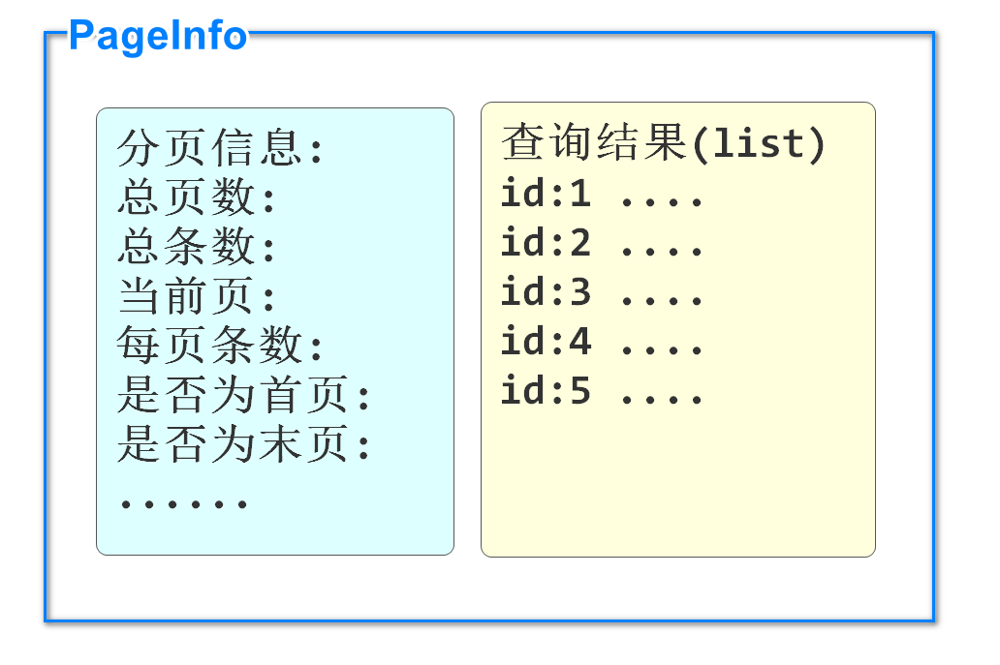

# PageHelper的基本使用

### 分页查询的优点

所谓分页,就是查询结果数据较多时,采用按页显示的方法,而不是一次性全部显示

分页的优点:

1. 服务器:一次性查询所有信息,服务器压力大,分页查询服务器压力小
2. 客户端:一次性显示所有信息,需要更多流量,加载时间也会更长,分页显示没有这个问题
3. 用户体验上:一般最有价值的信息都会在前几页显示,也方便用户记忆,多查询出来的数据使用几率很低

实现分页查询需要我们开发过程中多几个步骤

### PageHelper实现分页查询原理

我们可以使用sql语句中添加limit关键字的方法实现分页查询

但是查询分页内容时,我们要自己计算相关的分页信息和参数

limit 0,10      limit  10,10

分页逻辑无论什么业务都是类似的,所以有框架帮助我们高效实现分页功能

PageHelper框架可以实现我们提供页码和每页条数,自动实现分页效果,收集分页信息

PageHelper的分页原理就是在程序运行时,在sql语句尾部添加limit关键字,并按照分页信息向limit后追加分页数据

要想使用,首先还是添加依赖

我们在之前搭建的微服务项目中先编写学习,建议使用csmall-order模块

```xml
<dependency>
    <groupId>com.github.pagehelper</groupId>
    <artifactId>pagehelper-spring-boot-starter</artifactId>
</dependency>
```

在添加seata支持时已经添加了pagehepler依赖

### 编写持久层

我们使用csmall-order-webapi模块来完成分页的测试

首先编写分页的持久层mapper,持久层功能是全查所有订单信息

OrderMapper添加方法

```java
// 分页查询所有订单的方法
// PageHelper框架完成分页的原理是运行的sql语句后自动添加limit关键字
// 所以我们在编写查询方法时,无需关注分页操作,和普通查询没有区别(注解和xml文件都是)
@Select("select id,user_id,commodity_code,count,money from order_tbl")
List<Order> findAllOrders();
```

注意这个方法并不需要任何分页的参数或返回值,sql也不需要编写limit

都是在业务逻辑层中由PageHelper框架处理的

### 编写业务逻辑层

下面就转到业务逻辑层实现类,先编写一个方法使用PageHelper的功能

先不用写接口,直接在业务逻辑层中写方法

OrderServiceImpl添加方法

```java
// 分页查询所有订单信息的方法
// page是页码,pageSize是每页条数
public PageInfo<Order> getAllOrdersByPage(Integer page,Integer pageSize){
    // PageHelper框架实现分页功能的核心代码,是要在执行查询数据库代码运行前
    // 编写PageHelper.startPage(page,pageSize)方法,设置分页的查询条件
    // page是页码从1开始,表示第一页
    PageHelper.startPage(page,pageSize);
    // 上面设置好的分页查询条件,会在下面的查询执行时,sql语句会自动追加limit关键字
    List<Order> list= orderMapper.findAllOrders();

    // 查询结果list只包含查询到的分页数据,并不能包含分页信息(总页数,总条数,有没有上一页下一页等)
    // 所以我们要利用PageHelper提供的PageInfo类型对象来进行返回
    // PageInfo对象既可以包含分页数据,又可以包含分页信息,且是自动计算的
    // 使用方式是在返回时直接实例化即可,构造方法()中直接传入查询到的数据list即可
    return new PageInfo<>(list);

}
```

### 编写控制层

打开OrderController新建方法

```java
@Autowired
//      ↓↓↓↓↓↓↓↓↓↓↓↓↓↓↓↓
private OrderServiceImpl orderService;

//...

@GetMapping("/page")
@ApiOperation("分页查询所有订单")
@ApiImplicitParams({
        @ApiImplicitParam(value = "页码",name="page",example ="1" ),
        @ApiImplicitParam(value = "每页条数",name="pageSize",example ="10" )
})
public JsonResult<PageInfo<Order>> pageOrder(Integer page,Integer pageSize){
    PageInfo<Order> pageInfo=
            orderService.getAllOrdersByPage(page,pageSize);
    return JsonResult.ok("查询完成",pageInfo);
}
```

启动Nacos\Seata

启动order

进行knife4j测试http://localhost:20002/doc.html#/home

可以观察控制台输出的运行的sql语句(会自动添加limit关键字)


PageInfo对象既包含查询数据结果,又包含分页信息

数据结构如下图 



**附:PageInfo全部分页信息属性**

```java
//当前页
private int pageNum;
//每页的数量
private int pageSize;
//当前页的行数量
private int size;
//当前页面第一个元素在数据库中的行号
private int startRow;
//当前页面最后一个元素在数据库中的行号
private int endRow;
//总页数
private int pages;
//前一页页号
private int prePage;
//下一页页号
private int nextPage;
//是否为第一页
private boolean isFirstPage;
//是否为最后一页
private boolean isLastPage;
//是否有前一页
private boolean hasPreviousPage;
//是否有下一页
private boolean hasNextPage;
//导航条中页码个数
private int navigatePages;
//所有导航条中显示的页号
private int[] navigatepageNums;
//导航条上的第一页页号
private int navigateFirstPage;
//导航条上的最后一页号
private int navigateLastPage;
```

### 使用JsonPage返回结果

当前我们分页查询返回的类型是PageInfo

如果用这个类型来做业务逻辑层的返回值,当当前方法作为dubbo生产者对外提供服务时

消费者调用该服务需要使用PageInfo类型对象来接收,这样要求消费者也添加PageHepler依赖,这是不合理的

所以我们设计在commons模块中,添加一个专门用于返回分页结果的类JsonPage,代替PageInfo

这样当前微服务项目中,所有分页或类似的操作,就都可以使用这个类了

例如之前SpringDataElasticsearch框架也支持分页,返回类型为Page,它也可以替换为JsonPage

因为需要在commons模块中使用PageInfo类型,所以commons模块要添加pageHelper的依赖

```xml
<!--  为了将PageHelper框架汇总分页查询的结果对象PageInfo转换为JsonPage类型
        我们需要在当前commons模块中添加PageHelper的依赖  -->
<dependency>
    <groupId>com.github.pagehelper</groupId>
    <artifactId>pagehelper</artifactId>
    <version>5.2.0</version>
</dependency>
```

在restful包中新建一个JsonPage类

代码如下

```java
@Data
public class JsonPage<T> implements Serializable {

    // 当前类是Page\PageInfo类的代替品,应该既能保存分页数据,又能保存分页信息
    // 也就是要将分页数据和分页信息声明出属性,至于声明出哪些属性,是我们自己定义的
    // 原则就是满足前端的需要,现在我们只编写最基本的分页信息,今后有需要再添加
    @ApiModelProperty(value = "总页数",name = "totalPages")
    private Integer totalPages;
    @ApiModelProperty(value = "总条数",name = "totalCount")
    private Long totalCount;
    @ApiModelProperty(value = "页码",name = "page")
    private Integer page;
    @ApiModelProperty(value = "每页条数",name = "pageSize")
    private Integer pageSize;

    // JsonPage中能够保存分页数据的集合对象
    @ApiModelProperty(value = "分页数据",name = "list")
    private List<T> list;

    // 下面要编写一个方法,能够实现将PageInfo类型转换成JsonPage对象返回
    // 如果还需要将其他分页类型(例如SpringData的Page类型)转换为JsonPage,再编写另外的方法即可
    public static <T> JsonPage<T> restPage(PageInfo<T> pageInfo){
        // 因为BeanUtils.copyProperties方法只能给同名属性赋值,
        // 又因为JsonPage和PageInfo属性同名属性有限,所以我们使用手动赋值的方式完成转换
        JsonPage<T> jsonPage=new JsonPage<>();
        jsonPage.setTotalCount(pageInfo.getTotal());
        jsonPage.setTotalPages(pageInfo.getPages());
        jsonPage.setPage(pageInfo.getPageNum());
        jsonPage.setPageSize(pageInfo.getPageSize());
        // 上面是分页信息的赋值,别忘了还有分页数据的赋值
        jsonPage.setList(pageInfo.getList());
        // 最终返回转换完成的jsonPage对象
        return jsonPage;
    }
}
```

下面去使用这个类

csmall-order-service项目的IOrderService业务逻辑层接口添加方法

返回值使用JsonPage定义一个分页查询的方法

```java
// 返回JsonPage类型的分页查询订单的方法
JsonPage<Order> getAllOrdersByPage(Integer page,Integer pageSize);
```

csmall-order-webapi项目OrderServiceImpl实现类中进行修改

```java
//     ↓↓↓↓↓↓↓↓
public JsonPage<OrderTb> getAllOrdersByPage(Integer pageNum, Integer pageSize){

    PageHelper.startPage(pageNum,pageSize);

    List<OrderTb> list= orderMapper.findAllOrders();

    //     ↓↓↓↓↓↓↓↓↓↓↓↓↓↓↓↓↓↓↓↓↓↓↓↓↓↓↓↓↓↓↓↓↓↓↓↓↓↓
    return JsonPage.restPage(new PageInfo<>(list));
}
```

业务逻辑层返回值的修改影响控制器方法的调用

再去修改OrderController中方法调用的位置

```java
@Autowired
//      ↓↓↓↓↓↓↓↓↓↓↓↓
private IOrderService orderService;

//...
//                ↓↓↓↓↓↓↓↓
public JsonResult<JsonPage<Order>> pageOrders(Integer pageNum, Integer pageSize){
      // 分页调用
      //↓↓↓↓↓↓        ↓↓↓↓↓↓↓↓↓  
      JsonPage<Order> jsonPage=orderService.getAllOrdersByPage(
          pageNum,pageSize);
      //                            ↓↓↓↓↓↓↓↓↓↓
      return JsonResult.ok("查询完成",jsonPage);
}
```

保证启动Nacos\Seata

启动order测试

能出现查询结果即可