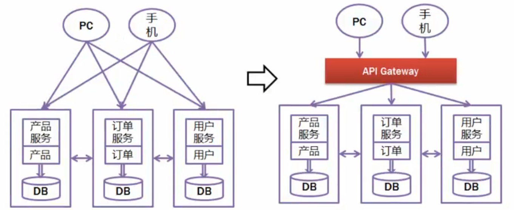

# SpringGateway网关

## 奈非框架简介

早期(2020年前)奈非提供的微服务组件和框架受到了很多开发者的欢迎

这些框架和SpringCloud Alibaba的对应关系我们要了解

现在还有很多旧项目维护是使用奈非框架完成的微服务架构

Nacos对应Eureka都是注册中心

Dubbo对应Ribbon+feign都是实现微服务远程RPC调用的组件

Sentinel对应Hystrix都是做项目限流熔断降级的组件

Gateway对应Zuul都是网关组件

Gateway框架不是阿里写的,是Spring提供的

## 什么是网关

"网"指网络,"关"指关口或关卡

网关:就是指网络中的关口\关卡

网关就是当前微服务项目的"**统一入口**"

程序中的网关就是当前微服务项目对外界开放的统一入口

所有外界的请求都需要先经过网关才能访问到我们的程序

提供了统一入口之后,方便对所有请求进行统一的检查和管理



网关项目git地址

https://gitee.com/jtzhanghl/gateway-demo.git

网关的主要功能有

* 将所有请求统一经过网关
* 网关可以对这些请求进行检查
* 网关方便记录所有请求的日志
* 网关可以统一将所有请求路由到正确的模块\服务上

路由的近义词就是"分配"

## Spring Gateway简介

我们使用Spring Gateway作为当前项目的网关框架

Spring Gateway是Spring自己编写的,也是SpringCloud中的组件

SpringGateway官网

https://docs.spring.io/spring-cloud-gateway/docs/current/reference/html/

网关项目git地址

https://gitee.com/jtzhanghl/gateway-demo.git

## 简单网关演示

SpringGateway网关是一个依赖,不是一个软件

所以我们要使用它的话,必须先创建一个SpringBoot项目

这个项目也要注册到Nacos注册中心,因为网关项目也是微服务项目的一个组成部分

beijing和shanghai是编写好的两个项目

gateway项目就是网关项目,需要添加相关配置

```xml
<dependencies>
    <!--   SpringGateway的依赖   -->
    <dependency>
        <groupId>org.springframework.cloud</groupId>
        <artifactId>spring-cloud-starter-gateway</artifactId>
    </dependency>
    <!--   Nacos依赖   -->
    <dependency>
        <groupId>com.alibaba.cloud</groupId>
        <artifactId>spring-cloud-starter-alibaba-nacos-discovery</artifactId>
    </dependency>
    <!--   网关负载均衡依赖    -->
    <dependency>
        <groupId>org.springframework.cloud</groupId>
        <artifactId>spring-cloud-starter-loadbalancer</artifactId>
    </dependency>
</dependencies>
```

我们从yml文件配置开始添加

```yaml
server:
  port: 9000
spring:
  application:
    name: gateway
  cloud:
    nacos:
      discovery:
        # 网关也是微服务项目的一部分,所以也要注册到Nacos
        server-addr: localhost:8848
    gateway:
      # routes就是路由的意思,下面的内容就是配置路由,它是一个数组类型的属性
      routes:
          # 数组类型属性赋值时,每个数组元素都要以"-"开头,一个"-"之后的所有内容,都是这个元素包含的值
          # id表示当前路由的名称,和之前出现过的任何名字没有关联,唯一的要求就是不能和之后出现的路由id重复
        - id: gateway-beijing
          # uri配置路由的目标服务器,beijing是服务器注册到nacos的名称
          # lb就是LoadBalance的缩写
          uri: lb://beijing
          # predicates是断言的意思,指满足某些条件的之后执行某些操作
          predicates:
            # predicates属性也是数组类型,赋值要以"-"开头
            # 这个断言的含义就是如果访问网关项目的路径以/bj/开头,路由访问beijing服务器
            # ↓ P要大写     **是通配任何路径
            - Path=/bj/**
```

先启动nacos

再启动beijing

最后启动gateway

## 网关多路由配置

上面只配置了一个beijing的路由设置

下面我们修改yml文件也实现shanghai的路由设置

```yaml
gateway:
  # routes就是路由的意思,下面的内容就是配置路由,它是一个数组类型的属性
  routes:
    - id: gateway-shanghai
      uri: lb://shanghai
      predicates:
        - Path=/sh/**
      # 数组类型属性赋值时,每个数组元素都要以"-"开头,一个"-"之后的所有内容,都是这个元素包含的值
      # id表示当前路由的名称,和之前出现过的任何名字没有关联,唯一的要求就是不能和之后出现的路由id重复
    - id: gateway-beijing
      # uri配置路由的目标服务器,beijing是服务器注册到nacos的名称
      # lb就是LoadBalance的缩写
      uri: lb://beijing
      # predicates是断言的意思,指满足某些条件的之后执行某些操作
      predicates:
        # predicates属性也是数组类型,赋值要以"-"开头
        # 这个断言的含义就是如果访问网关项目的路径以/bj/开头,路由访问beijing服务器
        # ↓ P要大写     **是通配任何路径
        - Path=/bj/**
```

在保证nacos启动的情况下

beijing服务器如果启动无需重启

启动shanghai项目

最后重启网关

测试网关路由到两个模块的效果

http://localhost:9000/bj/show可以访问beijing服务器的资源

http://localhost:9000/sh/show可以访问shanghai服务器的资源

以此类推,再有很多服务器时,我们都可以仅使用9000端口号来将请求路由到正确的服务器

就实现了gateway成为项目的统一入口的效果

## 动态路由

网关项目的配置会随着微服务模块数量增多而变得复杂,维护的工作量也会越来越大

所以我们希望gateway能够设计一套默认情况下自动路由到每个模块的路由规则

这样的话,不管当前项目有多少个路由目标,都不需要维护yml文件了

这就是我们SpringGateway的动态路由功能

配置文件中开启即可

```yaml
server:
  port: 9000
spring:
  application:
    name: gateway
  cloud:
    nacos:
      discovery:
        # 网关也是微服务项目的一部分,所以也要注册到Nacos
        server-addr: localhost:8848
    gateway:
      discovery:
        locator:
          # 开启网关动态路由的配置
          # 默认的路由规则:在网关端口号后,先编写要路由到的目标服务器
          #              注册到Nacos的名称,再编写要访问的具体路径
          # 例如 localhost:9001/bj/show  ->  localhost:9000/beijing/bj/show
          enabled: true
```

按上面修改完配置之后

我们可以重启gateway来测试动态路由路径是否生效

动态路由生成规则为:在网关端口号后先写要路由到的目标服务器在nacos注册的名称,再编写具体路径

## 内置断言

我们上次课在网关配置中使用了predicates(断言)的配置

断言的意思就是判断某个条件是否满足

我们之前使用了Path断言,判断请求的路径是不是满足条件,例如是不是/sh/**   /bj/**

如果路径满足这个条件,就路由到指定的服务器

但是Path实际上只是SpringGateway提供的多种内置断言中的一种

还有很多其它断言

- after
- before
- between
- cookie
- header
- host
- method
- path
- query
- remoteaddr

**时间相关**

after,before,between

判断当前时间在指定时间之前,之后或之间的操作

如果条件满足可以执行路由操作,否则拒绝访问

表示时间的格式比较特殊,先使用下面代码获得时间

```
ZonedDateTime.now()
```

运行程序输出,可获得当前时间,这个时间的格式可能是

```
2022-11-25T11:47:18.087+08:00[Asia/Shanghai]
```

下面在yml配置中添加新的断言配置

使用After设置必须在指定时间之后访问

```yaml
routes:
  - id: gateway-shanghai
    uri: lb://shanghai
    predicates:
      - Path=/sh/**
      # After是时间断言,判断访问时间是否指定时间之后
      # 如果早于这个时间,访问结果时404,晚于这个时间才能正常访问, 和上面Path断言是"与"的关系
      - After=2022-11-25T11:53:50.087+08:00[Asia/Shanghai]
```

必须在指定时间之后才能访问服务

否则发生404错误拒绝访问

需要注意测试时,先启动Nacos,再启动shanghai之后启动gateway

测试时必须通过9000端口访问才能有效果

使用Before设置必须在指定时间之前访问

```yaml
routes:
  - id: gateway-shanghai
    uri: lb://shanghai
    predicates:
      - Path=/sh/**
      - Before=2022-11-25T14:17:30.087+08:00[Asia/Shanghai]
```

使用Between设置必须在指定时间之间访问

```yaml
routes:
  - id: gateway-shanghai
    uri: lb://shanghai
    predicates:
      - Path=/sh/**
      - Between=2022-11-25T14:20:15.087+08:00[Asia/Shanghai],2022-11-25T14:20:30.087+08:00[Asia/Shanghai]
```

**要求指定参数的请求**

Query断言,判断是否包含指定的参数名称,包含参数名称才能通过路由

```yaml
routes:
  - id: gateway-shanghai
    uri: lb://shanghai
    predicates:
      - Path=/sh/**
      # Query断言判断请求中是否包含指定的参数名称(username)的参数,如果不包含就发生404错误
      - Query=username
```

重启gateway测试

必须是包含username参数的请求才能访问到指定的页面

例如:http://localhost:9000/sh/show?username=tom

## 内置过滤器

Gateway还提供的内置过滤器

不要和我们学习的filter混淆

内置过滤器允许我们在路由请求到目标资源的同时,对这个请求进行一些加工或处理

常见过滤器也有一些

我们给大家演示一下AddRequestParameter过滤器

它的作用是在请求中添加参数和它对应的值

```yaml
routes:
  - id: gateway-shanghai
    uri: lb://shanghai
    filters:
      - AddRequestParameter=age,18
    predicates:
      - Path=/sh/**
      # Query断言判断请求中是否包含指定的参数名称(username)的参数,如果不包含就发生404错误
      - Query=username
```

在shanghai的控制器方法中添加代码接收username,age的值

```java
@GetMapping("/show")
public String show(String username,Integer age){
    System.out.println(ZonedDateTime.now());
    return "这里是上海！"+username+","+age;
}
```

重启shanghai和gateway进行测试

http://localhost:9000/sh/show?username=tom

因为过滤器的存在,控制器可以获取网关过滤器添加的参数值


其他内置过滤器和自定义过滤器的使用,同学们可以查阅相关文档自己了解


## 路由配置的设计规则

路由规则解释

路由规则一定是在开发之前就设计好的

一般可以使用约定好的路径开头来实现的

例如

gateway项目

如果路径以 /bj开头,就是要访问beijing项目

如果路径以 /sh开头.就是养访问shanghai项目

csmall项目

如果路径是 /base/business开头的,	    就去找nacos-business服务器

如果路径是 /base/cart开头的,				 就去找nacos-cart服务器

如果路径是 /base/order开头的,		      就去找nacos-order服务器

如果路径是 /base/stock开头的,		       就去找nacos-stock服务器


当我们输入路径

localhost:9000/bj/show时  相当于访问了  localhost:9001/bj/show

# csmall项目网关

## 创建gateway网关子项目

创建网关项目,然后父子相认

修改子项目pom文件和依赖

```xml
<?xml version="1.0" encoding="UTF-8"?>
<project xmlns="http://maven.apache.org/POM/4.0.0" xmlns:xsi="http://www.w3.org/2001/XMLSchema-instance"
         xsi:schemaLocation="http://maven.apache.org/POM/4.0.0 https://maven.apache.org/xsd/maven-4.0.0.xsd">
    <modelVersion>4.0.0</modelVersion>
    <parent>
        <groupId>cn.tedu</groupId>
        <artifactId>csmall</artifactId>
        <version>0.0.1-SNAPSHOT</version>
        <relativePath/> <!-- lookup parent from repository -->
    </parent>
    <groupId>cn.tedu</groupId>
    <artifactId>gateway</artifactId>
    <version>0.0.1-SNAPSHOT</version>
    <name>gateway</name>
    <description>Demo project for Spring Boot</description>
    <dependencies>
        <!-- web实例 -->
        <dependency>
            <groupId>org.springframework.boot</groupId>
            <artifactId>spring-boot-starter-web</artifactId>
        </dependency>
        <!--  Nacos注册依赖 -->
        <dependency>
            <groupId>com.alibaba.cloud</groupId>
            <artifactId>spring-cloud-starter-alibaba-nacos-discovery</artifactId>
        </dependency>
        <dependency>
            <groupId>org.springframework.cloud</groupId>
            <artifactId>spring-cloud-starter-gateway</artifactId>
        </dependency>
        <dependency>
            <groupId>org.springframework.cloud</groupId>
            <artifactId>spring-cloud-starter-loadbalancer</artifactId>
        </dependency>
        <dependency>
            <groupId>com.github.xiaoymin</groupId>
            <artifactId>knife4j-spring-boot-starter</artifactId>
        </dependency>
    </dependencies>

</project>
```

也删除test测试文件夹

application.properties换为yml

配置如下

```yml
server:
  port: 19000
spring:
  application:
    name: gateway-server
  cloud:
    nacos:
      discovery:
        server-addr: localhost:8848
    gateway:
      discovery:
        locator:
          # 网关开启动态路由
          enabled: true
  main:
    # 防止SpringMvc和SpringGateway依赖冲突的配置
    web-application-type: reactive
```

## 网关项目的knife4j配置

我们希望配置网关之后,在使用knife4j测试时

就不来回切换端口号了

我们需要在网关项目中配置Knife4j才能实现

而这个配置是固定的,

只要是网关项目配置各个子模块的knife4j功能,就直接复制这几个类即可

csmall-finish中直接复制config\controller\filter

cn.tedu.gateway.config

SwaggerProvider

```java
@Component
public class SwaggerProvider implements SwaggerResourcesProvider {
    /**
     * 接口地址
     */
    public static final String API_URI = "/v2/api-docs";
    /**
     * 路由加载器
     */
    @Autowired
    private RouteLocator routeLocator;
    /**
     * 网关应用名称
     */
    @Value("${spring.application.name}")
    private String applicationName;

    @Override
    public List<SwaggerResource> get() {
        //接口资源列表
        List<SwaggerResource> resources = new ArrayList<>();
        //服务名称列表
        List<String> routeHosts = new ArrayList<>();
        // 获取所有可用的应用名称
        routeLocator.getRoutes().filter(route -> route.getUri().getHost() != null)
                .filter(route -> !applicationName.equals(route.getUri().getHost()))
                .subscribe(route -> routeHosts.add(route.getUri().getHost()));
        // 去重，多负载服务只添加一次
        Set<String> existsServer = new HashSet<>();
        routeHosts.forEach(host -> {
            // 拼接url
            String url = "/" + host + API_URI;
            //不存在则添加
            if (!existsServer.contains(url)) {
                existsServer.add(url);
                SwaggerResource swaggerResource = new SwaggerResource();
                swaggerResource.setUrl(url);
                swaggerResource.setName(host);
                resources.add(swaggerResource);
            }
        });
        return resources;
    }
}
```

cn.tedu.gateway.controller

SwaggerController类

```java
@RestController
@RequestMapping("/swagger-resources")
public class SwaggerController {
    @Autowired(required = false)
    private SecurityConfiguration securityConfiguration;
    @Autowired(required = false)
    private UiConfiguration uiConfiguration;
    private final SwaggerResourcesProvider swaggerResources;
    @Autowired
    public SwaggerController(SwaggerResourcesProvider swaggerResources) {
        this.swaggerResources = swaggerResources;
    }
    @GetMapping("/configuration/security")
    public Mono<ResponseEntity<SecurityConfiguration>> securityConfiguration() {
        return Mono.just(new ResponseEntity<>(
                Optional.ofNullable(securityConfiguration).orElse(SecurityConfigurationBuilder.builder().build()), HttpStatus.OK));
    }
    @GetMapping("/configuration/ui")
    public Mono<ResponseEntity<UiConfiguration>> uiConfiguration() {
        return Mono.just(new ResponseEntity<>(
                Optional.ofNullable(uiConfiguration).orElse(UiConfigurationBuilder.builder().build()), HttpStatus.OK));
    }
    @GetMapping("")
    public Mono<ResponseEntity> swaggerResources() {
        return Mono.just((new ResponseEntity<>(swaggerResources.get(), HttpStatus.OK)));
    }
}
```

cn.tedu.gateway.filter

SwaggerHeaderFilter类

```java
@Component
public class SwaggerHeaderFilter extends AbstractGatewayFilterFactory {
    private static final String HEADER_NAME = "X-Forwarded-Prefix";

    private static final String URI = "/v2/api-docs";

    @Override
    public GatewayFilter apply(Object config) {
        return (exchange, chain) -> {
            ServerHttpRequest request = exchange.getRequest();
            String path = request.getURI().getPath();
            if (!StringUtils.endsWithIgnoreCase(path,URI )) {
                return chain.filter(exchange);
            }
            String basePath = path.substring(0, path.lastIndexOf(URI));
            ServerHttpRequest newRequest = request.mutate().header(HEADER_NAME, basePath).build();
            ServerWebExchange newExchange = exchange.mutate().request(newRequest).build();
            return chain.filter(newExchange);
        };
    }
}
```

测试网关路由效果,和knife4j效果

启动Nacos\Seata\Sentinel

启动cart\stock\order\business

**最后启动gateway**

可以通过19000端口测试各个业务模块的功能

http://localhost:19000/nacos-stock/doc.html

http://localhost:19000/nacos-cart/doc.html

http://localhost:19000/nacos-order/doc.html

http://localhost:19000/nacos-business/doc.html

如果不使用网关一切正常,但是启动网关访问失败的话,就是gateway项目配置问题 

## Gateway和SpringMvc依赖冲突问题和解决

之前网关的演示项目我们添加的网关依赖

```xml
<!-- Spring Gateway 网关依赖 -->
<dependency>
    <groupId>org.springframework.cloud</groupId>
    <artifactId>spring-cloud-starter-gateway</artifactId>
</dependency>
```

当前csmall项目需要配置knife4j的路由配置,需要编写一个控制器

所以我们添加了SpringMvc的依赖

```xml
<dependency>
    <groupId>org.springframework.boot</groupId>
    <artifactId>spring-boot-starter-web</artifactId>
</dependency>
```

这两个依赖在同一个项目中时,默认情况下启动会报错

SpringMvc框架依赖中自带一个Tomcat服务器

而SpringGateway框架中自带一个Netty的服务器

在启动项目时,两个框架中包含的服务器都想占用相同端口,因为争夺端口号的主动权而发生冲突

导致启动服务时报错

要想能够正常启动必须在yml文件配置

```yaml
spring:
  main:
    web-application-type: reactive
```

reactive:反应的

添加这个配置之后,会Tomcat服务器会变成非阻塞的运行